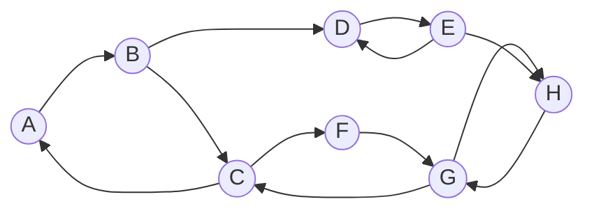
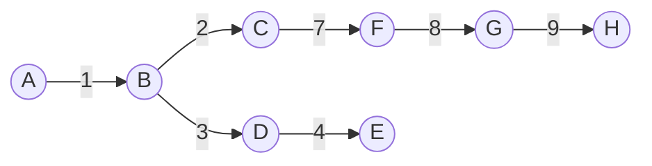

# 深入剖析Tarjan算法：时间复杂度与正确性证明

作者：禅与计算机程序设计艺术

## 1. 背景介绍
### 1.1 图论基础
#### 1.1.1 图的定义与表示
#### 1.1.2 有向图与无向图
#### 1.1.3 连通性与强连通性
### 1.2 图的遍历算法
#### 1.2.1 深度优先搜索（DFS）
#### 1.2.2 广度优先搜索（BFS）
#### 1.2.3 DFS与BFS的应用
### 1.3 Tarjan算法概述
#### 1.3.1 Tarjan算法的起源与发展
#### 1.3.2 Tarjan算法解决的问题
#### 1.3.3 Tarjan算法的重要性

## 2. 核心概念与联系
### 2.1 强连通分量（SCC）
#### 2.1.1 强连通分量的定义
#### 2.1.2 强连通分量的性质
#### 2.1.3 强连通分量与图的关系
### 2.2 DFS树与DFS森林
#### 2.2.1 DFS树的构建过程
#### 2.2.2 DFS树的性质
#### 2.2.3 DFS森林与图的联系
### 2.3 时间戳与追溯值
#### 2.3.1 时间戳的定义与计算
#### 2.3.2 追溯值的定义与更新
#### 2.3.3 时间戳与追溯值在算法中的作用

## 3. 核心算法原理与具体操作步骤
### 3.1 Tarjan算法的基本思想
#### 3.1.1 利用DFS遍历图
#### 3.1.2 在DFS过程中计算时间戳与追溯值
#### 3.1.3 利用追溯值找出强连通分量
### 3.2 Tarjan算法的详细步骤
#### 3.2.1 初始化
#### 3.2.2 DFS遍历
#### 3.2.3 计算时间戳与追溯值
#### 3.2.4 找出强连通分量
### 3.3 算法的优化与改进
#### 3.3.1 使用栈存储节点
#### 3.3.2 在线算法的实现
#### 3.3.3 处理重复边与自环

## 4. 数学模型与公式详细讲解举例说明
### 4.1 时间戳与追溯值的数学定义
#### 4.1.1 时间戳的数学表示
#### 4.1.2 追溯值的数学表示
#### 4.1.3 时间戳与追溯值的关系
### 4.2 追溯值更新公式推导
#### 4.2.1 追溯值初始化
#### 4.2.2 追溯值更新规则
#### 4.2.3 追溯值更新公式证明
### 4.3 强连通分量判定条件
#### 4.3.1 根据追溯值判定强连通分量
#### 4.3.2 判定条件的数学证明
#### 4.3.3 判定条件的几何解释

## 5. 项目实践：代码实例与详细解释说明
### 5.1 C++实现
#### 5.1.1 数据结构设计
#### 5.1.2 DFS函数实现
#### 5.1.3 Tarjan主函数实现
#### 5.1.4 完整代码与注释
### 5.2 Python实现
#### 5.2.1 图的表示方法
#### 5.2.2 DFS函数实现
#### 5.2.3 Tarjan主函数实现 
#### 5.2.4 完整代码与注释
### 5.3 算法复杂度分析
#### 5.3.1 时间复杂度分析
#### 5.3.2 空间复杂度分析
#### 5.3.3 复杂度优化思路

## 6. 实际应用场景
### 6.1 社交网络分析
#### 6.1.1 社区发现
#### 6.1.2 影响力分析
#### 6.1.3 社交网络可视化
### 6.2 程序依赖分析
#### 6.2.1 软件包依赖关系
#### 6.2.2 函数调用图分析
#### 6.2.3 死锁检测
### 6.3 生物信息学
#### 6.3.1 基因调控网络分析
#### 6.3.2 蛋白质相互作用网络
#### 6.3.3 代谢通路分析

## 7. 工具与资源推荐
### 7.1 图论可视化工具
#### 7.1.1 Graphviz
#### 7.1.2 NetworkX
#### 7.1.3 Gephi
### 7.2 在线算法题库
#### 7.2.1 LeetCode
#### 7.2.2 HackerRank
#### 7.2.3 CodeForces
### 7.3 相关论文与书籍
#### 7.3.1 Tarjan原论文
#### 7.3.2《算法导论》
#### 7.3.3《图论及其算法》

## 8. 总结：未来发展趋势与挑战
### 8.1 Tarjan算法的优势与局限
#### 8.1.1 算法的高效性
#### 8.1.2 算法的应用广泛性
#### 8.1.3 算法的改进空间
### 8.2 图算法的研究热点
#### 8.2.1 外存图算法
#### 8.2.2 动态图算法
#### 8.2.3 近似图算法
### 8.3 图数据的处理挑战
#### 8.3.1 图的大规模性 
#### 8.3.2 图的异构性
#### 8.3.3 图的动态演化

## 9. 附录：常见问题与解答
### 9.1 Tarjan算法与Kosaraju算法的区别
### 9.2 Tarjan算法能否用于无向图？
### 9.3 如何理解追溯值的更新规则？
### 9.4 Tarjan算法的时间复杂度如何证明？
### 9.5 Tarjan算法是否适用于所有有向图？

---

Tarjan算法是图论中一个经典而强大的算法，用于寻找有向图的强连通分量（Strongly Connected Components，SCCs）。自1972年由Robert Tarjan提出以来，这一算法以其高效、巧妙的设计在理论研究和工程实践中得到了广泛应用。本文将从算法原理入手，结合数学模型、代码实例以及复杂度分析，深入剖析Tarjan算法的精髓，并探讨其在社交网络、程序分析、生物信息等领域的应用价值。

图论作为计算机科学的重要分支，其核心在于研究图这一数据结构的性质和操作。图由节点（Vertices）和连接节点的边（Edges）组成，根据边的方向性可分为无向图和有向图。在有向图中，如果两个节点之间存在一条由一个节点到达另一个节点的有向路径，则称这两个节点"强连通"。强连通是一种等价关系，据此可将有向图的所有节点划分为若干等价类，每个等价类即为一个强连通分量。

寻找强连通分量的一个常见方法是DFS（深度优先搜索）。DFS从图中某个未访问节点出发，沿着边递归地"深入"图的其他部分，直至无法继续为止，然后回溯到之前的节点，再选择另一条未探索的边继续搜索。基于DFS构造的搜索树（或森林）能够揭示图的结构特性。Tarjan算法的核心思路正是在DFS过程中，巧妙地定义并维护每个节点的时间戳（Timestamp）和追溯值（Lowlink），从而高效地找出所有强连通分量。

具体而言，Tarjan算法为每个节点u记录其第一次被发现（即第一次成为DFS树上某条边的终点）的时间戳 $d[u]$，并初始化追溯值 $low[u]=d[u]$。在DFS回溯过程中，对于每条指向u的树边（搜索树上的边）$(v,u)$，则令 $low[u]=min(low[u],low[v])$；对于每条指向u的回边（非树边）$(w,u)$，则令 $low[u]=min(low[u],d[w])$。直观地说，节点u的追溯指——要么沿着搜索树往上追溯到某个被早于u发现的节点，要么直接连接到u某个祖先节点。当DFS回溯到节点u，且发现$low[u]=d[u]$时，以u为根的搜索子树上所有节点构成一个强连通分量。Tarjan算法使用一个栈来辅助DFS，其时间复杂度为$O(V+E)$。

我们不妨通过一个简单例子来说明Tarjan算法的执行过程。考虑下图所示的一个有向图：

以节点A为起点进行DFS，得到的搜索树如下图所示（编号表示访问顺序）：

回边（非树边）用虚线表示。在DFS过程中维护时间戳和追溯值：

- 访问A，$d[A]=low[A]=1$。
- 沿树边$(A,B)$访问B，$d[B]=low[B]=2$。
- 沿树边$(B,C)$访问C，$d[C]=low[C]=3$；再沿回边$(C,A)$，由于$d[A]<d[C]$，故$low[C]=min(low[C],d[A])=1$。
- 沿树边$(B,D)$访问D，$d[D]=low[D]=4$。
- 沿树边$(D,E)$访问E，$d[E]=low[E]=5$；再沿回边$(E,D)$，由于$d[D]<d[E]$，故$low[E]=d[D]=4$。
- DFS回溯到D，发现$low[D]=d[D]=4$，找到一个强连通分量${D,E}$。 
- 回溯到B，有$low[B]=min(low[B],low[D])=2$。
- DFS沿树边$(C,F)$访问F，$d[F]=low[F]=6$。
- 沿树边$(F,G)$访问G，$d[G]=low[G]=7$；沿回边$(G,C)$有$low[G]=min(low[G],d[C])=3$。
- 沿树边$(G,H)$访问H，$d[H]=low[H]=8$；沿回边$(H,G)$维持$low[H]=8$。
- 回溯到G，发现$low[G]=d[G]=7$，得到强连通分量${G,H}$。
- 继续回溯，F、C、B、A的追溯值均被更新为1，最终得到强连通分量${A,B,C,F}$。

整个过程结束后，该有向图被划分为三个强连通分量：$\{A,B,C,F\}$、$\{D,E\}$、$\{G,H\}$。

Tarjan算法巧妙而优雅的设计赋予了其广泛的应用场景。在社交网络分析中，基于网络节点间的转发、评论等交互行为构建有向图，运用Tarjan算法可以发现紧密联系的社区结构。对于一个由多个模块组成的软件系统，Tarjan算法有助于分析模块间的依赖关系，找出可能导致系统死锁的循环依赖。在生物学领域，细胞内的基因调控、蛋白质相互作用等关系可建模为复杂网络，使用Tarjan算法能揭示其中的关键调控子网络——这对理解生命活动机制至关重要。

尽管Tarjan算法的时间复杂度是最优的，但在处理现实世界的海量图数据时，算法在存储和计算上仍面临巨大挑战。随着图数据规模的不断增长，传统的单机算法已无法满足要求，研究者们开始探索外存算法、近似算法、并行化算法等新的解决思路。此外，现实图数据通常是异构、动态演化的，如何拓展Tarjan算法处理带权重、带标签、随时间变化的图，也是一个值得关注的研究课题。

综上所述，Tarjan算法以其高效、巧妙的特性在图论研究和应用中占据重要地位。深入理解该算法的原理和实现，对于从事图数据相关工作的研究者和工程师而言大有裨益。站在前