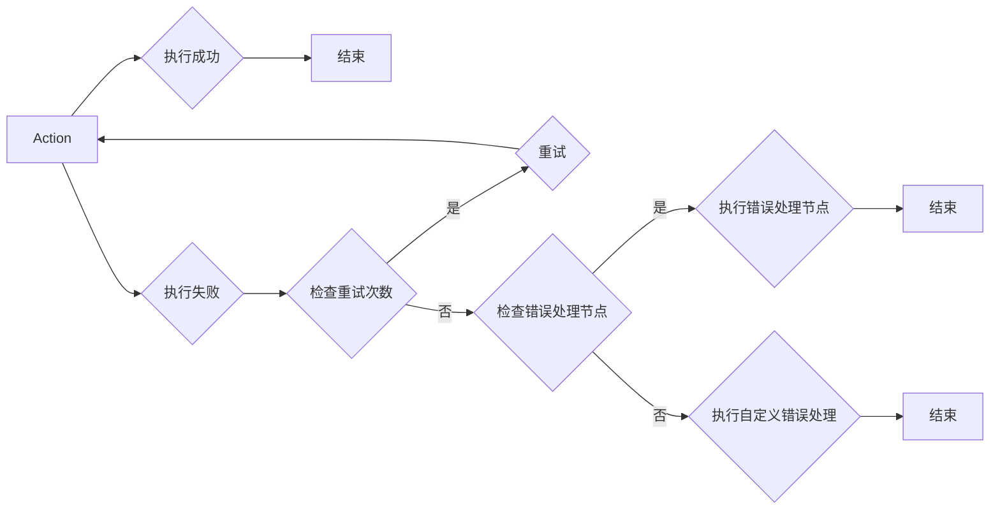

## 1. 背景介绍

### 1.1 大数据处理的挑战

随着大数据时代的到来，海量数据的处理成为了各个领域面临的共同挑战。为了高效地处理这些数据，各种分布式计算框架应运而生，如Hadoop, Spark等。然而，这些框架本身的复杂性以及数据处理流程的多样性，使得错误处理成为了一个不可忽视的问题。

### 1.2 Oozie: Hadoop工作流引擎

Oozie是一个基于Hadoop生态系统的工作流引擎，它能够将多个MapReduce、Pig、Hive等任务组合成一个复杂的工作流程，并自动调度和执行。Oozie的出现极大地简化了大数据处理流程的管理，但同时也带来了新的挑战，即如何有效地处理工作流执行过程中的错误。

### 1.3 错误处理的重要性

在Oozie工作流中，任何一个任务的失败都可能导致整个工作流的终止。因此，有效的错误处理机制对于保证工作流的稳定性和可靠性至关重要。一个完善的错误处理机制应该能够：

* 及时发现错误
* 精确定位错误原因
* 采取相应的补救措施
* 尽可能地恢复工作流的正常运行

## 2. 核心概念与联系

### 2.1 Action

Action是Oozie工作流中的基本执行单元，它可以是一个MapReduce任务、Pig脚本、Hive查询或者其他类型的任务。每个Action都有其自身的输入、输出和执行逻辑。

### 2.2 Workflow

Workflow是由多个Action组成的有向无环图(DAG)，它定义了Action之间的依赖关系以及执行顺序。Oozie引擎会根据Workflow的定义自动调度和执行各个Action。

### 2.3 错误处理机制

Oozie提供了多种错误处理机制，包括：

* **重试:** 当Action执行失败时，Oozie可以自动进行重试，最多可以配置重试次数。
* **错误处理节点:** Oozie允许用户在Workflow中定义专门的错误处理节点，用于处理特定类型的错误。
* **自定义错误处理:** 用户可以通过Java API自定义错误处理逻辑，实现更灵活的错误处理策略。

## 3. 核心算法原理具体操作步骤

### 3.1 重试机制

当Action执行失败时，Oozie会根据配置的重试次数自动进行重试。重试机制的原理如下：

1. Oozie引擎检测到Action执行失败。
2. 检查是否配置了重试次数，如果未配置则直接将Action标记为失败。
3. 如果配置了重试次数，则将Action标记为重试状态。
4. 等待一段时间后，Oozie引擎再次尝试执行该Action。
5. 如果重试成功，则将Action标记为成功状态。
6. 如果重试次数达到上限仍未成功，则将Action标记为失败状态。

### 3.2 错误处理节点

Oozie允许用户在Workflow中定义专门的错误处理节点，用于处理特定类型的错误。错误处理节点的原理如下：

1. 在Workflow定义中指定错误处理节点。
2. 当Action执行失败时，Oozie引擎会检查是否定义了错误处理节点。
3. 如果定义了错误处理节点，则将控制流转移到错误处理节点。
4. 错误处理节点可以根据错误类型执行相应的处理逻辑，例如发送告警邮件、记录错误日志等。

### 3.3 自定义错误处理

用户可以通过Java API自定义错误处理逻辑，实现更灵活的错误处理策略。自定义错误处理的步骤如下：

1. 编写自定义的错误处理类，实现org.apache.oozie.action.ActionExecutor接口。
2. 在Workflow定义中指定自定义错误处理类。
3. 当Action执行失败时，Oozie引擎会调用自定义错误处理类的execute()方法。
4. 用户可以在execute()方法中实现自定义的错误处理逻辑。

## 4. 数学模型和公式详细讲解举例说明

Oozie的错误处理机制不涉及复杂的数学模型和公式。

## 5. 项目实践：代码实例和详细解释说明

### 5.1 重试机制示例

以下是一个使用Oozie重试机制的示例：

```xml
<workflow-app name="retry-example" xmlns="uri:oozie:workflow:0.4">
  <start to="java-action"/>
  <action name="java-action">
    <java>
      <main-class>com.example.RetryAction</main-class>
    </java>
    <retry max="3" retry-interval="10"/>
    <ok to="end"/>
    <error to="kill"/>
  </action>
  <kill name="kill">
    <message>Action failed, killing the workflow</message>
  </kill>
  <end name="end"/>
</workflow-app>
```

在这个示例中，`java-action`的`retry`属性配置了最大重试次数为3，重试间隔为10秒。如果`java-action`执行失败，Oozie会自动进行最多3次重试，每次重试之间间隔10秒。如果3次重试后仍未成功，则工作流会转移到`kill`节点，并将工作流标记为失败。

### 5.2 错误处理节点示例

以下是一个使用Oozie错误处理节点的示例：

```xml
<workflow-app name="error-handling-example" xmlns="uri:oozie:workflow:0.4">
  <start to="java-action"/>
  <action name="java-action">
    <java>
      <main-class>com.example.ErrorAction</main-class>
    </java>
    <ok to="end"/>
    <error to="error-handler"/>
  </action>
  <action name="error-handler">
    <email>
      <to>admin@example.com</to>
      <subject>Workflow Error</subject>
      <body>An error occurred in the workflow.</body>
    </email>
    <ok to="kill"/>
  </action>
  <kill name="kill">
    <message>Action failed, killing the workflow</message>
  </kill>
  <end name="end"/>
</workflow-app>
```

在这个示例中，`java-action`的`error`属性指定了错误处理节点为`error-handler`。如果`java-action`执行失败，Oozie会将控制流转移到`error-handler`节点，并发送一封错误邮件给管理员。

## 6. 实际应用场景

Oozie的错误处理机制在各种大数据处理场景中都有着广泛的应用，例如：

* **数据清洗:** 在数据清洗过程中，可能会遇到各种错误数据，例如格式错误、缺失值等。Oozie的错误处理机制可以帮助用户捕获这些错误，并采取相应的处理措施，例如过滤掉错误数据、填充缺失值等。
* **数据分析:** 在数据分析过程中，可能会遇到一些异常数据，例如离群点、数据倾斜等。Oozie的错误处理机制可以帮助用户识别这些异常数据，并进行相应的处理，例如剔除离群点、调整数据分布等。
* **机器学习:** 在机器学习过程中，可能会遇到模型训练失败、预测结果不准确等问题。Oozie的错误处理机制可以帮助用户及时发现这些问题，并进行相应的调整，例如修改模型参数、增加训练数据等。

## 7. 工具和资源推荐

* **Oozie官方文档:** https://oozie.apache.org/docs/4.3.0/
* **Oozie教程:** https://www.tutorialspoint.com/oozie/

## 8. 总结：未来发展趋势与挑战

随着大数据技术的不断发展，Oozie的错误处理机制也在不断完善。未来，Oozie的错误处理机制将朝着以下方向发展：

* **更智能的错误处理:** 利用机器学习等技术，自动识别和处理各种类型的错误。
* **更灵活的错误处理策略:** 支持更丰富的错误处理策略，例如根据错误类型、错误级别等进行不同的处理。
* **更完善的错误监控和告警:** 提供更完善的错误监控和告警机制，帮助用户及时发现和解决问题。

## 9. 附录：常见问题与解答

### 9.1 如何配置Oozie的重试机制？

在Oozie Workflow定义中，可以通过`retry`属性配置Action的重试机制，该属性包含两个参数：

* `max`: 最大重试次数
* `retry-interval`: 重试间隔时间(秒)

例如：

```xml
<retry max="3" retry-interval="10"/>
```

表示最多重试3次，每次重试之间间隔10秒。

### 9.2 如何定义Oozie的错误处理节点？

在Oozie Workflow定义中，可以通过`error`属性指定Action的错误处理节点。例如：

```xml
<error to="error-handler"/>
```

表示将`error-handler`节点作为错误处理节点。

### 9.3 如何自定义Oozie的错误处理逻辑？

用户可以通过Java API自定义Oozie的错误处理逻辑，步骤如下：

1. 编写自定义的错误处理类，实现`org.apache.oozie.action.ActionExecutor`接口。
2. 在Workflow定义中指定自定义错误处理类。
3. 当Action执行失败时，Oozie引擎会调用自定义错误处理类的`execute()`方法。
4. 用户可以在`execute()`方法中实现自定义的错误处理逻辑。

## 10. Oozie 错误处理机制流程图

