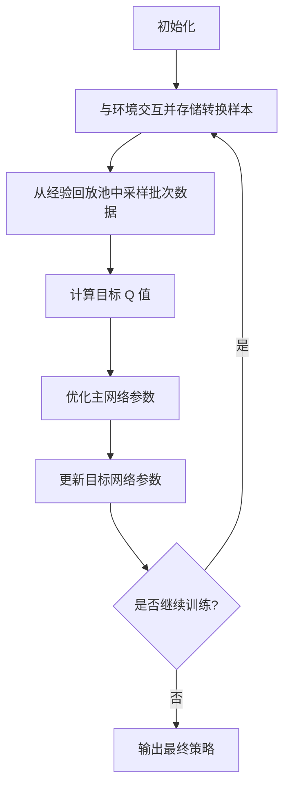

# 深度 Q-learning：在直播推荐系统中的应用

## 1. 背景介绍

### 1.1 直播推荐系统的重要性

在当今快节奏的数字时代，直播流媒体平台逐渐成为人们获取信息、娱乐和社交的重要渠道。随着用户数量的不断增长和内容种类的日益丰富，为用户推荐个性化、高质量的直播内容成为了直播平台的核心竞争力。一个高效的直播推荐系统不仅能够提高用户体验,增加用户粘性,还可以促进直播生态的健康发展。

### 1.2 传统推荐系统的局限性

传统的推荐算法,如基于内容的推荐、协同过滤等,虽然在某些场景下表现不错,但仍然存在一些固有的缺陷。例如,它们难以捕捉用户动态偏好的变化,无法很好地处理冷启动问题,并且在直播场景下的实时性和延迟要求方面存在挑战。

### 1.3 深度强化学习在推荐系统中的应用

近年来,深度强化学习(Deep Reinforcement Learning, DRL)作为一种新兴的机器学习范式,在推荐系统领域受到了广泛关注。与监督学习和无监督学习不同,强化学习通过与环境的交互来学习,旨在最大化长期累积奖励。这种范式非常适合于直播推荐场景,因为它可以动态地捕捉用户的实时反馈和偏好变化,并持续优化推荐策略以提高长期收益。

其中,Q-learning是强化学习中最著名和广泛使用的算法之一。通过将深度神经网络与 Q-learning 相结合,可以构建出强大的深度 Q-learning (Deep Q-Network, DQN) 模型,用于解决复杂的决策问题,如直播推荐。

## 2. 核心概念与联系

### 2.1 Q-learning 基础

Q-learning 是一种基于时间差分(Temporal Difference, TD)的强化学习算法,它旨在学习一个最优的行为策略,使得在给定状态下采取的行动可以最大化未来的累积奖励。

在 Q-learning 中,我们定义了一个 Q 函数 $Q(s, a)$,它表示在状态 $s$ 下采取行动 $a$ 所能获得的期望累积奖励。通过不断与环境交互并更新 Q 函数,智能体可以逐步学习到最优策略。

Q-learning 的核心更新规则如下:

$$Q(s_t, a_t) \leftarrow Q(s_t, a_t) + \alpha \left[ r_t + \gamma \max_{a} Q(s_{t+1}, a) - Q(s_t, a_t) \right]$$

其中:

- $s_t$ 和 $a_t$ 分别表示当前状态和行动
- $r_t$ 是执行 $a_t$ 后获得的即时奖励
- $\alpha$ 是学习率,控制更新的步长
- $\gamma$ 是折扣因子,用于权衡即时奖励和未来奖励的重要性

通过不断更新 Q 函数,最终可以收敛到最优的 Q 值,从而得到最优的策略 $\pi^*(s) = \arg\max_a Q^*(s, a)$。

### 2.2 深度 Q-网络 (Deep Q-Network, DQN)

传统的 Q-learning 算法在处理高维状态和复杂环境时存在局限性。深度 Q-网络 (DQN) 通过将深度神经网络与 Q-learning 相结合,可以有效地解决这一问题。

在 DQN 中,我们使用一个深度神经网络来近似 Q 函数,即 $Q(s, a; \theta) \approx Q^*(s, a)$,其中 $\theta$ 表示网络的可训练参数。网络的输入是当前状态 $s$,输出是对应于每个可能行动的 Q 值。

DQN 的训练过程如下:

1. 初始化网络参数 $\theta$
2. 与环境交互,获取一批转换样本 $(s_t, a_t, r_t, s_{t+1})$
3. 计算目标 Q 值 $y_t = r_t + \gamma \max_{a'} Q(s_{t+1}, a'; \theta^-)$,其中 $\theta^-$ 是目标网络的参数
4. 优化损失函数 $L(\theta) = \mathbb{E}_{(s, a, r, s')} \left[ \left( y_t - Q(s_t, a_t; \theta) \right)^2 \right]$,更新网络参数 $\theta$
5. 周期性地将 $\theta$ 复制到 $\theta^-$,以保持目标网络的稳定性

通过上述方式,DQN 可以有效地学习到最优的 Q 函数近似,从而获得最优的推荐策略。

### 2.3 深度 Q-learning 在直播推荐中的应用

在直播推荐场景中,我们可以将推荐过程建模为一个马尔可夫决策过程 (Markov Decision Process, MDP)。具体来说:

- 状态 $s$: 描述当前用户的特征、上下文信息和历史行为
- 行动 $a$: 推荐给用户的直播间
- 奖励 $r$: 根据用户对推荐内容的反馈(如观看时长、点赞等)计算得到的即时奖励

通过与用户持续交互,深度 Q-网络可以不断学习和优化推荐策略,从而最大化长期累积奖励,即用户的总体满意度和参与度。

与传统的推荐算法相比,深度 Q-learning 在直播推荐中具有以下优势:

1. **动态适应性强**: 能够根据用户的实时反馈动态调整推荐策略,捕捉用户偏好的变化。
2. **延迟低、实时性好**: 推荐过程不需要预先计算相似性或构建用户模型,可以实现低延迟的实时推荐。
3. **冷启动问题缓解**: 通过探索不同的推荐选择,可以更好地解决冷启动问题。
4. **长期收益最大化**: 直接优化长期累积奖励,而不是局部的即时奖励,从而提高用户的总体体验。

## 3. 核心算法原理具体操作步骤 

### 3.1 深度 Q-网络算法流程

深度 Q-网络算法的具体流程如下:

1. **初始化**
   - 初始化深度 Q-网络(主网络)的参数 $\theta$
   - 初始化目标网络的参数 $\theta^-=\theta$
   - 初始化经验回放池 (Experience Replay Buffer) $D$

2. **与环境交互并存储转换样本**
   - 从当前状态 $s_t$ 出发,根据 $\epsilon$-贪婪策略选择行动 $a_t$
   - 执行行动 $a_t$,获得奖励 $r_t$ 和新状态 $s_{t+1}$
   - 将转换样本 $(s_t, a_t, r_t, s_{t+1})$ 存入经验回放池 $D$

3. **从经验回放池中采样批次数据**
   - 从经验回放池 $D$ 中随机采样一个批次的转换样本

4. **计算目标 Q 值**
   - 对于每个转换样本 $(s_t, a_t, r_t, s_{t+1})$,计算目标 Q 值:
     $$y_t = r_t + \gamma \max_{a'} Q(s_{t+1}, a'; \theta^-)$$

5. **优化主网络参数**
   - 计算损失函数:
     $$L(\theta) = \mathbb{E}_{(s, a, r, s')} \left[ \left( y_t - Q(s_t, a_t; \theta) \right)^2 \right]$$
   - 使用优化算法(如梯度下降)更新主网络参数 $\theta$,最小化损失函数 $L(\theta)$

6. **更新目标网络参数**
   - 每隔一定步骤,将主网络的参数 $\theta$ 复制到目标网络,即 $\theta^- \leftarrow \theta$,以保持目标网络的稳定性

7. **重复步骤 2-6**,直到算法收敛或达到最大训练步数

在实际应用中,还需要考虑一些技术细节和优化策略,如经验回放池的大小、目标网络更新频率、探索与利用的权衡(如 $\epsilon$-贪婪策略)等,以确保算法的稳定性和收敛性。

### 3.2 算法流程图

下面使用 Mermaid 流程图来直观地展示深度 Q-网络算法的核心流程:

## 4. 数学模型和公式详细讲解举例说明

在直播推荐场景中,我们可以将推荐过程建模为一个马尔可夫决策过程 (Markov Decision Process, MDP),由元组 $\langle \mathcal{S}, \mathcal{A}, \mathcal{P}, \mathcal{R}, \gamma \rangle$ 表示:

- $\mathcal{S}$: 状态空间,描述用户的特征、上下文信息和历史行为
- $\mathcal{A}$: 行动空间,即可推荐的直播间集合
- $\mathcal{P}(s' | s, a)$: 状态转移概率,表示在状态 $s$ 下执行行动 $a$ 后转移到状态 $s'$ 的概率
- $\mathcal{R}(s, a)$: 奖励函数,定义在状态 $s$ 下执行行动 $a$ 所获得的即时奖励
- $\gamma \in [0, 1)$: 折扣因子,用于权衡即时奖励和未来奖励的重要性

在 MDP 中,我们的目标是找到一个最优策略 $\pi^*$,使得在任意初始状态 $s_0$ 下,期望的累积折扣奖励最大化:

$$\pi^* = \arg\max_\pi \mathbb{E}_\pi \left[ \sum_{t=0}^\infty \gamma^t r_t | s_0 \right]$$

其中,$r_t = \mathcal{R}(s_t, a_t)$ 是在时间步 $t$ 获得的即时奖励。

为了找到最优策略 $\pi^*$,我们定义了一个行动价值函数 $Q^\pi(s, a)$,表示在状态 $s$ 下执行行动 $a$,之后遵循策略 $\pi$ 所能获得的期望累积奖励:

$$Q^\pi(s, a) = \mathbb{E}_\pi \left[ \sum_{t=0}^\infty \gamma^t r_t | s_0=s, a_0=a \right]$$

根据 Bellman 方程,我们可以将 $Q^\pi(s, a)$ 分解为即时奖励和未来奖励的和:

$$Q^\pi(s, a) = \mathcal{R}(s, a) + \gamma \sum_{s'} \mathcal{P}(s' | s, a) \max_{a'} Q^\pi(s', a')$$

其中,第一项 $\mathcal{R}(s, a)$ 是执行行动 $a$ 后获得的即时奖励,第二项是未来状态 $s'$ 下按照策略 $\pi$ 执行最优行动所能获得的期望累积奖励。

我们定义最优行动价值函数 $Q^*(s, a)$ 为所有策略中的最大值:

$$Q^*(s, a) = \max_\pi Q^\pi(s, a)$$

那么,最优策略 $\pi^*$ 就可以通过选择在每个状态下最大化 $Q^*(s, a)$ 的行动来获得:

$$\pi^*(s) = \arg\max_a Q^*(s, a)$$

Q-learning 算法的目标就是学习这个最优行动价值函数 $Q^*(s, a)$,从而获得最优策略 $\pi^*$。

### 4.1 Q-learning 更新规则

Q-learning 通过与环境交互,不断更新 Q 值的估计,以逼近真实的 $Q^*(s, a)$。具体的更新规则如下:

$$Q(s_t, a_t) \leftarrow Q(s_t, a_t) + \alpha \left[ r_t + \gamma \max_{a} Q(s_{t+1}, a) - Q(s_t