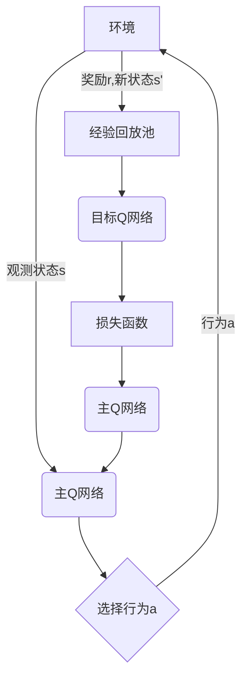
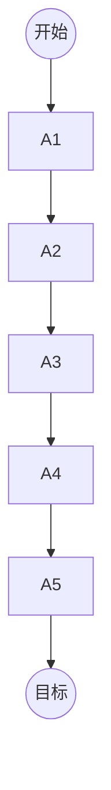

深度Q学习(Deep Q-Learning)是一种结合了深度学习和强化学习的技术,用于解决复杂的决策过程问题。它通过策略迭代和价值迭代相结合的方式,学习最优的行为策略,从而实现智能决策。本文将全面介绍深度Q学习的核心概念、算法原理、数学模型、实际应用以及未来发展趋势。

## 1. 背景介绍

### 1.1 强化学习概述

强化学习(Reinforcement Learning)是机器学习的一个重要分支,它关注如何基于环境反馈训练智能体(Agent)以获取最大累积奖励。不同于监督学习需要大量标注数据,强化学习通过与环境的互动来学习,适用于决策序列问题。

### 1.2 Q-Learning算法

Q-Learning是强化学习中的一种基于价值迭代的经典算法,通过不断更新状态-行为对的Q值表,逐步逼近最优策略。但传统Q-Learning使用表格存储Q值,难以应对高维状态空间。

### 1.3 深度学习与强化学习结合

深度学习具有强大的特征提取和函数逼近能力,可以学习复杂的状态表示,而强化学习则提供了一种基于经验的决策优化框架。将两者结合,就可以构建端到端的智能决策系统,能够在复杂环境中做出明智决策。

## 2. 核心概念与联系

### 2.1 马尔可夫决策过程(MDP)

马尔可夫决策过程是强化学习问题的数学模型,包含以下组成部分:

- 状态集合S
- 行为集合A 
- 转移概率P(s'|s,a)
- 奖励函数R(s,a)
- 折扣因子γ

智能体与环境进行交互,观测当前状态s,执行行为a,转移到新状态s',获得奖励r,目标是最大化累积折扣奖励。

### 2.2 Q函数与最优策略

Q函数Q(s,a)表示在状态s执行行为a后,能获得的最大期望累积奖励。最优Q函数和最优策略之间有如下关系:

$$
Q^*(s, a) = \mathbb{E}\left[r_t + \gamma\max_{a'}Q^*(s_{t+1}, a')\mid s_t=s, a_t=a\right]
$$

$$
\pi^*(s) = \arg\max_a Q^*(s, a)
$$

通过学习最优Q函数,就可以得到最优策略。这是Q-Learning的核心思想。

### 2.3 深度Q网络(DQN)

深度Q网络(Deep Q-Network)使用神经网络来逼近Q函数,可以泛化到高维状态空间。其核心思想是:

1. 使用经验回放池(Experience Replay)存储过往经验
2. 定期从经验回放池采样数据,通过梯度下降优化神经网络参数
3. 目标Q网络(Target Q-Network)增加训练稳定性

DQN架构如下所示:



## 3. 核心算法原理具体操作步骤

以下是DQN算法的主要步骤:

1. **初始化**:
   - 初始化主Q网络和目标Q网络参数相同
   - 初始化经验回放池为空
   
2. **采样并存储经验**:
   - 从环境观测当前状态s
   - 使用ε-贪婪策略从主Q网络输出选择行为a
   - 在环境中执行行为a,观测奖励r和新状态s'
   - 将(s,a,r,s')存入经验回放池
   
3. **采样并学习**:
   - 从经验回放池随机采样批量数据
   - 计算目标Q值:
     $$
     y_i = r_i + \gamma\max_{a'}Q(s'_i, a'; \theta^-)
     $$
     其中$\theta^-$为目标Q网络的参数
   - 计算损失函数:
     $$
     L(\theta) = \mathbb{E}_{(s,a,r,s')\sim D}\left[(y_i - Q(s_i, a_i; \theta))^2\right]
     $$
   - 使用梯度下降优化主Q网络参数$\theta$
   
4. **目标Q网络参数更新**:
   - 每隔一定步长将主Q网络参数赋值给目标Q网络

5. **回到步骤2**,重复训练

通过上述过程,主Q网络将不断学习逼近最优Q函数,从而获得最优策略。

## 4. 数学模型和公式详细讲解举例说明

### 4.1 Bellman方程

Bellman方程是强化学习理论的基础,描述了状态值函数V(s)和Q函数Q(s,a)的递推关系:

$$
V(s) = \max_a\mathbb{E}[r + \gamma V(s')]\\
Q(s,a) = \mathbb{E}[r + \gamma\max_{a'}Q(s',a')]
$$

其中,γ是折扣因子,用于权衡即时奖励和长期累积奖励。

### 4.2 Q-Learning更新规则

Q-Learning通过以下更新规则逐步逼近最优Q函数:

$$
Q(s_t, a_t) \leftarrow Q(s_t, a_t) + \alpha\left(r_t + \gamma\max_{a'}Q(s_{t+1}, a') - Q(s_t, a_t)\right)
$$

其中,α是学习率,控制了新经验对Q值的影响程度。

### 4.3 DQN损失函数

DQN使用下面的损失函数进行训练:

$$
L(\theta) = \mathbb{E}_{(s,a,r,s')\sim D}\left[\left(r + \gamma\max_{a'}Q(s', a'; \theta^-) - Q(s, a; \theta)\right)^2\right]
$$

其中,θ为主Q网络参数,$\theta^-$为目标Q网络参数,D为经验回放池。这个损失函数最小化了Q值的时序差分误差。

### 4.4 探索与利用权衡

在训练过程中,智能体需要在探索(exploration)和利用(exploitation)之间权衡:

- **探索**:选择一些看似次优但未探索的行为,以获取新经验
- **利用**:根据当前Q值选择最优行为,获取最大奖励

ε-贪婪策略是一种常用的探索策略,以ε的概率随机选择行为,1-ε的概率选择当前最优行为。

### 4.5 范例:机器人导航

假设有一个机器人需要在一个二维网格世界中导航到目标位置。机器人的状态s包括(x,y)坐标,可执行的行为a包括上下左右移动。

- 状态转移:P(s'|s,a)由机器人运动模型决定
- 奖励:到达目标位置获得大正奖励,越接近目标奖励越高
- 折扣因子:0.9,鼓励机器人走最短路径

通过DQN算法训练,机器人可以学习到导航到目标的最优策略,如下图所示:



## 5. 项目实践:代码实例和详细解释说明

以下是使用PyTorch实现DQN算法的示例代码:

```python
import torch
import torch.nn as nn
import torch.optim as optim
import random

# 定义Q网络
class QNetwork(nn.Module):
    def __init__(self, state_dim, action_dim):
        super(QNetwork, self).__init__()
        self.fc1 = nn.Linear(state_dim, 64)
        self.fc2 = nn.Linear(64, action_dim)

    def forward(self, x):
        x = torch.relu(self.fc1(x))
        return self.fc2(x)

# 定义经验回放池
class ReplayBuffer:
    def __init__(self, capacity):
        self.buffer = []
        self.capacity = capacity

    def push(self, data):
        self.buffer.append(data)
        if len(self.buffer) > self.capacity:
            self.buffer.pop(0)

    def sample(self, batch_size):
        return random.sample(self.buffer, batch_size)

# DQN算法主函数
def dqn(env, episodes, batch_size, gamma, epsilon, epsilon_decay):
    state_dim = env.observation_space.shape[0]
    action_dim = env.action_space.n
    q_net = QNetwork(state_dim, action_dim)
    target_q_net = QNetwork(state_dim, action_dim)
    optimizer = optim.Adam(q_net.parameters())
    buffer = ReplayBuffer(10000)

    for episode in range(episodes):
        state = env.reset()
        done = False
        while not done:
            # 选择行为
            if random.random() < epsilon:
                action = env.action_space.sample()
            else:
                with torch.no_grad():
                    q_values = q_net(torch.tensor(state, dtype=torch.float32))
                action = torch.argmax(q_values).item()

            # 执行行为并存储经验
            next_state, reward, done, _ = env.step(action)
            buffer.push((state, action, reward, next_state, done))
            state = next_state

            # 采样并学习
            if len(buffer.buffer) >= batch_size:
                samples = buffer.sample(batch_size)
                states, actions, rewards, next_states, dones = zip(*samples)
                states = torch.tensor(states, dtype=torch.float32)
                actions = torch.tensor(actions, dtype=torch.int64)
                rewards = torch.tensor(rewards, dtype=torch.float32)
                next_states = torch.tensor(next_states, dtype=torch.float32)
                dones = torch.tensor(dones, dtype=torch.bool)

                # 计算目标Q值
                with torch.no_grad():
                    next_q_values = target_q_net(next_states).max(dim=1)[0]
                    target_q_values = rewards + gamma * next_q_values * (1 - dones)

                # 计算损失并优化
                q_values = q_net(states).gather(1, actions.unsqueeze(1)).squeeze()
                loss = nn.MSELoss()(q_values, target_q_values)
                optimizer.zero_grad()
                loss.backward()
                optimizer.step()

            # 更新目标Q网络
            if episode % 10 == 0:
                target_q_net.load_state_dict(q_net.state_dict())

        # 更新探索率
        epsilon = max(epsilon * epsilon_decay, 0.01)

    return q_net
```

代码解释:

1. 定义Q网络:使用PyTorch构建一个简单的全连接神经网络,输入为状态,输出为每个行为的Q值。

2. 定义经验回放池:使用列表存储过往经验,支持添加和随机采样操作。

3. DQN算法主函数:
   - 初始化Q网络、目标Q网络、优化器和经验回放池
   - 对于每个episode:
     - 与环境交互,执行ε-贪婪策略选择行为
     - 存储(s,a,r,s',done)经验到回放池
     - 从回放池采样批量数据
     - 计算目标Q值和损失函数
     - 使用梯度下降优化Q网络参数
     - 定期更新目标Q网络参数
     - 更新探索率ε

4. 返回训练好的Q网络

通过上述代码,我们可以在各种强化学习环境中训练DQN智能体,并最终获得近似最优的决策策略。

## 6. 实际应用场景

深度Q学习在诸多领域有着广泛的应用,包括但不限于:

1. **游戏AI**: Deepmind的AlphaGo利用深度Q学习等技术,打败了人类顶尖围棋手。游戏AI是强化学习的一个重要应用场景。

2. **机器人控制**: 深度Q学习可以训练机器人在复杂环境中导航、操作等,实现智能机器人控制。

3. **自动驾驶**: 无人驾驶汽车需要根据实时交通情况做出合理决策,深度Q学习可以学习最优驾驶策略。

4. **资源管理**: 在数据中心、网络等资源调度场景,深度Q学习可以优化资源利用,提高效率。

5. **对话系统**: 基于深度Q学习的对话系统可以与用户自然互动,给出恰当响应。

6. **投资决策**: 利用深度Q学习分析历史数据,可以制定投资策略,实现智能投资决策。

## 7. 工具和资源推荐

以下是一些有用的深度Q学习工具和资源:

1. **OpenAI Gym**: 提供各种强化学习环境的