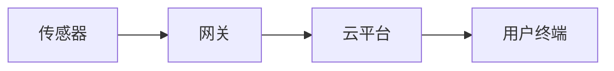
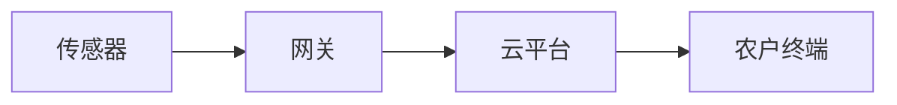

## 物联网与企业数字化转型的融合创新

作者：禅与计算机程序设计艺术

## 1. 背景介绍

### 1.1 数字化转型浪潮

近年来，随着信息技术的快速发展，数字化转型已成为企业发展的重要趋势。数字化转型是指企业利用新一代数字技术，对业务流程、组织架构、商业模式等进行全面改造，以提高效率、降低成本、增强竞争力。

### 1.2 物联网技术的兴起

物联网（IoT）作为新一代信息技术的重要组成部分，近年来发展迅速。物联网通过传感器、无线网络、云计算等技术，将物理世界与数字世界连接起来，实现万物互联。

### 1.3  融合创新：数字化转型的助推器

物联网与数字化转型相互促进，融合创新。物联网为企业数字化转型提供了新的技术手段和数据基础，而数字化转型也为物联网的发展提供了更广阔的应用场景和市场需求。

## 2. 核心概念与联系

### 2.1 物联网

物联网是指通过各种信息传感器、射频识别技术、全球定位系统、红外感应器、激光扫描器等各种装置与技术，实时采集任何需要监控、 连接、互动的物体或过程，采集其声、光、热、电、力学、化学、生物、位置等各种需要的信息，与互联网结合形成的一个巨大网络。

#### 2.1.1 物联网架构

物联网架构通常包括感知层、网络层、平台层和应用层。

- 感知层：负责采集数据，包括各种传感器、RFID标签等。
- 网络层：负责数据的传输，包括各种网络协议和通信技术。
- 平台层：负责数据的存储、处理和分析，包括云计算、大数据等技术。
- 应用层：负责提供各种应用服务，例如智能家居、智慧城市、工业互联网等。

#### 2.1.2 物联网关键技术

- 传感器技术
- RFID技术
- 网络通信技术
- 云计算技术
- 大数据技术

### 2.2  企业数字化转型

#### 2.2.1 数字化转型定义

企业数字化转型是指利用新一代数字技术，对业务流程、组织架构、商业模式等进行全面改造，以提高效率、降低成本、增强竞争力。

#### 2.2.2 数字化转型关键技术

- 云计算
- 大数据
- 人工智能
- 移动互联网
- 物联网

### 2.3 物联网与数字化转型的联系

物联网为企业数字化转型提供了新的技术手段和数据基础，而数字化转型也为物联网的发展提供了更广阔的应用场景和市场需求。

#### 2.3.1 物联网驱动数字化转型

- 数据驱动决策：物联网可以采集海量数据，为企业提供更精准的决策依据。
- 流程优化：物联网可以实现自动化控制和远程监控，优化企业业务流程。
- 新产品和服务：物联网可以催生新的产品和服务，例如智能家居、智慧城市等。

#### 2.3.2 数字化转型促进物联网发展

- 应用场景拓展：数字化转型为物联网提供了更广阔的应用场景，例如智慧医疗、智慧农业等。
- 技术创新：数字化转型推动了物联网技术的创新，例如边缘计算、区块链等。
- 产业生态构建：数字化转型促进了物联网产业生态的构建，例如平台建设、标准制定等。

## 3. 核心算法原理具体操作步骤

### 3.1 数据采集

#### 3.1.1 传感器数据采集

传感器是物联网数据采集的核心设备，可以感知各种物理量，例如温度、湿度、光照、压力等。

```
# 温度传感器数据采集代码示例

import time
import Adafruit_DHT

# 设置传感器类型
sensor = Adafruit_DHT.DHT11
# 设置传感器引脚
pin = 4

# 循环读取数据
while True:
    # 读取湿度和温度
    humidity, temperature = Adafruit_DHT.read_retry(sensor, pin)

    # 打印数据
    print('温度: {0:0.1f} C  湿度: {1:0.1f} %'.format(temperature, humidity))

    # 延时1秒
    time.sleep(1)
```

#### 3.1.2 RFID数据采集

RFID（射频识别）技术通过无线电信号识别特定目标并读写相关数据，无需识别系统与特定目标之间建立机械或光学接触。

```python
# RFID数据采集代码示例

import RPi.GPIO as GPIO
from mfrc522 import SimpleMFRC522

# 设置RFID读卡器
reader = SimpleMFRC522()

# 循环读取数据
while True:
    try:
        # 读取RFID标签ID
        id, text = reader.read()

        # 打印数据
        print("ID: %s\nText: %s" % (id,text))

    finally:
        # 清理GPIO
        GPIO.cleanup()
```

### 3.2 数据传输

#### 3.2.1  MQTT协议

MQTT（消息队列遥测传输）是一种轻量级的消息传输协议，专为物联网设备设计，支持发布/订阅消息模式。

```python
# MQTT数据传输代码示例

import paho.mqtt.client as mqtt

# 设置MQTT服务器地址
broker_address = "mqtt.eclipse.org"

# 创建MQTT客户端
client = mqtt.Client("Python-Publisher")

# 连接MQTT服务器
client.connect(broker_address)

# 发布消息
client.publish("test/message", "Hello, world!")

# 断开连接
client.disconnect()
```

#### 3.2.2  HTTP协议

HTTP（超文本传输协议）是一种应用层的通信协议，用于分布式、协作式和超媒体信息系统。

```python
# HTTP数据传输代码示例

import requests

# 设置API接口地址
url = 'https://api.example.com/data'

# 设置请求参数
data = {'temperature': 25, 'humidity': 60}

# 发送POST请求
response = requests.post(url, data=data)

# 打印响应结果
print(response.text)
```

### 3.3 数据处理与分析

#### 3.3.1  云计算平台

云计算平台提供强大的计算、存储和网络资源，可以高效处理海量物联网数据。

#### 3.3.2  大数据技术

大数据技术可以对海量物联网数据进行分析，挖掘数据价值，例如预测设备故障、优化生产流程等。

```python
# 大数据分析代码示例

from pyspark.sql import SparkSession

# 创建SparkSession
spark = SparkSession.builder.appName("IoTDataAnalysis").getOrCreate()

# 读取数据
df = spark.read.csv("iot_data.csv", header=True, inferSchema=True)

# 数据清洗和转换
# ...

# 数据分析
# ...

# 结果展示
# ...

# 停止SparkSession
spark.stop()
```

## 4. 数学模型和公式详细讲解举例说明

### 4.1  时间序列分析

时间序列分析用于分析随时间变化的数据，例如传感器数据、设备运行状态等。

#### 4.1.1  移动平均模型

移动平均模型（MA）是一种常用的时间序列分析方法，通过计算历史数据的平均值来预测未来值。

$$
\hat{y}_t = \frac{1}{n} \sum_{i=t-n+1}^{t} y_i
$$

其中，$\hat{y}_t$ 表示时间 $t$ 的预测值，$y_i$ 表示时间 $i$ 的实际值，$n$ 表示移动平均窗口大小。

#### 4.1.2  指数平滑模型

指数平滑模型（ES）是一种常用的时间序列分析方法，通过对历史数据进行加权平均来预测未来值。

$$
\hat{y}_t = \alpha y_{t-1} + (1-\alpha) \hat{y}_{t-1}
$$

其中，$\hat{y}_t$ 表示时间 $t$ 的预测值，$y_{t-1}$ 表示时间 $t-1$ 的实际值，$\hat{y}_{t-1}$ 表示时间 $t-1$ 的预测值，$\alpha$ 表示平滑系数。

### 4.2  机器学习

机器学习可以用于构建预测模型，例如预测设备故障、识别异常行为等。

#### 4.2.1  线性回归

线性回归是一种常用的机器学习算法，用于建立线性模型预测目标变量。

$$
y = \beta_0 + \beta_1 x_1 + \beta_2 x_2 + ... + \beta_n x_n
$$

其中，$y$ 表示目标变量，$x_1, x_2, ..., x_n$ 表示特征变量，$\beta_0, \beta_1, \beta_2, ..., \beta_n$ 表示模型参数。

#### 4.2.2  支持向量机

支持向量机（SVM）是一种常用的机器学习算法，用于分类和回归问题。

SVM的目标是找到一个最优超平面，将不同类别的数据分开。

## 5. 项目实践：代码实例和详细解释说明

### 5.1 智能家居系统

#### 5.1.1 系统架构



#### 5.1.2 代码示例

```python
# 智能家居系统代码示例

# 导入库
import RPi.GPIO as GPIO
import time
import paho.mqtt.client as mqtt

# 设置GPIO引脚
led_pin = 17
sensor_pin = 4

# 设置MQTT服务器地址
broker_address = "mqtt.eclipse.org"

# 创建MQTT客户端
client = mqtt.Client("SmartHome")

# 连接MQTT服务器
client.connect(broker_address)

# 设置GPIO模式
GPIO.setmode(GPIO.BCM)
GPIO.setup(led_pin, GPIO.OUT)
GPIO.setup(sensor_pin, GPIO.IN)

# 循环检测传感器状态
while True:
    # 读取传感器状态
    sensor_state = GPIO.input(sensor_pin)

    # 如果传感器状态发生变化
    if sensor_state == 1:
        # 点亮LED灯
        GPIO.output(led_pin, GPIO.HIGH)
        # 发布MQTT消息
        client.publish("home/sensor", "Motion detected!")
    else:
        # 熄灭LED灯
        GPIO.output(led_pin, GPIO.LOW)

    # 延时1秒
    time.sleep(1)

# 清理GPIO
GPIO.cleanup()
```

### 5.2 智慧农业系统

#### 5.2.1 系统架构



#### 5.2.2 代码示例

```python
# 智慧农业系统代码示例

# 导入库
import time
import Adafruit_DHT
import paho.mqtt.client as mqtt

# 设置传感器类型
sensor = Adafruit_DHT.DHT11
# 设置传感器引脚
pin = 4

# 设置MQTT服务器地址
broker_address = "mqtt.eclipse.org"

# 创建MQTT客户端
client = mqtt.Client("SmartFarm")

# 连接MQTT服务器
client.connect(broker_address)

# 循环读取数据
while True:
    # 读取湿度和温度
    humidity, temperature = Adafruit_DHT.read_retry(sensor, pin)

    # 发布MQTT消息
    client.publish("farm/temperature", temperature)
    client.publish("farm/humidity", humidity)

    # 延时1分钟
    time.sleep(60)
```

## 6. 实际应用场景

### 6.1  智慧城市

- 智能交通：利用物联网技术实现交通信号灯智能控制、车辆实时监控等，缓解交通拥堵，提高交通效率。
- 环境监测：利用物联网技术实时监测空气质量、水质等环境指标，为环境保护提供数据支持。
- 公共安全：利用物联网技术实现视频监控、人脸识别等，提高城市安全防范能力。

### 6.2  智能制造

- 设备监控：利用物联网技术实时监测设备运行状态，预测设备故障，提高设备利用率。
- 生产流程优化：利用物联网技术实现生产流程自动化控制，提高生产效率，降低生产成本。
- 产品质量追溯：利用物联网技术实现产品生产过程的全程追溯，提高产品质量和安全性。

### 6.3  智慧医疗

- 远程医疗：利用物联网技术实现远程诊断、远程手术等，提高医疗服务效率和质量。
- 健康监测：利用物联网技术实现患者生命体征实时监测，为疾病预防和治疗提供数据支持。
- 药物管理：利用物联网技术实现药品生产、流通、使用等环节的全程追溯，保障药品安全。

## 7. 工具和资源推荐

### 7.1  物联网平台

- AWS IoT Core
- Azure IoT Hub
- Google Cloud IoT Core
- 阿里云物联网平台

### 7.2  开发工具

- Arduino IDE
- Raspberry Pi
- Node-RED
- Python

### 7.3  学习资源

- 物联网开发者社区
- Coursera物联网课程
- edX物联网课程

## 8. 总结：未来发展趋势与挑战

### 8.1  发展趋势

- 智能化：物联网将更加智能化，利用人工智能技术实现自动化控制、智能决策等。
- 融合化：物联网将与其他技术深度融合，例如云计算、大数据、人工智能等。
- 平台化：物联网平台将更加完善，提供更丰富的服务和应用。

### 8.2  挑战

- 安全问题：物联网设备数量庞大，安全问题日益突出。
- 标准化：物联网技术发展迅速，标准化工作滞后。
- 数据隐私：物联网采集海量数据，数据隐私保护面临挑战。

## 9. 附录：常见问题与解答

### 9.1  什么是物联网？

物联网是指通过各种信息传感器、射频识别技术、全球定位系统、红外感应器、激光扫描器等各种装置与技术，实时采集任何需要监控、 连接、互动的物体或过程，采集其声、光、热、电、力学、化学、生物、位置等各种需要的信息，与互联网结合形成的一个巨大网络。

### 9.2  物联网有哪些应用场景？

物联网应用场景广泛，例如智能家居、智慧城市、工业互联网、智慧医疗等。

### 9.3  如何学习物联网技术？

可以通过参加物联网培训课程、阅读物联网书籍、参与物联网开发者社区等方式学习物联网技术。
