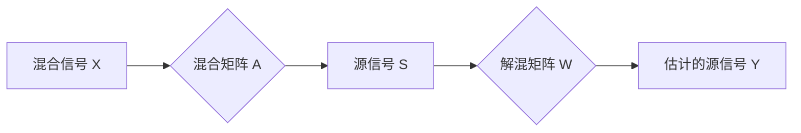

## 1. 背景介绍

### 1.1 信号分离的挑战

在现实世界中，我们经常会遇到混合信号的情况。例如，在一个嘈杂的房间里，我们听到的声音是多个声源混合的结果；在医学影像中，我们观察到的图像可能是多个组织器官叠加的结果。如何将这些混合信号分离成独立的成分，是信号处理领域的一个重要问题。

### 1.2 独立成分分析 (ICA) 的诞生

独立成分分析 (Independent Component Analysis, ICA) 是一种用于解决信号分离问题的统计方法。它基于一个假设：**混合信号是由多个统计独立的源信号线性组合而成**。ICA 的目标是找到一个线性变换，将混合信号分解成相互独立的成分。

### 1.3 ICA 的应用领域

ICA 在多个领域都有广泛的应用，包括：

* **语音识别**: 从嘈杂的环境中分离出人的语音信号。
* **图像处理**: 将医学图像中的不同组织器官分离出来。
* **脑电图 (EEG) 分析**: 从脑电信号中分离出不同的大脑活动成分。
* **金融数据分析**: 从股票价格数据中分离出不同的市场因素。

## 2. 核心概念与联系

### 2.1 统计独立性

ICA 的核心概念是**统计独立性**。两个随机变量 $X$ 和 $Y$ 是统计独立的，当且仅当它们的联合概率密度函数可以分解成两个边缘概率密度函数的乘积：

$$
p(X, Y) = p(X)p(Y)
$$

这意味着 $X$ 的取值不提供任何关于 $Y$ 取值的额外信息，反之亦然。

### 2.2 非高斯性

ICA 的另一个重要概念是**非高斯性**。ICA 假设源信号是非高斯分布的。这是因为高斯分布具有最大的熵，如果源信号是高斯分布的，那么 ICA 无法将它们分离出来。

### 2.3 混合模型

ICA 的混合模型可以用以下公式表示：

$$
X = AS
$$

其中：

* $X$ 是观测到的混合信号，是一个 $n \times m$ 的矩阵，$n$ 是观测信号的数量，$m$ 是时间点的数量。
* $A$ 是混合矩阵，是一个 $n \times n$ 的矩阵，表示源信号是如何混合的。
* $S$ 是源信号，是一个 $n \times m$ 的矩阵，表示独立的源信号。

ICA 的目标是找到一个解混矩阵 $W$，使得：

$$
Y = WX = WAS = S
$$

其中 $Y$ 是估计的源信号。

### 2.4 核心概念联系图



## 3. 核心算法原理具体操作步骤

ICA 的算法有很多种，其中比较常用的算法是**FastICA**。FastICA 算法的具体操作步骤如下：

1. **数据预处理**: 对观测信号进行中心化和白化处理。中心化是指将信号的均值调整为 0，白化是指将信号的协方差矩阵调整为单位矩阵。
2. **初始化解混矩阵**: 随机初始化解混矩阵 $W$。
3. **迭代优化**: 
    * 计算估计的源信号 $Y = WX$。
    * 选择一个非线性函数 $g(y)$，例如 $g(y) = tanh(y)$。
    * 更新解混矩阵 $W$：
    $$
    W \leftarrow W + \alpha [I - g(Y)Y^T]W
    $$
    其中 $\alpha$ 是学习率。
4. **重复步骤 3 直到收敛**: 当解混矩阵 $W$ 不再发生 significant 变化时，算法停止迭代。

## 4. 数学模型和公式详细讲解举例说明

### 4.1 中心化

中心化是指将信号的均值调整为 0。对于一个信号 $x$，其中心化后的信号为：

$$
x' = x - \bar{x}
$$

其中 $\bar{x}$ 是 $x$ 的均值。

### 4.2 白化

白化是指将信号的协方差矩阵调整为单位矩阵。对于一个信号 $x$，其白化后的信号为：

$$
x' = E^{-1/2}x
$$

其中 $E$ 是 $x$ 的协方差矩阵，$E^{-1/2}$ 是 $E$ 的逆矩阵的平方根。

### 4.3 非线性函数

FastICA 算法中使用的非线性函数 $g(y)$ 必须满足以下条件：

* $g(y)$ 必须是非线性的。
* $g(y)$ 的导数必须是正的。

常用的非线性函数包括 $tanh(y)$ 和 $g(y) = y^3$。

### 4.4 学习率

学习率 $\alpha$ 控制着解混矩阵 $W$ 的更新速度。学习率过大会导致算法不稳定，学习率过小会导致算法收敛速度慢。

## 5. 项目实践：代码实例和详细解释说明

### 5.1 Python 代码实例

以下是一个使用 Python 实现 FastICA 算法的例子：

```python
import numpy as np
from sklearn.decomposition import FastICA

# 生成模拟数据
np.random.seed(0)
n_samples = 2000
time = np.linspace(0, 8, n_samples)
s1 = np.sin(2 * time)  # 信号 1 : 正弦波
s2 = np.sign(np.sin(3 * time))  # 信号 2 : 方波
S = np.c_[s1, s2]
A = np.array([[1, 1], [0.5, 0.5]])  # 混合矩阵
X = np.dot(S, A.T)  # 混合信号

# 使用 FastICA 算法分离信号
ica = FastICA(n_components=2)
S_ = ica.fit_transform(X)  # 重建信号
A_ = ica.mixing_  # 获取混合矩阵

# 绘制结果
plt.figure(figsize=(12, 6))

models = [X, S, S_]
names = ['混合信号', '源信号', 'ICA 重建信号']
colors = ['red', 'steelblue', 'orange']

for ii, (model, name, color) in enumerate(zip(models, names, colors), 1):
    plt.subplot(3, 1, ii)
    plt.title(name)
    for sig, color in zip(model.T, color):
        plt.plot(sig, color=color)

plt.tight_layout()
plt.show()
```

### 5.2 代码解释

1. **生成模拟数据**: 
    * 使用 `np.linspace` 生成时间序列 `time`。
    * 使用 `np.sin` 和 `np.sign` 生成两个源信号 `s1` 和 `s2`。
    * 使用 `np.c_` 将两个源信号合并成一个矩阵 `S`。
    * 定义混合矩阵 `A`。
    * 使用 `np.dot` 计算混合信号 `X`。
2. **使用 FastICA 算法分离信号**:
    * 导入 `FastICA` 类。
    * 创建一个 `FastICA` 对象，并指定要分离的信号数量 `n_components=2`。
    * 使用 `fit_transform` 方法对混合信号 `X` 进行 ICA 分解，得到重建信号 `S_`。
    * 使用 `mixing_` 属性获取估计的混合矩阵 `A_`。
3. **绘制结果**:
    * 使用 `matplotlib.pyplot` 绘制混合信号、源信号和 ICA 重建信号。

## 6. 实际应用场景

### 6.1 语音识别

在语音识别中，ICA 可以用于从嘈杂的环境中分离出人的语音信号。例如，在一个多人同时说话的房间里，ICA 可以将每个人的语音信号分离出来，从而提高语音识别的准确率。

### 6.2 图像处理

在图像处理中，ICA 可以用于将医学图像中的不同组织器官分离出来。例如，在脑部 MRI 图像中，ICA 可以将灰质、白质和脑脊液分离出来，从而帮助医生更好地诊断疾病。

### 6.3 脑电图 (EEG) 分析

在脑电图 (EEG) 分析中，ICA 可以从脑电信号中分离出不同的大脑活动成分。例如，ICA 可以将与视觉、听觉和运动相关的脑电信号分离出来，从而帮助研究人员更好地理解大脑的功能。

### 6.4 金融数据分析

在金融数据分析中，ICA 可以从股票价格数据中分离出不同的市场因素。例如，ICA 可以将与宏观经济、行业趋势和公司特定因素相关的股票价格波动分离出来，从而帮助投资者更好地理解市场风险。

## 7. 工具和资源推荐

### 7.1 Python 库

* **scikit-learn**: 包含 `FastICA` 类，用于实现 FastICA 算法。
* **MNE-Python**: 用于分析脑电图 (EEG) 数据的 Python 库，包含 ICA 功能。

### 7.2 书籍

* **Independent Component Analysis**: 由 Aapo Hyvärinen、Juha Karhunen 和 Erkki Oja 合著的 ICA 领域经典著作。

## 8. 总结：未来发展趋势与挑战

### 8.1 未来发展趋势

* **深度学习与 ICA 的结合**: 将深度学习技术应用于 ICA，可以提高 ICA 的性能和鲁棒性。
* **非线性 ICA**: 传统的 ICA 假设源信号是线性混合的，而现实世界中的信号往往是非线性混合的。非线性 ICA 方法可以更好地处理非线性混合信号。
* **实时 ICA**: 将 ICA 应用于实时信号处理，例如实时语音识别和脑机接口。

### 8.2 挑战

* **高维数据**: 当信号维度很高时，ICA 的计算复杂度会很高。
* **非平稳信号**: 传统的 ICA 假设源信号是平稳的，而现实世界中的信号往往是非平稳的。非平稳 ICA 方法可以更好地处理非平稳信号。

## 9. 附录：常见问题与解答

### 9.1 如何选择 ICA 算法？

不同的 ICA 算法具有不同的优缺点。FastICA 算法是一种比较常用的算法，它具有较快的收敛速度和较好的鲁棒性。其他 ICA 算法包括 Infomax 和 JADE。

### 9.2 如何评估 ICA 分离效果？

可以使用多种指标来评估 ICA 分离效果，例如：

* **独立性**: 评估分离后的信号是否统计独立。
* **可解释性**: 评估分离后的信号是否具有实际意义。
* **重构误差**: 评估分离后的信号与原始信号之间的差异。

### 9.3 ICA 可以用于哪些类型的信号？

ICA 可以用于分离各种类型的信号，包括：

* **时间序列信号**: 例如语音信号、脑电信号和金融数据。
* **图像信号**: 例如医学图像和自然图像。
* **其他类型信号**: 例如文本数据和化学数据。
