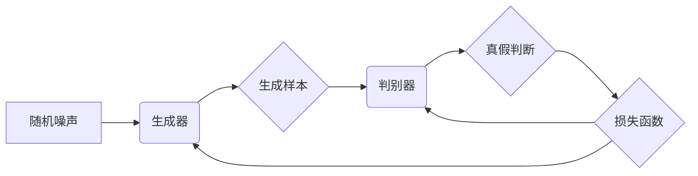

# 生成对抗网络:开创新纪元的革命力量

作者：禅与计算机程序设计艺术

## 1. 背景介绍

### 1.1 人工智能的新纪元

人工智能 (AI) 经历了数次浪潮，从早期的符号主义到如今的深度学习，每一次技术革新都推动着 AI 迈向新的高度。近年来，深度学习的崛起将 AI 推向了前所未有的巅峰，在图像识别、语音识别、自然语言处理等领域取得了突破性进展。然而，深度学习的成功很大程度上依赖于海量标注数据的训练，这限制了 AI 的进一步发展。

### 1.2 生成模型的崛起

为了克服深度学习对数据的过度依赖，研究者们开始探索新的 AI 范式，其中生成模型 (Generative Model) 成为研究热点。生成模型的目标是学习数据的潜在分布，从而能够生成新的数据样本，这些样本与真实数据具有相似的特征。生成模型的出现为 AI 开辟了新的道路，使得 AI 不再局限于对已有数据的分析，而是能够创造新的内容。

### 1.3 生成对抗网络的诞生

2014 年，Ian Goodfellow 提出了生成对抗网络 (Generative Adversarial Networks, GANs)，这是一种全新的生成模型，其核心思想是利用两个神经网络相互对抗来学习数据的真实分布。GANs 的出现标志着 AI 进入了一个新的纪元，为 AI 的发展带来了革命性的影响。

## 2. 核心概念与联系

### 2.1 生成器与判别器

GANs 的核心是两个神经网络：生成器 (Generator) 和判别器 (Discriminator)。生成器的目标是生成与真实数据尽可能相似的样本，而判别器的目标是区分真实数据和生成器生成的样本。这两个网络相互对抗，不断优化自身，最终达到生成器生成的样本与真实数据难以区分的程度。

### 2.2 对抗训练

GANs 的训练过程是一个对抗的过程。生成器不断生成新的样本，试图欺骗判别器，而判别器则不断提高自身的辨别能力，试图识破生成器生成的假样本。这两个网络在对抗中不断学习，最终达到一个平衡状态，此时生成器生成的样本与真实数据非常相似，判别器也难以区分真假样本。

### 2.3 零和博弈

GANs 的训练过程可以看作是一个零和博弈。生成器和判别器是博弈的双方，它们的利益相互冲突。生成器希望生成尽可能真实的样本，以获得更高的奖励，而判别器希望尽可能准确地识别真假样本，以避免受到惩罚。在博弈过程中，双方不断调整自己的策略，最终达到一个纳什均衡，此时任何一方都不能通过单方面的改变策略来获得更高的收益。

## 3. 核心算法原理具体操作步骤

### 3.1 生成器网络

生成器网络通常是一个多层神经网络，其输入是一个随机噪声向量，输出是一个与真实数据维度相同的样本。生成器的结构可以根据具体应用场景进行设计，常用的结构包括全连接网络、卷积神经网络、循环神经网络等。

#### 3.1.1 全连接网络生成器

全连接网络生成器是最简单的生成器结构，它由多个全连接层组成，每一层都包含一个线性变换和一个非线性激活函数。全连接网络生成器适用于生成低维数据，例如图像的像素值。

#### 3.1.2 卷积神经网络生成器

卷积神经网络生成器适用于生成高维数据，例如图像。卷积神经网络生成器由多个卷积层和池化层组成，卷积层用于提取图像的特征，池化层用于降低特征图的维度。

#### 3.1.3 循环神经网络生成器

循环神经网络生成器适用于生成序列数据，例如文本。循环神经网络生成器由多个循环单元组成，每个循环单元都包含一个隐藏状态，用于存储序列的历史信息。

### 3.2 判别器网络

判别器网络也是一个多层神经网络，其输入是一个样本，输出是一个标量，表示该样本是真实数据的概率。判别器的结构可以根据具体应用场景进行设计，常用的结构包括全连接网络、卷积神经网络等。

### 3.3 训练过程

GANs 的训练过程可以分为以下几个步骤：

1. 初始化生成器和判别器网络的参数。
2. 从真实数据集中采样一个批次的真实数据。
3. 从随机噪声分布中采样一个批次的随机噪声向量。
4. 使用生成器网络将随机噪声向量转换为生成样本。
5. 将真实数据和生成样本输入判别器网络，计算判别器网络的输出。
6. 根据判别器网络的输出计算生成器和判别器的损失函数。
7. 使用梯度下降算法更新生成器和判别器网络的参数。
8. 重复步骤 2 到 7，直到达到预设的训练轮数或模型性能达到要求。

### 3.4 损失函数

GANs 的损失函数通常使用二元交叉熵损失函数，用于衡量判别器网络对真实数据和生成样本的分类能力。生成器的损失函数则与判别器的损失函数相反，用于衡量生成器网络欺骗判别器网络的能力。

## 4. 数学模型和公式详细讲解举例说明

### 4.1 生成器损失函数

生成器的目标是生成尽可能真实的样本，以欺骗判别器网络。因此，生成器的损失函数可以定义为：

$$
\mathcal{L}_G = - \mathbb{E}_{z \sim p_z(z)} [\log D(G(z))]
$$

其中，$z$ 是随机噪声向量，$p_z(z)$ 是随机噪声分布，$G(z)$ 是生成器网络生成的样本，$D(x)$ 是判别器网络对样本 $x$ 是真实数据的概率。

### 4.2 判别器损失函数

判别器的目标是尽可能准确地识别真假样本。因此，判别器的损失函数可以定义为：

$$
\mathcal{L}_D = - \mathbb{E}_{x \sim p_{data}(x)} [\log D(x)] - \mathbb{E}_{z \sim p_z(z)} [\log (1 - D(G(z)))]
$$

其中，$x$ 是真实数据样本，$p_{data}(x)$ 是真实数据分布，$z$ 是随机噪声向量，$p_z(z)$ 是随机噪声分布，$G(z)$ 是生成器网络生成的样本，$D(x)$ 是判别器网络对样本 $x$ 是真实数据的概率。

## 5. 项目实践：代码实例和详细解释说明

### 5.1 使用 TensorFlow 构建 GANs

下面是一个使用 TensorFlow 构建 GANs 的示例代码：

```python
import tensorflow as tf

# 定义生成器网络
def generator(z):
  # 定义网络结构
  # ...
  return output

# 定义判别器网络
def discriminator(x):
  # 定义网络结构
  # ...
  return output

# 定义随机噪声
z = tf.random.normal([batch_size, noise_dim])

# 生成样本
generated_images = generator(z)

# 计算判别器输出
real_output = discriminator(real_images)
fake_output = discriminator(generated_images)

# 计算损失函数
generator_loss = -tf.reduce_mean(tf.math.log(fake_output))
discriminator_loss = -tf.reduce_mean(tf.math.log(real_output) + tf.math.log(1 - fake_output))

# 定义优化器
generator_optimizer = tf.keras.optimizers.Adam(learning_rate)
discriminator_optimizer = tf.keras.optimizers.Adam(learning_rate)

# 训练循环
for epoch in range(epochs):
  for batch in range(batches_per_epoch):
    # 采样真实数据
    real_images = ...

    # 训练判别器
    with tf.GradientTape() as disc_tape:
      # 计算判别器输出
      # ...
      # 计算判别器损失
      # ...
    # 计算梯度
    discriminator_gradients = disc_tape.gradient(discriminator_loss, discriminator.trainable_variables)
    # 更新判别器参数
    discriminator_optimizer.apply_gradients(zip(discriminator_gradients, discriminator.trainable_variables))

    # 训练生成器
    with tf.GradientTape() as gen_tape:
      # 生成样本
      # ...
      # 计算判别器输出
      # ...
      # 计算生成器损失
      # ...
    # 计算梯度
    generator_gradients = gen_tape.gradient(generator_loss, generator.trainable_variables)
    # 更新生成器参数
    generator_optimizer.apply_gradients(zip(generator_gradients, generator.trainable_variables))

  # 打印训练进度
  # ...
```

## 6. 实际应用场景

### 6.1 图像生成

GANs 在图像生成领域取得了显著成果，可以用于生成逼真的图像、图像修复、图像超分辨率等。

### 6.2 文本生成

GANs 可以用于生成文本，例如诗歌、小说、新闻报道等。

### 6.3 语音合成

GANs 可以用于生成语音，例如语音助手、语音客服等。

### 6.4 视频生成

GANs 可以用于生成视频，例如电影、电视剧、动画等。

## 7. 工具和资源推荐

### 7.1 TensorFlow

TensorFlow 是 Google 开发的开源机器学习平台，提供了丰富的 API 用于构建和训练 GANs。

### 7.2 PyTorch

PyTorch 是 Facebook 开发的开源机器学习平台，也提供了丰富的 API 用于构建和训练 GANs。

### 7.3 Keras

Keras 是一个高级神经网络 API，可以运行在 TensorFlow、CNTK 或 Theano 之上，提供了一种更简洁的方式来构建和训练 GANs。

## 8. 总结：未来发展趋势与挑战

### 8.1 未来发展趋势

GANs 作为一种强大的生成模型，未来将在以下几个方面继续发展：

* 提高生成样本的质量和多样性。
* 探索新的 GANs 架构和训练方法。
* 将 GANs 应用于更广泛的领域，例如医疗、金融、教育等。

### 8.2 挑战

GANs 也面临着一些挑战，例如：

* 训练过程不稳定，容易出现模式崩溃等问题。
* 生成样本的评价指标难以量化。
* GANs 的可解释性较差。

## 9. 附录：常见问题与解答

### 9.1 什么是模式崩溃？

模式崩溃是指 GANs 在训练过程中，生成器网络只能生成有限的几种模式，而无法生成多样化的样本。

### 9.2 如何解决模式崩溃问题？

解决模式崩溃问题的方法有很多，例如：

* 使用更复杂的网络结构。
* 使用不同的损失函数。
* 调整训练参数。

### 9.3 如何评价 GANs 生成样本的质量？

评价 GANs 生成样本的质量是一个复杂的问题，目前还没有统一的评价指标。常用的评价指标包括 Inception Score (IS)、Fréchet Inception Distance (FID) 等。


## 10. Mermaid 流程图




## 11. 结束语

生成对抗网络作为一种强大的生成模型，为人工智能的发展带来了革命性的影响。随着技术的不断进步，GANs 将在未来发挥更加重要的作用，为人类社会创造更大的价值。
