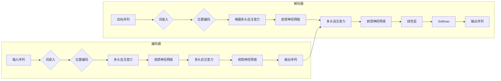

## 1. 背景介绍

### 1.1 机器翻译的演进

机器翻译是自然语言处理领域中一个重要的研究方向，其目标是将一种自然语言自动翻译成另一种自然语言。早期的机器翻译系统主要基于规则，需要人工编写大量的语法规则和词汇表，效率低下且翻译质量不高。随着统计机器翻译 (SMT) 的兴起，机器翻译的质量得到了显著提升。SMT 利用大量的平行语料库，通过统计模型学习语言之间的映射关系，从而实现自动翻译。近年来，随着深度学习技术的快速发展，神经机器翻译 (NMT) 逐渐取代 SMT 成为主流方法。NMT 使用深度神经网络来建模语言之间的映射关系，能够更好地捕捉语言的语义信息，翻译质量更高。

### 1.2 Transformer 的崛起

Transformer 是一种基于自注意力机制的神经网络架构，最初应用于自然语言处理领域的机器翻译任务，并取得了突破性的成果。Transformer 模型抛弃了传统的循环神经网络 (RNN) 结构，完全基于注意力机制来建模序列数据，能够更好地捕捉长距离依赖关系，并行计算效率更高。Transformer 模型的成功很快扩展到其他自然语言处理任务，例如文本摘要、问答系统、情感分析等。

### 1.3 Transformer 在机器翻译中的优势

Transformer 在机器翻译任务中展现出以下优势：

* **并行计算能力强:** Transformer 模型的编码器和解码器都采用了并行计算的方式，能够充分利用硬件资源，加速训练和推理过程。
* **长距离依赖关系建模能力强:** Transformer 模型的自注意力机制能够捕捉句子中任意两个词之间的依赖关系，无论距离多远。
* **翻译质量高:** Transformer 模型能够更好地捕捉语言的语义信息，翻译结果更加流畅自然。

## 2. 核心概念与联系

### 2.1 Transformer 架构

Transformer 模型由编码器和解码器两部分组成，如下图所示：



* **编码器:** 编码器负责将输入序列转换成一个包含语义信息的向量表示。编码器由多个相同的层堆叠而成，每个层包含两个子层：多头自注意力层和前馈神经网络层。
* **解码器:** 解码器负责根据编码器生成的向量表示，生成目标序列。解码器也由多个相同的层堆叠而成，每个层包含三个子层：掩蔽多头自注意力层、多头自注意力层和前馈神经网络层。

### 2.2 自注意力机制

自注意力机制是 Transformer 模型的核心组件，其作用是计算序列中每个词与其他所有词之间的相关性，从而捕捉词与词之间的依赖关系。自注意力机制的计算过程如下：

1. **计算查询向量、键向量和值向量:** 对于序列中的每个词，将其词嵌入分别乘以三个不同的矩阵，得到查询向量 $Q$、键向量 $K$ 和值向量 $V$。
2. **计算注意力权重:** 将查询向量 $Q$ 与所有键向量 $K$ 进行点积，然后进行缩放和 Softmax 操作，得到注意力权重矩阵。
3. **加权求和:** 将注意力权重矩阵与值向量 $V$ 进行加权求和，得到最终的输出向量。

### 2.3 多头自注意力机制

多头自注意力机制是自注意力机制的扩展，它将自注意力机制并行执行多次，并将结果进行拼接，从而获得更丰富的语义信息。

### 2.4 位置编码

由于 Transformer 模型没有循环结构，无法感知词的顺序信息。为了解决这个问题，Transformer 模型引入了位置编码，将词的位置信息加入到词嵌入中，使得模型能够感知词的顺序信息。

## 3. 核心算法原理具体操作步骤

### 3.1 数据预处理

机器翻译任务的数据预处理步骤包括：

1. **数据清洗:** 对原始语料进行清洗，去除噪声数据，例如标点符号、特殊字符等。
2. **分词:** 将句子切分成词语序列。
3. **构建词汇表:** 统计语料中出现的词语，构建源语言和目标语言的词汇表。
4. **数字化:** 将词语映射成数字 ID，方便模型处理。

### 3.2 模型训练

Transformer 模型的训练过程如下：

1. **初始化模型参数:** 随机初始化 Transformer 模型的编码器和解码器的参数。
2. **前向传播:** 将训练数据输入到模型中，计算模型的输出。
3. **计算损失函数:** 计算模型输出与真实标签之间的差异，使用交叉熵损失函数。
4. **反向传播:** 根据损失函数计算梯度，使用梯度下降算法更新模型参数。
5. **重复步骤 2-4:** 重复上述步骤，直到模型收敛。

### 3.3 模型推理

Transformer 模型的推理过程如下:

1. **将源语言句子输入到编码器中，得到其向量表示。**
2. **将编码器生成的向量表示输入到解码器中。**
3. **解码器根据编码器生成的向量表示，逐个生成目标语言词语，直到生成结束符。**

## 4. 数学模型和公式详细讲解举例说明

### 4.1 自注意力机制

自注意力机制的计算公式如下：

$$
Attention(Q, K, V) = softmax(\frac{QK^T}{\sqrt{d_k}})V
$$

其中：

* $Q$ 表示查询向量矩阵。
* $K$ 表示键向量矩阵。
* $V$ 表示值向量矩阵。
* $d_k$ 表示键向量维度。

**举例说明:**

假设输入序列为 "我 爱 北京 天安门"，将其转换成词嵌入矩阵：

```
[[0.1, 0.2, 0.3],
 [0.4, 0.5, 0.6],
 [0.7, 0.8, 0.9],
 [1.0, 1.1, 1.2],
 [1.3, 1.4, 1.5]]
```

计算查询向量、键向量和值向量：

```
Q = X * W_q
K = X * W_k
V = X * W_v
```

其中 $W_q$, $W_k$, $W_v$ 是可学习的参数矩阵。

计算注意力权重矩阵：

```
Attention_weights = softmax(QK^T / sqrt(d_k))
```

计算输出向量：

```
Output = Attention_weights * V
```

### 4.2 多头自注意力机制

多头自注意力机制将自注意力机制并行执行多次，并将结果进行拼接。假设执行 $h$ 次自注意力机制，则多头自注意力机制的计算公式如下：

$$
MultiHead(Q, K, V) = Concat(head_1, ..., head_h)W^O
$$

其中：

* $head_i = Attention(QW_i^Q, KW_i^K, VW_i^V)$
* $W_i^Q$, $W_i^K$, $W_i^V$ 是可学习的参数矩阵。
* $W^O$ 是可学习的参数矩阵。

### 4.3 位置编码

位置编码的计算公式如下：

$$
PE_{(pos, 2i)} = sin(pos / 10000^{2i/d_{model}})
$$

$$
PE_{(pos, 2i+1)} = cos(pos / 10000^{2i/d_{model}})
$$

其中：

* $pos$ 表示词的位置。
* $i$ 表示维度索引。
* $d_{model}$ 表示词嵌入维度。

## 5. 项目实践：代码实例和详细解释说明

### 5.1 环境搭建

```python
!pip install transformers
!pip install datasets
```

### 5.2 数据加载

```python
from datasets import load_dataset

# 加载数据集
dataset = load_dataset("wmt14", language_pair=("en", "de"))

# 打印数据集信息
print(dataset)
```

### 5.3 数据预处理

```python
from transformers import AutoTokenizer

# 初始化分词器
tokenizer = AutoTokenizer.from_pretrained("t5-small")

# 定义预处理函数
def preprocess_function(examples):
    inputs = [ex["en"] for ex in examples]
    targets = [ex["de"] for ex in examples]
    model_inputs = tokenizer(inputs, text_target=targets, max_length=128, truncation=True)
    return model_inputs

# 对数据集进行预处理
tokenized_datasets = dataset.map(preprocess_function, batched=True)
```

### 5.4 模型定义

```python
from transformers import AutoModelForSeq2SeqLM

# 初始化模型
model = AutoModelForSeq2SeqLM.from_pretrained("t5-small")
```

### 5.5 模型训练

```python
from transformers import Seq2SeqTrainer, Seq2SeqTrainingArguments

# 定义训练参数
training_args = Seq2SeqTrainingArguments(
    output_dir="./results",
    per_device_train_batch_size=8,
    per_device_eval_batch_size=8,
    predict_with_generate=True,
    num_train_epochs=3,
    fp16=True,
)

# 初始化训练器
trainer = Seq2SeqTrainer(
    model=model,
    args=training_args,
    train_dataset=tokenized_datasets["train"],
    eval_dataset=tokenized_datasets["validation"],
)

# 训练模型
trainer.train()
```

### 5.6 模型推理

```python
from transformers import pipeline

# 初始化翻译管道
translator = pipeline("translation_en_to_de", model=model, tokenizer=tokenizer)

# 翻译句子
sentence = "This is a test sentence."
translation = translator(sentence)

# 打印翻译结果
print(translation)
```

## 6. 实际应用场景

机器翻译技术在许多领域都有广泛的应用，例如：

* **跨语言交流:** 机器翻译可以帮助人们克服语言障碍，实现跨语言交流。
* **信息获取:** 机器翻译可以帮助人们获取其他语言的信息，例如新闻、文献等。
* **文化传播:** 机器翻译可以帮助人们了解其他文化，促进文化交流。

## 7. 工具和资源推荐

### 7.1 工具

* **Transformers:** Hugging Face 开发的 Transformer 模型库，提供了各种预训练的 Transformer 模型和工具。
* **Fairseq:** Facebook 开发的序列到序列建模工具包，支持 Transformer 模型的训练和推理。
* **OpenNMT:** 哈佛大学开发的神经机器翻译工具包，支持 Transformer 模型的训练和推理。

### 7.2 资源

* **WMT:** 机器翻译领域的顶级学术会议，每年都会发布机器翻译数据集和评测指标。
* **OPUS:** 一个大型的平行语料库，包含多种语言的平行文本。
* **TED Talks:** 一个包含多种语言字幕的演讲视频库，可以用来训练机器翻译模型。

## 8. 总结：未来发展趋势与挑战

### 8.1 未来发展趋势

* **多模态机器翻译:** 将图像、语音等多模态信息融入机器翻译模型，提升翻译质量。
* **低资源机器翻译:** 针对资源稀缺的语言，开发低资源机器翻译模型。
* **可解释机器翻译:** 提升机器翻译模型的可解释性，使其更易于理解和调试。

### 8.2 挑战

* **数据稀缺:** 许多语言缺乏高质量的平行语料库，限制了机器翻译模型的训练效果。
* **语言差异:** 不同语言之间存在语法、语义等方面的差异，增加了机器翻译的难度。
* **评估指标:** 目前还没有完美的机器翻译评估指标，难以准确评估机器翻译模型的性能。

## 9. 附录：常见问题与解答

### 9.1 Transformer 模型的参数量很大，如何降低模型的复杂度？

可以使用模型压缩技术，例如知识蒸馏、剪枝等，降低 Transformer 模型的参数量。

### 9.2 如何提高 Transformer 模型的翻译质量？

可以使用数据增强技术，例如回译、噪声注入等，增加训练数据的多样性，提升模型的泛化能力。

### 9.3 Transformer 模型的训练时间很长，如何加速模型训练？

可以使用混合精度训练、梯度累积等技术，加速 Transformer 模型的训练过程。
