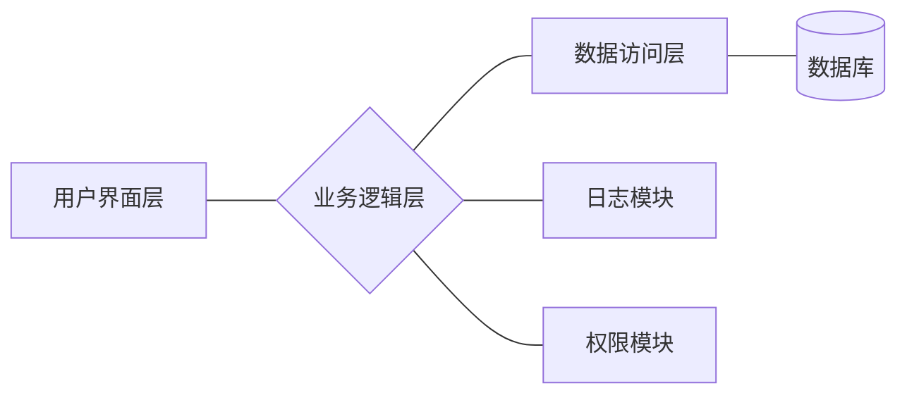

# 电脑公司进销存系统详细设计与具体代码实现

作者：禅与计算机程序设计艺术

## 1. 背景介绍

### 1.1 进销存系统的重要性
在现代企业管理中,进销存系统扮演着至关重要的角色。它能够有效地管理企业的进货、销售和库存等业务流程,提高企业运营效率,降低成本,为企业的决策提供数据支持。

### 1.2 电脑公司的业务特点
电脑公司作为IT行业的代表,其业务具有产品型号多样、更新换代快、客户群体广泛等特点。因此,电脑公司对进销存系统的需求更加迫切和专业化。

### 1.3 系统开发的目标
本文旨在针对电脑公司的业务特点,设计并实现一套功能完善、性能优异、扩展性强的进销存管理系统。通过对系统的详细设计和代码实现过程的讲解,帮助读者深入理解进销存系统的架构原理和开发技巧。

## 2. 核心概念与关联

### 2.1 进货管理
- 2.1.1 采购计划
- 2.1.2 供应商管理  
- 2.1.3 采购订单处理
- 2.1.4 入库管理

### 2.2 销售管理
- 2.2.1 客户管理
- 2.2.2 销售报价
- 2.2.3 销售订单处理
- 2.2.4 出库与发货
- 2.2.5 销售退货  

### 2.3 库存管理
- 2.3.1 商品信息管理
- 2.3.2 库存查询与盘点
- 2.3.3 库存预警
- 2.3.4 移库管理

### 2.4 基础数据
- 2.4.1 商品类别
- 2.4.2 仓库信息
- 2.4.3 员工账号
- 2.4.4 系统设置

### 2.5 报表统计
- 2.5.1 入库报表   
- 2.5.2 出库报表
- 2.5.3 库存报表
- 2.5.4 采购与销售统计

## 3. 架构设计与核心算法

### 3.1 系统架构图


### 3.2 分层设计
系统采用经典的三层架构设计:  
- 表示层:提供用户交互界面,处理用户输入输出
- 业务逻辑层:封装业务逻辑,实现业务流程控制
- 数据访问层:提供数据持久化服务,封装数据库访问细节

### 3.3 模块划分
按照功能划分为若干模块:
- 进货管理模块
- 销售管理模块 
- 库存管理模块
- 基础数据管理模块
- 报表统计模块
- 日志模块 
- 权限模块

### 3.4 数据库设计
采用关系型数据库,部分核心表:
- 商品表: goods
- 供应商表: supplier
- 客户表: customer  
- 采购订单表: purchase_order
- 销售订单表: sale_order
- 仓库表: warehouse
- ... 

### 3.5 核心算法
系统中使用的一些核心算法:  
- 可用库存计算:采用FIFO(先进先出)算法 
- 订货点与安全库存:使用统计模型如正态分布等计算
- 需求预测:使用时间序列分析、机器学习等算法
- ABC分类管理:采用帕累托法则(二八法则)对物料分类

## 4. 数学模型和公式

### 4.1 经济订货批量(EOQ)模型

经济订货批量是在一定时期内,在满足需求量的前提下,总订货费用与储存费用之和最小时的订货量。

$$Q^*=\sqrt{\frac{2DS}{H}}$$

其中:
- $Q^*$ 表示经济订货批量
- $D$ 表示一定时期内的需求量  
- $S$ 表示每次订货的费用
- $H$ 表示单位商品的储存费用

### 4.2 安全库存计算

设 $μ$ 为需求量均值,$σ$ 为需求量标准差,$z$ 为服务水平因子,则安全库存$SS$为:

$$SS=z\sigma\sqrt{LT}$$

其中,$LT$为提前期(单位:月)。 

服务水平 | 服务因子z
---|---
90% | 1.29 
95% | 1.65
99% | 2.33
99.9% | 3.08

### 4.3 产品分类的ABC分析

ABC分析是根据帕累托法则(又称20/80定律)将产品分为A、B、C三类:
- A类:占总体的20%,重要价值达80% 
- B类:占总体的30%,重要价值达15% 
- C类:占总体的50%,重要价值达5%

对这三类产品进行不同级别的管理。

## 5. 代码实现

下面给出系统关键模块的部分代码实现。

### 5.1 商品管理
```java
public class GoodsService {
    
    @Autowired
    private GoodsMapper goodsMapper;
    
    /**
     * 创建商品
     */
    public void createGoods(Goods goods) {
        // 参数校验
        validateParams(goods);
        
        // 保存商品信息
        goodsMapper.insertGoods(goods);
        
        // 同步缓存
        syncCache(goods);
    }
    
    /**
     * 更新商品信息 
     */
    public void updateGoods(Goods goods) {
        // 参数校验
        validateParams(goods);
        
        // 更新商品信息
        goodsMapper.updateGoods(goods);
        
        // 同步缓存
        syncCache(goods);
    }
    
    /**
     * 删除商品
     */
    public void deleteGoods(Long goodsId) {
        goodsMapper.deleteGoods(goodsId);    
        
        // 同步删除缓存
        removeCacheByKey(goodsId);
    }
    
    /**
     * 商品详情查询
     */
    public Goods getGoods(Long goodsId) {
        // 优先读取缓存
        Goods goods = getGoodsFromCache(goodsId);
        
        if (goods == null) {
            goods = goodsMapper.getGoods(goodsId);
            // 同步最新数据到缓存  
            syncCache(goods);
        }
        
        return goods;
    }
    
    // ...
}
```

### 5.2 库存管理
```java
public class StockService {
    
    @Autowired
    private StockMapper stockMapper;
    
    /**
     * 入库操作
     */
    public void stockIn(StockInRequest request) {
        // 参数校验
        validateParams(request);
        
        // 保存入库单
        StockInDO stockInDO = new StockInDO();
        stockInDO.setGoodsId(request.getGoodsId());
        stockInDO.setQuantity(request.getQuantity());
        // ...
        stockMapper.insertStockIn(stockInDO);
         
        // 更新库存数量
        stockMapper.increaseStock(request.getGoodsId(), request.getQuantity());
    }
    
    /**
     * 出库操作
     */
    public void stockOut(StockOutRequest request) {
        // 参数校验
        validateParams(request);
        
        // 判断库存是否充足
        if (!checkStock(request.getGoodsId(), request.getQuantity())) {
            throw new BizException("库存不足");
        }
        
        // 保存出库单
        StockOutDO stockOutDO = new StockOutDO();
        stockOutDO.setGoodsId(request.getGoodsId());
        stockOutDO.setQuantity(request.getQuantity());
        // ...
        stockMapper.insertStockOut(stockOutDO);
        
        // 扣减库存
        stockMapper.decreaseStock(request.getGoodsId(), request.getQuantity());
    }
    
    // 判断库存是否充足
    private boolean checkStock(Long goodsId, Integer quantity) {
        Integer stock = stockMapper.getStock(goodsId);
        return stock >= quantity;
    }
    
    // ...
}
```

### 5.3 订单处理

以下是销售订单处理的简化版代码示例:
```java
public class SaleOrderService {
    
    @Autowired
    private SaleOrderMapper saleOrderMapper;
    
    @Autowired
    private StockService stockService;
    
    /**
     * 创建销售订单
     */
    @Transactional
    public void createSaleOrder(SaleOrder order) {
        // 参数校验
        validateParams(order);
        
        // 保存销售订单
        saleOrderMapper.insertOrder(order);
        
        // 占用库存
        List<OrderItem> items = order.getItems();
        for (OrderItem item : items) {
            stockService.decreaseStock(item.getGoodsId(), item.getQuantity());
        }
        
        // TODO: 其他逻辑,如生成出库单、发票等
    }
    
    /**
     * 取消订单
     */
    @Transactional
    public void cancelOrder(Long orderId) {
        // 校验订单是否存在
        SaleOrder order = saleOrderMapper.getOrder(orderId);
        if (order == null) {
            throw new BizException("订单不存在");
        }
        
        // 修改订单状态为"已取消"
        saleOrderMapper.updateStatus(orderId, OrderStatus.CANCELED);
        
        // 释放库存
        List<OrderItem> items = order.getItems();
        for (OrderItem item : items) {
             stockService.increaseStock(item.getGoodsId(), item.getQuantity());
        }
    }
    
    // ...
}
```

## 6. 应用场景

进销存系统在电脑公司的各个业务环节中广泛应用,比如:

- 新产品上市时,采购部门根据销售预测及库存情况制定采购计划并下达采购订单,到货后通过进货管理模块进行入库操作;

- 销售部门根据客户订单创建销售订单,系统自动检查库存并占用库存,并生成出库单供仓库发货;

- 对滞销产品可及时通过库存预警功能感知,并制定降价促销方案,回笼资金;

- 通过商品进销存情况的报表统计,分析商品的销售状况,指导未来生产与采购计划。

系统的应用提高了进销存业务的信息化水平,减少了人工处理环节,提高了工作效率,避免了数据错漏,为管理决策提供了数据支持,为企业创造了价值。

## 7. 工具和资源推荐

进销存系统的开发涉及多种技术和工具,推荐如下:
- 开发语言:Java、C#、Python等
- 开发框架:Spring、.NET、Django等
- 数据库:MySQL、Oracle、SQL Server等
- ORM框架:MyBatis、Hibernate、Entity Framework等
- 缓存:Redis、Memcached
- 消息队列:Kafka、RabbitMQ  
- 全文检索:Elasticsearch、Solr
- 报表工具:FineReport、Jasperreports
- 开发工具:Eclipse、IntelliJ IDEA、Visual Studio等

需要学习的相关资源:
- 《企业进销存管理》 - 了解进销存业务流程和管理知识
- 《Java从入门到精通》 - Java语言编程学习
- 《Spring实战》 - Spring框架应用指南
- 《高性能MySQL》 - 学习MySQL数据库优化  
- 《领域驱动设计》 - 学习DDD领域驱动设计思想
- 《企业应用架构模式》 - 学习各种架构设计模式

## 8. 总结

本文全面阐述了电脑公司进销存系统的设计与实现要点,内容涵盖了需求分析、架构设计、核心算法、数据建模、代码实现、应用场景等各个方面。

正如文章所展示的,一套优秀的进销存系统需要考虑诸多因素,从业务本身的复杂性、系统性能的高要求,到软件工程领域的最佳实践等。

进销存系统作为企业信息化的核心系统之一,未来还有很大的优化和创新空间。建议开发者们多思考以下问题:

- 如何提高系统的并发性能,支撑更大的业务量?
- 如何利用大数据、机器学习等技术,挖掘数据价值,实现智能化进销存?
- 如何与移动互联网相结合,让进销存系统"移动化"?
- 如何做好平台化建设,让系统具备二次开发、定制化的能力?

希望本文能给从事进销存系统开发的同行们带来一些启发,让我们携手共进,以技术之力赋能企业管理变革。

## 9. 附录 - 常见问题与解答

Q: 采购订单和采购入库单的区别是什么?  
A: 采购订单描述