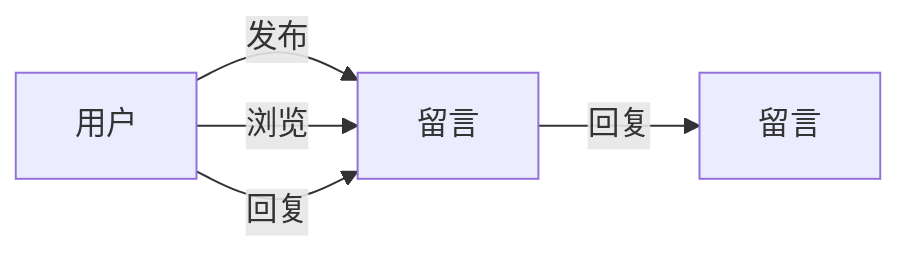

## 1.背景介绍

留言板管理系统一直是Web开发的重要组成部分，在互联网的发展过程中，它承载着用户之间的沟通交流的重要任务。随着时间的推移，留言板管理系统在功能和性能上都有了飞跃式的进步，但其核心设计理念和基础构成仍然保持了一致性。在本文中，我们将深入探讨留言板管理系统的详细设计和具体代码实现。

## 2.核心概念与联系

留言板系统基本上是一个CRUD（Create, Read, Update, Delete）应用，其核心概念包括用户、留言和回复。这些概念之间的联系可以用以下的关系图来表示：



## 3.核心算法原理具体操作步骤

在留言板管理系统中，核心操作如下：

1. **用户注册和登录**：用户需要首先注册并登录系统，才能发布或回复留言。这涉及到用户验证和授权的算法。
   
2. **发布留言**：用户可以发布留言，这涉及到数据的创建和存储算法。

3. **浏览留言**：用户可以浏览所有的留言，这涉及到数据的读取和展示算法。

4. **回复留言**：用户可以对留言进行回复，这涉及到数据的更新算法。

5. **删除留言**：用户可以删除自己的留言，这涉及到数据的删除算法。

## 4.数学模型和公式详细讲解举例说明

在留言板管理系统中，我们可以通过一些数学模型和公式来进行性能分析。例如，我们可以通过贝叶斯公式来预测用户的行为，通过马尔科夫链来模拟用户的浏览习惯等。这些公式可以帮助我们更好地理解用户行为，从而优化我们的系统。

例如，假设我们想要预测一个用户是否会对一个留言进行回复，我们可以使用贝叶斯公式：

$$ P(A|B) = \frac{P(B|A) \cdot P(A)}{P(B)} $$

其中，A表示用户回复留言，B表示用户浏览留言。通过这个公式，我们可以根据用户的浏览行为来预测他是否会进行回复。

## 5.项目实践：代码实例和详细解释说明

在这部分，我们将以Python和Django框架为例，展示一个简单的留言板管理系统的实现。

首先，我们需要创建一个Django项目，并为留言板应用创建一个模型。以下是`models.py`的代码：

```python
from django.db import models
from django.contrib.auth.models import User

class Message(models.Model):
    content = models.TextField()
    user = models.ForeignKey(User, on_delete=models.CASCADE)
    reply_to = models.ForeignKey('self', null=True, blank=True, on_delete=models.CASCADE)
```

这段代码定义了`Message`模型，其中`content`字段用于存储留言的内容，`user`字段表示发表该留言的用户，`reply_to`字段表示这条留言是回复哪条留言的。

接下来，我们需要在`views.py`中实现留言的创建、读取、更新和删除操作。以下是其中的一部分代码：

```python
from django.shortcuts import render, get_object_or_404
from .models import Message

def create_message(request):
    if request.method == 'POST':
        content = request.POST['content']
        user = request.user
        message = Message.objects.create(content=content, user=user)
        return redirect('message_list')

def message_list(request):
    messages = Message.objects.all()
    return render(request, 'message_list.html', {'messages': messages})
```

这段代码实现了留言的创建和读取操作。当用户提交一个POST请求时，`create_message`视图会创建一个新的留言并保存到数据库中。而当用户访问留言列表页面时，`message_list`视图会从数据库中读取所有的留言并展示给用户。

同样的，我们可以在`views.py`中实现留言的更新和删除操作。

## 6.实际应用场景

留言板管理系统在我们的日常生活和工作中有很多应用场景，以下是一些例子：

1. **论坛讨论区**：用户可以发布主题，其他用户可以回复，形成一种线上的多方交流。

2. **客服反馈系统**：用户可以在网站上留言反馈问题，客服人员可以及时回复处理。

3. **教育平台**：学生可以对老师的课程提问，老师和其他学生可以回答。

## 7.工具和资源推荐

以下是一些在开发留言板管理系统时可能会用到的工具和资源：

1. **Python**：一种广泛用于Web开发的编程语言。

2. **Django**：一个强大的Python Web开发框架，内置了ORM、模板引擎等功能。

3. **SQLite**：一个轻量级的数据库系统，适合用于小型Web应用。

4. **Bootstrap**：一个流行的前端框架，可以方便地创建美观的界面。

## 8.总结：未来发展趋势与挑战

随着技术的发展，留言板管理系统面临着新的挑战和机遇。例如，随着大数据和人工智能的发展，我们可以通过分析用户的留言和行为，为他们提供更个性化的体验。然而，这也带来了隐私和安全的问题，我们需要在提供个性化服务的同时，保护用户的隐私和数据安全。

## 9.附录：常见问题与解答

Q: 如何防止恶意用户发布垃圾留言？

A: 我们可以通过一些机器学习算法，例如朴素贝叶斯分类器，来预测一条留言是否是垃圾留言。同时，我们还可以设置一些规则，例如限制用户在一定时间内发布留言的数量。

Q: 如何提高留言板管理系统的性能？

A: 我们可以通过一些方法来提高系统的性能，例如使用缓存来减少数据库查询，使用异步操作来提高响应速度，使用负载均衡来分散请求等。

Q: 如何保护用户的隐私？

A: 我们需要遵守相关的法律法规，例如GDPR。在设计系统时，我们应该尽可能地减少对用户隐私数据的收集和存储，并提供用户管理和删除自己数据的方式。

以上就是关于留言板管理系统详细设计与具体代码实现的所有内容，希望对大家有所帮助。