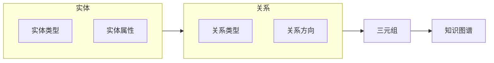

## 1. 背景介绍

### 1.1.  知识图谱的起源与发展

知识图谱的概念最早起源于20世纪50年代，当时人们开始尝试将人类知识以符号化的方式存储在计算机中，以便进行推理和问题求解。早期的知识表示方法主要包括语义网络、框架系统等。然而，这些方法存在着表达能力有限、难以扩展等问题。

随着互联网的快速发展，海量的文本、图像、视频等数据不断涌现，如何从这些数据中提取有价值的知识并进行有效管理成为了一个亟待解决的问题。在此背景下，知识图谱应运而生。2012年，Google正式推出其知识图谱产品，用于增强搜索引擎的能力，标志着知识图谱技术进入了一个新的发展阶段。

### 1.2. 知识图谱的定义与特征

知识图谱本质上是一种语义网络，它以图的形式表示知识，其中节点代表实体，边代表实体之间的关系。与传统的语义网络相比，知识图谱具有以下特征：

* **规模更大:** 知识图谱通常包含数百万甚至数十亿个实体和关系，能够表达更复杂的知识。
* **结构化更强:** 知识图谱采用RDF、OWL等标准化的知识表示语言，使得知识的存储和查询更加规范化。
* **语义更丰富:** 知识图谱不仅包含实体和关系，还可以包含属性、类别、规则等语义信息，能够更全面地描述知识。

### 1.3. 知识图谱的应用价值

知识图谱在很多领域都有着广泛的应用价值，例如：

* **搜索引擎:** 增强搜索结果的准确性和相关性，提供更智能的搜索体验。
* **问答系统:** 理解用户的问题并给出精准的答案，提高问答效率。
* **推荐系统:** 根据用户的兴趣和偏好推荐相关内容，提升用户体验。
* **金融风控:** 建立企业、个人、交易等实体之间的关系图谱，识别潜在的风险。
* **医疗诊断:** 构建疾病、症状、药物等实体之间的关系图谱，辅助医生进行诊断和治疗。

## 2. 核心概念与联系

### 2.1. 实体（Entity）

实体是指客观存在的事物或概念，例如人、地点、机构、事件等。在知识图谱中，实体通常用唯一的标识符（URI）来表示。

#### 2.1.1. 实体类型

实体可以根据其所属的类别进行分类，例如：

* 人：姓名、年龄、性别、职业等
* 地点：名称、经纬度、地址等
* 机构：名称、地址、联系方式等
* 事件：时间、地点、参与者等

#### 2.1.2. 实体属性

实体可以具有各种属性，例如：

* 人：身高、体重、学历等
* 地点：面积、人口密度等
* 机构：员工数量、营业收入等
* 事件：影响力、持续时间等

### 2.2. 关系（Relation）

关系是指实体之间的联系，例如：

* 人与人之间的关系：朋友、同事、亲属等
* 人与地点之间的关系：居住地、工作地等
* 人与机构之间的关系：雇员、会员等
* 事件与事件之间的关系：因果关系、时序关系等

#### 2.2.1. 关系类型

关系可以根据其语义进行分类，例如：

* 父子关系
* 夫妻关系
* 朋友关系
* 工作关系
* 地理位置关系

#### 2.2.2. 关系方向

关系可以是有向的，也可以是无向的。例如：

* 父子关系是有向的，从父亲指向儿子。
* 朋友关系是无向的，朋友之间相互连接。

### 2.3. 三元组（Triple）

三元组是知识图谱的基本单元，它由 subject、predicate、object 三部分组成，表示实体之间的关系。例如：

* (姚明, 效力于, 火箭队)
* (北京, 是, 中国的首都)

#### 2.3.1. Subject

Subject 是三元组的主语，表示关系的起点。

#### 2.3.2. Predicate

Predicate 是三元组的谓语，表示关系的类型。

#### 2.3.3. Object

Object 是三元组的宾语，表示关系的终点。

### 2.4. 知识图谱的表示方法

知识图谱可以使用多种方式进行表示，例如：

* **RDF (Resource Description Framework):** 一种用于描述网络资源的标准化语言。
* **OWL (Web Ontology Language):** 一种用于定义本体的标准化语言，可以用于描述实体、关系和属性之间的语义关系。
* **图数据库:** 一种专门用于存储和查询图数据的数据库，例如 Neo4j、OrientDB 等。

### 2.5. 核心概念联系图



## 3. 核心算法原理具体操作步骤

### 3.1. 知识抽取

知识抽取是从非结构化数据中提取结构化知识的过程，是构建知识图谱的关键步骤。常用的知识抽取方法包括：

#### 3.1.1. 实体识别

实体识别是从文本中识别出实体的名称，例如人名、地名、机构名等。常用的实体识别方法包括：

* **基于规则的方法:** 根据预先定义的规则识别实体，例如正则表达式匹配。
* **基于统计的方法:** 利用统计模型识别实体，例如隐马尔可夫模型（HMM）。
* **基于深度学习的方法:** 利用深度学习模型识别实体，例如循环神经网络（RNN）。

#### 3.1.2. 关系抽取

关系抽取是从文本中识别出实体之间的关系，例如父子关系、夫妻关系等。常用的关系抽取方法包括：

* **基于模板的方法:** 根据预先定义的模板识别关系，例如 "X 的父亲是 Y"。
* **基于统计的方法:** 利用统计模型识别关系，例如支持向量机（SVM）。
* **基于深度学习的方法:** 利用深度学习模型识别关系，例如卷积神经网络（CNN）。

### 3.2. 知识融合

知识融合是将来自不同数据源的知识进行整合，消除数据冗余和冲突，构建统一的知识图谱。常用的知识融合方法包括：

#### 3.2.1. 实体对齐

实体对齐是识别不同数据源中表示相同实体的标识符，例如将不同数据库中表示 "姚明" 的记录进行匹配。常用的实体对齐方法包括：

* **基于字符串相似度的匹配:** 计算实体名称之间的相似度，例如编辑距离、Jaccard 系数等。
* **基于属性相似度的匹配:** 计算实体属性之间的相似度，例如姓名、年龄、地址等。
* **基于图结构的匹配:** 利用图算法计算实体之间的相似度，例如 SimRank 算法。

#### 3.2.2. 关系对齐

关系对齐是识别不同数据源中表示相同关系的谓词，例如将不同数据库中表示 "父子关系" 的谓词进行匹配。常用的关系对齐方法包括：

* **基于字符串相似度的匹配:** 计算关系谓词之间的相似度，例如编辑距离、Jaccard 系数等。
* **基于语义相似度的匹配:** 利用词向量或知识库计算关系谓词之间的语义相似度。

### 3.3. 知识推理

知识推理是利用已有的知识推导出新的知识，例如根据 "姚明效力于火箭队" 和 "火箭队属于 NBA" 推导出 "姚明效力于 NBA"。常用的知识推理方法包括：

#### 3.3.1. 基于规则的推理

基于规则的推理利用预先定义的规则进行推理，例如 "如果 A 效力于 B，且 B 属于 C，则 A 效力于 C"。

#### 3.3.2. 基于统计的推理

基于统计的推理利用统计模型进行推理，例如马尔可夫逻辑网络（MLN）。

#### 3.3.3. 基于深度学习的推理

基于深度学习的推理利用深度学习模型进行推理，例如图神经网络（GNN）。

## 4. 数学模型和公式详细讲解举例说明

### 4.1. SimRank 算法

SimRank 算法是一种基于图结构的实体相似度计算方法，其基本思想是：如果两个实体的邻居节点相似，则这两个实体也相似。SimRank 算法的数学模型如下：

$$
S(a, b) = \frac{C}{|I(a)||I(b)|}\sum_{i \in I(a)}\sum_{j \in I(b)}S(i, j)
$$

其中：

* $S(a, b)$ 表示实体 $a$ 和 $b$ 之间的相似度。
* $C$ 是衰减因子，取值范围为 $(0, 1)$，表示邻居节点对实体相似度的影响程度。
* $I(a)$ 表示实体 $a$ 的邻居节点集合。

**举例说明：**

假设有一个社交网络图谱，其中包含以下关系：

* (A, 朋友, B)
* (A, 朋友, C)
* (B, 朋友, D)
* (C, 朋友, E)

利用 SimRank 算法计算 A 和 B 之间的相似度，衰减因子 $C$ 取 0.8：

$$
\begin{aligned}
S(A, B) &= \frac{0.8}{|I(A)||I(B)|}\sum_{i \in I(A)}\sum_{j \in I(B)}S(i, j) \\
&= \frac{0.8}{2 \times 1}(S(B, D) + S(C, E)) \\
&= 0.4 (S(B, D) + S(C, E))
\end{aligned}
$$

由于 B 和 D、C 和 E 之间没有直接关系，因此 $S(B, D) = S(C, E) = 0$，所以 $S(A, B) = 0$。

### 4.2. Jaccard 系数

Jaccard 系数是一种用于计算两个集合之间相似度的指标，其计算公式如下：

$$
J(A, B) = \frac{|A \cap B|}{|A \cup B|}
$$

其中：

* $A$ 和 $B$ 表示两个集合。
* $|A \cap B|$ 表示 $A$ 和 $B$ 的交集元素个数。
* $|A \cup B|$ 表示 $A$ 和 $B$ 的并集元素个数。

**举例说明：**

假设有两个实体：

* 实体 A 的属性集合为 {姓名: "姚明", 年龄: 40, 国籍: "中国"}。
* 实体 B 的属性集合为 {姓名: "姚明", 年龄: 41, 职业: "篮球运动员"}。

利用 Jaccard 系数计算 A 和 B 之间的相似度：

$$
\begin{aligned}
J(A, B) &= \frac{|A \cap B|}{|A \cup B|} \\
&= \frac{1}{4} \\
&= 0.25
\end{aligned}
$$

## 5. 项目实践：代码实例和详细解释说明

### 5.1. Python 代码示例

```python
import rdflib

# 创建一个图谱
graph = rdflib.Graph()

# 定义命名空间
FOAF = rdflib.Namespace("http://xmlns.com/foaf/0.1/")

# 添加三元组
graph.add((FOAF["yao_ming"], FOAF["name"], rdflib.Literal("姚明")))
graph.add((FOAF["yao_ming"], FOAF["age"], rdflib.Literal(40)))
graph.add((FOAF["yao_ming"], FOAF["nationality"], rdflib.Literal("中国")))

# 查询姚明的年龄
query = """
    PREFIX foaf: <http://xmlns.com/foaf/0.1/>
    SELECT ?age
    WHERE {
        foaf:yao_ming foaf:age ?age .
    }
"""
results = graph.query(query)

# 打印结果
for row in results:
    print(f"姚明的年龄是：{row['age']}")
```

### 5.2. 代码解释

* `rdflib` 是一个用于操作 RDF 数据的 Python 库。
* `FOAF` 是一个定义了人员信息的本体。
* `graph.add()` 方法用于向图谱中添加三元组。
* `graph.query()` 方法用于查询图谱中的数据。
* `PREFIX` 语句用于定义命名空间前缀。
* `SELECT` 语句用于指定要查询的变量。
* `WHERE` 语句用于指定查询条件。

## 6. 实际应用场景

### 6.1. 搜索引擎

知识图谱可以用于增强搜索结果的准确性和相关性，例如：

* **实体识别和消歧:** 识别搜索词中的实体，并将其链接到知识图谱中对应的实体。
* **关系抽取:** 识别搜索词之间的关系，并根据关系提供更精准的搜索结果。
* **语义搜索:** 理解用户的搜索意图，并根据语义关系提供更相关的搜索结果。

### 6.2. 问答系统

知识图谱可以用于构建问答系统，例如：

* **问题理解:** 识别问题中的实体和关系，并将问题转换为知识图谱上的查询。
* **答案生成:** 根据知识图谱中的数据生成答案，并以自然语言的形式呈现给用户。

### 6.3. 推荐系统

知识图谱可以用于构建推荐系统，例如：

* **用户画像:** 根据用户的历史行为构建用户画像，包括用户的兴趣、偏好等。
* **商品画像:** 根据商品的属性、类别、关系等构建商品画像。
* **基于知识图谱的推荐:** 根据用户画像和商品画像，利用知识图谱中的关系进行推荐，例如 "喜欢姚明" 的用户可能会喜欢 "NBA" 相关的商品。

## 7. 总结：未来发展趋势与挑战

### 7.1. 未来发展趋势

* **大规模知识图谱构建:** 随着数据量的不断增长，构建更大规模的知识图谱成为了一个重要的发展趋势。
* **多模态知识图谱:** 将文本、图像、视频等多模态数据融合到知识图谱中，构建更全面的知识表示。
* **知识图谱推理:** 发展更强大的知识推理方法，实现更智能的知识应用。
* **知识图谱与深度学习融合:** 将深度学习技术应用于知识图谱的构建、推理和应用，提升知识图谱的性能和效率。

### 7.2. 面临的挑战

* **数据质量:** 知识图谱的构建依赖于高质量的数据，而现实世界中的数据往往存在着噪声、不完整等问题。
* **知识表示:** 如何有效地表示知识，并使其能够被计算机理解和推理，是一个重要的挑战。
* **知识推理:** 现有的知识推理方法仍然存在着效率低、泛化能力差等问题。
* **知识应用:** 如何将知识图谱应用于实际场景，并产生实际价值，是一个需要不断探索的问题。

## 8. 附录：常见问题与解答

### 8.1. 知识图谱与数据库的区别？

知识图谱和数据库都是用于存储数据的工具，但它们之间存在着一些区别：

* **数据模型:** 知识图谱采用图数据模型，而数据库通常采用关系数据模型。
* **数据语义:** 知识图谱侧重于数据的语义关系，而数据库侧重于数据的结构化存储。
* **查询方式:** 知识图谱支持基于图结构的查询，而数据库支持基于 SQL 的查询。

### 8.2. 知识图谱的构建流程？

知识图谱的构建流程通常包括以下步骤：

1. **知识抽取:** 从非结构化数据中提取结构化知识。
2. **知识融合:** 将来自不同数据源的知识进行整合。
3. **知识存储:** 将知识存储到图数据库或其他存储系统中。
4. **知识推理:** 利用已有的知识推导出新的知识。
5. **知识应用:** 将知识图谱应用于实际场景。

### 8.3. 如何评估知识图谱的质量？

评估知识图谱的质量可以从以下几个方面进行：

* **准确率:** 知识图谱中三元组的准确率。
* **完整性:** 知识图谱中包含的知识的完整程度。
* **一致性:** 知识图谱中知识的一致性，例如不存在冲突或矛盾的知识。
* **推理能力:** 知识图谱的推理能力，例如能够推导出新的知识。