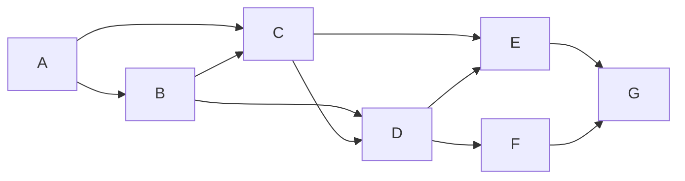

# 社区发现 原理与代码实例讲解

## 1. 背景介绍

### 1.1 什么是社区发现?

社区发现(Community Detection)是一种在复杂网络(如社交网络、生物网络、计算机网络等)中识别密集连接的节点群集或社区的过程。社区通常被定义为网络中的一组节点,这些节点之间的连接比与其他节点的连接更密集。

社区发现在许多领域都有重要应用,例如:

- **社交网络分析**: 识别社交网络中的兴趣群体、朋友圈等。
- **生物信息学**: 发现蛋白质相互作用网络中的功能模块。
- **网页排名**: 改进网页排名算法,提高搜索质量。
- **推荐系统**: 根据用户社区发现相似兴趣爱好,提供个性化推荐。
- **欺诈检测**: 识别金融交易网络中的欺诈分子集团。
- **社区营销**: 根据社区特征开展精准营销。

### 1.2 社区发现的挑战

尽管社区发现概念简单,但由于复杂网络的多样性和复杂性,实现准确高效的社区发现算法并非易事。主要挑战包括:

- **缺乏明确的社区定义**: 不同领域对社区的定义可能不同。
- **分辨率限制**: 一些算法难以识别小社区或处理大规模网络。  
- **噪声和缺失数据**: 现实网络往往包含噪声和缺失数据。
- **重叠社区**: 节点可能同时属于多个社区。
- **动态网络**: 网络拓扑结构随时间变化。
- **大规模计算**: 高效处理大规模复杂网络是一大挑战。

## 2. 核心概念与联系  

### 2.1 图论基础

社区发现问题建立在图论的基础之上。给定一个无向图 $G=(V,E)$,其中 $V$ 是节点集合, $E$ 是边集合。我们希望将 $V$ 划分为若干个不相交的子集 $C_1,C_2,...,C_k$,使得每个子集 $C_i$ 对应一个社区,且满足某些优化目标。

常用的图论指标包括:

- **度(Degree)**: 节点的度是指与该节点直接相连的边数。
- **邻居(Neighbors)**: 与某节点直接相连的节点集合。
- **路径(Path)**: 连接两个节点的边序列。
- **连通性(Connectivity)**: 图的连通性描述了图中节点的可达性。

### 2.2 社区紧密性

衡量社区质量的一个关键指标是社区内部连接的紧密程度。常用指标包括:

- **内部密度(Internal Density)**: 社区内部边数与最大可能边数的比值。
- **内部传递性(Internal Transitivity)**: 社区内三元组闭包的分数。  
- **导出度(Outgoing Degree Fraction)**: 社区外部边数占总边数的比例。

一个好的社区应当具有高内部密度、高内部传递性和低导出度。

### 2.3 社区分割视角

另一种看待社区发现的视角是图的分割(Graph Partitioning)问题。我们希望将图分割成若干个子图(社区),使得某个目标函数最小(或最大)化。常见目标函数包括:

- **割构造(Cut)**: 所有边缘边(连接不同子图的边)的权重之和。
- **导出度(Outgoing Degree)**: 所有边缘边的度数之和。  
- **模 (Modularity)**: 比较子图内外密度差异的指标。

## 3. 核心算法原理具体操作步骤

社区发现算法可大致分为四类:原型分析算法、图分割算法、动态算法和基于模型的算法。我们逐一介绍这些算法的核心原理和具体步骤。

### 3.1 原型分析算法

原型分析算法旨在基于节点间相似性对网络进行聚类。常见算法包括:

#### 3.1.1 K-Means算法

K-Means算法是一种简单而流行的聚类算法,其在社区发现中的步骤如下:

1. 随机选取 $k$ 个节点作为初始质心。
2. 将每个节点指派到与之最近的质心所在簇。
3. 更新每个簇的质心为簇内所有节点的均值向量。  
4. 重复步骤2-3,直至收敛(质心不再变化)。

该算法的优点是简单快速,但缺点是需要预先指定社区数量 $k$,且对初始质心选择敏感。

#### 3.1.2 谱聚类算法

谱聚类算法利用图的拉普拉斯矩阵的特征向量对节点进行聚类,具体步骤如下:

1. 构建图的邻接矩阵 $A$ 和度矩阵 $D$。
2. 计算拉普拉斯矩阵 $L=D-A$。
3. 计算 $L$ 的前 $k$ 个最小非零特征向量 $u_1,u_2,...,u_k$。  
4. 将每个节点 $i$ 映射为 $k$ 维向量 $(u_1(i),u_2(i),...,u_k(i))$。
5. 使用 $K$-Means 等传统聚类算法对映射后的节点向量进行聚类。

谱聚类适用于发现任意形状的社区,但计算复杂度较高。

### 3.2 图分割算法

图分割算法将网络划分为高度连通的子图(社区),同时使子图之间的连通性最小化。

#### 3.2.1 Kernighan-Lin 算法

Kernighan-Lin 算法是一种贪心启发式划分算法,其基本思路是通过交换节点对来减小割集大小,具体步骤如下:

1. 从一个初始二分割开始。
2. 计算将每对节点互换后的割集变化量。
3. 选择能使割集最小的节点对互换。  
4. 重复步骤2-3,直至割集不再变小。

该算法简单高效,但局限于发现两个分区,且结果依赖初始分割。

#### 3.2.2 Girvan-Newman 算法  

Girvan-Newman 算法是一种基于边去中心性的分层聚类算法,其步骤如下:

1. 计算每条边的边介数中心性。
2. 移除边介数中心性最高的边。
3. 重新计算剩余边的边介数中心性。
4. 重复步骤2-3,直至图被完全切分。
5. 构建树状层次聚类图,根据所需社区数量截断树枝获得社区划分。

该算法可发现任意数量的社区,但计算复杂度较高,适用于中小型网络。

### 3.3 动态算法

动态算法专门处理随时间变化的动态网络。

#### 3.3.1 Incremental 算法

Incremental 算法通过增量更新来保持社区结构,步骤如下:

1. 初始化社区结构(如使用其他算法的结果)。
2. 监视网络动态变化(新增/删除节点或边)。
3. 根据变化,增量更新社区结构和相关指标。
4. 如果社区质量下降超过阈值,重新运行社区发现算法获取新的社区划分。
5. 重复步骤2-4,直至网络停止变化。

该算法避免了重复计算的高开销,适合处理网络变化速率较慢的情况。

#### 3.3.2 Cross-Periods 算法

Cross-Periods 算法利用网络历史快照,通过跨时间段优化来发现动态社区结构,步骤如下:

1. 将网络按时间划分为多个时间段。
2. 在每个时间段内,使用静态算法发现当前社区结构。
3. 构建时间段间的节点映射矩阵。
4. 使用映射矩阵,在相邻时间段间传递社区结构。
5. 跨时间段优化总体社区划分,使某目标函数(如模)最大化。

该算法可发现网络中持续存在的稳定社区,但计算代价较高。

### 3.4 基于模型的算法

基于模型的算法使用生成模型对网络和社区进行建模,然后优化模型参数以发现最佳社区划分。

#### 3.4.1 Stochastic Block Model

Stochastic Block Model(SBM)是一种常用的概率生成模型,其基本思想是:

1. 假设存在 $k$ 个社区,每个节点属于这 $k$ 个社区之一。
2. 节点 $i,j$ 之间存在一条边的概率 $p_{ij}$ 仅取决于它们所属社区 $c_i,c_j$。
3. 使用 $k \times k$ 概率矩阵 $\Theta$ 参数化 $p_{ij}$,其中 $\Theta_{c_i,c_j}=p_{ij}$。

我们可以通过最大似然估计或者贝叶斯方法估计模型参数 $\Theta$ 和社区分配 $c$,从而发现最佳社区划分。

#### 3.4.2 BIGCLAM 模型

BIGCLAM(Bipartite Graphs as Clustered with Latent Attribute Models)是一种基于非负矩阵分解的社区发现模型,适用于二部图。其基本思想是:

1. 将二部图的关系矩阵 $R$ 分解为两个低秩矩阵 $U,V$ 的乘积:$R \approx U \times V^T$。
2. $U$ 表示一部分节点的隐含社区分布向量,$V$ 表示另一部分节点的隐含社区分布向量。
3. 优化 $U,V$ 使 $R$ 和 $U \times V^T$ 的差异最小化,从而发现社区结构。

BIGCLAM 可以同时发现两部分节点的社区,并支持重叠社区和节点属性。

## 4. 数学模型和公式详细讲解举例说明

社区发现算法中涉及到多种数学模型和公式,我们逐一详细讲解并给出实例说明。

### 4.1 模(Modularity)

模是衡量社区划分质量的一个重要指标,由Newman等人于2004年提出。模度量了网络的实际社区结构与随机网络的差异程度。

给定一个具有 $m$ 条边的加权无向图 $G=(V,E,w)$,其中 $w_{ij}$ 表示边 $(i,j)$ 的权重。令社区划分为 $C=\{C_1,C_2,...,C_k\}$,则模定义为:

$$Q=\frac{1}{2m}\sum_{ij}\left[w_{ij}-\frac{d_id_j}{2m}\right]\delta(c_i,c_j)$$

其中:
- $d_i=\sum_jw_{ij}$ 为节点 $i$ 的度。
- $\delta(c_i,c_j)=1$ 当 $i,j$ 属于同一社区时,否则为0。
- 第一项 $w_{ij}$ 表示社区内部边权重之和。
- 第二项 $\frac{d_id_j}{2m}$ 是在随机网络中边 $(i,j)$ 存在的期望。

模的取值范围是 $[-1,1]$,值越大表示社区结构越显著。一般认为模大于0.3就表示网络具有较强的社区结构。

**实例**：
考虑一个具有8个节点和10条边的无权无向图,如下所示:

假设我们将其划分为两个社区 $C_1=\{A,B,C,D\}$,$C_2=\{E,F,G\}$。由于每个节点的度为4,总边数为10,代入模公式可得:

$$\begin{aligned}
Q&=\frac{1}{2\times 10}\left[6-\frac{16\times 12}{2\times 10}+4-\frac{12\times 8}{2\times 10}\right]\\
&=\frac{1}{10}[6-9.6+4-4.8]\\
&=\frac{1}{10}[-4.4]\\
&=-0.44
\end{aligned}$$

负值表明该划分并不合理,实际上这个网络更像是一个整体而非两个独立社区。

### 4.2 边介数中心性(Edge Betweenness Centrality)

边介数中心性是Girvan-Newman算法所使用的一种边级别的中心性指标。它