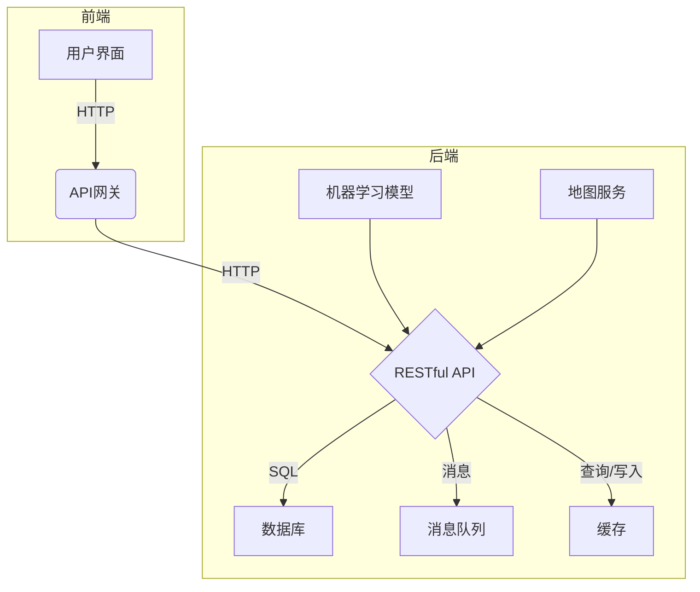

# 空调售后服务系统详细设计与具体代码实现

## 1.背景介绍

### 1.1 空调售后服务系统概述

随着空调产品的普及和使用年限的增加,空调售后服务需求日益增长。传统的人工服务模式已难以满足快速响应、高效处理的要求。因此,构建一个智能化、自动化的空调售后服务系统势在必行。

该系统旨在提供一站式的空调故障诊断、维修派单、备件管理等服务,实现对用户报修需求的快速响应和高效处理,提升用户体验。同时,系统还可以对历史数据进行分析,为企业决策提供依据。

### 1.2 系统架构概览

空调售后服务系统采用前后端分离的架构设计,具体包括:

- 前端:基于React框架开发,提供用户友好的Web界面
- 后端:基于Spring Boot框架开发RESTful API
- 数据库:使用MySQL存储系统数据
- 消息队列:使用RabbitMQ实现异步处理
- 缓存:使用Redis提高查询性能

此外,系统还集成了故障诊断模型(基于机器学习)、地图服务等模块,实现智能化服务。



## 2.核心概念与联系

### 2.1 报修订单

报修订单是系统的核心概念,包含了用户的报修信息、处理状态等数据。一个典型的报修订单生命周期如下:

1. 用户提交报修需求,生成新订单
2. 系统根据订单信息给出初步故障诊断
3. 订单进入待派单队列
4. 分配维修人员,生成维修工单
5. 维修人员处理订单,更新订单状态
6. 订单完成

### 2.2 备件管理

维修过程中可能需要更换零部件,因此系统需要管理备件库存,包括:

- 备件入库
- 备件出库
- 库存警戒线设置
- 库存盘点等

### 2.3 用户管理

系统需要对用户(包括普通用户和管理员)进行管理,实现:

- 用户注册/登录
- 权限控制
- 个人信息维护等

## 3.核心算法原理具体操作步骤  

### 3.1 故障诊断算法

故障诊断是系统的一个核心功能,通过对用户提供的故障信息进行分析,给出初步诊断结果。我们采用基于决策树的机器学习模型实现该功能。

1. **数据预处理**

   - 对历史报修数据进行清洗,剔除异常/缺失数据
   - 将非数值型数据(如故障现象描述)转换为数值型特征向量
   - 数据归一化

2. **构建决策树模型**

   - 使用ID3或C4.5算法构建决策树 
   - 设置合理的树深度,防止过拟合
   - 使用交叉验证等方法评估模型性能

3. **模型部署与更新**

   - 将训练好的模型持久化,集成到系统中
   - 定期使用新的历史数据重新训练模型,更新部署

4. **故障诊断流程**

   ```mermaid
   graph TD
   A[用户报修信息] --> B{特征提取}
   B --> C{决策树模型}
   C --> D[诊断结果]
   ```

### 3.2 维修工单派单算法

为了高效分配维修工单,提高现场服务效率,我们需要一个合理的派单算法。

1. **数据准备**

   - 获取当前所有待派单订单信息
   - 获取所有维修人员位置和工作状态信息

2. **计算订单-维修员匹配分值**

   - 基于订单地点和维修员位置,计算距离分值
   - 考虑维修员工作量,计算工作量分值
   - 考虑订单优先级,计算优先级分值
   - 将上述分值加权求和,得到总分值

3. **排序与派单**

   - 对所有(订单,维修员)组合按总分值降序排列
   - 从排序结果中,依次分配订单给维修员
   - 已分配订单的维修员,工作量分值实时更新  

通过上述算法,我们可以实现订单快速高效分配,同时兼顾现场服务效率。

## 4.数学模型和公式详细讲解举例说明

### 4.1 决策树模型

决策树是一种常用的监督学习算法,可用于分类和回归问题。它通过不断划分特征空间,构建一个树状决策模型。对于给定的输入实例,从树根开始,按照决策节点的条件进行特征检查,最终到达叶子节点,得到相应的输出。

决策树的构建算法通常基于信息增益或信息增益比准则,选择最优划分特征,递归构建子树,直至满足终止条件。常用的决策树算法包括ID3、C4.5和CART等。

以二类别问题为例,设有 $m$ 个样本,其中第 $i$ 个样本的特征向量为 $\boldsymbol{x}_i$,类别标记为 $y_i \in \{0, 1\}$。定义熵 (Entropy) 为:

$$
H(p) = -p\log_2 p - (1-p)\log_2(1-p)
$$

其中 $p$ 为正例的比例。熵 $H(p)$ 可以看作是数据的混乱程度的度量。

对于给定的特征 $A$,其可能取值为 $\{a_1, a_2, \cdots, a_n\}$,根据特征 $A$ 的取值将数据集 $D$ 划分为 $\{D_1, D_2, \cdots, D_n\}$,则条件熵为:

$$
H(D|A) = \sum_{k=1}^n \frac{|D_k|}{|D|}H(D_k)
$$

特征 $A$ 对数据集 $D$ 的信息增益定义为:

$$
\text{Gain}(D, A) = H(D) - H(D|A)
$$

在决策树构建过程中,我们选择信息增益最大的特征作为当前节点的划分条件,递归构建子树。

### 4.2 工单派单算法距离分值计算

在工单派单算法中,我们需要计算订单地点与维修员位置的距离分值。我们采用经纬度坐标系,使用球面距离公式计算两点间的近似距离:

$$
d = R \cdot \arccos\left(\sin(\text{lat}_1)\sin(\text{lat}_2) + \cos(\text{lat}_1)\cos(\text{lat}_2)\cos(\text{lon}_1 - \text{lon}_2)\right)
$$

其中:
- $d$ 为两点间的距离(单位:千米)
- $R$ 为地球半径,约 $6371$ 千米
- $(\text{lat}_1, \text{lon}_1)$ 和 $(\text{lat}_2, \text{lon}_2)$ 分别为两点的纬度和经度(单位:弧度)

将计算出的距离 $d$ 归一化到 $[0, 1]$ 区间,即为距离分值。

## 4.项目实践:代码实例和详细解释说明

### 4.1 Spring Boot 项目结构

```
src/main
  ├─ java
  │   └─ com.example.acrepair
  │       ├─ config       // 配置相关
  │       ├─ controller  // Web Controller
  │       ├─ entity      // 实体类
  │       ├─ repository  // 数据访问层
  │       ├─ service     // 业务逻辑层
  │       └─ util        // 工具类
  └─ resources
      ├─ static          // 静态资源
      └─ templates        // 模板文件
```

### 4.2 报修订单实体

```java
@Entity
public class RepairOrder {
    @Id
    @GeneratedValue
    private Long id;
    
    private String customerName;
    private String contactPhone;
    private String address;
    
    @Embedded
    private GeoLocation location; // 地理位置
    
    private String problemDesc;
    private String initialDiagnosis; 
    
    @Enumerated(EnumType.STRING)
    private OrderStatus status; // 订单状态
    
    // getter/setter 方法...
}
```

其中 `GeoLocation` 是一个嵌入式类,用于存储经纬度:

```java
@Embeddable
public class GeoLocation {
    private double latitude;
    private double longitude;
    
    // 构造函数和getter/setter
}
```

### 4.3 故障诊断服务

```java
@Service
public class FaultDiagnosisService {

    private DecisionTreeModel model;
    
    public FaultDiagnosisService() {
        // 从文件加载预训练模型
        model = loadModel("model.dat");
    }
    
    public String diagnose(RepairOrder order) {
        // 特征提取和向量化
        double[] features = extractFeatures(order);
        
        // 模型预测
        int prediction = model.predict(features);
        
        // 将预测结果转换为文本描述
        return getFaultDescription(prediction);
    }
    
    // 其他辅助方法...
}
```

在实际应用中,我们需要定期使用新数据重新训练模型,然后更新部署的模型文件。

### 4.4 工单派单服务

```java
@Service
public class DispatchService {

    @Autowired
    private OrderRepository orderRepo;
    
    @Autowired 
    private TechnicianRepository techRepo;
    
    public void dispatchOrders() {
        // 获取所有待派单订单
        List<RepairOrder> pendingOrders = orderRepo.findByStatus(OrderStatus.PENDING);
        
        // 获取所有维修员信息
        List<Technician> technicians = techRepo.findAll();
        
        // 计算派单分值矩阵
        double[][] scoreMatrix = calculateScoreMatrix(pendingOrders, technicians);
        
        // 匈牙利算法求最优分配
        int[] assignment = HungarianAlgorithm.computeAssignments(scoreMatrix);
        
        // 执行派单操作
        dispatchOrders(pendingOrders, technicians, assignment);
    }
    
    private double calculateScore(RepairOrder order, Technician tech) {
        // 计算距离、工作量、优先级等分值
        ...
        
        // 加权求和
        return 0.5 * distanceScore + 0.3 * workloadScore + 0.2 * priorityScore;
    }
    
    // 其他辅助方法...
}
```

上述代码使用了匈牙利算法(Hungarian Algorithm)求解最优分配问题。该算法的时间复杂度为 $O(n^3)$,对于规模较小的实例足够高效。如果规模较大,可以考虑使用其他近似算法。

## 5.实际应用场景

### 5.1 家用空调售后服务

家用空调作为高频使用的家电产品,其售后服务需求量较大。通过构建智能化的空调售后服务系统,可以为用户提供便捷、高效的报修服务,提升用户体验。

### 5.2 中央空调系统维护

大型商场、办公楼等场所通常采用中央空调系统,系统规模庞大、运行环境复杂。该系统可用于中央空调的故障诊断、维修调度等,提高运维效率。

### 5.3 空调制造商服务支持

空调制造商可以利用该系统为用户提供售后服务支持,收集现场维修数据用于产品质量分析和改进。同时,系统的故障诊断模型可以为产品设计提供反馈。

## 6.工具和资源推荐

### 6.1 开发工具

- IntelliJ IDEA: 功能强大的 Java IDE
- Visual Studio Code: 轻量级文本编辑器,支持多种语言
- Git: 版本控制系统
- Docker: 容器化部署工具

### 6.2 框架和库

- Spring Boot: 用于开发基于 Spring 的应用程序
- React: 构建用户界面的 JavaScript 库
- MyBatis: 持久层框架,用于数据库访问
- TensorFlow: 机器学习框架,用于训练故障诊断模型
- Mermaid: 基于文本的流程图生成工具

### 6.3 云服务

- 阿里云: 提供云服务器、对象存储等资源
- 腾讯云: 提供云数据库、CDN等服务
- 百度地图开放平台: 提供地图API服务

### 6.4 学习资源

- 《Spring 实战》
- 《React 实战》
- 《机器学