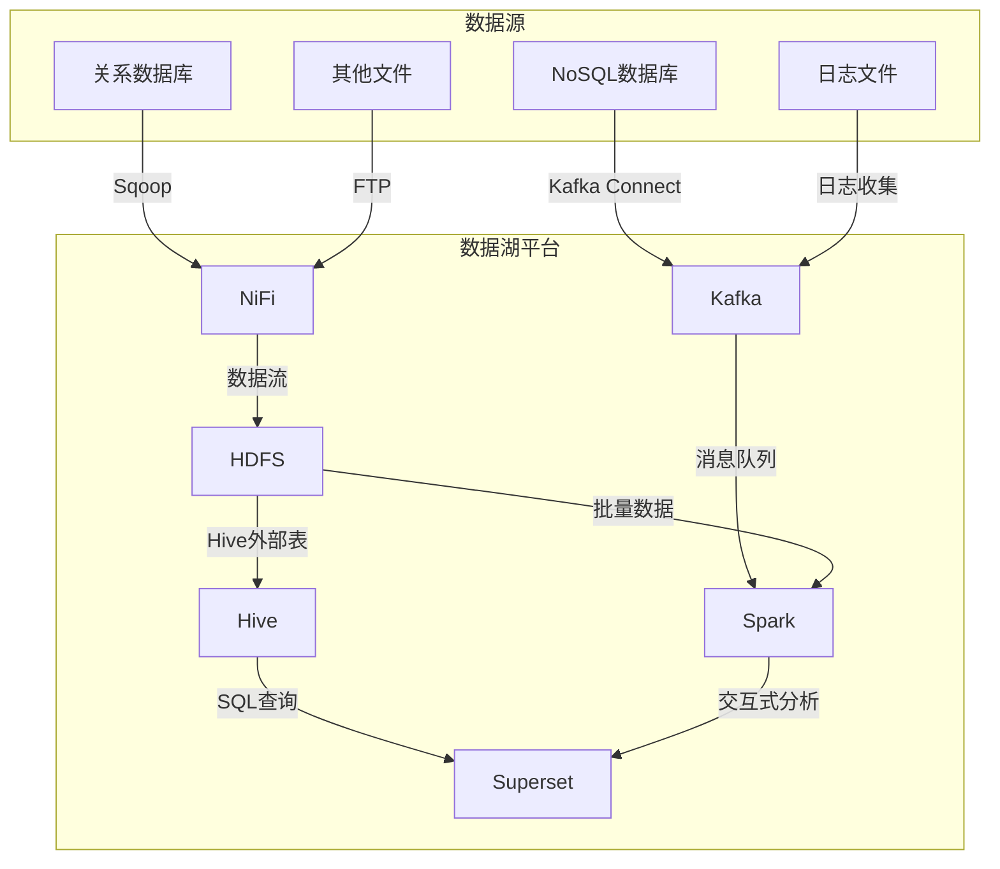

# 第四十一章：数据湖技术人才培养

## 1.背景介绍

### 1.1 数据时代的到来

在当今时代，数据被视为新的"石油"，成为推动商业创新和决策的关键驱动力。随着数字化转型的加速，各行各业都在产生大量的结构化和非结构化数据。有效管理和利用这些海量数据对于企业的发展至关重要。

### 1.2 数据湖的兴起

传统的数据仓库虽然在处理结构化数据方面表现出色，但在处理非结构化数据时却显得力不从心。为了解决这一挑战，数据湖(Data Lake)应运而生。数据湖是一种能够存储各种类型数据的集中式存储库,它采用了更灵活、更经济的方式来管理数据。

### 1.3 数据湖人才的紧缺

随着数据湖技术的兴起,对数据湖专业人才的需求也与日俱增。然而,由于这项技术相对较新,具备相关技能的人才却非常匮乏。培养数据湖人才成为企业和教育机构的当务之急。

## 2.核心概念与联系

### 2.1 数据湖的定义

数据湖是一种可扩展的大数据存储和处理平台,能够以原始格式存储结构化、半结构化和非结构化数据。它不同于传统数据仓库的关系数据模型,而是采用一种更加灵活的对象存储方式。

### 2.2 数据湖与数据仓库的区别

数据湖和数据仓库虽然都是存储和管理数据的平台,但在设计理念和使用场景上存在明显差异:

- 数据模型:数据仓库使用关系模型,数据湖采用对象存储
- 数据类型:数据仓库主要处理结构化数据,数据湖可处理各种类型数据 
- 数据处理:数据仓库先对数据进行ETL加工后再加载,数据湖先存储原始数据再按需处理
- 成本:数据湖基于开源技术,成本较低

### 2.3 数据湖的核心技术

数据湖的核心技术主要包括:

- 分布式文件系统(HDFS)
- 批处理框架(MapReduce/Spark)
- 流式处理框架(Kafka/Flink)
- 数据查询引擎(Hive/Presto)
- 元数据管理(Apache Atlas)
- 数据治理(Apache Ranger)

## 3.核心算法原理具体操作步骤

### 3.1 数据摄取
  
#### 3.1.1 批量数据摄取

批量数据摄取是将大量已存在的数据加载到数据湖中。这通常是数据湖建设的第一步,涉及从各种源系统提取数据并导入到HDFS等分布式文件系统中。常用的工具有:

- Apache Sqoop:关系数据库到Hadoop的数据传输工具
- Apache Kafka Connect:连接器可实现数据的持续导入
- Apache NiFi:支持基于Web UI的数据流编排和集成

#### 3.1.2 流式数据摄取

许多应用场景需要实时或近实时处理数据,这就需要流式数据摄取。常用的工具包括:

- Apache Kafka:分布式流处理平台
- Apache Flume:分布式、可靠、高可用的数据收集系统

### 3.2 数据存储

数据湖通常将数据存储在分布式文件系统中,如HDFS、对象存储等。数据可以按原始格式存储,也可以根据需要进行结构化处理并存储在Hive等系统中。

### 3.3 数据处理

数据湖中的数据可以通过多种方式进行处理和分析:

#### 3.3.1 批处理

对已存储的历史数据进行批量处理分析,常用的框架有:

- Apache MapReduce
- Apache Spark

#### 3.3.2 流式处理  

对实时或近实时数据进行处理分析,常用的框架有:

- Apache Spark Streaming 
- Apache Flink
- Apache Storm

#### 3.3.3 交互式查询分析

通过SQL类查询语言对数据进行即席分析,常用的引擎有:

- Apache Hive
- Apache Presto
- Apache Impala

### 3.4 数据治理

数据治理对于确保数据湖中数据的完整性、安全性至关重要,涉及以下关键环节:

- 元数据管理
- 数据质量管理
- 数据安全和隐私
- 数据生命周期管理
- 数据资产管理
   
常用的开源工具包括Apache Atlas、Apache Ranger等。

### 3.5 数据可视化

为了更好地呈现分析结果,数据可视化是不可或缺的一个环节。常用的开源可视化工具有:

- Apache Superset
- Apache ECharts
- Grafana

## 4. 数学模型和公式详细讲解举例说明

在数据湖的数据处理过程中,通常需要使用一些数学模型和公式。下面将对其中一些常用的模型和公式进行详细讲解:

### 4.1 MapReduce模型

MapReduce是一种分布式计算模型,常用于大数据处理。它的核心思想是将任务分成两个阶段:Map和Reduce。

Map阶段的工作原理如下:

$$
\begin{align*}
map(k_1,v_1) \rightarrow list(k_2,v_2)\\
\\
\end{align*}
$$

其中:
- $(k_1, v_1)$表示输入的键值对
- $list(k_2, v_2)$表示经过Map函数处理后输出的中间键值对列表

Reduce阶段的工作原理如下:

$$
\begin{align*}
reduce(k_2, list(v_2)) \rightarrow list(k_3,v_3)\\
\\
\end{align*}
$$

其中:
- $k_2$是Map阶段输出的键
- $list(v_2)$是对应于相同键$k_2$的值列表
- $list(k_3, v_3)$是Reduce函数的输出结果

### 4.2 PageRank算法

PageRank算法是谷歌用于网页排名的著名算法,它通过网页之间的链接结构来计算网页的重要性。

PageRank算法的核心公式为:

$$
PR(p) = (1-d) + d \sum_{q \in M(p)} \frac{PR(q)}{L(q)} 
$$

其中:

- $PR(p)$表示网页$p$的PageRank值
- $M(p)$表示链接到$p$的所有网页集合
- $L(q)$表示网页$q$的出链接数量
- $d$是一个衰减因子,通常取值0.85

该公式体现了两个基本思想:

1. 一个被许多重要网页链接的网页,其重要性也很高
2. 一个网页的重要性会被均摊到它的出链接上

通过迭代计算,整个网络中所有网页的PageRank值会收敛到一个稳定值。

### 4.3 协同过滤算法

协同过滤是推荐系统中常用的一种算法,根据用户之间的相似度预测用户可能感兴趣的项目。

#### 4.3.1 用户相似度计算

常用的用户相似度计算方法是基于余弦相似度:

$$
sim(u,v)=\frac{\sum\limits_{i \in I}r_{ui}r_{vi}}{\sqrt{\sum\limits_{i \in I}r_{ui}^2}\sqrt{\sum\limits_{i \in I}r_{vi}^2}}
$$

其中:
- $u$和$v$分别表示两个用户
- $I$是两个用户都评分过的项目集合 
- $r_{ui}$表示用户$u$对项目$i$的评分

#### 4.3.2 预测评分

对于目标用户$u$,其对项目$j$的预测评分可以用加权平均算法计算:

$$
p_{uj} = \overline{r_u} + \frac{\sum\limits_{v \in S(j,k)}sim(u,v)(r_{vj}-\overline{r_v})}{\sum\limits_{v \in S(j,k)}sim(u,v)} 
$$

其中:
- $\overline{r_u}$表示用户$u$的平均评分
- $S(j,k)$表示对项目$j$评分过且与$u$最相似的$k$个用户
- $r_{vj}$表示用户$v$对项目$j$的评分
- $\overline{r_v}$表示用户$v$的平均评分

## 4. 项目实践:代码实例和详细解释说明

为了加深对数据湖技术的理解,下面将通过一个实际项目案例,结合代码示例对数据湖的构建和使用进行详细说明。

### 4.1 项目背景

某电子商务公司需要构建一个数据湖系统,用于存储公司各个业务系统产生的数据,并对这些数据进行分析挖掘,以期获得有价值的业务洞察。

### 4.2 技术架构

该项目的技术架构如下所示:



该架构主要包括以下组件:

- **Kafka**:用于收集实时数据流,如日志、消息等
- **NiFi**:用于批量数据的收集和流程编排
- **HDFS**:作为数据湖的核心存储层
- **Hive**:提供SQL接口,用于对HDFS上的数据进行结构化处理和查询分析
- **Spark**:用于批量和流式数据的处理分析
- **Superset**:提供数据可视化和BI分析功能

### 4.3 数据摄取

#### 4.3.1 批量数据摄取

使用Apache NiFi对批量数据进行摄取和处理。下面是一个从关系数据库摄取数据到HDFS的NiFi流程:

```xml
<?xml version="1.0" encoding="UTF-8"?>
<template encoding-version="1.2">
    <ingestors>
        <processor>
            <class>org.apache.nifi.processors.standard.ExecuteSQLRecord</class>
            <properties>
                <entry key="Database Connection Pooling Service">dbcp</entry>
                <entry key="sql-query">
                    SELECT * FROM orders WHERE order_date >= #{dateTime():format('yyyy-MM-dd')}
                </entry>
            </properties>
            <schedule>
                <period>1 hour</period>
            </schedule>
        </processor>
        <processor>
            <class>org.apache.nifi.processors.standard.PutHDFS</class>
            <properties>
                <entry key="Hadoop Configuration Resources">/etc/hadoop/conf/core-site.xml</entry>
                <entry key="Directory">/data/orders</entry>
            </properties>
        </processor>
    </ingestors>
    <controllerServices>
        <service>
            <class>org.apache.nifi.dbcp.DBCPConnectionPool</class>
            <id>dbcp</id>
            <properties>
                <entry key="Database Connection URL">jdbc:mysql://localhost:3306/ecommerce</entry>
            </properties>
        </service>
    </controllerServices>
</template>
```

该流程每小时从MySQL数据库中提取当天的订单数据,并将其保存到HDFS的`/data/orders`路径下。

#### 4.3.2 流式数据摄取

使用Apache Kafka对实时数据流进行收集,下面是一个从服务器日志文件收集数据到Kafka的示例:

```bash
# 创建Kafka Topic
kafka-topics.sh --create --topic server_logs --bootstrap-server localhost:9092 --partitions 3 --replication-factor 2

# 使用Filebeat收集日志
filebeat.inputs:
- type: log
  paths:
    - /var/log/*.log
output.kafka:
  hosts: ["localhost:9092"]
  topic: server_logs

# 启动Filebeat
./filebeat -e
```

上述配置将服务器上的日志文件实时收集到Kafka的`server_logs`主题中,以供后续的流式处理。

### 4.4 数据处理和分析

#### 4.4.1 批处理

使用Apache Spark对