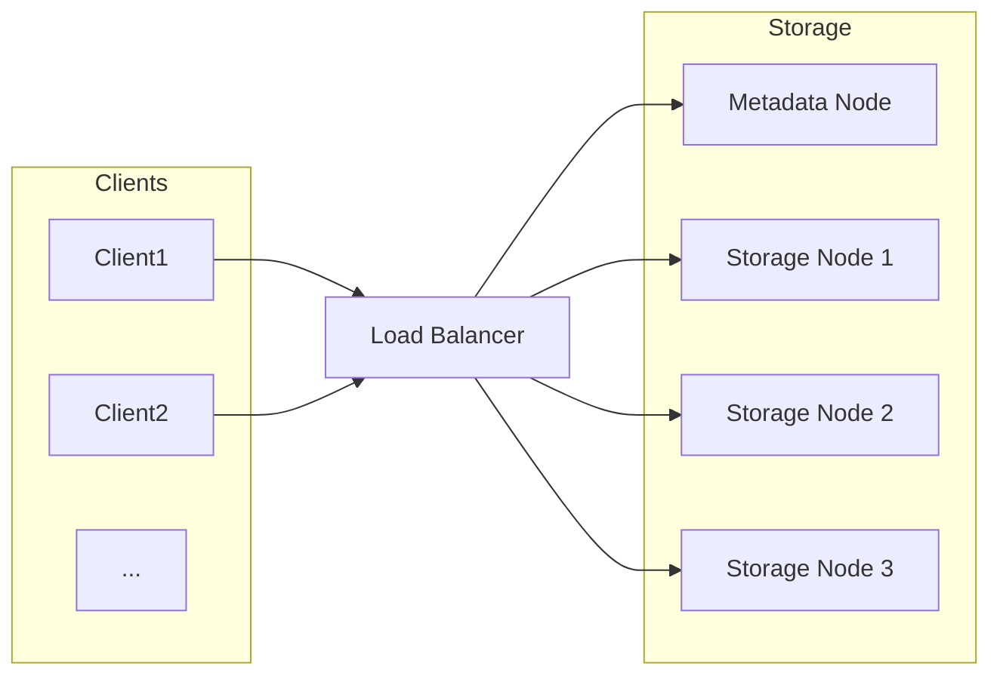

# 简易网络存储系统详细设计与具体代码实现

## 1. 背景介绍

### 1.1 网络存储的需求和挑战

随着数据量的不断增长和网络技术的快速发展,网络存储系统已经成为现代IT基础架构中不可或缺的一部分。传统的本地存储方式已经无法满足海量数据的存储和高并发访问需求,网络存储系统应运而生。

网络存储系统需要解决以下几个主要挑战:

1. **数据分布和冗余**:海量数据需要分布在多个节点上存储,并提供数据冗余备份,以确保数据的可靠性和高可用性。
2. **并发访问控制**:大量客户端并发读写请求需要被合理调度和控制,避免相互干扰。
3. **负载均衡和扩展性**:存储系统需要能够根据负载情况动态扩展存储容量和计算能力。
4. **数据一致性**:分布式存储系统需要保证数据的最终一致性。
5. **安全性和权限管理**:存储系统需要提供安全的数据访问机制和细粒度的权限控制。

### 1.2 简易网络存储系统概述

本文将设计并实现一个简易的网络存储系统,它包含以下几个核心组件:

- **存储节点(Storage Node)**:负责实际存储数据文件的节点。
- **元数据节点(Metadata Node)**:维护文件到存储节点的映射元数据。
- **客户端库(Client Library)**:提供文件上传、下载、删除等操作接口。
- **负载均衡器(Load Balancer)**:负责客户端请求的调度和负载均衡。

该系统设计目标是提供一个简单且可扩展的分布式文件存储解决方案,重点关注数据分布、元数据管理、客户端访问等核心功能,并在一定程度上保证数据可靠性。

## 2. 核心概念与联系  

### 2.1 文件分块(File Sharding)

为了支持大文件的分布式存储,我们需要将文件分割为多个数据块(Chunk)存储在不同的存储节点上。常见的文件分块策略有:

1. **固定大小分块**:将文件按照固定的大小(如4MB)切分为多个数据块。
2. **基于内容的分块**:根据文件内容的特征(如Rabin指纹)切分数据块,有助于增量备份等。

本系统采用固定大小分块策略,以简化实现。

### 2.2 冗余存储(Redundancy)

为了提高数据可靠性,我们需要为每个数据块在多个存储节点上保存冗余副本。常用的冗余存储策略有:

1. **复制存储(Replication)**:为每个数据块保存多个完整副本。
2. **纠删码(Erasure Coding)**:通过对数据块进行编码计算,生成同等大小的多个编码块,从而提高存储空间利用率。

本系统采用简单的复制存储策略,即为每个数据块保存3个副本,存储在3个不同的存储节点上。

### 2.3 一致性哈希(Consistent Hashing)

为了实现数据块到存储节点的均匀映射,并提高系统的扩展性,我们采用一致性哈希(Consistent Hashing)算法。该算法将数据块和存储节点都映射到同一个哈希环空间,数据块被存储在其顺时针方向的第一个存储节点上。当有新的存储节点加入或离开时,只需重新计算受影响的数据块的存储位置,而不需要重新计算所有数据块。

### 2.4 元数据管理

为了快速定位文件对应的数据块及其存储位置,我们需要维护一个元数据系统。元数据包括:

1. **文件到数据块的映射**:记录了文件被切分为哪些数据块。
2. **数据块到存储节点的映射**:记录了每个数据块的存储位置。

本系统采用集中式元数据节点存储以上两种元数据信息。

### 2.5 客户端与负载均衡

客户端通过客户端库与存储系统进行交互,包括上传文件、下载文件、删除文件等操作。

为了实现客户端请求的负载均衡,我们引入了负载均衡器(Load Balancer)组件,客户端请求首先被发送到负载均衡器,由其根据某种调度策略(如轮询、最小连接等)转发到元数据节点或存储节点。

## 3. 核心算法原理具体操作步骤

### 3.1 文件上传流程

1. 客户端通过负载均衡器连接到元数据节点,请求上传一个文件。
2. 元数据节点为该文件生成一个唯一的文件ID。
3. 客户端将文件分块,每个数据块计算一个数字签名(如SHA-1)。
4. 客户端通过一致性哈希算法,为每个数据块选择3个不同的存储节点,并将数据块上传到这3个存储节点。
5. 客户端将文件元数据(文件ID、数据块签名和存储节点列表)上传到元数据节点。
6. 元数据节点记录文件元数据,上传操作完成。

### 3.2 文件下载流程

1. 客户端通过负载均衡器连接到元数据节点,请求下载一个文件。
2. 元数据节点查询该文件的元数据,获取数据块签名和存储节点列表。
3. 客户端通过负载均衡器并行连接到存储节点,从中下载数据块。
4. 客户端对下载的数据块进行校验(比对数字签名),并按顺序重新组装为完整文件。
5. 下载操作完成。

### 3.3 数据块冗余修复

为了防止数据丢失,当某个存储节点宕机或数据块损坏时,我们需要修复数据块的冗余副本。修复流程如下:

1. 元数据节点周期性扫描存储节点的状态,发现某些数据块的副本数量小于3。
2. 元数据节点从其他存储节点下载该数据块的可用副本。
3. 元数据节点将数据块的副本分别上传到3个新的存储节点。
4. 元数据节点更新该数据块的存储节点列表。

## 4. 数学模型和公式详细讲解举例说明

### 4.1 一致性哈希算法

一致性哈希算法的核心思想是将数据块和存储节点都映射到同一个哈希环空间,通过顺时针方向寻找距离数据块哈希值最近的存储节点作为其存储位置。

具体步骤如下:

1. 选择一个哈希函数(如SHA-1)计算哈希值。
2. 为每个存储节点计算一个哈希值,并将其放置在哈希环空间。
3. 为每个数据块计算一个哈希值。
4. 顺时针查找距离该数据块哈希值最近的存储节点,作为该数据块的存储位置。
5. 为提高均匀性,每个存储节点可以在哈希环上放置多个虚拟节点。

数学模型:

设有 $N$ 个存储节点 $\{node_1, node_2, ..., node_N\}$,计算它们的哈希值:

$$hash(node_i) = SHA1(node_i), \quad i=1,2,...,N$$

对于一个数据块 $chunk$,计算其哈希值 $hash(chunk)$。

该数据块的存储节点为:

$$node_{store} = \operatorname*{argmin}_{node_i} \{ |hash(chunk) - hash(node_i)| \}$$

其中 $|\cdot|$ 表示在哈希环上的距离。

引入虚拟节点后,每个存储节点有 $M$ 个虚拟节点,则存储节点集合扩展为:

$$\{node_1^1, node_1^2, ..., node_1^M, node_2^1, ..., node_N^M\}$$

相应地,数据块的存储节点变为:

$$node_{store} = \operatorname*{argmin}_{node_i^j} \{ |hash(chunk) - hash(node_i^j)| \}$$

### 4.2 数据块签名

为了验证数据块的完整性,我们需要为每个数据块计算一个数字签名。常用的签名算法有SHA家族、MD5等。

本系统使用SHA-1算法计算数据块签名:

$$sign(chunk) = SHA1(chunk)$$

其中 $chunk$ 表示数据块的二进制数据。

客户端在上传数据块时计算签名,并将签名信息存储在元数据节点。下载时,客户端对下载的数据块重新计算签名,并与元数据中的签名进行比对,从而验证数据块的完整性。

## 5. 项目实践:代码实例和详细解释说明

为了阐明上述设计,我们提供了一个简单的Python实现示例。完整代码可在[这里](https://github.com/yourusername/SimpleNetworkStorage)获取。

### 5.1 系统架构



上图展示了系统的主要组件及其交互关系:

1. 客户端(Client)通过负载均衡器(Load Balancer)连接到元数据节点(Metadata Node)或存储节点(Storage Node)。
2. 元数据节点维护文件元数据,包括文件到数据块的映射,以及数据块的存储位置。
3. 存储节点实际存储文件数据块及其冗余副本。

### 5.2 关键数据结构

```python
class File:
    def __init__(self, file_id, chunk_signs, storage_nodes):
        self.file_id = file_id
        self.chunk_signs = chunk_signs  # 数据块签名列表
        self.storage_nodes = storage_nodes  # 存储节点列表

class MetadataNode:
    def __init__(self):
        self.file_metadata = {}  # 文件元数据: file_id -> File

class StorageNode:
    def __init__(self, node_id):
        self.node_id = node_id
        self.chunks = {}  # 存储的数据块: chunk_sign -> chunk_data

class LoadBalancer:
    def __init__(self, metadata_nodes, storage_nodes):
        self.metadata_nodes = metadata_nodes
        self.storage_nodes = storage_nodes
```

- `File`类表示一个文件的元数据,包括文件ID、数据块签名列表和存储节点列表。
- `MetadataNode`类维护一个字典,存储所有文件的元数据。
- `StorageNode`类用于存储数据块,通过数据块签名作为键访问数据块数据。
- `LoadBalancer`类管理元数据节点和存储节点的列表,用于请求调度。

### 5.3 核心功能实现

#### 5.3.1 文件上传

```python
def upload_file(file_data, metadata_node, load_balancer):
    # 1. 生成文件ID
    file_id = str(uuid.uuid4())

    # 2. 分块并计算数字签名
    chunk_size = 4 * 1024 * 1024  # 4MB
    chunks = [file_data[i:i+chunk_size] for i in range(0, len(file_data), chunk_size)]
    chunk_signs = [sha1(chunk).hexdigest() for chunk in chunks]

    # 3. 通过一致性哈希选择存储节点
    storage_nodes = consistent_hash(chunk_signs)

    # 4. 上传数据块到存储节点
    for chunk, sign, nodes in zip(chunks, chunk_signs, storage_nodes):
        for node in nodes:
            storage_node = load_balancer.get_storage_node(node)
            storage_node.put_chunk(sign, chunk)

    # 5. 上传元数据到元数据节点
    file_metadata = File(file_id, chunk_signs, storage_nodes)
    metadata_node.put_metadata(file_id, file_metadata)

    return file_id
```

上传文件的主要步骤:

1. 生成一个唯一的文件ID。
2. 将文件分块,并为每个数据块计算SHA-1签名。
3. 通过一致性哈希算法为每个数据块选择3个存储节点。
4. 将数据块上传到对应的存储节点。
5. 将文件元数据(文件ID、数据块签名、存储节点列表)上传到元数据节点。

#### 5.3.2 文件下载

```python
def download_file(