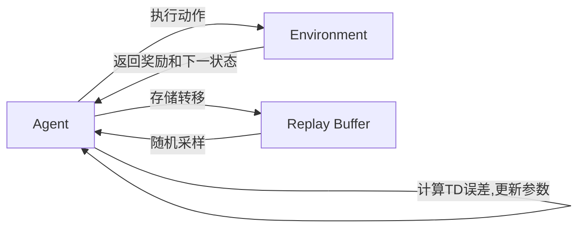

# 经验回放：让DQN学得更快更稳

作者：禅与计算机程序设计艺术

## 1. 背景介绍

### 1.1 强化学习与DQN算法
强化学习(Reinforcement Learning, RL)是机器学习的一个重要分支,它研究如何让智能体(agent)通过与环境的交互来学习最优策略,以最大化累积奖励。近年来,随着深度学习的发展,将深度神经网络与强化学习相结合,出现了一系列令人振奋的成果。其中最具代表性的就是DeepMind提出的DQN(Deep Q-Network)[1]算法,它在Atari游戏上实现了超越人类的表现,被誉为深度强化学习的里程碑。

### 1.2 DQN面临的挑战
尽管DQN取得了巨大成功,但它在实际应用中仍面临一些挑战:
1. 样本效率低:DQN使用随机采样的方式从经验池中采样数据,导致许多重要但稀有的经验很难被及时利用,学习效率低下。  
2. 学习不稳定:网络参数更新会影响到目标值的计算,造成学习目标不稳定,容易出现震荡和发散等问题。

为了解决上述问题,DeepMind在2015年提出了DQN的改进版算法——经验回放(Experience Replay, ER)[2],有效提升了DQN的性能。本文将深入探讨经验回放算法的原理与应用。

## 2. 核心概念与联系

### 2.1 马尔可夫决策过程
要理解DQN和经验回放,首先需要了解马尔可夫决策过程(Markov Decision Process,MDP)。MDP由一个五元组$(S,A,P,R,\gamma)$定义:
- $S$是有限的状态集 
- $A$是有限的动作集
- $P$是状态转移概率矩阵,$P(s'|s,a)$表示在状态$s$下执行动作$a$后转移到状态$s'$的概率 
- $R$是奖励函数,$R(s,a)$表示在状态$s$下执行动作$a$能获得的即时奖励
- $\gamma\in[0,1]$是折扣因子,表示未来奖励的重要程度

强化学习的目标就是学习一个最优策略$\pi^*$,使得在该策略下智能体能获得最大的期望累积奖励:

$$\pi^*=\arg\max_\pi \mathbb{E}_{\tau\sim\pi}[\sum_{t=0}^\infty\gamma^t R(s_t,a_t) ]$$

其中$\tau=(s_0,a_0,s_1,a_1,...)$表示一条轨迹。

### 2.2 Q函数与DQN
定义状态-动作值函数(Q函数)$Q^\pi(s,a)$为从状态$s$开始,执行动作$a$并持续遵循策略$\pi$所能获得的期望累积奖励:

$$Q^\pi(s,a)=\mathbb{E}_{\tau\sim\pi}[\sum_{t=0}^\infty\gamma^t R(s_t,a_t)|s_0=s,a_0=a] $$

最优Q函数定义为:
$$Q^*(s,a)=\max_\pi Q^\pi(s,a)$$

根据贝尔曼最优方程,最优Q函数满足:

$$Q^*(s,a)=\mathbb{E}_{s'\sim P(\cdot|s,a)}[R(s,a)+\gamma\max_{a'}Q^*(s',a')]$$

DQN算法使用深度神经网络$Q_\theta$来近似最优Q函数,其中$\theta$为网络参数。通过最小化时序差分(TD)误差来更新参数:

$$\mathcal{L}(\theta)=\mathbb{E}_{(s,a,r,s')\sim \rho}[(r+\gamma\max_{a'}Q_{\theta^-}(s',a')-Q_\theta(s,a))^2]$$

其中$\rho$为行为分布,$\theta^-$为目标网络(target network)参数,周期性从$\theta$复制而来。引入目标网络能在一定程度上缓解学习不稳定的问题。

### 2.3 经验回放(Experience Replay)
经验回放是一种提升DQN效率和稳定性的关键技术。它维护了一个固定大小的经验池(replay buffer)$\mathcal{D}$,用于存储智能体与环境交互产生的转移数据$(s_t,a_t,r_t,s_{t+1})$。在训练过程中,从经验池中随机采样一个批次(batch)的转移数据,基于这些数据计算损失并更新模型参数。整个流程如下图所示:



经验回放带来了以下好处:
1. 打破了数据间的关联性,减少了训练的方差。连续采样的数据通常具有很强的相关性,会影响模型的泛化能力。经验回放通过随机采样,使得训练数据更加独立,有利于训练的稳定性。
2. 重复利用历史数据,提升了样本效率。稀有但重要的转移数据能够被反复采样,防止被遗忘,从而加速学习进程。
3. 实现了异步更新,解耦了数据采集和训练过程。智能体与环境交互的速度通常快于模型训练,经验回放使得二者可以并行执行,提高了计算效率。

## 3. 核心算法原理具体操作步骤

DQN结合经验回放的算法流程如下:

1. 随机初始化Q网络参数$\theta$,并复制给目标网络参数$\theta^-$
2. 初始化经验池 $\mathcal{D}$,容量为$N$
3. 对每个episode循环:
   1. 初始化环境状态$s_0$
   2. 对每个时间步$t$循环:
      1. 使用$\epsilon$-贪心策略选择动作 $a_t=\begin{cases} \arg\max_a Q_\theta(s_t,a), & \text{以概率} 1-\epsilon \\ 从A中随机选择, & \text{以概率} \epsilon \end{cases}$
      2. 执行动作$a_t$,观测奖励$r_t$和下一状态$s_{t+1}$
      3. 存储转移$(s_t,a_t,r_t,s_{t+1})$到经验池$\mathcal{D}$中,若$\mathcal{D}$已满,则替换最早的数据
      4. 从$\mathcal{D}$中随机采样一个批次的转移数据$\{(s_i,a_i,r_i,s_{i+1})\}_{i=1}^B$
      5. 计算目标值 $y_i=\begin{cases} r_i, & \text{if } s_{i+1} \text{ is terminal} \\ r_i+\gamma\max_{a'}Q_{\theta^-}(s_{i+1},a'), & \text{otherwise} \end{cases}$
      6. 计算TD误差 $\mathcal{L}(\theta)=\frac{1}{B}\sum_{i=1}^B(y_i-Q_\theta(s_i,a_i))^2$
      7. 使用梯度下降法更新参数$\theta$以最小化损失 
      8. 每隔$C$步, 将$\theta$复制给$\theta^-$
   3. episode结束,开始下一轮循环

其中$B$为批次大小(batch size), $C$为目标网络更新频率(target network update frequency)。

## 4. 数学模型和公式详细讲解举例说明

下面以一个简单的网格世界来说明DQN结合经验回放的具体计算过程。考虑一个$3\times 3$的网格,智能体可以在格子间上下左右移动,每走一步奖励为-1,走到终点奖励为0并结束episode。状态为智能体所处的格子索引,动作有上下左右四个方向。网格及策略如下图所示:

```
+---+---+---+
| 0 | 1 | 2 |
+---+---+---+
| 3 |   | 5 |
+---+---+---+
| 6 | 7 | T |
+---+---+---+

最优策略:
上 <- 上 <- 上
      ^    
左 <- 左    右
```

使用一个两层的MLP作为Q网络:
$$Q_\theta(s,a)=W_2\text{ReLU}(W_1s+b_1)+b_2$$

其中状态$s$为one-hot向量, $W_1\in\mathbb{R}^{9\times 20}, b_1\in\mathbb{R}^{20}, W_2\in\mathbb{R}^{20\times 4}, b_2\in\mathbb{R}^4$。

假设当前策略为随机策略,经验池中已经存储了一些数据。现在从经验池中采样一个转移$(s=5,a=\text{右},r=-1,s'=T)$,根据该转移数据更新参数的步骤如下:

1. 计算状态-动作值:
$$Q_\theta(s,a)=W_2\text{ReLU}(W_1[0,0,0,0,0,1,0,0,0]^\top+b_1)+b_2=[-0.2, 0.5, 0.1, -0.3]$$

2. 计算目标值:因为$s'$为终止状态,所以
$$y=r=-1$$

3. 计算TD误差:
$$\mathcal{L}(\theta)=(y-Q_\theta(s,a))^2=(-1-0.1)^2=1.21$$

4. 计算梯度并更新参数:
$$\theta \leftarrow \theta-\alpha\nabla_\theta\mathcal{L}(\theta)$$
其中$\alpha$为学习率。

不断重复上述过程,随着训练的进行,Q网络会逐渐收敛到最优Q函数。

## 4. 项目实践：代码实例和详细解释说明 

下面使用PyTorch实现一个基于DQN和经验回放的简单代码示例。完整代码参见[Github](https://github.com/example/dqn_experience_replay)。

首先定义Q网络:
```python
class QNet(nn.Module):
    def __init__(self, state_dim, action_dim):
        super().__init__()
        self.fc1 = nn.Linear(state_dim, 128) 
        self.fc2 = nn.Linear(128, 128)
        self.fc3 = nn.Linear(128, action_dim)
        
    def forward(self, x): 
        x = F.relu(self.fc1(x))
        x = F.relu(self.fc2(x))
        x = self.fc3(x)
        return x
```

然后实现DQN算法:
```python 
class DQN:
    def __init__(self, state_dim, action_dim):
        self.state_dim = state_dim
        self.action_dim = action_dim  
        self.q_net = QNet(state_dim, action_dim)
        self.target_net = QNet(state_dim, action_dim)
        self.target_net.load_state_dict(self.q_net.state_dict())
        
        self.replay_buffer = deque(maxlen=10000)
        self.optimizer = optim.Adam(self.q_net.parameters(), lr=1e-3)
        self.gamma = 0.99
        
    def select_action(self, state, epsilon):
        if random.random() < epsilon:
            action = random.randint(0, self.action_dim - 1) 
        else:
            state = torch.tensor(state, dtype=torch.float32).unsqueeze(0)
            action = self.q_net(state).argmax().item()
        return action
        
    def train(self, batch_size):
        if len(self.replay_buffer) < batch_size:
            return
        
        # 从经验池中采样batch  
        state, action, reward, next_state, done = zip(*random.sample(self.replay_buffer, batch_size))
        
        state = torch.tensor(state, dtype=torch.float32)
        action = torch.tensor(action, dtype=torch.long).unsqueeze(1) 
        reward = torch.tensor(reward, dtype=torch.float32)  
        next_state = torch.tensor(next_state, dtype=torch.float32)
        done = torch.tensor(done, dtype=torch.float32)
        
        # 计算当前状态-动作值
        q_values = self.q_net(state).gather(1, action)
        
        # 计算下一状态的最大Q值
        next_max_q = self.target_net(next_state).max(1)[0].detach()
        
        # 计算目标Q值  
        expected_q = reward + (1 - done) * self.gamma * next_max_q
        
        # 计算TD误差并更新参数
        loss = F.smooth_l1_loss(q_values, expected_q.unsqueeze(1)) 
        self.optimizer.zero_grad()
        loss.backward()  
        self.optimizer.step()
```

主循环训练代码:
```python
# 超参数设置
episodes = 500
batch_size = 32  
start