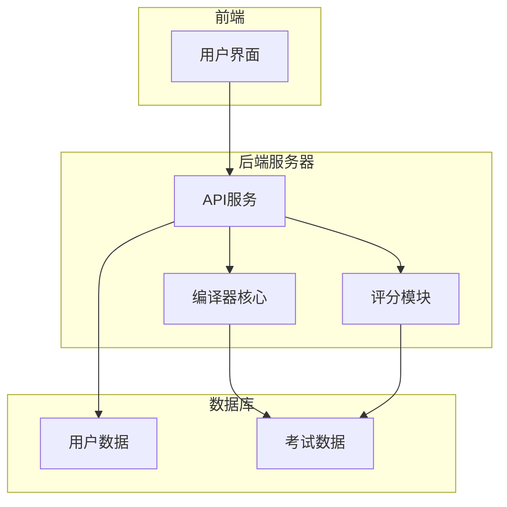

# 编译原理在线考试系统详细设计与具体代码实现

## 1.背景介绍

### 1.1 编译原理概述

编译原理是计算机科学中一个重要的分支,研究将高级程序语言源代码翻译成可执行的目标代码的过程和方法。编译器是实现这一过程的软件工具,它负责将源代码翻译成目标代码,并进行必要的优化和错误检查。编译原理涵盖了词法分析、语法分析、语义分析、中间代码生成、代码优化和目标代码生成等多个阶段。

### 1.2 在线考试系统的重要性

在当今教育领域,在线考试系统已成为一种常见的评估和测试工具。它可以提高考试的效率、降低成本,并为学生提供更加灵活和便利的考试环境。对于编译原理这门课程,在线考试系统可以帮助教师更好地评估学生对编译器工作原理和实现细节的掌握程度。

### 1.3 项目概述

本文详细介绍了一个基于Web的编译原理在线考试系统的设计与实现。该系统允许教师创建和管理考试,学生可以在线参加考试并获得即时反馈。系统包括前端界面、后端服务器和编译器核心三个主要部分。前端界面提供用户友好的交互体验,后端服务器负责处理用户请求和数据存储,而编译器核心则实现了编译原理的各个阶段。

## 2.核心概念与联系

### 2.1 编译器前端

编译器前端负责将源代码翻译成中间表示形式,通常是抽象语法树(AST)。这个过程包括以下几个步骤:

1. **词法分析(Lexical Analysis)**: 将源代码字符流转换为一个个有意义的词法单元(token)序列。
2. **语法分析(Syntax Analysis)**: 根据语言的语法规则,将词法单元序列构建成抽象语法树。
3. **语义分析(Semantic Analysis)**: 对AST进行语义检查,确保程序符合语言的语义规则。

### 2.2 编译器后端

编译器后端将前端生成的中间表示形式(AST)转换为目标代码。主要步骤包括:

1. **中间代码生成(Intermediate Code Generation)**: 将AST转换为更加紧凑和面向目标机器的中间表示形式,如三地址码。
2. **代码优化(Code Optimization)**: 对中间代码进行各种优化,以提高目标代码的性能。
3. **目标代码生成(Target Code Generation)**: 将优化后的中间代码转换为可执行的目标机器代码。

### 2.3 在线考试系统核心组件

在线考试系统的核心组件包括:

1. **用户管理模块**: 负责管理用户(教师和学生)的注册、登录和权限控制。
2. **考试管理模块**: 允许教师创建、编辑和发布考试,设置考试时间和试题。
3. **在线编译器**: 实现编译原理的各个阶段,用于编译和执行学生提交的代码。
4. **评分模块**: 根据预先设置的评分标准,自动评分学生的代码提交。
5. **反馈模块**: 向学生提供即时的编译和运行结果反馈,有助于他们了解知识点。

## 3.核心算法原理具体操作步骤

### 3.1 词法分析

词法分析是编译过程的第一个阶段,将源代码字符序列转换为有意义的词法单元序列。主要步骤如下:

1. **确定单词的正则表达式模式**。例如,标识符可用`[a-zA-Z_][a-zA-Z0-9_]*`表示。
2. **构建有限状态自动机(FA)**。根据正则表达式模式构建对应的FA。
3. **使用FA对源代码进行扫描**。从左到右扫描源代码字符,并根据当前状态和输入字符进行状态转移。
4. **生成词法单元序列**。当FA接受一个单词时,生成相应的词法单元,并将其加入序列。

下面是一个简单的词法分析器实现示例(使用Python的正则表达式):

```python
import re

# 词法单元的正则表达式模式
patterns = [
    ('IDENTIFIER', r'[a-zA-Z_][a-zA-Z0-9_]*'),
    ('NUMBER', r'\d+'),
    # 添加更多模式...
]

def lexer(code):
    tokens = []
    while code:
        for name, pattern in patterns:
            match = re.match(pattern, code)
            if match:
                value = match.group()
                tokens.append((name, value))
                code = code[len(value):]
                break
        else:
            raise ValueError(f'Invalid token: {code[:10]}...')
    return tokens
```

### 3.2 语法分析

语法分析的目标是根据语言的语法规则,将词法单元序列构建成抽象语法树(AST)。主要步骤如下:

1. **定义语法规则**。使用上下文无关文法(CFG)或其他形式的语法规则来描述语言的语法结构。
2. **构建语法分析器**。常见的语法分析技术有自顶向下分析(如递归下降分析)和自底向上分析(如LR分析)。
3. **进行语法分析**。根据语法规则和词法单元序列,构建AST。
4. **处理语法错误**。当输入与语法规则不匹配时,需要进行错误处理和恢复。

下面是一个简单的自顶向下递归下降语法分析器的示例实现(使用Python):

```python
class ASTNode:
    def __init__(self, type, children=None):
        self.type = type
        self.children = children or []

def parse(tokens):
    def expr():
        result = term()
        while tokens and tokens[0][0] in ('+', '-'):
            op = tokens.pop(0)
            result = ASTNode(op[0], [result, term()])
        return result

    def term():
        result = factor()
        while tokens and tokens[0][0] in ('*', '/'):
            op = tokens.pop(0)
            result = ASTNode(op[0], [result, factor()])
        return result

    def factor():
        token = tokens.pop(0)
        if token[0] == 'NUMBER':
            return ASTNode('NUMBER', [token[1]])
        elif token[0] == '(':
            result = expr()
            assert tokens.pop(0)[0] == ')'
            return result
        else:
            raise ValueError(f'Invalid token: {token}')

    ast = expr()
    assert not tokens
    return ast
```

### 3.3 语义分析

语义分析的目的是确保程序符合语言的语义规则。主要步骤包括:

1. **构建符号表**。符号表用于存储变量、函数和其他符号的信息,如名称、类型和作用域。
2. **类型检查**。验证表达式和语句的操作数类型是否匹配,并进行必要的类型转换或报错。
3. **作用域检查**。确保变量和函数在其作用域内被正确使用。
4. **其他语义检查**。根据语言的具体语义规则,执行额外的检查,如检查数组边界、检查函数参数个数等。

以下是一个简单的类型检查器的示例实现(使用Python):

```python
class Symbol:
    def __init__(self, name, type):
        self.name = name
        self.type = type

class SymbolTable:
    def __init__(self):
        self.symbols = {}

    def define(self, name, type):
        self.symbols[name] = Symbol(name, type)

    def lookup(self, name):
        return self.symbols.get(name)

def type_check(ast, symbol_table):
    def visit(node):
        if node.type == 'NUMBER':
            return 'int'
        elif node.type == '+':
            left_type = visit(node.children[0])
            right_type = visit(node.children[1])
            if left_type != 'int' or right_type != 'int':
                raise TypeError('Invalid operand types for +')
            return 'int'
        # 处理其他节点类型...

    visit(ast)
```

## 4.数学模型和公式详细讲解举例说明

在编译原理中,有许多涉及到数学模型和公式的概念,如有限状态自动机、正则表达式、上下文无关文法、语法分析算法等。以下是一些重要概念的数学模型和公式:

### 4.1 有限状态自动机(FA)

有限状态自动机是一种用于识别和处理字符串的数学模型。它由一组有限的状态、一组输入符号、一个初始状态、一组接受状态和一组状态转移规则组成。FA可以形式化地定义如下:

$$
M = (Q, \Sigma, \delta, q_0, F)
$$

其中:

- $Q$ 是有限状态集合
- $\Sigma$ 是输入字母表
- $\delta: Q \times \Sigma \rightarrow Q$ 是状态转移函数
- $q_0 \in Q$ 是初始状态
- $F \subseteq Q$ 是接受状态集合

FA的状态转移可以用状态转移图来直观表示,其中节点表示状态,边表示输入符号和相应的状态转移。

### 4.2 正则表达式

正则表达式是一种用于描述字符串模式的形式语言。它们可以用来定义词法单元的模式,并用于构建有限状态自动机。正则表达式的基本语法如下:

- $\emptyset$ 表示空集,不匹配任何字符串
- $\epsilon$ 表示空字符串,匹配空字符串
- $a \in \Sigma$ 表示单个字符 $a$
- $r_1r_2$ 表示正则表达式 $r_1$ 和 $r_2$ 的连接
- $r_1 \mid r_2$ 表示 $r_1$ 或 $r_2$ 的选择
- $r^*$ 表示 $r$ 的闭包(0次或多次重复)

正则表达式可以用有限状态自动机来表示,并且对于任何正则表达式,都存在一个等价的有限状态自动机。

### 4.3 上下文无关文法(CFG)

上下文无关文法是一种用于描述语言语法结构的形式系统。它由一组终结符号、一组非终结符号、一个开始符号和一组产生式规则组成。CFG可以形式化地定义如下:

$$
G = (N, \Sigma, P, S)
$$

其中:

- $N$ 是非终结符号集合
- $\Sigma$ 是终结符号集合
- $P$ 是产生式规则集合,每条规则形如 $A \rightarrow \alpha$,其中 $A \in N$,$\alpha \in (N \cup \Sigma)^*$
- $S \in N$ 是开始符号

CFG可以用上下文无关语法树来直观表示,其中内部节点表示非终结符号,叶节点表示终结符号。

### 4.4 语法分析算法

语法分析算法用于根据给定的CFG和输入字符串,构建语法树或抽象语法树。常见的语法分析算法包括:

1. **自顶向下分析**,如递归下降分析。递归下降分析从开始符号出发,根据输入符号和产生式规则,递归地构建语法树。
2. **自底向上分析**,如LR分析。LR分析从输入的底部开始,根据移进-规约动作构建语法树。

LR分析算法的核心是构建LR(0)自动机,该自动机由项目集合组成,每个项目都是一个产生式规则和一个点的对,表示当前已经分析的部分。LR(0)自动机的状态转移函数如下:

$$
\text{GOTO}(I, X) = \text{closure}(\{A \rightarrow \alpha X \beta \mid A \rightarrow \alpha \cdot X \beta \in I\})
$$

其中 $\text{closure}$ 是对项目集合进行闭包计算的函数,用于添加所有可能的推导。

## 4.项目实践:代码实例和详细解释说明

在本节中,我们将介绍编译原理在线考试系统的具体实现细节,包括系统架构、关键组件和代码示例。

### 4.1 系统架构

编译原理在线考试系统采用了典型的三层Web架构,包括表示层(前端)、业务逻辑层(后端服务器)和数据层(数据库)。系统的整体架构如下所示:



### 4.2 