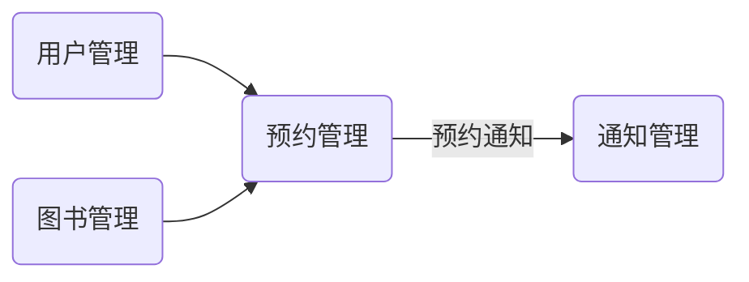

## 1.背景介绍

在现代社会，互联网的普及和数字化的进步使得信息获取的方式发生了极大的变化。传统的图书馆仍然是我们获取知识的重要渠道，但其中的管理方式也需要与时俱进。特别是在当前全球疫情的背景下，如何实现远程、有效、安全地预约图书成为了一个新的挑战。因此，设计并实现一个高效、便捷、稳定的网上图书预约系统显得尤为重要。

## 2.核心概念与联系

网上图书预约系统是一个在网络环境下，实现图书馆图书预约功能的系统。它主要涉及到以下几个核心概念：

### 2.1 用户管理

用户是系统的使用者，需要实现用户的注册、登录、修改个人信息、注销等功能。

### 2.2 图书管理

图书管理是系统的核心功能之一，需要实现图书的上架、信息修改、下架等功能。

### 2.3 预约管理

预约管理是系统的核心功能之一，用户可以通过系统预约图书，也可以取消预约。

### 2.4 通知管理

当用户预约的图书到馆或者预约到期，系统需要通知用户。

这些核心概念之间的联系，可以通过一个图来展示：



## 3.核心算法原理具体操作步骤

在网上图书预约系统中，主要的流程包括：用户管理、图书管理、预约管理和通知管理。下面我们将详细介绍这几个流程的具体操作步骤。

### 3.1 用户管理
用户管理主要包括用户的注册、登录、修改个人信息、注销等功能。具体操作步骤如下：
1. 用户注册：用户通过填写个人信息（包括但不限于用户名、密码、手机号码、电子邮箱等），提交注册申请，系统在后台进行信息校验，校验通过后，完成注册。
2. 用户登录：用户通过输入用户名和密码，提交登录申请，系统在后台进行信息校验，校验通过后，完成登录。
3. 修改个人信息：用户在个人中心，可以修改个人信息，包括但不限于密码、手机号码、电子邮箱等。
4. 用户注销：用户在个人中心，可以提交注销申请，系统在后台进行处理，完成注销。

### 3.2 图书管理
图书管理主要包括图书的上架、信息修改、下架等功能。具体操作步骤如下：
1. 图书上架：管理员通过输入图书信息（包括但不限于书名、作者、出版社、ISBN号、库存数量等），提交上架申请，系统在后台进行信息校验，校验通过后，完成上架。
2. 图书信息修改：管理员在图书管理中心，可以修改图书信息，包括但不限于书名、作者、出版社、ISBN号、库存数量等。
3. 图书下架：管理员在图书管理中心，可以提交下架申请，系统在后台进行处理，完成下架。

### 3.3 预约管理
预约管理主要包括图书的预约、预约取消等功能。具体操作步骤如下：
1. 图书预约：用户在图书信息页面，可以提交预约申请，系统在后台进行处理，处理完成后，用户可以在个人中心查看预约状态。
2. 预约取消：用户在个人中心，可以提交取消预约的申请，系统在后台进行处理，处理完成后，用户可以在个人中心查看预约状态。

### 3.4 通知管理
通知管理主要包括预约通知和到期通知。具体操作步骤如下：
1. 预约通知：当用户预约的图书到馆，系统会自动发送预约通知给用户。
2. 到期通知：当用户预约的图书即将到期，系统会自动发送到期通知给用户。

## 4.数学模型和公式详细讲解举例说明

在网上图书预约系统中，我们可以通过数学模型来优化图书的分配。考虑到图书的数量有限，我们可以使用优化算法来决定如何分配图书。

我们假定有 $n$ 本图书，$m$ 个用户，用户 $i$ 预约了图书 $j$，我们用 $x_{ij}$ 表示用户 $i$ 是否得到图书 $j$ 的分配。如果得到分配，$x_{ij}=1$，否则 $x_{ij}=0$。

我们的目标是最大化用户的满意度。我们用 $s_{ij}$ 表示用户 $i$ 得到图书 $j$ 的满意度。那么我们的目标函数可以表示为：

$$
\max \sum_{i=1}^{m}\sum_{j=1}^{n}s_{ij}x_{ij}
$$

同时，我们需要满足以下条件：

- 每本图书只能分配给一个用户：$\sum_{i=1}^{m}x_{ij} \leq 1$。
- 每个用户只能得到一本他预约的图书：$\sum_{j=1}^{n}x_{ij} \leq 1$。

这就是一个典型的整数规划问题，可以通过现有的算法库进行求解。

## 5.项目实践：代码实例和详细解释说明

在本节，我们将以一个简单的例子，演示如何实现图书预约功能。我们将使用 Python 的 Flask 框架来构建后端，使用 SQLite 作为数据库。

首先，我们需要定义数据库的 schema。在 Flask 中，我们可以使用 SQLAlchemy 来定义：

```python
from flask_sqlalchemy import SQLAlchemy

db = SQLAlchemy()

class User(db.Model):
    id = db.Column(db.Integer, primary_key=True)
    username = db.Column(db.String(80), unique=True)
    email = db.Column(db.String(120), unique=True)
    password = db.Column(db.String(80))

class Book(db.Model):
    id = db.Column(db.Integer, primary_key=True)
    title = db.Column(db.String(80))
    author = db.Column(db.String(80))
    isbn = db.Column(db.String(20), unique=True)
    stock = db.Column(db.Integer)

class Reservation(db.Model):
    id = db.Column(db.Integer, primary_key=True)
    user_id = db.Column(db.Integer, db.ForeignKey('user.id'))
    book_id = db.Column(db.Integer, db.ForeignKey('book.id'))
    status = db.Column(db.String(20))
```

然后，我们需要定义路由和处理函数：

```python
from flask import Flask, request
from flask_login import LoginManager, login_user, logout_user, login_required

app = Flask(__name__)
login_manager = LoginManager()
login_manager.init_app(app)

@app.route('/register', methods=['POST'])
def register():
    # 处理注册请求
    pass

@app.route('/login', methods=['POST'])
def login():
    # 处理登录请求
    pass

@app.route('/logout')
@login_required
def logout():
    # 处理注销请求
    pass

@app.route('/books', methods=['GET', 'POST'])
@login_required
def manage_books():
    # 处理图书管理请求
    pass

@app.route('/reservations', methods=['GET', 'POST'])
@login_required
def manage_reservations():
    # 处理预约管理请求
    pass
```

具体的处理函数的实现，需要根据业务逻辑来进行编写。这里就不再详细展示了。

## 6.实际应用场景

网上图书预约系统可以广泛应用于各类图书馆，包括但不限于公共图书馆、学校图书馆、企业图书馆等。通过网上图书预约系统，用户可以在家中或者任何有网络的地方，随时随地预约图书，极大地提高了图书的可利用性和利用率。

## 7.工具和资源推荐

在开发网上图书预约系统时，以下工具和资源可能会有所帮助：

- Flask：一个轻量级的 Web 框架，适合用来开发小型到中型的 Web 应用。
- SQLAlchemy：一个 Python 的 ORM 框架，可以方便地操作数据库。
- SQLite：一个轻量级的数据库，适合用来开发小型应用。
- Bootstrap：一个前端框架，可以方便地开发美观的界面。

## 8.总结：未来发展趋势与挑战

随着现代化的图书馆管理需求的提升，以及互联网技术的发展，网上图书预约系统将有更大的发展空间。我们可以预见到以下几个可能的发展趋势：

- 更丰富的功能：除了预约图书之外，还可以提供更丰富的功能，如电子书阅读、在线交流、图书推荐等。
- 更高的用户体验：通过更美观的界面、更流畅的交互、更智能的推荐等方式，提高用户体验。
- 更好的数据分析：通过对用户行为的分析，了解用户的需求，为图书馆的运营提供数据支持。

同时，也面临着一些挑战：

- 数据安全：如何保证用户数据的安全，避免数据泄露。
- 系统稳定性：如何保证系统的稳定性，避免出现故障影响用户使用。
- 用户隐私：如何保护用户的隐私。

## 9.附录：常见问题与解答

### Q1：我可以预约多本图书吗？
A1：在我们的系统设计中，每个用户在同一时间只能预约一本图书，以确保图书的公平分配。

### Q2：我预约的图书何时可以取书？
A2：当图书到馆后，我们的系统会自动发送通知给你，你可以根据通知的内容，来图书馆取书。

### Q3：我预约的图书需要在何时归还？
A3：图书的归还期限，一般为从你取书的日起的一个月后。系统会在图书到期前，发送通知提醒你归还图书。

### Q4：我忘记了我的密码，怎么办？
A4：你可以在登录页面，点击“忘记密码”链接，按照提示操作，通过注册时绑定的电子邮箱，重置密码。

希望这篇文章能帮助你了解网上图书预约系统的设计与实现，如果你有任何问题或建议，欢迎留言交流。