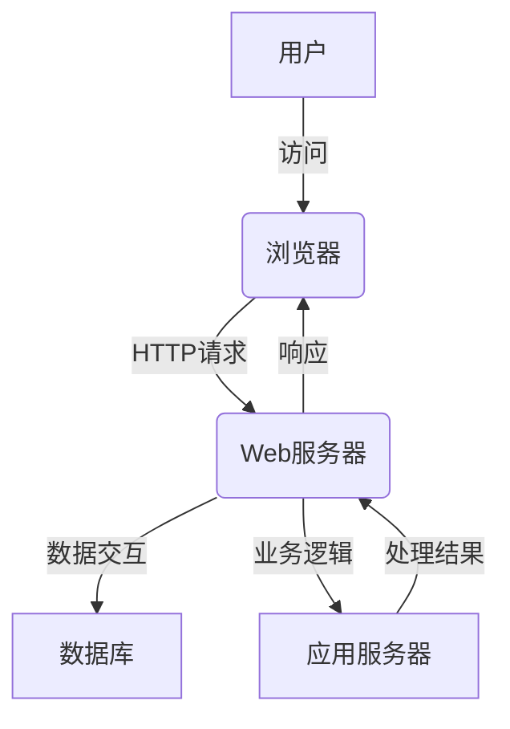

# 网上教学系统详细设计与具体代码实现

## 1.背景介绍

### 1.1 网上教学系统的重要性

在当今时代,网络技术的迅速发展,使得在线教育成为一种越来越流行的教学模式。网上教学系统作为实现远程教育的关键工具,其重要性不言而喻。它打破了时间和空间的限制,为学习者提供了更加灵活便捷的学习方式,同时也为教师提供了更广阔的授课平台。

### 1.2 网上教学系统的挑战

然而,构建一个高质量的网上教学系统并非易事。它需要综合考虑多方面的因素,如系统的可扩展性、安全性、易用性等,以确保系统能够满足日益增长的用户需求。此外,如何有效地整合多种教学资源,提供个性化的学习体验,也是系统设计中需要解决的重要问题。

## 2.核心概念与联系  

### 2.1 系统架构

网上教学系统通常采用客户端-服务器架构或浏览器-服务器架构。其中,服务器端负责存储和管理教学资源、处理用户请求、维护系统运行等核心功能。而客户端或浏览器则提供用户界面,允许用户与系统进行交互。



### 2.2 关键模块

一个典型的网上教学系统通常包括以下几个关键模块:

1. **用户管理模块**: 负责用户注册、登录、权限控制等功能。
2. **课程管理模块**: 用于创建、编辑、发布和管理课程内容。
3. **学习管理模块**: 提供学习资源浏览、作业提交、在线测试等功能。
4. **互动交流模块**: 支持在线答疑、讨论区、即时通讯等师生互动。
5. **数据分析模块**: 收集和分析学习数据,为教学决策提供支持。

### 2.3 关键技术

网上教学系统的实现需要综合运用多种技术,包括但不限于:

- **Web开发技术**: HTML、CSS、JavaScript、服务器端语言(如Java、Python、Node.js)等。
- **数据库技术**: 关系型数据库(如MySQL、PostgreSQL)或NoSQL数据库(如MongoDB)。
- **multimedia技术**: 用于处理音视频等多媒体资源。
- **安全技术**: 如加密、认证、防火墙等,确保系统和数据的安全性。
- **云计算技术**: 提供可扩展的计算资源和存储空间。

## 3.核心算法原理具体操作步骤

在网上教学系统中,有几个核心算法值得重点关注。

### 3.1 推荐算法

推荐算法旨在为用户推荐个性化的学习资源,提高学习效率。常见的推荐算法包括:

1. **协同过滤算法(Collaborative Filtering)**

   - **步骤1**: 收集用户对项目(如课程、资源)的评分数据。
   - **步骤2**: 计算用户之间的相似度,可使用皮尔逊相关系数或余弦相似度等方法。
   - **步骤3**: 根据相似用户的评分,预测目标用户对项目的评分。
   - **步骤4**: 推荐给用户预测评分较高的项目。

2. **基于内容的推荐算法(Content-based)**

   - **步骤1**: 提取项目(如课程描述)的特征向量。
   - **步骤2**: 计算用户的兴趣向量,可基于用户历史行为数据。
   - **步骤3**: 计算项目特征向量与用户兴趣向量的相似度。
   - **步骤4**: 推荐与用户兴趣向量最相似的项目。

### 3.2 自动评分算法

自动评分算法用于评估学生的作业、测试等,减轻教师的工作量。一种常见的方法是:

1. **步骤1**: 收集标准答案样本,并提取其特征向量。
2. **步骤2**: 对学生的答案进行文本预处理,如分词、去停用词等。
3. **步骤3**: 提取学生答案的特征向量。
4. **步骤4**: 计算学生答案与标准答案的相似度,可使用余弦相似度等方法。
5. **步骤5**: 根据相似度给出评分,设置合理的分数映射规则。

## 4.数学模型和公式详细讲解举例说明

在推荐算法和自动评分算法中,常常需要计算两个向量之间的相似度。下面以余弦相似度为例,详细介绍其数学原理。

### 4.1 余弦相似度

余弦相似度用于计算两个非零向量之间的夹角的余弦值,其数学表达式如下:

$$sim(A,B) = \cos(\theta) = \frac{A \cdot B}{\|A\|\|B\|} = \frac{\sum_{i=1}^{n}A_iB_i}{\sqrt{\sum_{i=1}^{n}A_i^2}\sqrt{\sum_{i=1}^{n}B_i^2}}$$

其中$A$和$B$是两个n维向量,即$A = (A_1, A_2, \dots, A_n)$、$B = (B_1, B_2, \dots, B_n)$。$\theta$是$A$和$B$之间的夹角。

余弦相似度的值域为$[-1,1]$,当两个向量完全相同时,余弦值为1;当两个向量完全相反时,余弦值为-1;当两个向量正交(夹角为90度)时,余弦值为0。

### 4.2 应用示例

假设有两个文本文档$D_1$和$D_2$,其词袋(bag-of-words)模型表示为:

$D_1 = (2, 1, 0, 1)$  
$D_2 = (1, 0, 1, 1)$

我们可以计算它们的余弦相似度:

$$sim(D_1,D_2) = \frac{2\times 1 + 1\times 0 + 0\times 1 + 1\times 1}{\sqrt{2^2+1^2+0^2+1^2}\sqrt{1^2+0^2+1^2+1^2}} \approx 0.53$$

可以看出,这两个文档具有一定的相似性。

## 4.项目实践:代码实例和详细解释说明

为了更好地理解网上教学系统的实现细节,我们将以一个基于Python的简化示例为例,介绍系统的核心模块及其代码实现。

### 4.1 用户管理模块

用户管理模块负责处理用户的注册、登录和权限管理等功能。下面是一个基于Flask框架的简单实现:

```python
from flask import Flask, request, session, redirect, url_for
import hashlib

app = Flask(__name__)
app.secret_key = 'your_secret_key'

# 用户数据存储在内存中,实际应使用数据库
users = {}

# 注册新用户
@app.route('/register', methods=['GET', 'POST'])
def register():
    if request.method == 'POST':
        username = request.form['username']
        password = hashlib.sha256(request.form['password'].encode()).hexdigest()
        if username in users:
            return 'Username already exists!'
        users[username] = {'password': password, 'role': 'student'}
        return redirect(url_for('login'))
    return '''
        <form method="post">
            <label>Username:</label>
            <input type="text" name="username" required>
            <label>Password:</label>
            <input type="password" name="password" required>
            <input type="submit" value="Register">
        </form>
    '''

# 用户登录
@app.route('/login', methods=['GET', 'POST'])
def login():
    if request.method == 'POST':
        username = request.form['username']
        password = hashlib.sha256(request.form['password'].encode()).hexdigest()
        if username in users and users[username]['password'] == password:
            session['username'] = username
            session['role'] = users[username]['role']
            return redirect(url_for('index'))
        return 'Invalid username or password!'
    return '''
        <form method="post">
            <label>Username:</label>
            <input type="text" name="username" required>
            <label>Password:</label>
            <input type="password" name="password" required>
            <input type="submit" value="Login">
        </form>
    '''

# 仅限教师访问
@app.route('/teacher')
def teacher():
    if 'username' in session and session['role'] == 'teacher':
        return 'Welcome, teacher!'
    return redirect(url_for('login'))

if __name__ == '__main__':
    app.run(debug=True)
```

在上述代码中,我们定义了三个路由:`/register`用于注册新用户,`/login`用于用户登录,`/teacher`仅限教师访问。用户数据存储在内存中的`users`字典中,密码使用SHA-256算法进行哈希加密。实际系统应该使用数据库来存储用户信息,并采用更安全的认证机制。

### 4.2 课程管理模块

课程管理模块允许教师创建、编辑和发布课程内容。下面是一个简单的实现示例:

```python
from flask import Flask, render_template, request, redirect, url_for
import os

app = Flask(__name__)

# 课程数据存储在内存中,实际应使用数据库
courses = {}

# 创建新课程
@app.route('/create_course', methods=['GET', 'POST'])
def create_course():
    if request.method == 'POST':
        course_id = request.form['course_id']
        course_name = request.form['course_name']
        if course_id in courses:
            return 'Course ID already exists!'
        courses[course_id] = {'name': course_name, 'lessons': []}
        return redirect(url_for('manage_course', course_id=course_id))
    return render_template('create_course.html')

# 管理课程内容
@app.route('/manage_course/<course_id>', methods=['GET', 'POST'])
def manage_course(course_id):
    if course_id not in courses:
        return 'Course not found!'
    course = courses[course_id]
    if request.method == 'POST':
        lesson_name = request.form['lesson_name']
        lesson_content = request.form['lesson_content']
        course['lessons'].append({'name': lesson_name, 'content': lesson_content})
    return render_template('manage_course.html', course=course)

if __name__ == '__main__':
    app.run(debug=True)
```

在这个示例中,我们定义了两个路由:`/create_course`用于创建新课程,`/manage_course/<course_id>`用于管理课程内容。课程数据存储在内存中的`courses`字典中,实际系统应该使用数据库进行持久化存储。

### 4.3 学习管理模块

学习管理模块提供了学生浏览课程内容、提交作业等功能。下面是一个简单的实现示例:

```python
from flask import Flask, render_template, request, redirect, url_for

app = Flask(__name__)

# 课程数据存储在内存中,实际应使用数据库
courses = {
    'CS101': {
        'name': 'Introduction to Computer Science',
        'lessons': [
            {'name': 'Lesson 1', 'content': 'This is the content of Lesson 1'},
            {'name': 'Lesson 2', 'content': 'This is the content of Lesson 2'}
        ]
    }
}

# 浏览课程内容
@app.route('/course/<course_id>')
def view_course(course_id):
    if course_id not in courses:
        return 'Course not found!'
    course = courses[course_id]
    return render_template('view_course.html', course=course)

# 提交作业
@app.route('/submit_assignment', methods=['GET', 'POST'])
def submit_assignment():
    if request.method == 'POST':
        assignment_content = request.form['assignment_content']
        # 处理作业提交逻辑
        print(f'Received assignment: {assignment_content}')
        return 'Assignment submitted successfully!'
    return render_template('submit_assignment.html')

if __name__ == '__main__':
    app.run(debug=True)
```

在这个示例中,我们定义了两个路由:`/course/<course_id>`用于浏览课程内容,`/submit_assignment`用于学生提交作业。课程数据存储在内存中的`courses`字典中,实际系统应该使用数据库进行持久化存储。

### 4.4 其他模块

由于篇幅有限,我们无法详细介绍所有模块的实现细节。但是,您可以参考以下示例代码,了解互动交流模块和数据分析模块的基本实现思路。

**互动交流模块**:

```python
from flask import Flask, render_template, request
from flask_socketio import SocketIO, emit

app = Flask(__name__)
app.config['SECRET_KEY'] = 'your_secret_key'
socketio = SocketIO(app)

# 在线讨论室
@app.route('/chat')
def chat():