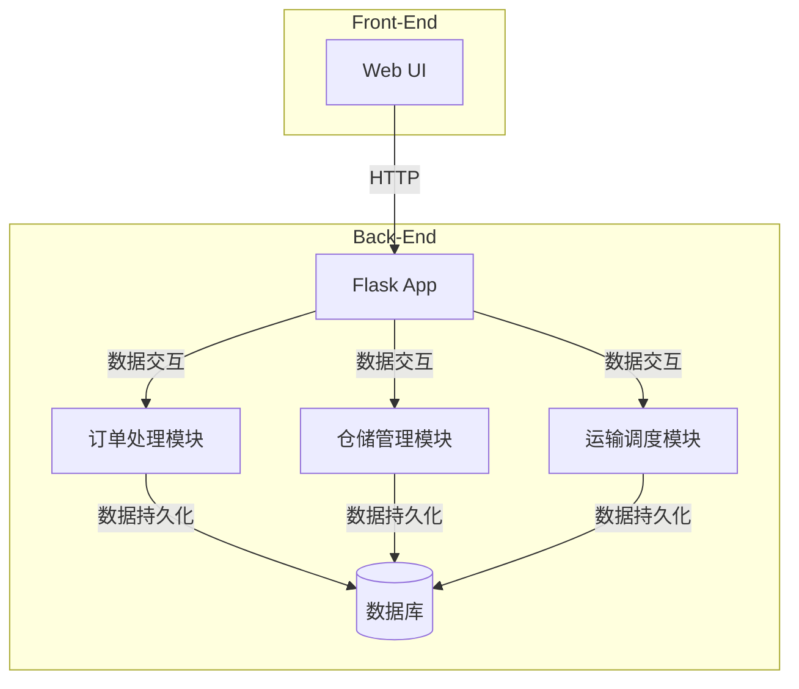

# 网上物流管理系统详细设计与具体代码实现

## 1. 背景介绍

### 1.1 物流管理系统的重要性

随着电子商务的快速发展,物流配送已经成为了整个供应链中至关重要的一个环节。高效、可靠的物流管理系统对于企业提高运营效率、降低成本、提升客户体验至关重要。

### 1.2 传统物流管理系统的局限性

传统的物流管理系统通常采用人工操作的方式,存在效率低下、错误率高、数据不完整等诸多问题。同时,这些系统缺乏实时追踪和优化调度的功能,无法满足现代物流需求。

### 1.3 网上物流管理系统的优势

网上物流管理系统通过将物流管理流程数字化、自动化和智能化,能够显著提高物流效率、降低运营成本,并为企业和客户提供更好的服务体验。

## 2. 核心概念与联系  

### 2.1 物流管理流程

物流管理流程包括订单处理、仓储管理、运输调度、配送跟踪等多个环节,这些环节相互关联、协同作用。

### 2.2 实时数据采集与处理

实时采集和处理订单数据、库存数据、车辆和人员位置数据等,是物流管理系统的基础。只有获得准确及时的数据,才能做出正确的决策和调度。

### 2.3 智能调度与优化

基于大数据分析和人工智能算法,物流管理系统可以实现订单和运力的智能匹配、车辆调度路线优化等,从而降低运营成本,提高效率。

### 2.4 实时追踪与可视化

将物流过程数据实时呈现并可视化,能够让企业和客户随时掌握货物动态,及时发现并处理异常情况。

## 3. 核心算法原理与具体操作步骤

### 3.1 订单处理算法

#### 3.1.1 订单拆分算法
对于大批量订单,需要先进行拆分以方便后续处理。常用的订单拆分算法包括:

- 货物属性拆分: 根据货物的尺寸、重量等属性进行拆分
- 地理位置拆分: 根据收货地的地理位置进行拆分
- ...

算法步骤:
1) 读取订单数据
2) 提取订单中的货物属性和地理位置信息 
3) 根据预设规则对订单进行分类和拆分
4) 输出拆分后的订单子集

#### 3.1.2 订单路由算法
将拆分后的订单分配到最佳的仓库和运输路线,以优化配送效率。

算法步骤:
1) 获取订单子集、可用仓库和运输资源
2) 构建目标函数(如最小化运输成本)和约束条件
3) 使用启发式或精确算法(如蚁群算法)求解
4) 输出订单路由方案

### 3.2 仓储管理算法

#### 3.2.1 入库算法
将到达的货物合理的放置到仓库中,以提高空间利用率。

算法步骤:
1) 获取货物信息和仓库现有布局
2) 计算各空余区域的放置评分(如便于后续拣货)
3) 选择评分最高的区域作为放置位置
4) 更新库存系统中的货物位置记录

#### 3.2.2 拣货算法  
根据订单需求,高效准确的从仓库中拣选所需货物。

算法步骤:
1) 获取订单需求清单
2) 查询库存系统中各货物位置
3) 规划最优的拣货路径(如遗传算法)
4) 按路径完成拣货,并更新库存记录

### 3.3 运输调度算法

#### 3.3.1 车辆调度算法
根据订单需求和可用车辆,安排最优的配载和运输路线。

算法步骤:
1) 获取订单和车辆信息 
2) 建立数学模型(如车辆路径规划问题)
3) 使用启发式或精确算法求解
4) 输出调度方案并分配给车辆执行

#### 3.3.2 路径优化算法
在车辆运输过程中,实时优化路径以避开拥堵和绕行。

算法步骤:
1) 获取车辆位置和实时交通数据
2) 构建路径优化目标函数(如最短时间)
3) 使用动态规划或其他算法求解最优路径
4) 将优化路径下发给车辆执行

### 3.4 配送追踪算法

通过对配送过程的关键节点进行数据采集和处理,实现实时追踪和可视化。

算法步骤:
1) 获取车辆GPS位置、扫码数据等
2) 与订单和运输线路数据进行匹配
3) 计算货物在运输链的实时位置和状态
4) 通过Web/App界面呈现可视化的追踪信息

## 4. 数学模型和公式详细讲解举例说明

### 4.1 车辆路径规划模型

车辆路径规划是运输调度中的一个核心问题,可以用数学模型来刻画。一种常用的模型是车辆路径规划问题(Vehicle Routing Problem, VRP)。

假设有 $n$ 个需要配送的客户点,1个配送中心,共有 $m$ 辆车可以使用。模型的目标是规划出一系列的最优路径,使得:

1. 每个客户点只被访问一次
2. 每条路径都始于并终止于配送中心
3. 每辆车的总行驶距离最短

该问题可以用如下数学模型表示:

$$
\begin{aligned}
\min \quad & \sum_{i=1}^{n}\sum_{j=1}^{n}c_{ij}x_{ij}\\
\text{s.t.}\quad & \sum_{i=1}^{n}x_{ij}=1,\quad \forall j\in \{2,\ldots,n\}\\
& \sum_{j=1}^{n}x_{ij}=1,\quad \forall i\in \{2,\ldots,n\}\\
& \sum_{i\in S}\sum_{j\in S}x_{ij}\leq |S|-r(S),\quad \forall S\subset \{2,\ldots,n\}\\
& x_{ij}\in \{0,1\}, \quad \forall i,j\in \{1,\ldots,n\}
\end{aligned}
$$

其中:
- $c_{ij}$ 表示从客户点 $i$ 到客户点 $j$ 的距离成本
- $x_{ij}$ 是决策变量,如果车辆经由边 $(i,j)$,则 $x_{ij}=1$,否则为 $0$
- 第二个约束确保每个客户点被访问一次
- 第三个约束确保每条路径都从配送中心出发并返回
- 第四个约束消除了不连通的子环路,其中 $r(S)$ 表示子集 $S$ 所需的最少车辆数量

该模型是一个NP难的组合优化问题,求解时往往需要使用启发式算法(如蚁群算法)或其他求解器。

### 4.2 仓库货位评分模型

在仓储管理中,如何合理的放置和存储货物,直接影响到后续拣货的效率。可以通过建立货位评分模型,为每个可用货位打分,从而指导存储决策。

假设仓库中有 $m$ 个可用货位,每个货位有 $n$ 个属性(如距离出口距离、可达性、温湿度等)。我们可以用如下函数对货位 $i$ 进行评分:

$$
\text{Score}_i=\sum_{j=1}^{n}w_j\cdot f_j(x_{ij})
$$

其中:
- $w_j$ 是属性 $j$ 的权重,反映了该属性的重要程度
- $x_{ij}$ 是货位 $i$ 在属性 $j$ 上的取值
- $f_j(\cdot)$ 是属性 $j$ 的评分函数,根据属性值给出一个分数

例如,对于距离出口的属性,评分函数可以设置为:

$$
f_{\text{distance}}(x)=\begin{cases}
100, & x<10\\
60, & 10\leq x<20\\
20, & x\geq 20
\end{cases}
$$

其中 $x$ 表示货位到出口的距离(米)。

最终,我们将选择得分最高的货位来存放新到货的货物。除了固定的评分函数,也可以通过机器学习的方式,从历史数据中自动学习出最优的评分模型。

## 5. 项目实践:代码实例和详细解释说明

为了更好地展示网上物流管理系统的实现细节,我们将给出一个使用Python编写的简化示例项目。该项目包括订单处理、仓储管理和运输调度三个核心模块,并使用 Flask Web 框架提供可视化的用户界面。

### 5.1 系统架构



该系统主要由以下几个部分组成:

- **Web UI**: 基于 HTML/CSS/JavaScript 构建,提供交互式的用户界面,可视化展示物流数据和调度结果。
- **Flask App**: 使用 Python Flask 框架构建的 Web 应用,作为前端和其他模块的通信枢纽。
- **订单处理模块**: 实现订单拆分、路由等功能。
- **仓储管理模块**: 实现入库策略、拣货路径规划等功能。  
- **运输调度模块**: 实现车辆调度、路径优化等功能。
- **数据库**: 使用 SQLite 或其他数据库存储订单、库存、车辆、路径等数据。

### 5.2 订单处理模块

该模块的主要任务是对新进入的订单进行拆分和路由,将订单分配到最佳的仓库和运输路线。

```python
import math
from ortools.constraint_solver import pywrapcp

class OrderSplitter:
    # 根据货物重量和地理位置进行订单拆分
    def split_orders(self, orders):
        ...

class OrderRouter:
    # 订单路由问题模型
    def create_data_model(self):
        ...
        
    # 使用OR工具求解器求解VRP
    def solve_vrp(self, data):
        ...
        
    # 路由新订单
    def route_orders(self, orders):
        data = self.create_data_model()
        ...
        return order_routes
```

在上面的代码中,我们首先定义了 `OrderSplitter` 类,用于对订单进行拆分。具体的拆分算法根据实际需求进行实现。

`OrderRouter` 类则负责订单路由,其中 `create_data_model` 方法构建了一个车辆路径规划模型的数据结构,`solve_vrp` 方法使用 Google OR-Tools 中的约束规划求解器求解该模型,得到最优解。`route_orders` 方法将新的订单数据输入到模型中进行求解。

### 5.3 仓储管理模块

该模块实现了入库策略和拣货路径规划算法。

```python
import numpy as np

class WarehouseManager:
    def __init__(self, layout):
        self.layout = layout # 仓库布局
        self.inventory = {} # 库存记录
        
    # 计算货位评分
    def score_position(self, pos):
        ...
        
    # 为新货物分配最优货位   
    def allocate_position(self, product, quantity):
        scores = [self.score_position(pos) for pos in self.layout.available_positions()]
        best_pos = self.layout.available_positions()[np.argmax(scores)]
        self.inventory[(product, best_pos)] = quantity
        return best_pos
        
    # 拣货路径规划(使用遗传算法)
    def plan_picking_route(self, order):
        ...
```

`WarehouseManager` 类维护了仓库的布局信息和库存记录。`score_position` 方法根据预定义的评分函数为仓库中的每个货位打分。`allocate_position` 方法则根据货位评分,为新到货的产品分配最优的存储位置。

`