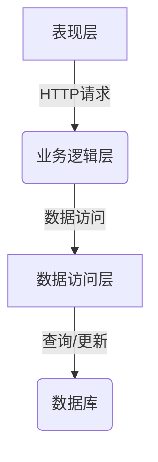

# 网络教学平台-教师子系统详细设计与具体代码实现

## 1.背景介绍

### 1.1 网络教学平台的重要性

随着信息技术的飞速发展,网络教学平台作为一种新兴的教育模式,正在逐渐改变着传统的教学方式。网络教学平台通过互联网将教师、学生、课程资源、教学活动等有机地结合在一起,为教与学提供了一个全新的空间。它打破了时间和空间的限制,实现了教学资源共享,促进了教学方式的创新,为教育现代化提供了有力支撑。

### 1.2 教师子系统在网络教学平台中的作用

在网络教学平台中,教师子系统是整个系统的核心和灵魂所在。教师作为知识的传播者和课程的设计者,在整个教学活动中扮演着至关重要的角色。教师子系统为教师提供了发布课程、组织教学活动、管理学生、评分考核等一系列功能,确保了教学过程的顺利进行。同时,教师子系统还为教师提供了教学资源管理、教学设计等辅助功能,提高了教学效率和质量。

## 2.核心概念与联系

### 2.1 用户管理

用户管理是网络教学平台的基础,它负责管理平台的用户,包括教师和学生。用户管理模块通常包括用户注册、登录、个人信息维护等功能。对于教师子系统,用户管理还需要支持教师身份认证和权限管理,确保教师能够安全地访问和操作相关功能。

### 2.2 课程管理

课程管理是教师子系统的核心功能之一。它允许教师创建、编辑和发布课程,管理课程资源(如课件、视频、练习等)。同时,教师还可以设置课程的开放时间、考核方式等参数,为学生提供更加灵活和个性化的学习体验。

### 2.3 教学活动管理

教学活动管理模块支持教师组织和管理各种教学活动,如讨论、测验、作业等。教师可以发布活动,设置活动参与规则和截止时间。此外,教师还可以查看学生的活动参与情况,及时了解学习进度。

### 2.4 学习评价

学习评价是教学过程中不可或缺的一个环节。教师子系统需要提供多种评价方式,如在线测验、作业批改、论坛互评等,以全面考核学生的学习效果。同时,系统还应支持成绩统计和分析,帮助教师更好地了解学生的学习情况。

### 2.5 教学资源管理

教学资源管理模块为教师提供了集中管理课程资源的功能,包括上传、下载、分类、搜索等。教师可以方便地组织和共享教学资源,提高资源利用率。此外,该模块还可以支持版本控制和权限管理,确保资源的安全性。

### 2.6 教学设计

教学设计模块旨在支持教师进行教学活动的策划和设计。教师可以在该模块中制定教学计划、设计教学流程、安排教学活动等。一些先进的教学设计模块还集成了智能推荐和辅助决策功能,帮助教师优化教学设计。

### 2.7 数据分析

数据分析模块通过对平台产生的大量数据(如学习行为数据、评价数据等)进行分析和挖掘,为教师提供学情分析、教学评估等决策支持。教师可以基于数据分析结果,了解学生的学习情况、发现教学中存在的问题,并进行相应的教学调整。

## 3.核心算法原理具体操作步骤  

### 3.1 用户身份认证算法

用户身份认证是网络教学平台安全性的基础,它确保只有合法用户才能访问相应的功能和资源。常见的用户身份认证算法有基于密码的算法、基于证书的算法、基于生物特征的算法等。以下是基于密码的用户身份认证算法的具体步骤:

1. 用户输入用户名和密码
2. 将用户输入的密码使用加密算法(如MD5、SHA-256等)进行单向加密,得到密码摘要
3. 将用户名和密码摘要发送到服务器
4. 服务器从用户数据库中查找与用户名对应的密码摘要
5. 比较用户发送的密码摘要和数据库中存储的密码摘要,如果相同,则认证通过,否则认证失败

此外,为提高安全性,可以在算法中引入"盐值"、"密码重试次数限制"等措施。

### 3.2 课程推荐算法

课程推荐算法旨在为用户(教师或学生)推荐感兴趣的课程,提高课程的曝光率和学习效率。常见的课程推荐算法包括基于内容的推荐、协同过滤推荐、基于知识图谱的推荐等。以下是基于内容的课程推荐算法步骤:

1. 从课程元数据(如标题、描述、关键词等)中提取课程特征向量
2. 计算用户的兴趣特征向量,可以基于用户的浏览记录、学习记录等
3. 计算课程特征向量与用户兴趣特征向量之间的相似度
4. 根据相似度大小,推荐相似度较高的课程给用户

在实际应用中,可以将多种推荐算法相结合,形成混合推荐算法,以提高推荐的准确性和多样性。

### 3.3 自动阅卷算法

自动阅卷算法通过计算机视觉和自然语言处理技术,实现对学生作业的自动批阅和评分,减轻了教师的工作负担。以文字作业为例,自动阅卷算法的步骤如下:

1. 使用光学字符识别(OCR)技术将作业图像转换为文本
2. 对作业文本进行分词、词性标注、命名实体识别等自然语言处理
3. 基于语义相似度、语义关系等计算作业内容与参考答案的相似程度
4. 根据相似程度给出分数,并生成反馈意见

对于非文字类型的作业(如编程作业、数学计算等),还需要引入其他专门的算法进行处理和评分。

## 4.数学模型和公式详细讲解举例说明

### 4.1 文本相似度计算

在课程推荐、自动阅卷等场景中,需要计算两段文本之间的相似度。常用的文本相似度计算模型有余弦相似度、编辑距离等。

#### 4.1.1 余弦相似度

余弦相似度通过计算两个向量的夹角余弦值来衡量它们的相似程度。在文本相似度计算中,我们首先需要将文本表示为向量,常用的方法是TF-IDF向量化。设两段文本的TF-IDF向量分别为$\vec{A}$和$\vec{B}$,则它们的余弦相似度定义为:

$$sim(\vec{A},\vec{B})=\frac{\vec{A}\cdot\vec{B}}{||\vec{A}||\times||\vec{B}||}=\frac{\sum\limits_{i=1}^{n}A_iB_i}{\sqrt{\sum\limits_{i=1}^{n}A_i^2}\sqrt{\sum\limits_{i=1}^{n}B_i^2}}$$

其中$n$是向量的维度。余弦相似度的值域为$[0,1]$,值越大表示两段文本越相似。

#### 4.1.2 编辑距离

编辑距离用于度量两个字符串之间的差异性,常用于拼写检查、DNA序列比对等领域。在文本相似度计算中,我们可以将两段文本视为长字符串,计算它们的编辑距离,作为相似度的一种度量。

最典型的编辑距离是Levenshtein距离,它考虑了插入、删除和替换三种基本操作,将一个字符串转换为另一个字符串所需的最小编辑代价。设两个字符串分别为$S_1$和$S_2$,它们的Levenshtein距离定义为:

$$lev(S_1,S_2)=\left\{\begin{array}{ll}
0&,\text{if }S_1=S_2=\empty\\
lev(S_1,S_2[:-1])+1&,\text{if }S_2\neq\empty\text{ and }S_1=\empty\\
lev(S_1[:-1],S_2)+1&,\text{if }S_1\neq\empty\text{ and }S_2=\empty\\
lev(S_1[:-1],S_2[:-1])&,\text{if }S_1[-1]=S_2[-1]\\
1+\min\begin{cases}
lev(S_1,S_2[:-1])\\
lev(S_1[:-1],S_2)\\
lev(S_1[:-1],S_2[:-1])
\end{cases}&,\text{otherwise}
\end{array}\right.$$

通过将Levenshtein距离归一化,我们可以得到一个$[0,1]$区间内的相似度值,值越小表示两段文本越相似。

### 4.2 推荐系统评价指标

对于推荐系统的性能评估,常用的指标有准确率(Precision)、召回率(Recall)、覆盖率(Coverage)和新颖度(Novelty)等。

#### 4.2.1 准确率和召回率

准确率是指推荐系统推荐的项目中有多大比例是用户感兴趣的,用$P$表示。召回率是指用户感兴趣的项目中有多大比例被推荐系统推荐到,用$R$表示。设$U$表示用户感兴趣的项目集合,$V$表示推荐系统推荐的项目集合,则准确率和召回率的计算公式为:

$$P=\frac{|U\cap V|}{|V|}$$
$$R=\frac{|U\cap V|}{|U|}$$

通常,我们需要在准确率和召回率之间寻求一个平衡,常用的综合指标是$F_1$值:

$$F_1=\frac{2PR}{P+R}$$

#### 4.2.2 覆盖率

覆盖率反映了推荐系统对全部可推荐项目的覆盖程度,用$C$表示。设$N$表示全部可推荐项目的集合,$V$表示推荐系统推荐过的项目集合,则覆盖率的计算公式为:

$$C=\frac{|V|}{|N|}$$

一个好的推荐系统应当具有较高的覆盖率,避免"过度特殊化"的问题。

#### 4.2.3 新颖度

新颖度用于衡量推荐系统推荐结果的新鲜程度和多样性,用$N$表示。设$P(i)$表示项目$i$被任何一个用户看到的概率,则新颖度的计算公式为:

$$N=\frac{\sum\limits_{i\in V}(1-P(i))}{|V|}$$

新颖度值越高,表明推荐结果越新颖、多样。

在实际应用中,我们通常需要在上述指标之间权衡,以满足不同的业务需求。

## 4.项目实践:代码实例和详细解释说明

为了更好地理解网络教学平台教师子系统的实现,我们将基于Python的Django Web框架,构建一个简化的教师子系统示例。

### 4.1 系统架构

我们将采用典型的三层架构(表现层、业务逻辑层、数据访问层)设计系统。表现层由Django的视图(View)和模板(Template)组成,负责与用户交互;业务逻辑层包含各种服务(Service),实现系统的核心功能;数据访问层由Django的模型(Model)组成,负责与数据库进行交互。



### 4.2 用户认证

Django提供了内置的用户认证系统,我们可以直接使用它来管理教师用户。首先,我们需要创建一个自定义的教师模型,继承自Django的AbstractUser模型:

```python
# models.py
from django.contrib.auth.models import AbstractUser

class Teacher(AbstractUser):
    pass
```

然后,在项目的settings.py文件中设置AUTH_USER_MODEL为我们新创建的Teacher模型。

```python
# settings.py
AUTH_USER_MODEL = 'myapp.Teacher'
```

接下来,我们可以在视图函数中使用Django提供的认证视图和装饰器,实现用户登录、注销等功能。

```python