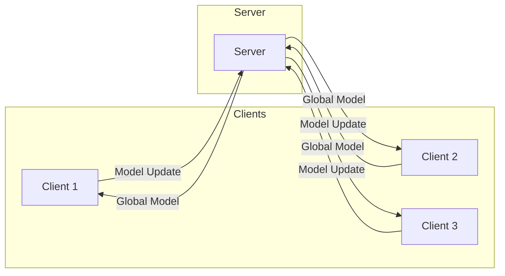

# 联邦学习 原理与代码实例讲解

## 1. 背景介绍

### 1.1 数据孤岛与隐私保护挑战

在当今数字化时代，数据被视为新的"石油"资源,对于机器学习算法的训练至关重要。然而,由于隐私、安全、法规等原因,数据通常被分散存储在不同的机构、组织或设备中,形成了数据孤岛。传统的集中式机器学习方法需要将这些分散的数据集中到一个中心服务器进行训练,这不仅增加了数据传输和存储的成本,而且存在潜在的隐私和安全风险。

### 1.2 联邦学习的兴起

为了解决这一问题,联邦学习(Federated Learning)应运而生。联邦学习允许多个参与方在不共享原始数据的情况下,通过协作训练出一个全局模型。每个参与方只需在本地训练数据上进行模型更新,然后将模型参数或梯度上传到一个协调中心,由协调中心进行模型聚合。这种分布式训练方式不仅保护了数据隐私,还提高了计算效率和模型性能。

### 1.3 联邦学习的应用前景

联邦学习在多个领域展现出广阔的应用前景,例如:

- **医疗保健**: 在不泄露敏感病人数据的情况下,从不同医院的数据中训练出更准确的诊断模型。
- **金融**: 银行可以在不共享客户数据的情况下,共同训练出更好的反欺诈模型。
- **物联网(IoT)**: 联邦学习可以在设备端进行模型训练,减少数据传输,提高隐私保护。
- **下一代移动网络**: 通过联邦学习,可以在保护用户隐私的同时,提高语音识别、计算机视觉等人工智能应用的性能。

## 2. 核心概念与联系

### 2.1 联邦学习系统架构

一个典型的联邦学习系统包括以下三个主要组件:

1. **客户端(Client)**: 也称为参与方,是数据所有者。客户端在本地数据上训练模型,并将模型参数或梯度上传到服务器。
2. **服务器(Server)**: 也称为协调中心,负责接收来自客户端的模型更新,并进行模型聚合,生成新的全局模型。
3. **通信信道**: 客户端和服务器之间通过安全的通信信道进行模型参数或梯度的传输。

下图使用 Mermaid 流程图展示了联邦学习系统的基本架构:



### 2.2 联邦学习算法

联邦学习算法可以分为两大类:

1. **水平联邦学习(Horizontal Federated Learning)**: 参与方拥有相同的特征空间(feature space),但是样本不同。例如,多家银行共同训练一个反欺诈模型,每家银行拥有不同的客户交易数据。

2. **垂直联邦学习(Vertical Federated Learning)**: 参与方拥有不同的特征空间,但是样本相同。例如,一家电商公司和一家银行共同训练一个贷款风险模型,电商公司拥有用户的购买记录,而银行拥有用户的财务数据。

### 2.3 联邦学习中的隐私保护

由于联邦学习过程中不会直接共享原始数据,因此天然地提供了一定程度的隐私保护。然而,仍然存在一些潜在的隐私风险,例如:

- **模型逆向工程攻击**: 攻击者可以通过观察模型的输出,推断出部分训练数据的信息。
- **成员推理攻击**: 攻击者可以判断某些数据是否被用于训练模型。
- **梯度泄露攻击**: 攻击者可以从梯度信息中推断出部分训练数据。

为了提高隐私保护水平,联邦学习通常采用以下技术:

- **差分隐私(Differential Privacy)**: 在模型更新或梯度计算时,引入一定程度的噪声,使得攻击者难以推断出单个数据记录的信息。
- **安全多方计算(Secure Multi-Party Computation)**: 通过加密计算,确保参与方之间无法访问彼此的原始数据。
- **同态加密(Homomorphic Encryption)**: 在加密状态下执行计算操作,避免数据泄露。
- **模型压缩**: 通过模型压缩技术(如量化、剪枝等),减小模型参数的传输开销,降低隐私风险。

## 3. 核心算法原理具体操作步骤

### 3.1 联邦平均算法(FedAvg)

联邦平均算法(FedAvg)是联邦学习中最常用的算法之一,由Google AI团队在2017年提出。它的基本思想是:

1. 服务器向所有客户端发送初始化的全局模型。
2. 每个客户端在本地数据上训练一定的epochs,得到新的模型参数。
3. 客户端将模型参数(或梯度)上传到服务器。
4. 服务器对所有客户端的模型参数进行加权平均,得到新的全局模型。
5. 重复步骤1-4,直到模型收敛或达到最大通信轮数。

FedAvg算法的伪代码如下:

```python
# 服务器端
初始化全局模型参数 w_0
for 每个通信轮数 t=1,...,T:
    m_t = max(C * r, 1) # 选择参与本轮训练的客户端数量
    S_t = 随机选择 m_t 个客户端 
    for 每个客户端 k 在 S_t:
        w_k = 客户端k在本地数据上训练得到的模型参数
    w_t = \sum_{k\in S_t} \frac{n_k}{n} w_k # 对客户端模型参数进行加权平均
发送全局模型 w_t 到所有客户端

# 客户端端 
接收来自服务器的初始模型参数 w_0
for 每个通信轮数 t=1,...,T:
    if 客户端被选中参与本轮训练:
        在本地数据上训练 E 个epochs,得到新的模型参数 w_k
        将 w_k 上传到服务器
    接收来自服务器的新全局模型参数 w_t
```

其中:

- $C$是参与率超参数,控制每轮参与训练的客户端比例。
- $r$是客户端数量与总数据量的比值。
- $n_k$是第k个客户端的本地数据量。
- $n$是所有客户端数据量之和。
- $E$是本地训练的epochs数。

FedAvg算法的优点是简单高效,易于实现和并行化。但它也存在一些缺陷,如:

- 客户端数据分布不均匀时,模型性能会下降。
- 对于高维稀疏数据,收敛速度较慢。
- 无法处理非独立同分布(non-IID)的数据。

为了解决这些问题,研究人员提出了多种改进的联邦学习算法,如FedProx、FedNova、FedDyn等。

### 3.2 联邦近端算法(FedProx)

联邦近端算法(FedProx)是一种改进的联邦学习算法,旨在解决非独立同分布(non-IID)数据的问题。它在FedAvg的基础上,引入了一个正则化项,限制客户端模型与全局模型之间的偏离程度。

FedProx算法的优化目标函数如下:

$$\min_{w} \left\{ \sum_{k=1}^{K} \frac{n_k}{n} F_k(w) + \frac{\mu}{2} \sum_{k=1}^{K} \frac{n_k}{n} \|w - w_k^t\|^2 \right\}$$

其中:

- $K$是参与训练的客户端数量。
- $n_k$是第$k$个客户端的本地数据量。
- $n$是所有客户端数据量之和。
- $F_k(w)$是第$k$个客户端的本地损失函数。
- $\mu$是正则化系数,控制客户端模型与全局模型之间的偏离程度。
- $w_k^t$是第$k$个客户端在第$t$轮的模型参数。

FedProx算法的伪代码如下:

```python
# 服务器端
初始化全局模型参数 w_0
for 每个通信轮数 t=1,...,T:
    m_t = max(C * r, 1) # 选择参与本轮训练的客户端数量
    S_t = 随机选择 m_t 个客户端
    for 每个客户端 k 在 S_t:
        w_k = 客户端k使用FedProx算法在本地数据上训练得到的模型参数
    w_t = \sum_{k\in S_t} \frac{n_k}{n} w_k # 对客户端模型参数进行加权平均
发送全局模型 w_t 到所有客户端

# 客户端端
接收来自服务器的初始模型参数 w_0
for 每个通信轮数 t=1,...,T:
    if 客户端被选中参与本轮训练:
        使用FedProx算法在本地数据上训练,得到新的模型参数 w_k
        将 w_k 上传到服务器
    接收来自服务器的新全局模型参数 w_t
```

FedProx算法在处理非独立同分布数据时表现更好,但引入了额外的超参数$\mu$,需要进行调优。此外,它仍然无法完全解决数据异构性和系统异构性带来的挑战。

## 4. 数学模型和公式详细讲解举例说明

### 4.1 联邦学习的数学形式化

我们可以将联邦学习问题形式化为以下优化问题:

$$\min_{w} \left\{ \frac{1}{K} \sum_{k=1}^{K} F_k(w) \right\}$$

其中:

- $K$是参与训练的客户端数量。
- $F_k(w)$是第$k$个客户端的本地损失函数,定义为$F_k(w) = \frac{1}{n_k} \sum_{i=1}^{n_k} f(w; x_i^k, y_i^k)$。
- $n_k$是第$k$个客户端的本地数据量。
- $(x_i^k, y_i^k)$是第$k$个客户端的第$i$个数据样本及其标签。
- $f(w; x, y)$是模型在单个样本$(x, y)$上的损失函数,例如交叉熵损失或均方误差损失。

联邦学习的目标是找到一个全局最优模型参数$w^*$,使得所有客户端的本地损失函数之和最小化。

### 4.2 梯度下降优化

在联邦学习中,通常使用梯度下降法来优化模型参数。每个客户端在本地数据上计算梯度,然后将梯度或模型参数上传到服务器进行聚合。

对于第$k$个客户端,其本地梯度可以表示为:

$$g_k = \nabla F_k(w) = \frac{1}{n_k} \sum_{i=1}^{n_k} \nabla f(w; x_i^k, y_i^k)$$

服务器收集所有客户端的梯度或模型参数后,可以进行加权平均:

$$w_{t+1} = w_t - \eta \left( \sum_{k=1}^{K} \frac{n_k}{n} g_k \right)$$

其中:

- $w_t$是第$t$轮的全局模型参数。
- $\eta$是学习率超参数。
- $n = \sum_{k=1}^{K} n_k$是所有客户端数据量之和。

通过迭代地更新全局模型参数,直到收敛或达到最大通信轮数,我们可以得到联邦学习的最终模型。

### 4.3 联邦学习中的正则化

为了提高模型的泛化能力和稳定性,我们可以在联邦学习的目标函数中引入正则化项。例如,FedProx算法使用了$L_2$正则化:

$$\min_{w} \left\{ \frac{1}{K} \sum_{k=1}^{K} F_k(w)