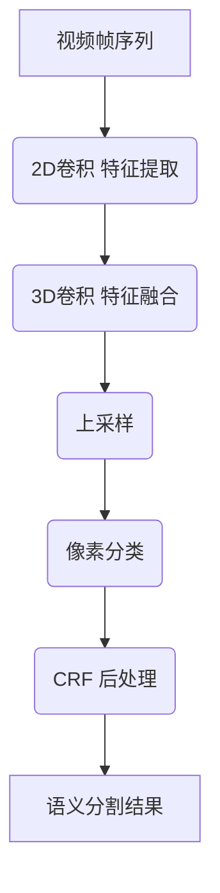
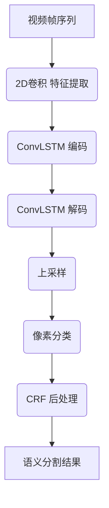
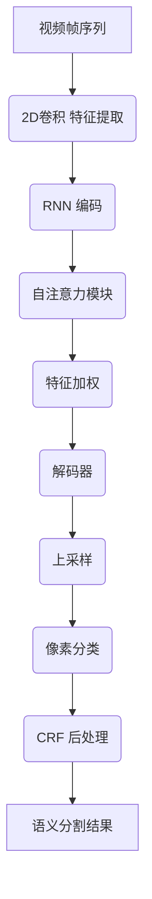
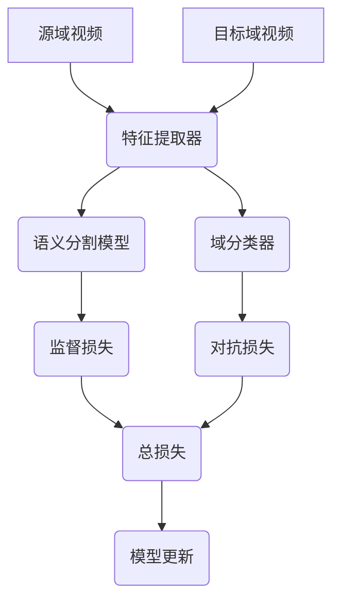

# 视频语义分割：挑战与机遇

## 1. 背景介绍

### 1.1 什么是视频语义分割?

视频语义分割是计算机视觉领域的一个重要任务,旨在对视频中的每个像素进行语义分类,将视频画面划分为多个语义对象或区域。与图像语义分割相比,视频语义分割不仅需要考虑单帧图像信息,还需要利用时域信息来提高分割的一致性和准确性。

### 1.2 视频语义分割的应用

视频语义分割在许多领域都有广泛的应用,例如:

- 视频编辑和增强
- 自动驾驶和机器人导航
- 视频监控和行为分析
- 增强现实(AR)和虚拟现实(VR)
- 视频编码和压缩

### 1.3 视频语义分割的挑战

尽管取得了长足的进步,视频语义分割仍然面临着一些挑战:

- 目标运动和形变
- 视角变化和遮挡
- 复杂背景和相似物体
- 计算效率和实时性
- 标注数据缺乏

## 2. 核心概念与联系

### 2.1 卷积神经网络

卷积神经网络(CNN)是视频语义分割的核心模型,能够自动从视频中提取特征。常用的CNN网络包括VGG、ResNet、Inception等。

### 2.2 循环神经网络

循环神经网络(RNN)可以捕捉时序信息,在视频语义分割中常与CNN结合使用,形成像ConvLSTM这样的模型。

### 2.3 注意力机制

注意力机制可以自适应地聚焦到重要的区域,提高分割精度。常见的注意力模块包括非局部注意力、自注意力等。

### 2.4 对抗训练

对抗训练可以利用无监督数据,生成更加鲁棒和通用的语义分割模型。像CyCADA等模型就采用了对抗训练。

### 2.5 半监督学习

由于标注视频数据代价高昂,半监督学习可以利用少量标注数据和大量无标注数据进行训练,提高模型性能。

### 2.6 弱监督学习

弱监督学习只需要图级别或视频级别的标注,而非像素级别的标注,可以大幅降低标注成本。

### 2.7 模型压缩

模型压缩技术可以在不损失太多精度的情况下,将庞大的语义分割模型压缩成小模型,以满足移动端等设备的计算能力和内存限制。

## 3. 核心算法原理具体操作步骤 

### 3.1 基于CNN的视频语义分割

基于CNN的视频语义分割通常分为以下几个步骤:

1. **特征提取**: 利用预训练的CNN(如VGG、ResNet等)从视频帧中提取特征图。

2. **特征融合**: 将相邻帧的特征图融合,以捕获时域信息。常见的融合方式包括3D卷积、RNN等。

3. **上采样**: 将融合后的特征图上采样至原始分辨率,通常使用反卷积或反池化。 

4. **像素分类**: 对上采样后的特征图进行像素级别的多类别分类,得到语义分割结果。

5. **后处理**: 可以进行条件随机场(CRF)等后处理,提高分割结果的一致性。

下面是一个基于3D卷积的视频语义分割网络示意图:



### 3.2 基于RNN的视频语义分割

RNN可以自然地对序列数据建模,适合捕获视频的时序信息。常见的基于RNN的视频语义分割流程如下:

1. **特征提取**: 利用CNN从每一帧提取特征图。

2. **RNN编码**: 将特征图序列输入RNN(如LSTM、ConvLSTM等),得到编码后的特征序列。

3. **RNN解码**: 将编码特征序列解码为语义分割结果序列。

4. **后处理**: 可以进行CRF等后处理,提高分割一致性。

下面是一个基于ConvLSTM的视频语义分割网络结构:



### 3.3 基于注意力机制的视频语义分割

注意力机制可以自适应地聚焦到重要的区域,提高分割精度。常见的注意力模块包括非局部注意力、自注意力等,可以与CNN或RNN相结合:

1. **特征提取**: 利用CNN或RNN从视频中提取特征序列。

2. **注意力模块**: 计算注意力权重,突出重要特征。

3. **特征加权**: 根据注意力权重加权特征序列。

4. **上采样和分类**: 对加权特征进行上采样和像素分类。  

下面是一个结合自注意力机制的视频语义分割网络示例:



### 3.4 基于对抗训练的视频语义分割

对抗训练可以利用大量无监督数据,生成更加鲁棒和通用的语义分割模型。一种常见的对抗训练流程如下:

1. **有监督训练**: 在有标注数据上训练语义分割模型。

2. **域适应**: 利用对抗损失,最小化源域(有标注)和目标域(无标注)特征的分布差异。

3. **目标域微调**: 在目标域数据上微调模型,进一步提高性能。

下面是一个基于对抗训练的视频语义分割框架示例:



## 4. 数学模型和公式详细讲解举例说明

### 4.1 卷积神经网络

卷积神经网络(CNN)是视频语义分割的核心模型,能够自动从视频帧中提取特征。CNN由多个卷积层、池化层和全连接层组成。

卷积层的作用是提取局部特征,公式如下:

$$
y_{ij}^l = f\left(\sum_{m}\sum_{n}w_{mn}^{l}x_{i+m,j+n}^{l-1} + b_l\right)
$$

其中:
- $x^{l-1}$是上一层的输入特征图
- $w^l$是当前层的卷积核权重
- $b_l$是当前层的偏置项
- $f$是非线性激活函数,如ReLU

池化层的作用是下采样特征图,减小计算量和参数数量。最大池化的公式为:

$$
y_{ij}^l = \max\limits_{(m,n) \in R_{ij}}x_{i+m,j+n}^{l-1}
$$

其中$R_{ij}$是以$(i,j)$为中心的池化区域。

### 4.2 循环神经网络

循环神经网络(RNN)可以捕捉时序信息,在视频语义分割中常与CNN结合使用。以LSTM为例,其门控机制公式如下:

**遗忘门**:
$$
f_t = \sigma(W_f \cdot [h_{t-1}, x_t] + b_f)
$$

**输入门**:  
$$
i_t = \sigma(W_i \cdot [h_{t-1}, x_t] + b_i)
$$

**记忆细胞**:
$$
\tilde{C}_t = \tanh(W_C \cdot [h_{t-1}, x_t] + b_C)
$$
$$
C_t = f_t \odot C_{t-1} + i_t \odot \tilde{C}_t
$$

**输出门**:
$$
o_t = \sigma(W_o \cdot [h_{t-1}, x_t] + b_o)
$$
$$
h_t = o_t \odot \tanh(C_t)
$$

其中$\sigma$是sigmoid函数,用于控制信息流动。$\odot$表示元素乘积。

### 4.3 注意力机制

注意力机制可以自适应地聚焦到重要的区域,提高分割精度。以自注意力(Self-Attention)为例,其公式如下:

$$
\mathrm{Attention}(Q, K, V) = \mathrm{softmax}\left(\frac{QK^T}{\sqrt{d_k}}\right)V
$$

其中:
- $Q$是查询向量(Query)
- $K$是键向量(Key)  
- $V$是值向量(Value)
- $d_k$是键向量的维度,用于缩放点积

这种形式的注意力机制可以直接应用于2D特征图,形成非局部注意力模块。

### 4.4 对抗训练

对抗训练的目标是最小化源域和目标域特征分布的差异,常用的损失函数是最小最大化(minimax)形式:

$$
\min\limits_G \max\limits_D \mathcal{L}_{adv}(G, D) = \mathbb{E}_{x \sim p_S(x)}[\log D(x)] + \mathbb{E}_{x \sim p_T(x)}[\log(1 - D(G(x)))]
$$

其中:
- $G$是生成器(如特征提取器)
- $D$是判别器(如域分类器)  
- $p_S(x)$是源域数据分布
- $p_T(x)$是目标域数据分布

通过对抗训练,生成器$G$会生成"欺骗"判别器$D$的特征,从而缩小域分布差异。

## 5. 项目实践: 代码实例和详细解释说明

这里我们提供一个使用PyTorch实现的视频语义分割示例代码,基于3D卷积和ConvLSTM。完整代码请参考GitHub仓库。

### 5.1 数据准备

我们使用Cityscapes数据集进行训练和测试,该数据集包含城市街景视频及对应的语义分割标签。数据读取和预处理代码如下:

```python
import torch
from torch.utils.data import Dataset

class CityscapesDataset(Dataset):
    def __init__(self, video_paths, label_paths, transforms=None):
        self.video_paths = video_paths
        self.label_paths = label_paths
        self.transforms = transforms

    def __len__(self):
        return len(self.video_paths)

    def __getitem__(self, idx):
        video = np.load(self.video_paths[idx])
        label = np.load(self.label_paths[idx])

        if self.transforms:
            video, label = self.transforms(video, label)

        return torch.from_numpy(video), torch.from_numpy(label)
```

### 5.2 模型定义

我们定义一个基于3D卷积和ConvLSTM的视频语义分割模型:

```python
import torch.nn as nn

class VideoSegmentationModel(nn.Module):
    def __init__(self, in_channels, num_classes):
        super().__init__()
        self.conv3d = nn.Conv3d(in_channels, 64, kernel_size=(3, 3, 3), padding=(1, 1, 1))
        self.bn3d = nn.BatchNorm3d(64)
        self.convlstm = nn.ConvLSTM(64, 64, kernel_size=(3, 3), padding=(1, 1))
        self.conv2d = nn.Conv2d(64, num_classes, kernel_size=(1, 1))

    def forward(self, x):
        x = self.bn3d(self.conv3d(x))
        x, _ = self.convlstm(x)
        x = self.conv2d(x[:, :, -1])
        return x
```

这个模型首先使用3D卷积提取视频的空间和时间特征,然后使用ConvLSTM捕捉时序信息,最后通过2D卷积进行像素级别的分类。

### 5.3 训练和测试

训练和测试代码如下:

```python
import torch.opt