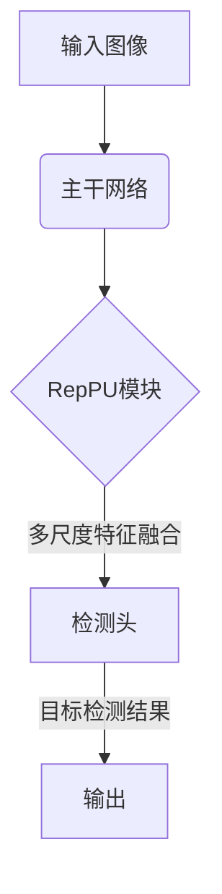
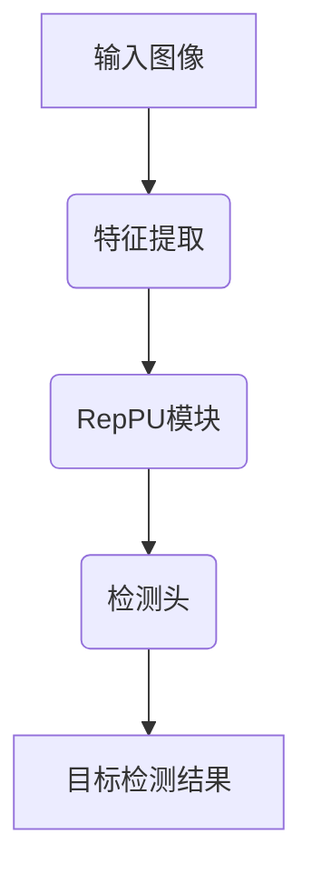

# 训练YOLOv6的秘诀：参数调整与性能优化

## 1. 背景介绍

### 1.1 什么是YOLOv6?

YOLOv6是一种先进的实时物体检测系统,由Ultralytics开发。它建立在YOLO(You Only Look Once)系列的成功之上,是目标检测领域中最先进的单阶段检测器之一。相比于以前的版本,YOLOv6在速度、精度和鲁棒性方面都有了显著提升,使其成为各种应用场景中的首选目标检测解决方案。

### 1.2 为什么需要调整参数和优化性能?

尽管YOLOv6已经取得了卓越的性能,但是在特定任务和环境下,仍然需要对其进行微调和优化,以达到最佳效果。合理地调整模型参数和优化训练过程,可以进一步提高检测精度、降低推理延迟、减少模型大小等,从而更好地满足实际应用需求。

## 2. 核心概念与联系 

### 2.1 损失函数

损失函数是训练目标检测模型时需要优化的关键指标。YOLOv6采用了一种新的综合损失函数,包括分类损失、置信度损失、边界框回归损失等多个部分,能够更好地平衡不同任务之间的损失。理解和调整损失函数对于提高模型性能至关重要。

### 2.2 数据增强

数据增强是通过对原始训练数据进行一系列变换(如旋转、平移、缩放等)来人为扩充数据集,从而提高模型的泛化能力。YOLOv6引入了一些新的数据增强策略,如Mosaic数据增强、自动增强等,能够有效提升模型的鲁棒性。选择合适的数据增强方法对于提高检测精度至关重要。

### 2.3 锚框设计

锚框(Anchor Box)是YOLOv6中用于初始化边界框预测的一组先验框。合理设计锚框尺寸和比例,能够显著提高模型对不同形状和尺度目标的检测能力。YOLOv6采用了自动锚框标注策略,可以根据数据集自动生成最优锚框配置。

### 2.4 模型蒸馏

模型蒸馏是一种知识传递技术,通过让小模型学习大模型的知识来提高其性能。YOLOv6支持多种蒸馏方法,如对抗蒸馏、关注蒸馏等,可以在保持较小模型尺寸的同时,显著提升其检测精度。

## 3. 核心算法原理具体操作步骤

在本节中,我们将深入探讨YOLOv6算法的核心原理和操作步骤,包括网络结构、前向传播和训练过程等方面。

### 3.1 网络架构

YOLOv6采用了一种新的网络架构,称为EfficientRep。该架构由一个主干网络(如EfficientNet)和一个RepPU(Representation Pooling Unit)模块组成。RepPU模块通过应用多尺度表示融合和注意力机制,能够有效地整合不同尺度的特征,从而提高对不同尺度目标的检测能力。



### 3.2 前向传播过程

在前向传播过程中,输入图像首先通过主干网络(如EfficientNet)提取特征。然后,RepPU模块对这些特征进行多尺度表示融合和注意力机制处理,生成增强的特征图。最后,这些增强的特征图被送入检测头,进行边界框回归、目标分类和置信度预测,得到最终的目标检测结果。



### 3.3 训练过程

YOLOv6的训练过程主要包括以下几个步骤:

1. **数据准备**: 收集和标注训练数据集,并进行适当的数据增强。

2. **模型初始化**: 初始化YOLOv6模型的权重,可以使用预训练权重或随机初始化。

3. **前向传播**: 将训练数据输入模型,计算输出的预测结果。

4. **损失计算**: 根据预测结果和真实标签,计算综合损失函数的值。

5. **反向传播**: 通过反向传播算法,计算模型参数的梯度。

6. **权重更新**: 使用优化器(如SGD或Adam)根据梯度更新模型权重。

7. **重复训练**: 重复执行步骤3-6,直到模型收敛或达到预期性能。

在训练过程中,还需要注意调整超参数(如学习率、批量大小等)、采用合适的正则化策略(如权重衰减)以及进行模型评估和早停,以获得最佳性能。

## 4. 数学模型和公式详细讲解举例说明

在本节中,我们将详细讨论YOLOv6中使用的一些关键数学模型和公式,并通过具体示例加深理解。

### 4.1 综合损失函数

YOLOv6采用了一种新的综合损失函数,用于平衡不同任务之间的损失,从而获得更好的检测性能。该损失函数包括以下几个部分:

$$
\mathcal{L} = \mathcal{L}_{cls} + \mathcal{L}_{obj} + \mathcal{L}_{box} + \alpha\mathcal{L}_{dfl}
$$

其中:

- $\mathcal{L}_{cls}$ 是分类损失,用于衡量目标类别预测的准确性。
- $\mathcal{L}_{obj}$ 是置信度损失,用于衡量目标存在与否的预测准确性。
- $\mathcal{L}_{box}$ 是边界框回归损失,用于衡量预测边界框与真实边界框之间的差异。
- $\mathcal{L}_{dfl}$ 是一种新引入的深度监督损失,用于提高特征表示的质量。
- $\alpha$ 是一个权重系数,用于平衡深度监督损失与其他损失之间的重要性。

通过合理设置这些损失项的权重,可以有效地优化模型的不同方面,从而提高整体检测性能。

### 4.2 注意力机制

注意力机制是YOLOv6中一个关键的技术,用于提高对不同尺度目标的检测能力。RepPU模块中采用了一种新的注意力机制,称为CBAM(Convolutional Block Attention Module)。

CBAM包括两个并行的注意力模块:通道注意力模块和空间注意力模块。通道注意力模块用于突出显示对于当前预测目标更加重要的特征通道,而空间注意力模块则用于突出显示对于当前预测目标更加重要的空间位置。

通过将这两种注意力机制结合,CBAM能够自适应地调整不同通道和空间位置的特征响应,从而提高模型对不同尺度目标的检测能力。

$$
\begin{aligned}
F' &= \mathcal{M}_c(F) \otimes F \\
F'' &= \mathcal{M}_s(F') \otimes F'
\end{aligned}
$$

其中:

- $F$ 是输入特征图
- $\mathcal{M}_c(\cdot)$ 是通道注意力模块
- $\mathcal{M}_s(\cdot)$ 是空间注意力模块
- $\otimes$ 表示元素wise乘积操作
- $F''$ 是注意力增强后的输出特征图

### 4.3 锚框分配策略

YOLOv6采用了一种新的锚框分配策略,称为自动锚框标注(Auto-Anchor Labeling)。这种策略能够根据训练数据集自动生成最优的锚框配置,从而提高模型对不同形状和尺度目标的检测能力。

该策略的核心思想是,对于每个真实边界框,找到与之最匹配的锚框,并将该真实边界框分配给该锚框。匹配度的计算公式如下:

$$
\text{match}(b, a) = \text{max}(\text{IOU}(b, a), \text{IOU}(a, b))
$$

其中:

- $b$ 是真实边界框
- $a$ 是锚框
- $\text{IOU}(\cdot, \cdot)$ 是计算两个边界框之间的交并比(Intersection over Union)

通过这种策略,YOLOv6能够自动学习到数据集中目标的形状和尺度分布,从而生成最优的锚框配置,提高检测性能。

## 5. 项目实践: 代码实例和详细解释说明

在本节中,我们将提供一些YOLOv6的代码实例,并对其进行详细的解释说明,以帮助读者更好地理解和实践该算法。

### 5.1 安装和配置

首先,我们需要安装YOLOv6及其依赖项。可以使用pip或conda进行安装:

```bash
pip install ultralytics
```

或者从GitHub克隆源代码并安装:

```bash
git clone https://github.com/ultralytics/ultralytics.git
cd ultralytics
pip install -e .
```

安装完成后,我们可以导入YOLOv6相关的模块:

```python
from ultralytics import YOLO
```

### 5.2 模型初始化

接下来,我们需要初始化一个YOLOv6模型实例。可以使用预训练权重或从头开始训练:

```python
# 使用预训练权重初始化
model = YOLO("yolov6n.pt")

# 从头开始训练
model = YOLO("yolov6n.yaml")
```

### 5.3 数据准备

为了训练YOLOv6模型,我们需要准备好标注的训练数据集。数据集应该包含图像文件和对应的标注文件(如YOLO格式的txt文件)。

假设我们的数据集位于`/path/to/dataset`目录下,并且已经按照标准格式进行了标注,我们可以这样加载数据集:

```python
data = "/path/to/dataset.yaml"  # 数据集配置文件
```

### 5.4 模型训练

现在,我们可以开始训练YOLOv6模型了。以下是一个基本的训练示例:

```python
from ultralytics import YOLO

# 加载模型和数据集
model = YOLO("yolov6n.pt")  # 使用预训练权重初始化
data = "/path/to/dataset.yaml"  # 数据集配置文件

# 设置训练参数
model.train(
    data=data,
    imgsz=640,  # 输入图像尺寸
    epochs=100,  # 训练epochs
    batch=16,  # 批量大小
    workers=8,  # 数据加载线程数
    name="yolov6n_results"  # 结果保存目录
)
```

在训练过程中,您可以监控损失值、评估指标(如mAP)等,并根据需要调整超参数,如学习率、优化器等。

### 5.5 模型评估

训练完成后,我们可以在验证集或测试集上评估模型的性能:

```python
metrics = model.val(data="/path/to/val_data.yaml")
```

这将输出模型在验证集上的各种评估指标,如mAP、速度等。

### 5.6 模型推理

最后,我们可以使用训练好的模型进行推理和预测:

```python
results = model.predict(source="/path/to/image_or_video")
```

`results`是一个包含检测结果的列表,每个元素对应一个输入图像或视频帧。您可以将这些结果可视化、保存或进一步处理。

以上是YOLOv6的一些基本用法示例。在实际应用中,您可能还需要进行更多的参数调整和优化,以获得最佳性能。

## 6. 实际应用场景

YOLOv6是一种通用的目标检测算法,可以应用于各种场景,包括但不限于:

### 6.1 安防监控

在安防监控领域,YOLOv6可以用于实时检测和跟踪可疑目标、人员和车辆,提高安全防范能力。

### 6.2 自动驾驶

在自动驾驶系统中,YOLOv6可以用于实时检测道路上的行人、车辆、障碍物等,为决策和控制提供关键信息。

### 6.3 机器人视觉

在机器人视觉应用中,YOLOv6可