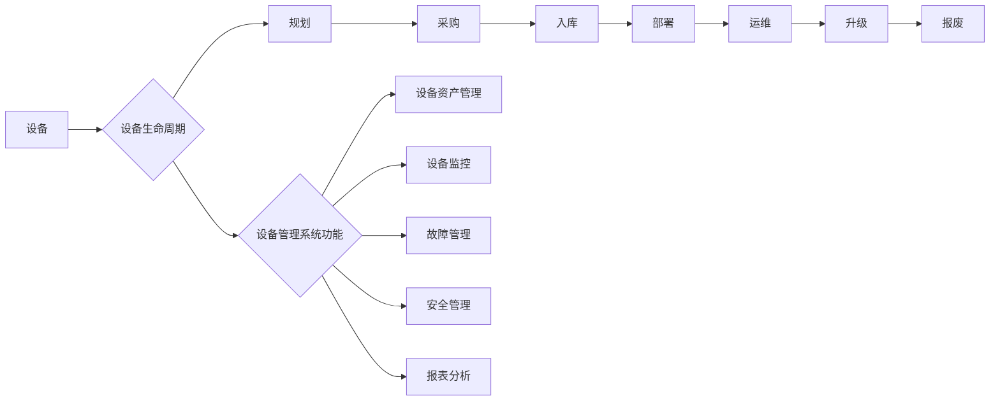

## 设备管理系统设计与实现

作者：禅与计算机程序设计艺术

## 1. 背景介绍

### 1.1 设备管理的必要性

随着信息技术的快速发展，企业和组织的IT基础设施规模不断扩大，设备数量也随之激增。如何高效地管理这些设备，确保其正常运行，成为IT管理人员面临的重大挑战。设备管理系统应运而生，它通过自动化和智能化手段，帮助企业实现对设备的全生命周期管理，提升IT运维效率，降低运营成本。

### 1.2 传统设备管理的局限性

传统的设备管理方式主要依赖人工操作，存在以下局限性：

* **效率低下:** 人工记录和统计设备信息，容易出错且耗费大量时间。
* **信息孤岛:** 设备信息分散在不同的部门和系统中，难以整合和共享。
* **缺乏实时监控:** 无法实时掌握设备的运行状态，难以及时发现和解决问题。
* **安全风险:** 设备缺乏统一的安全策略，容易遭受攻击和数据泄露。

### 1.3 设备管理系统的优势

设备管理系统克服了传统设备管理方式的局限性，具有以下优势：

* **提高效率:** 自动化设备信息采集、更新和维护，节省人力成本。
* **信息集中:** 整合所有设备信息，提供统一的管理平台。
* **实时监控:** 实时监测设备运行状态，及时发现故障和异常。
* **增强安全性:**  统一的安全策略，保障设备和数据的安全。

## 2. 核心概念与联系

### 2.1 设备

设备是指企业或组织拥有的，用于支持业务运营的硬件设施，例如服务器、网络设备、存储设备、终端设备等。

### 2.2 设备生命周期

设备生命周期是指设备从采购到报废的整个过程，包括以下阶段：

* **规划:** 确定设备需求，制定采购计划。
* **采购:** 筛选供应商，签订采购合同。
* **入库:** 设备到货，进行验收和登记。
* **部署:** 安装、配置和调试设备。
* **运维:** 监控设备运行状态，进行故障处理和维护。
* **升级:** 对设备进行软件或硬件升级，提升性能或功能。
* **报废:** 设备达到使用寿命或无法修复，进行报废处理。

### 2.3 设备管理系统功能

设备管理系统涵盖设备生命周期的各个阶段，提供以下核心功能：

* **设备资产管理:** 记录设备的基本信息、配置信息、维护记录等，实现对设备资产的全面管理。
* **设备监控:** 实时采集设备运行数据，监控设备运行状态，及时发现故障和异常。
* **故障管理:** 记录故障信息，进行故障分析和处理，跟踪故障解决进度。
* **安全管理:** 制定设备安全策略，控制设备访问权限，防止数据泄露。
* **报表分析:** 生成各种报表，分析设备利用率、故障率等指标，为决策提供依据。

### 2.4 核心概念联系

设备管理系统围绕设备生命周期，提供各种功能模块，实现对设备的全面管理。



## 3. 核心算法原理具体操作步骤

### 3.1 设备自动发现

#### 3.1.1 原理

设备自动发现是指系统自动识别和收集网络中的设备信息，无需人工干预。常用的自动发现协议包括：

* **SNMP:** 简单网络管理协议，通过轮询设备获取信息。
* **Netconf:** 网络配置协议，通过远程调用设备接口获取信息。
* **WMI:** Windows Management Instrumentation，用于管理 Windows 系统及其应用程序。

#### 3.1.2 操作步骤

1. 配置自动发现规则，例如扫描的 IP 地址范围、协议类型、用户名密码等。
2. 系统根据规则自动扫描网络，发现设备。
3. 收集设备的基本信息，例如 IP 地址、MAC 地址、设备类型、操作系统等。
4. 将设备信息添加到系统数据库中。

### 3.2 设备状态监控

#### 3.2.1 原理

设备状态监控是指系统实时采集设备运行数据，例如 CPU 使用率、内存占用率、网络流量等，并根据预设的阈值判断设备是否正常运行。

#### 3.2.2 操作步骤

1. 配置监控指标和阈值，例如 CPU 使用率超过 80% 则报警。
2. 系统定期采集设备运行数据。
3. 判断指标是否超过阈值，如果超过则触发报警。
4. 记录报警信息，通知管理员处理。

### 3.3 故障自动诊断

#### 3.3.1 原理

故障自动诊断是指系统根据设备运行数据和日志信息，自动分析故障原因，并提供解决方案建议。

#### 3.3.2 操作步骤

1. 收集设备运行数据和日志信息。
2. 分析数据和日志，识别故障模式。
3. 根据故障模式，匹配相应的解决方案。
4. 提供解决方案建议，例如重启服务、更换硬件等。

## 4. 数学模型和公式详细讲解举例说明

### 4.1 设备可用性

设备可用性是指设备正常运行的时间占总时间的比例，可用性越高，设备的可靠性越好。

$$
可用性 = \frac{正常运行时间}{总时间}
$$

**举例说明：**

一台服务器的总运行时间为 100 小时，其中有 95 小时正常运行，则其可用性为：

$$
可用性 = \frac{95}{100} = 0.95 = 95\%
$$

### 4.2 平均故障间隔时间 (MTBF)

平均故障间隔时间是指两次故障之间的平均时间，MTBF 越长，设备的可靠性越好。

$$
MTBF = \frac{总运行时间}{故障次数}
$$

**举例说明：**

一台服务器在 1000 小时的运行时间内发生了 2 次故障，则其 MTBF 为：

$$
MTBF = \frac{1000}{2} = 500 小时
$$

## 5. 项目实践：代码实例和详细解释说明

### 5.1 设备信息管理

```python
class Device:
    def __init__(self, name, ip_address, device_type, os):
        self.name = name
        self.ip_address = ip_address
        self.device_type = device_type
        self.os = os

    def get_info(self):
        return f"设备名称: {self.name}, IP地址: {self.ip_address}, 设备类型: {self.device_type}, 操作系统: {self.os}"

# 创建设备对象
device1 = Device("服务器1", "192.168.1.100", "服务器", "Linux")

# 打印设备信息
print(device1.get_info())
```

**代码解释：**

* `Device` 类表示设备，包含设备名称、IP 地址、设备类型、操作系统等属性。
* `get_info()` 方法用于获取设备信息。
* 创建 `device1` 对象，表示一台名为 "服务器1" 的 Linux 服务器。
* 调用 `get_info()` 方法打印设备信息。

### 5.2 设备状态监控

```python
import psutil

# 获取 CPU 使用率
cpu_percent = psutil.cpu_percent()

# 获取内存使用率
memory_percent = psutil.virtual_memory().percent

# 设置阈值
cpu_threshold = 80
memory_threshold = 90

# 判断是否超过阈值
if cpu_percent > cpu_threshold:
    print(f"CPU 使用率超过阈值: {cpu_percent}%")

if memory_percent > memory_threshold:
    print(f"内存使用率超过阈值: {memory_percent}%")
```

**代码解释：**

* 使用 `psutil` 库获取 CPU 和内存使用率。
* 设置 CPU 和内存使用率的阈值。
* 判断 CPU 和内存使用率是否超过阈值，如果超过则打印报警信息。

## 6. 实际应用场景

### 6.1 数据中心

数据中心拥有大量的服务器、网络设备、存储设备等，设备管理系统可以帮助数据中心实现：

* **设备资产管理:** 跟踪设备的配置信息、维护记录、使用情况等。
* **设备监控:** 实时监控设备运行状态，及时发现故障和异常。
* **容量规划:** 分析设备利用率，预测未来容量需求。
* **自动化运维:**  自动化设备部署、配置、升级等操作。

### 6.2 企业网络

企业网络包含各种网络设备、终端设备等，设备管理系统可以帮助企业实现：

* **网络拓扑管理:**  可视化网络拓扑结构，方便管理和维护。
* **设备配置管理:**  集中管理网络设备的配置信息，提高效率和安全性。
* **安全策略管理:**  统一管理网络设备的安全策略，防止网络攻击和数据泄露。

### 6.3 物联网

物联网包含大量的传感器、执行器等设备，设备管理系统可以帮助物联网实现：

* **设备注册和认证:**  管理设备的身份信息，确保设备安全接入网络。
* **数据采集和分析:**  收集设备数据，分析设备运行状态和环境信息。
* **远程控制:**  远程控制设备的运行状态，实现自动化操作。

## 7. 总结：未来发展趋势与挑战

### 7.1 未来发展趋势

* **云化:**  设备管理系统将更多地采用云计算技术，提供更灵活、可扩展的服务。
* **智能化:**  人工智能技术将被应用于设备管理系统，实现故障自动诊断、预测性维护等功能。
* **一体化:**  设备管理系统将与其他 IT 管理系统集成，实现统一的 IT 运维管理平台。

### 7.2 面临的挑战

* **海量设备管理:**  物联网的快速发展带来了海量的设备，如何高效地管理这些设备是一个挑战。
* **安全风险:**  设备安全风险日益严峻，如何保障设备和数据的安全是一个重要课题。
* **技术复杂性:**  设备管理系统涉及的技术越来越复杂，需要专业的技术人员进行开发和维护。

## 8. 附录：常见问题与解答

### 8.1 如何选择合适的设备管理系统？

选择设备管理系统需要考虑以下因素：

* **功能需求:**  根据企业的实际需求选择功能模块，例如设备资产管理、设备监控、故障管理等。
* **部署方式:**  根据企业的 IT 基础设施选择部署方式，例如本地部署、云部署等。
* **成本预算:**  根据企业的预算选择合适的设备管理系统，避免成本过高。
* **技术支持:**  选择提供良好技术支持的设备管理系统，确保系统稳定运行。

### 8.2 如何保障设备管理系统的安全性？

保障设备管理系统的安全性需要采取以下措施：

* **访问控制:**  限制对设备管理系统的访问权限，只允许授权用户访问。
* **数据加密:**  对敏感数据进行加密存储和传输，防止数据泄露。
* **安全审计:**  定期进行安全审计，发现和修复安全漏洞。
* **安全更新:**  及时更新设备管理系统的软件版本，修复安全漏洞。
