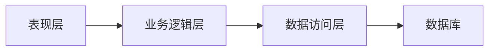

## 1. 背景介绍

### 1.1  在线教育的兴起与发展趋势

近年来，随着互联网技术的快速发展以及人们对优质教育资源的需求日益增长，在线教育平台如雨后春笋般涌现。这类平台打破了传统教育模式的时空限制，为学习者提供了更加灵活、便捷的学习方式。课程教学网站作为在线教育平台的重要组成部分，承担着课程资源的组织、管理、发布以及学习交互等核心功能。

### 1.2 课程教学网站的功能需求分析

一个功能完善的课程教学网站需要满足以下几个方面的需求：

* **课程管理**：支持课程的创建、编辑、分类、发布等功能，方便教师对课程内容进行管理和更新。
* **用户管理**：支持用户注册、登录、个人信息管理、学习进度跟踪等功能，为学习者提供个性化的学习体验。
* **学习交互**：提供在线学习、讨论、答疑、作业提交等功能，促进学习者之间的互动和交流。
* **数据统计与分析**：记录用户学习行为数据，并进行分析，为平台运营和课程改进提供数据支持。

### 1.3 本文目的与意义

本文旨在提供一个课程教学网站的详细设计方案和代码实现示例，帮助开发者快速搭建一个功能完备、性能优良的在线教育平台。文章将从系统架构设计、数据库设计、核心功能模块实现、技术选型等方面进行详细阐述，并结合代码示例进行讲解，力求实用性和可操作性。


## 2. 核心概念与联系

### 2.1 系统架构设计

课程教学网站的系统架构采用经典的三层架构模式，即表现层、业务逻辑层和数据访问层。

* **表现层**：负责用户界面展示和用户交互逻辑，主要使用HTML、CSS、JavaScript等前端技术实现。
* **业务逻辑层**：负责处理业务逻辑，包括用户管理、课程管理、学习交互等功能，主要使用Java、Python等后端语言实现。
* **数据访问层**：负责与数据库交互，进行数据的增删改查操作，主要使用SQL语言和数据库驱动程序实现。

三层架构模式能够有效地降低各层之间的耦合度，提高系统的可维护性和可扩展性。



### 2.2 数据库设计

课程教学网站的数据库设计主要包括以下几个实体：

* **用户**：存储用户信息，包括用户名、密码、邮箱、昵称、头像等。
* **课程**：存储课程信息，包括课程名称、课程简介、课程分类、授课教师、课程价格等。
* **章节**：存储课程章节信息，包括章节名称、章节内容、章节视频等。
* **作业**：存储课程作业信息，包括作业题目、作业要求、作业截止日期等。
* **学习记录**：存储用户的学习记录，包括学习时间、学习进度、作业完成情况等。

各实体之间存在以下关系：

* 一对多关系：一个用户可以学习多门课程，一门课程可以有多个章节，一个章节可以有多个作业。
* 多对多关系：一个用户可以完成多个作业，一个作业可以被多个用户完成。

### 2.3 核心功能模块

课程教学网站的核心功能模块包括：

* **用户管理模块**：实现用户注册、登录、个人信息管理、密码修改等功能。
* **课程管理模块**：实现课程的创建、编辑、分类、发布、搜索等功能。
* **学习交互模块**：实现在线学习、讨论、答疑、作业提交等功能。
* **数据统计与分析模块**：实现用户学习行为数据的记录和分析，为平台运营和课程改进提供数据支持。

## 3. 核心算法原理具体操作步骤

### 3.1 用户注册流程

用户注册流程如下：

1. 用户填写注册表单，包括用户名、密码、邮箱等信息。
2. 系统验证用户输入的信息是否合法，例如用户名是否已存在、密码是否符合安全规范等。
3. 如果信息合法，系统将用户信息保存到数据库中，并发送激活邮件到用户邮箱。
4. 用户点击激活链接，完成注册流程。

### 3.2 课程发布流程

课程发布流程如下：

1. 教师填写课程信息，包括课程名称、课程简介、课程分类、课程价格等。
2. 系统验证课程信息是否合法，例如课程名称是否重复、课程价格是否合理等。
3. 如果信息合法，系统将课程信息保存到数据库中，并生成课程页面。
4. 教师上传课程章节内容，包括章节名称、章节内容、章节视频等。
5. 系统将章节内容保存到数据库中，并更新课程页面。

### 3.3 在线学习流程

在线学习流程如下：

1. 用户登录系统，选择要学习的课程。
2. 系统根据用户的学习进度，展示相应的课程章节内容。
3. 用户可以通过视频播放、文字阅读、图片浏览等方式学习课程内容。
4. 系统记录用户的学习时间、学习进度等信息。

## 4. 数学模型和公式详细讲解举例说明

### 4.1 用户学习行为数据分析模型

用户学习行为数据分析模型可以用于分析用户的学习兴趣、学习习惯、学习效果等，为平台运营和课程改进提供数据支持。

常用的用户学习行为数据分析模型包括：

* **聚类分析**：将用户按照学习行为特征进行分组，例如将学习时间长、学习进度快的用户归为一组，将学习时间短、学习进度慢的用户归为另一组。
* **关联规则分析**：挖掘用户学习行为之间的关联规则，例如发现学习课程A的用户更容易学习课程B。
* **预测模型**：预测用户的学习成绩、学习进度等，例如根据用户的历史学习数据预测用户未来一周的学习进度。

### 4.2 课程推荐算法

课程推荐算法可以根据用户的学习兴趣、学习历史等信息，为用户推荐合适的课程。

常用的课程推荐算法包括：

* **基于内容的推荐**：根据课程内容特征，为用户推荐与其学习过的课程内容相似的课程。
* **基于协同过滤的推荐**：根据其他用户的学习行为，为用户推荐与其学习兴趣相似的用户学习过的课程。
* **混合推荐**：结合多种推荐算法，为用户提供更加个性化的课程推荐服务。

## 5. 项目实践：代码实例和详细解释说明

### 5.1 用户注册功能实现

**代码示例：**

```python
from flask import Flask, render_template, request, redirect, url_for, session
from flask_mysqldb import MySQL

app = Flask(__name__)

# 数据库配置
app.config['MYSQL_HOST'] = 'localhost'
app.config['MYSQL_USER'] = 'root'
app.config['MYSQL_PASSWORD'] = 'password'
app.config['MYSQL_DB'] = 'course_website'
mysql = MySQL(app)

# 用户注册路由
@app.route('/register', methods=['GET', 'POST'])
def register():
    if request.method == 'POST':
        # 获取用户输入的信息
        username = request.form['username']
        password = request.form['password']
        email = request.form['email']

        # 验证用户信息是否合法
        if not username or not password or not email:
            return render_template('register.html', error='请填写所有信息')

        # 检查用户名是否已存在
        cursor = mysql.connection.cursor()
        cursor.execute("SELECT * FROM users WHERE username = %s", [username])
        user = cursor.fetchone()
        if user:
            return render_template('register.html', error='用户名已存在')

        # 将用户信息保存到数据库中
        cursor.execute("INSERT INTO users (username, password, email) VALUES (%s, %s, %s)", (username, password, email))
        mysql.connection.commit()

        # 发送激活邮件
        # ...

        return redirect(url_for('login'))
    else:
        return render_template('register.html')
```

**代码解释：**

* 代码使用 Flask 框架实现用户注册功能。
* 首先，代码配置了数据库连接信息。
* `register()` 函数处理用户注册请求。
* 如果请求方法为 POST，则获取用户输入的用户名、密码和邮箱信息。
* 然后，代码验证用户信息是否合法，例如用户名是否已存在、密码是否符合安全规范等。
* 如果信息合法，则将用户信息保存到数据库中，并发送激活邮件到用户邮箱。
* 最后，代码将用户重定向到登录页面。

### 5.2 课程发布功能实现

**代码示例：**

```python
# 课程发布路由
@app.route('/publish', methods=['GET', 'POST'])
def publish():
    if 'logged_in' in session:
        if request.method == 'POST':
            # 获取课程信息
            course_name = request.form['course_name']
            course_description = request.form['course_description']
            course_category = request.form['course_category']
            course_price = request.form['course_price']

            # 验证课程信息是否合法
            if not course_name or not course_description or not course_category or not course_price:
                return render_template('publish.html', error='请填写所有信息')

            # 检查课程名称是否重复
            cursor = mysql.connection.cursor()
            cursor.execute("SELECT * FROM courses WHERE course_name = %s", [course_name])
            course = cursor.fetchone()
            if course:
                return render_template('publish.html', error='课程名称已存在')

            # 将课程信息保存到数据库中
            cursor.execute("INSERT INTO courses (course_name, course_description, course_category, course_price) VALUES (%s, %s, %s, %s)", (course_name, course_description, course_category, course_price))
            mysql.connection.commit()

            # 生成课程页面
            # ...

            return redirect(url_for('course', course_id=course_id))
        else:
            return render_template('publish.html')
    else:
        return redirect(url_for('login'))
```

**代码解释：**

* `publish()` 函数处理课程发布请求。
* 首先，代码检查用户是否已登录。
* 如果用户已登录，则获取课程信息，包括课程名称、课程简介、课程分类、课程价格等。
* 然后，代码验证课程信息是否合法，例如课程名称是否重复、课程价格是否合理等。
* 如果信息合法，则将课程信息保存到数据库中，并生成课程页面。
* 最后，代码将用户重定向到课程页面。

## 6. 实际应用场景

课程教学网站的实际应用场景非常广泛，例如：

* **高校在线课程平台**：为高校学生提供在线课程学习、作业提交、考试测评等服务。
* **职业技能培训平台**：为职场人士提供职业技能培训、证书考试等服务。
* **企业内部培训平台**：为企业员工提供内部培训、知识管理等服务。
* **在线教育机构**：为用户提供各种类型的在线课程，例如语言学习、编程入门、艺术设计等。

## 7. 工具和资源推荐

### 7.1 后端开发框架

* **Flask**：Python Web 开发微框架，简单易学，适合小型项目。
* **Django**：Python Web 开发全栈框架，功能强大，适合大型项目。
* **Spring Boot**：Java Web 开发框架，易于上手，适合企业级应用。

### 7.2 前端开发框架

* **React**：JavaScript 前端框架，组件化开发，适合大型单页应用。
* **Vue.js**：JavaScript 前端框架，轻量级，易于上手，适合中小型项目。
* **Angular**：JavaScript 前端框架，功能强大，适合企业级应用。

### 7.3 数据库

* **MySQL**：开源关系型数据库，性能优良，应用广泛。
* **PostgreSQL**：开源关系型数据库，功能强大，支持多种数据类型。
* **MongoDB**：非关系型数据库，灵活 scalable，适合存储非结构化数据。

## 8. 总结：未来发展趋势与挑战

### 8.1 未来发展趋势

未来，课程教学网站将朝着以下几个方向发展：

* **个性化学习**：根据用户的学习兴趣、学习习惯等信息，为用户提供个性化的学习内容和学习路径推荐。
* **智能化辅助**：利用人工智能技术，为用户提供智能化的学习辅助功能，例如自动批改作业、智能答疑等。
* **沉浸式体验**：利用虚拟现实、增强现实等技术，为用户提供更加沉浸式的学习体验。
* **社交化学习**：促进学习者之间的互动和交流，打造更加活跃的学习社区。

### 8.2 面临的挑战

课程教学网站在发展过程中也面临着一些挑战：

* **内容质量**：如何保证课程内容的质量和权威性，是课程教学网站面临的重要挑战。
* **用户体验**：如何提升用户体验，吸引用户持续使用，是课程教学网站需要不断探索的问题。
* **盈利模式**：如何找到有效的盈利模式，实现平台的可持续发展，是课程教学网站需要解决的难题。
* **技术创新**：如何利用新技术不断提升平台的功能和性能，是课程教学网站保持竞争力的关键。

## 9. 附录：常见问题与解答

### 9.1 如何防止用户重复注册？

可以使用以下方法防止用户重复注册：

* **用户名唯一性约束**：在数据库中设置用户名唯一性约束，防止用户使用相同的用户名注册多个账号。
* **邮箱验证**：在用户注册时，发送激活邮件到用户邮箱，用户必须点击激活链接才能完成注册流程。
* **手机号验证**：在用户注册时，发送验证码到用户手机，用户必须输入正确的验证码才能完成注册流程。

### 9.2 如何保证课程内容的质量？

可以采取以下措施保证课程内容的质量：

* **教师资质审核**：对教师的资质进行严格审核，确保教师具备相应的教学经验和专业知识。
* **课程内容评审**：对课程内容进行评审，确保课程内容的准确性、完整性和实用性。
* **用户评价机制**：建立用户评价机制，鼓励用户对课程内容进行评价，并根据用户评价改进课程内容。


### 9.3 如何提升用户体验？

可以从以下几个方面提升用户体验：

* **界面设计**：设计简洁美观的用户界面，方便用户操作和浏览。
* **功能设计**：提供实用、便捷的功能，满足用户的学习需求。
* **性能优化**：优化平台性能，提升页面加载速度和响应速度。
* **客户服务**：提供及时、有效的客户服务，解决用户的疑问和问题。