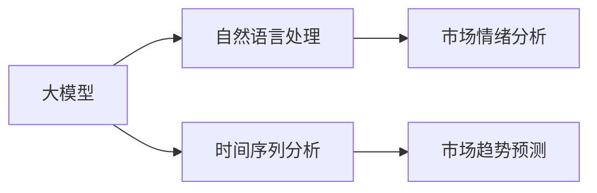

## 1. 背景介绍

### 1.1 财经分析的挑战

在瞬息万变的金融市场中，准确预测市场趋势一直是投资者和金融机构梦寐以求的目标。传统的分析方法，例如基本面分析和技术分析，往往受限于数据量、分析维度以及人为偏差等因素，难以捕捉市场复杂的动态变化。

### 1.2 AI赋能财经分析

近年来，人工智能（AI）技术，特别是大模型的出现，为财经分析带来了革命性的变化。大模型，例如GPT-3，LaMDA等，拥有强大的文本理解、生成和推理能力，能够从海量数据中学习市场规律，并进行高精度预测。

### 1.3 大模型预测市场趋势的优势

* **海量数据处理:** 大模型能够处理海量金融数据，包括新闻资讯、公司财报、社交媒体信息等，从中提取有价值的信息。
* **多维度分析:** 大模型可以同时考虑多个因素，例如宏观经济指标、行业发展趋势、公司经营状况等，进行综合分析。
* **实时预测:** 大模型能够实时跟踪市场动态，并根据最新信息进行预测调整，提高预测的时效性。
* **降低人为偏差:** 大模型的预测基于数据和算法，可以有效降低人为偏差，提高预测的客观性。

## 2. 核心概念与联系

### 2.1 大模型

大模型是指参数量巨大，训练数据规模庞大的深度学习模型。其核心是通过学习海量数据，建立数据与目标之间的复杂映射关系，从而实现对未知数据的预测。

### 2.2 自然语言处理（NLP）

自然语言处理是人工智能的一个重要分支，其目标是让计算机理解和处理人类语言。在财经分析中，NLP技术可以用于分析新闻资讯、社交媒体信息等文本数据，提取市场情绪、风险事件等关键信息。

### 2.3 时间序列分析

时间序列分析是研究数据随时间变化规律的统计学方法。在财经分析中，时间序列分析可以用于分析股票价格、交易量等金融数据，预测市场未来走势。

### 2.4 核心概念联系图



## 3. 核心算法原理具体操作步骤

### 3.1 数据收集和预处理

* **数据来源:** 财经新闻网站、金融数据库、社交媒体平台等
* **数据清洗:** 去除噪声数据、处理缺失值、数据标准化等

### 3.2 特征工程

* **文本特征:** 使用NLP技术提取文本数据中的关键词、情感倾向等信息
* **时间序列特征:** 使用统计学方法提取时间序列数据中的趋势、周期性等信息
* **其他特征:** 整合宏观经济指标、行业数据等

### 3.3 模型训练

* **选择合适的模型:** 根据数据特点和预测目标选择合适的模型，例如RNN、LSTM、Transformer等
* **模型调参:** 通过调整模型参数，优化模型性能

### 3.4 模型评估和预测

* **评估指标:** 使用RMSE、MAE等指标评估模型预测精度
* **市场趋势预测:** 使用训练好的模型对未来市场走势进行预测

## 4. 数学模型和公式详细讲解举例说明

### 4.1 LSTM模型

LSTM（长短期记忆网络）是一种特殊的循环神经网络，能够有效处理时间序列数据。其核心是通过门控机制，控制信息的流动，从而记住长期依赖关系。

**LSTM模型公式:**

* 遗忘门: $f_t = \sigma(W_f \cdot [h_{t-1}, x_t] + b_f)$
* 输入门: $i_t = \sigma(W_i \cdot [h_{t-1}, x_t] + b_i)$
* 候选记忆单元: $\tilde{C}_t = tanh(W_C \cdot [h_{t-1}, x_t] + b_C)$
* 记忆单元: $C_t = f_t * C_{t-1} + i_t * \tilde{C}_t$
* 输出门: $o_t = \sigma(W_o \cdot [h_{t-1}, x_t] + b_o)$
* 隐藏状态: $h_t = o_t * tanh(C_t)$

其中:

* $x_t$ 表示t时刻的输入
* $h_t$ 表示t时刻的隐藏状态
* $C_t$ 表示t时刻的记忆单元
* $\sigma$ 表示sigmoid函数
* $tanh$ 表示tanh函数
* $W$ 和 $b$ 分别表示权重矩阵和偏置向量

**举例说明:**

假设我们要预测某只股票未来一周的收盘价，可以使用LSTM模型。输入数据为过去一个月该股票的每日收盘价，输出数据为未来一周的每日收盘价。通过训练LSTM模型，学习股票价格的历史变化规律，从而预测未来价格走势。

## 5. 项目实践：代码实例和详细解释说明

### 5.1 Python代码示例

```python
import pandas as pd
from sklearn.preprocessing import MinMaxScaler
from keras.models import Sequential
from keras.layers import LSTM, Dense

# 加载数据
data = pd.read_csv('stock_data.csv')

# 数据预处理
data['Date'] = pd.to_datetime(data['Date'])
data = data.set_index('Date')
data = data['Close'].values.reshape(-1, 1)
scaler = MinMaxScaler(feature_range=(0, 1))
data = scaler.fit_transform(data)

# 划分训练集和测试集
train_size = int(len(data) * 0.8)
train, test = data[0:train_size,:], data[train_size:len(data),:]

# 创建训练集和测试集的输入输出数据
def create_dataset(dataset, look_back=1):
    X, Y = [], []
    for i in range(len(dataset)-look_back-1):
        a = dataset[i:(i+look_back), 0]
        X.append(a)
        Y.append(dataset[i + look_back, 0])
    return np.array(X), np.array(Y)

look_back = 10
trainX, trainY = create_dataset(train, look_back)
testX, testY = create_dataset(test, look_back)

# 构建LSTM模型
model = Sequential()
model.add(LSTM(units=50, return_sequences=True, input_shape=(trainX.shape[1], 1)))
model.add(LSTM(units=50))
model.add(Dense(1))

# 编译模型
model.compile(loss='mean_squared_error', optimizer='adam')

# 训练模型
model.fit(trainX, trainY, epochs=100, batch_size=32)

# 预测
trainPredict = model.predict(trainX)
testPredict = model.predict(testX)

# 反归一化
trainPredict = scaler.inverse_transform(trainPredict)
trainY = scaler.inverse_transform([trainY])
testPredict = scaler.inverse_transform(testPredict)
testY = scaler.inverse_transform([testY])

# 评估模型
from sklearn.metrics import mean_squared_error
trainScore = math.sqrt(mean_squared_error(train