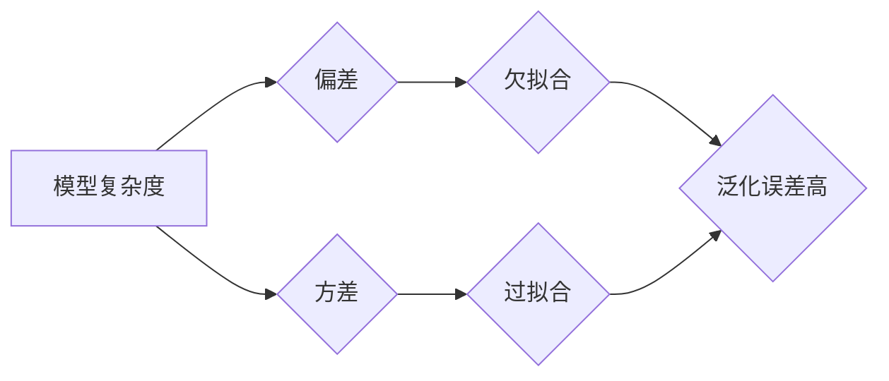

## 1. 背景介绍

### 1.1 机器学习的核心目标

机器学习的核心目标是构建能够从数据中学习并对新数据进行预测的模型。模型的性能取决于其泛化能力，即其将学习到的知识应用于未见数据的能力。

### 1.2 泛化能力的挑战：过拟合与欠拟合

在模型训练过程中，我们常常会遇到两种主要的泛化能力挑战：过拟合（overfitting）和欠拟合（underfitting）。

*   **过拟合**：模型过度地学习训练数据中的细节和噪声，导致其在未见数据上的表现较差。
*   **欠拟合**：模型未能充分捕捉训练数据中的潜在模式，导致其在训练数据和未见数据上的表现都不佳。

### 1.3 本文的意义

本文旨在深入探讨过拟合和欠拟合问题，分析其产生的原因、表现形式，并介绍一系列解决方法，帮助读者更好地理解和应对模型训练中的这两大挑战。

## 2. 核心概念与联系

### 2.1 偏差-方差权衡

理解过拟合和欠拟合的关键在于偏差-方差权衡（bias-variance tradeoff）。

*   **偏差**：指模型预测值与真实值之间的平均差异，反映模型的准确性。
*   **方差**：指模型预测值在不同训练数据集上的波动程度，反映模型的稳定性。

### 2.2 过拟合、欠拟合与偏差-方差的关系

*   **高偏差**：模型过于简单，无法捕捉数据中的复杂模式，导致欠拟合。
*   **高方差**：模型过于复杂，过度拟合训练数据中的噪声，导致过拟合。

### 2.3 泛化误差

泛化误差（generalization error）是模型在未见数据上的预测误差，是衡量模型泛化能力的关键指标。理想情况下，我们希望模型的泛化误差尽可能小。

## 3. 核心算法原理具体操作步骤

### 3.1 识别过拟合和欠拟合

#### 3.1.1 训练误差与验证误差

判断模型是否过拟合或欠拟合的一个重要指标是训练误差和验证误差之间的差异。

*   **训练误差**：模型在训练数据上的预测误差。
*   **验证误差**：模型在验证数据上的预测误差。验证数据是从未参与训练的数据集，用于评估模型的泛化能力。

如果训练误差很低，但验证误差很高，则表明模型可能过拟合了训练数据。如果训练误差和验证误差都很高，则表明模型可能欠拟合了训练数据。

#### 3.1.2 学习曲线

学习曲线可以直观地展示模型在不同训练数据量下的性能变化，帮助我们识别过拟合和欠拟合。

*   **过拟合**：学习曲线显示，随着训练数据量的增加，训练误差持续降低，但验证误差先降低后升高。
*   **欠拟合**：学习曲线显示，训练误差和验证误差都较高，且随着训练数据量的增加，两者都没有显著降低。

### 3.2 解决过拟合

#### 3.2.1 正则化

正则化（regularization）是一种通过向模型添加惩罚项来限制模型复杂度的技术。常用的正则化方法包括：

*   **L1 正则化**：将模型参数的绝对值之和添加到损失函数中。
*   **L2 正则化**：将模型参数的平方和添加到损失函数中。

#### 3.2.2 数据增强

数据增强（data augmentation）是一种通过对训练数据进行变换来增加数据量和多样性的技术。常用的数据增强方法包括：

*   **图像旋转、缩放、翻转**
*   **添加噪声**
*   **颜色变换**

#### 3.2.3 Dropout

Dropout 是一种在训练过程中随机丢弃神经网络中的一些神经元的技术。Dropout 可以减少神经元之间的相互依赖，从而降低模型的复杂度。

### 3.3 解决欠拟合

#### 3.3.1 增加模型复杂度

如果模型欠拟合，可以尝试增加模型的复杂度。例如，对于神经网络，可以增加网络层数或神经元数量。

#### 3.3.2 特征工程

特征工程（feature engineering）是指从原始数据中提取或构建新的特征，以提高模型性能。

#### 3.3.3 获取更多数据

如果数据量不足，模型可能无法充分学习数据中的潜在模式。在这种情况下，获取更多数据可以帮助解决欠拟合问题。

## 4. 数学模型和公式详细讲解举例说明

### 4.1 损失函数

损失函数（loss function）用于衡量模型预测值与真实值之间的差异。常见的损失函数包括：

*   **均方误差（MSE）**：
    $$
    MSE = \frac{1}{n} \sum_{i=1}^{n} (y_i - \hat{y}_i)^2
    $$
    其中，$y_i$ 是真实值，$\hat{y}_i$ 是模型预测值，$n$ 是样本数量。

*   **交叉熵（Cross-entropy）**：
    $$
    Cross-entropy = -\frac{1}{n} \sum_{i=1}^{n} [y_i \log(\hat{y}_i) + (1-y_i) \log(1-\hat{y}_i)]
    $$
    其中，$y_i$ 是真实值，$\hat{y}_i$ 是模型预测值，$n$ 是样本数量。

### 4.2 正则化

L1 正则化将模型参数的绝对值之和添加到损失函数中：

$$
L = L_0 + \lambda \sum_{i=1}^{m} |w_i|
$$

其中，$L_0$ 是原始损失函数，$\lambda$ 是正则化系数，$w_i$ 是模型参数。

L2 正则化将模型参数的平方和添加到损失函数中：

$$
L = L_0 + \lambda \sum_{i=1}^{m} w_i^2
$$

其中，$L_0$ 是原始损失函数，$\lambda$ 是正则化系数，$w_i$ 是模型参数。

## 5. 项目实践：代码实例和详细解释说明

### 5.1 Python 代码示例

```python
import numpy as np
from sklearn.linear_model import LinearRegression
from sklearn.model_selection import train_test_split
from sklearn.metrics import mean_squared_error

# 生成随机数据
X = np.random.rand(100, 1)
y = 2 * X + 1 + np.random.randn(100, 1)

# 划分训练集和测试集
X_train, X_test, y_train, y_test = train_test_split(X, y, test_size=0.2)

# 创建线性回归模型
model = LinearRegression()

# 训练模型
model.fit(X_train, y_train)

# 预测测试集
y_pred = model.predict(X_test)

# 计算均方误差
mse = mean_squared_error(y_test, y_pred)

print("均方误差：", mse)
```

### 5.2 代码解释

*   首先，我们使用 `numpy` 生成随机数据。
*   然后，我们使用 `sklearn.model_selection.train_test_split` 函数将数据划分为训练集和测试集。
*   接下来，我们创建了一个线性回归模型，并使用训练数据训练模型。
*   训练完成后，我们使用测试数据评估模型的性能，并计算均方误差。

## 6. 实际应用场景

过拟合和欠拟合问题在各种机器学习应用中都普遍存在，例如：

*   **计算机视觉**：图像分类、目标检测、图像分割
*   **自然语言处理**：文本分类、情感分析、机器翻译
*   **推荐系统**：个性化推荐、商品推荐

## 7. 工具和资源推荐

*   **Scikit-learn**：Python 机器学习库，提供了各种模型和工具，用于解决过拟合和欠拟合问题。
*   **TensorFlow**：开源机器学习平台，提供了强大的工具，用于构建和训练复杂模型。
*   **PyTorch**：开源机器学习库，提供了灵活的接口，用于构建和训练各种模型。

## 8. 总结：未来发展趋势与挑战

随着机器学习技术的不断发展，过拟合和欠拟合问题将继续存在，并带来新的挑战。未来发展趋势包括：

*   **更复杂的模型**：深度学习模型的复杂度不断增加，更容易过拟合。
*   **更少的数据**：在某些应用场景中，数据量有限，容易导致欠拟合。
*   **更强的解释性**：人们越来越关注模型的可解释性，需要开发新的方法来解释过拟合和欠拟合问题。

## 9. 附录：常见问题与解答

### 9.1 如何选择正则化系数？

正则化系数的选择取决于具体问题和数据集。通常，可以使用交叉验证来选择最佳正则化系数。

### 9.2 如何判断模型是否过拟合？

可以通过观察训练误差和验证误差之间的差异，以及学习曲线来判断模型是否过拟合。

### 9.3 如何解决数据不平衡问题？

数据不平衡问题是指某些类别的数据量远大于其他类别。解决数据不平衡问题的方法包括：

*   **过采样**：增加少数类别的数据量。
*   **欠采样**：减少多数类别的数据量。
*   **代价敏感学习**：为不同类别分配不同的误分类成本。


## 10. 过拟合和欠拟合关系图



**图解：**

模型复杂度会影响模型的偏差和方差。模型复杂度越高，偏差越低，但方差越高，容易导致过拟合；模型复杂度越低，偏差越高，但方差越低，容易导致欠拟合。过拟合和欠拟合都会导致模型的泛化误差高。 
