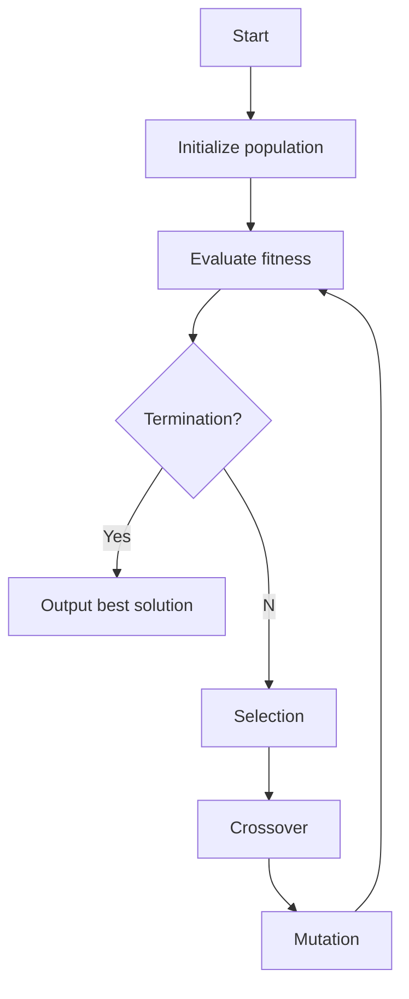

# 遗传算法代码实例：背包问题

## 1.背景介绍

### 1.1 什么是背包问题？

背包问题是一种经典的组合优化问题。它可以描述为：给定一个背包,它所能承载的重量是有限制的,现在有许多物品,每个物品都有自身的重量和价值,要求挑选出一些物品放入背包,使得背包中物品的总重量不超过背包的最大承重量,同时物品的总价值最大化。

背包问题在现实生活中有着广泛的应用,例如:

- 旅行时选择携带的物品
- 运输公司规划运输路线时装载货物
- 项目管理时分配资源
- 投资组合优化
- 码流压缩

### 1.2 背包问题的分类

根据物品是否可以分割,背包问题可分为两类:

1. **0-1背包问题**: 每种物品要么完全放入,要么完全不放,不允许拆分。
2. **分数背包问题**: 可以将物品拆分成任意小数分数,只要总重量不超过背包最大承重量即可。

根据物品的种类数量,又可分为:

1. **单个背包问题**
2. **多个背包问题**

本文主要讨论0-1单个背包问题。

## 2.核心概念与联系

### 2.1 0-1背包问题的数学模型

假设有 $n$ 种物品和一个最大承重为 $W$ 的背包,用 $w_i$ 表示第 $i$ 个物品的重量,用 $v_i$ 表示第 $i$ 个物品的价值,现在要求选择若干个物品放入背包,使得背包中物品的总重量不超过 $W$,且总价值最大。令 $x_i$ 为决策变量,若第 $i$ 个物品被选中,则 $x_i=1$,否则 $x_i=0$。那么,0-1背包问题可以表示为:

$$
\begin{aligned}
\max \quad & \sum_{i=1}^{n}v_ix_i\\
\text{s.t.}\quad & \sum_{i=1}^{n}w_ix_i \leq W\\
& x_i \in \{0,1\}, \quad i=1,2,\ldots,n
\end{aligned}
$$

这是一个整数线性规划问题,属于 NP 完全问题,当问题规模较大时,使用精确算法求解非常困难。

### 2.2 基于贪心算法和动态规划的传统求解方法

对于背包问题,最直观的想法是使用贪心算法,即按照单位重量价值比从高到低的顺序,尽可能多地装入价值高的物品。但这种方法在大多数情况下并不能得到最优解。

另一种常用的方法是动态规划算法。定义状态 $f(i,j)$ 表示前 $i$ 个物品,当背包重量限制为 $j$ 时,能够获得的最大价值。则可以写出如下状态转移方程:

$$
f(i,j)=\max\left\{f(i-1,j),f(i-1,j-w_i)+v_i\right\}
$$

通过填表计算所有状态值,最终 $f(n,W)$ 即为最优解。该算法的时间复杂度为 $O(nW)$,空间复杂度为 $O(nW)$。对于规模较大的问题,动态规划算法的效率也较低。

### 2.3 遗传算法的思想

遗传算法(Genetic Algorithm,GA)是一种借鉴生物进化过程的优化算法。它通过模拟生物的遗传、变异、交叉和选择等过程,在解空间中进行高效的搜索,最终获得近似最优解。

遗传算法的基本思路如下:

1. 首先对问题的解空间进行编码,生成一个初始种群。
2. 通过设计合适的适应度函数,评估每个个体的优劣程度。
3. 根据个体的适应度值,选择优秀的个体进行交叉和变异操作,产生新的种群。
4. 重复步骤2和3,直至满足终止条件(如达到预期的最优解或进化代数)。

遗传算法具有全局寻优、鲁棒性强、易于实现等优点,在求解NP难题时表现出良好的性能,因此非常适合求解背包问题。

## 3.核心算法原理具体操作步骤

### 3.1 编码方式

首先需要将问题的解空间进行编码,生成初始种群。对于0-1背包问题,通常采用二进制编码方式。

假设有 $n$ 种物品,则一个个体可以用长度为 $n$ 的二进制串表示,其中第 $i$ 位的0或1表示第 $i$ 个物品是否被选中装入背包。例如,对于5个物品的背包问题,`10011`表示选择了第1、第4和第5个物品。

初始种群可以通过随机生成一定数量的二进制串来构造。

### 3.2 适应度函数设计

适应度函数用于评估个体的优劣程度,是遗传算法的核心部分。对于背包问题,适应度函数可以定义为背包中物品的总价值,即:

$$
f(x)=\sum_{i=1}^{n}v_ix_i
$$

其中 $x=(x_1,x_2,\ldots,x_n)$ 表示一个个体的编码串。

但是,这种定义存在一个问题:如果某个个体对应的物品总重量超过了背包的最大承重量,则它是一个不可行解,但仍然可能被选中进行交叉和变异操作,这将导致算法无法收敛。

为了解决这个问题,我们可以对不可行解进行适当的惩罚,使其适应度值降低。具体做法是,对于不可行解,令其适应度值为一个很小的常数 $C$。修改后的适应度函数为:

$$
f(x)=\begin{cases}
\sum_{i=1}^{n}v_ix_i, & \text{if }\sum_{i=1}^{n}w_ix_i\leq W\\
C, & \text{if }\sum_{i=1}^{n}w_ix_i>W
\end{cases}
$$

其中 $C$ 可取一个很小的正数,如0.0001。这样,不可行解在选择过程中就很难被选中,有利于算法收敛。

### 3.3 选择操作

根据个体的适应度值,从当前种群中选择若干个体,作为下一代种群的父代。常用的选择方法有:

1. **轮盘赌选择(Roulette Wheel Selection)**: 将每个个体被选中的概率设置为其适应度值占总适应度值的比例。
2. **锦标赛选择(Tournament Selection)**: 随机选择若干个个体,将其中适应度最高的个体选为父代。
3. **排名选择(Ranking Selection)**: 先对个体按适应度值从高到低排序,然后根据排名顺序,被选中的概率逐渐降低。

本文采用锦标赛选择方法,具体做法是:每次随机选择 $k$ 个个体(通常 $k$ 取2或3),将其中适应度最高的个体选为父代,重复该过程直至选出足够数量的父代。

### 3.4 交叉操作

选择出父代后,对它们进行交叉操作产生新的个体。常用的交叉方法有:

1. **单点交叉**: 在两个父代的编码串中随机选择一个位置作为交叉点,将两个编码串的后半部分进行交换,生成两个新的子代。
2. **多点交叉**: 在两个父代的编码串中随机选择多个位置作为交叉点,将编码串按交叉点进行分段,并交换相应的段,生成两个新的子代。
3. **均匀交叉**: 对两个父代的每一个基因位,随机决定从哪一个父代继承该位的基因。

本文采用单点交叉方式,具体做法是:随机选取两个父代,在它们的编码串中随机选一个位置作为交叉点,将两个编码串的后半部分进行交换,生成两个新的子代。

### 3.5 变异操作

为了增加种群的多样性,防止过早收敛,还需要对个体进行变异操作。常用的变异方法有:

1. **基因突变**: 随机选择一个或多个基因位,将其值取反(0变1,1变0)。
2. **编码串突变**: 随机生成一个新的编码串,替换原有的编码串。

本文采用基因突变方式,具体做法是:以一定的小概率(通常为0.01~0.1),随机选择一些个体,再在这些个体的编码串中随机选择一些位置,将这些位置上的基因取反。

### 3.6 终止条件

在每一代进行选择、交叉和变异操作后,需要判断是否已经满足终止条件。常用的终止条件有:

1. **进化代数**: 当进化的代数达到预先设定的最大代数时,终止算法。
2. **目标值**: 当最优个体的适应度值达到预先设定的目标值时,终止算法。
3. **无更新代数**: 如果经过多代仍无更新,则认为已经收敛,终止算法。

本文采用无更新代数作为终止条件,即如果连续 $maxstall$ 代最优适应度值无变化,则终止算法。

### 3.7 算法流程图

下面使用 Mermaid 给出遗传算法求解0-1背包问题的流程图:

其中,Initialize population表示初始化种群;Evaluate fitness表示计算个体适应度值;Selection表示选择操作;Crossover表示交叉操作;Mutation表示变异操作。

## 4.数学模型和公式详细讲解举例说明

在第2.1节中,我们给出了0-1背包问题的数学模型:

$$
\begin{aligned}
\max \quad & \sum_{i=1}^{n}v_ix_i\\
\text{s.t.}\quad & \sum_{i=1}^{n}w_ix_i \leq W\\
& x_i \in \{0,1\}, \quad i=1,2,\ldots,n
\end{aligned}
$$

其中:

- $n$ 表示物品的种类数量
- $W$ 表示背包的最大承重量
- $w_i$ 表示第 $i$ 个物品的重量
- $v_i$ 表示第 $i$ 个物品的价值
- $x_i$ 为决策变量,若第 $i$ 个物品被选中,则 $x_i=1$,否则 $x_i=0$

目标函数 $\max \sum_{i=1}^{n}v_ix_i$ 表示要最大化背包中物品的总价值。

约束条件 $\sum_{i=1}^{n}w_ix_i \leq W$ 表示背包中物品的总重量不能超过背包的最大承重量。

$x_i \in \{0,1\}$ 表示每个物品要么完全装入背包,要么完全不装入,不允许拆分。

这是一个0-1整数线性规划问题,属于NP完全问题,当问题规模较大时,使用精确算法求解非常困难。我们可以使用遗传算法来求解这个问题。

### 4.1 适应度函数

在第3.2节中,我们给出了适应度函数的定义:

$$
f(x)=\begin{cases}
\sum_{i=1}^{n}v_ix_i, & \text{if }\sum_{i=1}^{n}w_ix_i\leq W\\
C, & \text{if }\sum_{i=1}^{n}w_ix_i>W
\end{cases}
$$

其中 $C$ 是一个很小的正常数,如0.0001。

这个适应度函数的含义是:如果一个个体对应的物品总重量不超过背包的最大承重量,则它的适应度值就是背包中物品的总价值;否则,它的适应度值就是一个很小的常数 $C$。

通过这种方式,不可行解在选择操作中几乎不会被选中,从而有利于算法收敛。

### 4.2 举例说明

假设有如下4种物品和一个最大承重量为10的背包:

| 物品编号 | 重量 | 价值 |
|----------|------|------|
| 1        | 5    | 8    |
| 2        | 3    | 6    |
| 3        | 4    | 7    |  