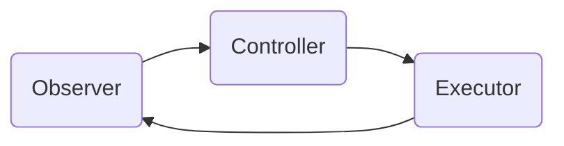

# 遥感数据处理的AI代理工作流技术

作者：禅与计算机程序设计艺术

## 1. 背景介绍

### 1.1 遥感数据处理的重要性

遥感技术已广泛应用于地球观测、环境监测、资源勘查等领域。随着遥感卫星数量的增加和传感器性能的提升,遥感数据呈现出数据量大、类型多、时效性强等特点。高效准确地处理海量遥感数据成为目前遥感应用中亟待解决的关键问题。

### 1.2 人工智能在遥感领域的应用现状

近年来,人工智能技术在计算机视觉、自然语言处理等领域取得了突破性进展。将人工智能技术引入遥感数据处理,可以极大提高数据分析效率和精度。目前,深度学习、迁移学习、主动学习等人工智能技术已经在遥感图像分类、变化检测、目标提取等任务中得到应用,取得了优于传统方法的效果。

### 1.3 AI代理工作流的提出

尽管人工智能技术在遥感领域展现出巨大潜力,但目前大多数研究局限于单一任务和算法。遥感数据处理通常需要经过预处理、特征提取、分类、后处理等多个步骤,涉及多种异构数据和算法。如何将人工智能无缝集成到遥感数据处理流程中,实现端到端的全流程自动化分析是一个亟待解决的问题。本文提出了一种基于AI代理的工作流技术,通过引入智能代理机制,实现遥感数据处理流程的自动化和智能化。

## 2. 核心概念与联系

### 2.1 AI代理的定义与特点

AI代理是一种智能化的软件实体,能够感知环境状态,根据知识和目标自主做出决策并执行任务。与传统软件不同,AI代理具有自主性、社会性、反应性、主动性等特点。在本文提出的技术框架中,每个数据处理步骤均由一个AI代理负责实现和优化。

### 2.2 工作流的定义与组成

工作流是对业务流程的计算机建模与自动化执行。一个典型的工作流由一系列任务节点和控制流程组成,通过任务间的数据流动与控制依赖,协同完成复杂业务逻辑。本文采用有向无环图(DAG)对遥感数据处理流程进行建模,节点表示数据处理任务,边表示任务间的依赖关系。

### 2.3 AI代理与工作流的结合

本文的核心创新在于将AI代理引入工作流系统。传统工作流任务节点通常由确定性算法实现,缺乏智能性和自适应性。引入AI代理后,工作流节点变成了具有感知、决策、学习能力的智能体,可根据数据特点和质量目标动态调整算法参数,不断优化性能。此外,代理间可以通过协商机制协同完成端到端的全局优化。

## 3. 核心算法原理与操作步骤

### 3.1 AI代理的内部结构

每个AI代理采用Observer-Controller-Executor (OCE)架构:

- Observer负责感知任务输入数据的特征(如数据量、噪声水平、空间分辨率等),并评估当前处理质量;
- Controller是代理的决策中枢,根据Observer提供的环境信息,结合知识库和学习模块,决定Executor的具体行为(如选择算法、调整参数等); 
- Executor负责算法的具体执行。



### 3.2 工作流的构建与执行

1. 根据遥感数据处理的业务需求,确定端到端的数据处理流程;
2. 将流程划分为若干个数据处理任务,构建DAG工作流;
3. 为每个任务节点设计和训练相应的AI代理;
4. 将训练好的AI代理部署到工作流系统中,启动工作流执行;
5. 在工作流执行过程中,每个AI代理自主感知、决策、执行,并与其他代理协同优化;
6. 评估端到端的数据处理效果,并将结果反馈给AI代理,持续改进模型。

### 3.3 AI代理的训练与优化

AI代理的核心在于Controller的决策算法。本文采用强化学习范式训练Controller:

1. 定义状态空间S、动作空间A和奖励函数R。以图像分类任务为例,状态可以是图像的各种统计特征,动作可以是分类器的选择和超参数,奖励可以是分类精度。
2. 初始化Controller的策略网络参数θ,通过与环境的交互产生轨迹数据$(s_t,a_t,r_t,s_{t+1})$。
3. 基于采样轨迹,估计动作值函数$Q^\pi(s,a)$,并通过策略梯度等算法更新策略网络参数:

$$\nabla_\theta J(\theta) = E_{s\sim\rho^\pi,a\sim\pi_\theta}[\nabla_\theta \log \pi_\theta(a|s)Q^\pi(s,a)]$$

4. 重复步骤2-3,直到策略网络收敛。

## 4. 数学模型与公式推导

本节以遥感图像分类任务为例,推导AI代理的数学模型。

### 4.1 马尔可夫决策过程

强化学习问题可以用马尔可夫决策过程(MDP)进行建模。一个MDP由状态空间S、动作空间A、转移概率P、奖励函数R和折扣因子γ组成。Agent与环境交互,在每个时间步t,Agent根据当前状态$s_t\in S$采取动作$a_t\in A$,环境根据转移概率$p(s_{t+1}|s_t,a_t)$转移到下一状态$s_{t+1}$,并反馈奖励$r_t=R(s_t,a_t)$。Agent的目标是学习一个策略$\pi:S\rightarrow A$,使得期望累积奖励最大化:

$$\max_\pi E[\sum_{t=0}^\infty \gamma^t r_t | \pi]$$

### 4.2 策略梯度定理

定义性能指标函数$J(\theta)$为:

$$J(\theta)=V^{\pi_\theta}(s_0)=E_{\tau\sim\pi_\theta}[R(\tau)]$$

其中$\tau=(s_0,a_0,r_0,...,s_T,a_T,r_T)$为一条轨迹,$R(\tau)=\sum_{t=0}^T \gamma^t r_t$为轨迹的累积奖励。使用策略梯度定理可以证明:

$$\nabla_\theta J(\theta) = E_{\tau\sim\pi_\theta}[\sum_{t=0}^T \nabla_\theta \log \pi_\theta(a_t|s_t)R(\tau)]$$

实际应用中,可以通过蒙特卡洛方法估计梯度:

$$\nabla_\theta J(\theta) \approx \frac{1}{N} \sum_{i=1}^N \sum_{t=0}^T \nabla_\theta \log \pi_\theta(a_{i,t}|s_{i,t})R(\tau_i)$$

其中$\tau_i$为第$i$条采样轨迹。

### 4.3 Actor-Critic算法

策略梯度算法的一个问题是方差较大。Actor-Critic算法引入值函数近似$V^{\pi_\theta}(s)$来降低梯度估计的方差:

$$\nabla_\theta J(\theta) = E_{\tau\sim\pi_\theta}[\sum_{t=0}^T \nabla_\theta \log \pi_\theta(a_t|s_t)(R(\tau)-V^{\pi_\theta}(s_t))]$$

其中$R(\tau)-V^{\pi_\theta}(s_t)$为优势函数(Advantage Function),表示当前动作相对于平均表现的优劣。在实现时,Actor网络$\pi_\theta$用于生成动作,Critic网络$V^{\pi_\theta}$用于估计状态值,两个网络交替训练,共同优化策略。

## 5. 项目实践

本节介绍如何使用Python和TensorFlow 2实现一个简单的AI代理,用于遥感图像分类任务。

### 5.1 环境构建

首先构建一个图像分类环境,状态为图像像素,动作为分类器选择和超参数,奖励为分类精度:

```python
class ImageClassificationEnv(gym.Env):
    def __init__(self):
        self.classifier_pool = [SVM(), RandomForest(), MLP()]
        self.action_space = spaces.Discrete(len(self.classifier_pool))
        self.observation_space = spaces.Box(low=0, high=255, 
                                            shape=(64,64,3), dtype=np.uint8)
        
    def reset(self):
        image, label = random_sample(dataset)
        return image
        
    def step(self, action):
        classifier = self.classifier_pool[action]
        pred = classifier.predict(self.image)
        reward = accuracy(pred, self.label) 
        done = True
        return self.image, reward, done, {}
```

### 5.2 AI代理实现

使用Actor-Critic算法训练AI代理,Actor和Critic网络均使用MLP实现:

```python
class Actor(tf.keras.Model):
    def __init__(self):
        super().__init__()
        self.fc1 = layers.Dense(128, activation='relu')
        self.fc2 = layers.Dense(64, activation='relu')  
        self.fc3 = layers.Dense(num_actions, activation='softmax')

    def call(self, x):
        x = self.fc1(x)
        x = self.fc2(x)
        x = self.fc3(x)
        return x

class Critic(tf.keras.Model):
    def __init__(self):
        super().__init__()
        self.fc1 = layers.Dense(128, activation='relu')
        self.fc2 = layers.Dense(64, activation='relu')
        self.fc3 = layers.Dense(1)

    def call(self, x):
        x = self.fc1(x)
        x = self.fc2(x)
        x = self.fc3(x)
        return x
```

### 5.3 训练流程

```python
actor = Actor()
critic = Critic() 
env = ImageClassificationEnv()

for episode in range(num_episodes):
    state = env.reset()
    done = False
    while not done:
        probs = actor(state)
        action = np.random.choice(num_actions, p=probs.numpy()[0])
        next_state, reward, done, _ = env.step(action)
        
        value = critic(state)
        next_value = critic(next_state)
        advantage = reward + (1-done) * gamma * next_value - value
        
        actor_loss = -tf.math.log(probs[0,action]) * advantage
        critic_loss = advantage ** 2
        
        actor_grad = tape.gradient(actor_loss, actor.variables)
        critic_grad = tape.gradient(critic_loss, critic.variables)
        
        actor_optimizer.apply_gradients(zip(actor_grad, actor.variables))
        critic_optimizer.apply_gradients(zip(critic_grad, critic.variables))
        
        state = next_state
```

## 6. 应用场景

本文提出的AI代理工作流技术可应用于以下遥感数据处理场景:

1. 遥感图像分类:针对不同传感器、不同区域、不同时相的遥感图像,自动选择和优化分类算法,实现土地利用/土地覆盖分类、变化检测等任务。

2. 目标检测与提取:自动选择和优化目标检测算法,实现道路、建筑物、车辆等地物要素的自动化提取。

3. 遥感影像匹配与配准:自动选择和优化影像匹配算法,实现不同传感器、不同时相遥感影像的自动配准。

4. 遥感数据融合:自动选择和优化多源遥感数据融合算法,实现光学、雷达、高光谱等异源数据的融合。

5. 遥感数据产品生产:将AI代理工作流集成到遥感数据地面处理系统,实现从原始数据到高级别产品的自动化生产。

## 7. 工具和资源

1. GeoAI: 地理人工智能开源工具箱,支持遥感图像分类、变化检测、地物要素提取等任务。
2. Raster Vision: 基于深度学习的遥感影像分析开源框架,支持多种数据类型和任务。
3. eo-learn: 基于Python的地球观测数据处理开源库,提供了数据获取、预处理、分析等工具。
4. GDAL: 地理空间数据抽象库,支持多种栅格和矢量数据格式的读写和处理。
5. OpenCV: 开源计算机视觉库,提供了大量图像处理和分析算法。
6. TensorFlow: 谷歌开源的端到端机器学习平台,支持多种神经网络模型的构建和训练。
7. PyTorch: Facebook开