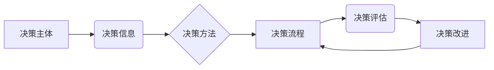

##  "重建公司决策体系：一个系统化的方法"

作者：禅与计算机程序设计艺术

## 1. 背景介绍

### 1.1 决策体系的现状与挑战

在当今快速变化的商业环境中，企业面临着前所未有的挑战。市场波动、技术颠覆、客户需求变化等等，都要求企业能够快速做出明智的决策。然而，许多公司现有的决策体系却难以应对这些挑战。 

传统的决策体系往往存在以下问题：

* **信息孤岛:** 各部门之间信息流通不畅，导致决策缺乏全局视野。
* **层级僵化:**  决策流程冗长，审批环节繁琐，导致决策效率低下。
* **缺乏数据支持:** 决策主要依靠经验和直觉，缺乏数据分析和科学评估。
* **执行力不足:**  决策执行不到位，难以有效落地。

这些问题严重制约了企业的创新能力和市场竞争力。因此，重建公司决策体系，构建一个高效、灵活、数据驱动的决策机制，成为了企业发展迫在眉睫的任务。

### 1.2 系统化方法的必要性

为了有效解决上述问题，我们需要采用系统化的方法来重建公司决策体系。系统化方法强调从整体出发，分析问题、制定方案、实施方案、评估效果，并不断优化改进。

具体来说，系统化方法包括以下几个关键步骤：

* **明确目标和原则:**  首先要明确决策体系的目标，例如提高决策效率、提升决策质量、增强决策的科学性和数据驱动性等。同时，还要制定相应的决策原则，例如数据驱动、透明公开、责任到人等。
* **分析现状，识别问题:**  对公司现有的决策体系进行全面分析，识别存在的问题和不足。
* **设计新的决策流程:**  根据目标和原则，设计新的决策流程，明确各个环节的职责、权限和流程。
* **建立数据分析平台:**  构建数据分析平台，为决策提供数据支持。
* **优化组织架构:**  根据新的决策流程，调整组织架构，确保决策的有效执行。
* **持续改进:**  定期评估决策体系的运行效果，并不断优化改进。

通过系统化的方法，可以有效解决传统决策体系存在的问题，构建一个高效、灵活、数据驱动的决策机制，从而提升企业的竞争力。

## 2. 核心概念与联系

### 2.1 决策体系的构成要素

一个完整的决策体系通常包括以下几个核心要素：

* **决策主体:**  指负责做出决策的个人或组织，例如公司 CEO、部门负责人、项目团队等。
* **决策信息:**  指决策所需的信息，包括市场数据、客户需求、竞争对手情报、内部运营数据等。
* **决策方法:**  指用于分析信息、制定方案的方法，例如 SWOT 分析、决策树、数据挖掘等。
* **决策流程:**  指决策的具体步骤和流程，例如信息收集、方案制定、方案评估、决策执行等。
* **决策评估:**  指对决策结果的评估，例如决策的有效性、效率、成本等。
* **决策改进:**  指根据评估结果，对决策体系进行优化改进。

### 2.2 核心概念之间的联系

这些核心要素之间相互联系，共同构成了一个完整的决策体系。

* **决策主体** 需要根据 **决策信息**，采用合适的 **决策方法**，按照 **决策流程** 做出决策。
* **决策流程** 规定了 **决策信息** 的获取方式、 **决策方法** 的应用时机以及 **决策主体** 的职责权限。
* **决策评估** 则是对整个 **决策体系** 运行效果的检验，为 **决策改进** 提供依据。

## 3. 核心算法原理具体操作步骤

### 3.1 数据驱动的决策方法

数据驱动的决策方法是指利用数据分析和挖掘技术，从海量数据中提取有价值的信息，为决策提供支持。

#### 3.1.1 数据收集与预处理

首先，需要收集与决策相关的数据，例如市场数据、客户数据、运营数据等。然后，对数据进行预处理，例如数据清洗、数据转换、数据降维等，以便于后续的分析和挖掘。

#### 3.1.2 数据分析与挖掘

利用统计分析、机器学习等方法，对数据进行分析和挖掘，例如：

* **描述性分析:**  对数据的基本特征进行统计描述，例如平均值、方差、分布等。
* **诊断性分析:**  分析数据变化的原因，例如销售额下降的原因、客户流失的原因等。
* **预测性分析:**  预测未来的趋势，例如市场需求预测、销售额预测等。
* **规范性分析:**  根据数据分析结果，制定最佳方案，例如产品定价策略、营销方案等。

#### 3.1.3 决策支持

根据数据分析和挖掘结果，为决策提供支持，例如：

* **提供决策依据:**  数据分析结果可以为决策提供客观依据，避免主观臆断。
* **识别潜在风险:**  数据分析可以识别潜在的风险，例如市场风险、运营风险等。
* **评估方案效果:**  数据分析可以评估不同方案的效果，选择最佳方案。

### 3.2 流程优化

#### 3.2.1 决策流程梳理

首先，需要对现有的决策流程进行梳理，明确各个环节的职责、权限和流程。

#### 3.2.2 问题识别

分析现有的决策流程，识别存在的问题，例如：

* **信息孤岛:**  各部门之间信息流通不畅，导致决策缺乏全局视野。
* **层级僵化:**  决策流程冗长，审批环节繁琐，导致决策效率低下。
* **缺乏数据支持:**  决策主要依靠经验和直觉，缺乏数据分析和科学评估。
* **执行力不足:**  决策执行不到位，难以有效落地。

#### 3.2.3 流程优化

根据问题识别结果，对决策流程进行优化，例如：

* **建立信息共享机制:**  打通各部门之间的数据壁垒，实现信息共享。
* **简化审批流程:**  减少审批环节，提高决策效率。
* **引入数据分析:**  在决策流程中引入数据分析，为决策提供数据支持。
* **加强执行力:**  明确责任人，加强监督和考核，确保决策的有效执行。

## 4. 数学模型和公式详细讲解举例说明

### 4.1 决策树模型

决策树模型是一种常用的分类和预测模型，它可以根据数据的特征，将数据划分到不同的类别中。

#### 4.1.1 模型原理

决策树模型的原理是：从根节点开始，根据数据的特征，将数据划分到不同的子节点中，直到所有子节点都属于同一类别为止。

#### 4.1.2 模型构建

决策树模型的构建过程包括以下步骤：

* **特征选择:**  选择用于划分数据的特征。
* **节点划分:**  根据选择的特征，将数据划分到不同的子节点中。
* **递归构建:**  对每个子节点，重复上述步骤，直到所有子节点都属于同一类别为止。

#### 4.1.3 模型评估

决策树模型的评估指标包括：

* **准确率:**  模型预测正确的样本数占总样本数的比例。
* **精确率:**  模型预测为正例的样本中，实际为正例的样本数占预测为正例的样本数的比例。
* **召回率:**  实际为正例的样本中，模型预测为正例的样本数占实际为正例的样本数的比例。
* **F1 值:**  精确率和召回率的调和平均值。

#### 4.1.4 应用举例

例如，我们可以利用决策树模型来预测客户是否会购买某款产品。我们可以收集客户的年龄、性别、收入、职业等特征数据，然后利用决策树模型进行训练。训练完成后，我们可以输入新客户的特征数据，模型就可以预测该客户是否会购买该产品。

### 4.2 线性回归模型

线性回归模型是一种常用的预测模型，它可以根据数据的特征，预测某个连续变量的值。

#### 4.2.1 模型原理

线性回归模型的原理是：假设目标变量与特征变量之间存在线性关系，然后利用最小二乘法求解模型参数。

#### 4.2.2 模型构建

线性回归模型的构建过程包括以下步骤：

* **数据准备:**  收集目标变量和特征变量的数据。
* **模型训练:**  利用最小二乘法求解模型参数。
* **模型评估:**  评估模型的预测精度。

#### 4.2.3 模型评估

线性回归模型的评估指标包括：

* **均方误差 (MSE):**  模型预测值与真实值之间差的平方的平均值。
* **均方根误差 (RMSE):**  MSE 的平方根。
* **决定系数 (R-squared):**  模型解释目标变量变异的比例。

#### 4.2.4 应用举例

例如，我们可以利用线性回归模型来预测公司的销售额。我们可以收集公司的广告支出、产品价格、市场份额等特征数据，然后利用线性回归模型进行训练。训练完成后，我们可以输入新的特征数据，模型就可以预测公司的销售额。

## 5. 项目实践：代码实例和详细解释说明

### 5.1 Python 代码实例

```python
import pandas as pd
from sklearn.tree import DecisionTreeClassifier
from sklearn.linear_model import LinearRegression
from sklearn.model_selection import train_test_split
from sklearn.metrics import accuracy_score, mean_squared_error

# 加载数据
data = pd.read_csv('data.csv')

# 划分特征变量和目标变量
X = data.drop('target', axis=1)
y = data['target']

# 划分训练集和测试集
X_train, X_test, y_train, y_test = train_test_split(X, y, test_size=0.2)

# 构建决策树模型
dtc = DecisionTreeClassifier()
dtc.fit(X_train, y_train)

# 预测测试集
y_pred = dtc.predict(X_test)

# 评估模型
accuracy = accuracy_score(y_test, y_pred)
print('Decision Tree Accuracy:', accuracy)

# 构建线性回归模型
lr = LinearRegression()
lr.fit(X_train, y_train)

# 预测测试集
y_pred = lr.predict(X_test)

# 评估模型
mse = mean_squared_error(y_test, y_pred)
print('Linear Regression MSE:', mse)
```

### 5.2 代码解释

* **`import pandas as pd`**: 导入 pandas 库，用于数据处理。
* **`from sklearn.tree import DecisionTreeClassifier`**: 导入决策树模型。
* **`from sklearn.linear_model import LinearRegression`**: 导入线性回归模型。
* **`from sklearn.model_selection import train_test_split`**: 导入用于划分训练集和测试集的函数。
* **`from sklearn.metrics import accuracy_score, mean_squared_error`**: 导入用于评估模型的函数。
* **`data = pd.read_csv('data.csv')`**: 加载数据。
* **`X = data.drop('target', axis=1)`**: 划分特征变量。
* **`y = data['target']`**: 划分目标变量。
* **`X_train, X_test, y_train, y_test = train_test_split(X, y, test_size=0.2)`**: 划分训练集和测试集。
* **`dtc = DecisionTreeClassifier()`**: 创建决策树模型对象。
* **`dtc.fit(X_train, y_train)`**: 训练决策树模型。
* **`y_pred = dtc.predict(X_test)`**: 预测测试集。
* **`accuracy = accuracy_score(y_test, y_pred)`**: 计算模型准确率。
* **`print('Decision Tree Accuracy:', accuracy)`**: 打印模型准确率。
* **`lr = LinearRegression()`**: 创建线性回归模型对象。
* **`lr.fit(X_train, y_train)`**: 训练线性回归模型。
* **`y_pred = lr.predict(X_test)`**: 预测测试集。
* **`mse = mean_squared_error(y_test, y_pred)`**: 计算模型均方误差。
* **`print('Linear Regression MSE:', mse)`**: 打印模型均方误差。

## 6. 实际应用场景

### 6.1 市场营销

* **目标客户识别:**  利用数据分析，识别潜在的目标客户，提高营销活动的精准度。
* **营销方案优化:**  利用数据分析，评估不同营销方案的效果，选择最佳方案。
* **广告投放优化:**  利用数据分析，优化广告投放策略，提高广告投放效果。

### 6.2 产品开发

* **需求预测:**  利用数据分析，预测市场需求，指导产品开发方向。
* **用户画像分析:**  利用数据分析，构建用户画像，了解用户需求和行为。
* **产品定价:**  利用数据分析，确定产品的最佳定价策略。

### 6.3 风险管理

* **信用风险评估:**  利用数据分析，评估客户的信用风险，降低坏账率。
* **市场风险预测:**  利用数据分析，预测市场风险，制定风险应对策略。
* **运营风险控制:**  利用数据分析，识别运营风险，优化运营流程。

## 7. 工具和资源推荐

### 7.1 数据分析工具

* **Python:**  Python 是一种流行的编程语言，拥有丰富的科学计算和数据分析库，例如 NumPy、Pandas、Scikit-learn 等。
* **R:**  R 是一种专门用于统计计算和数据可视化的编程语言，拥有丰富的统计分析和机器学习库。
* **Tableau:**  Tableau 是一款数据可视化工具，可以创建交互式的数据仪表盘和报表。
* **Power BI:**  Power BI 是一款商业智能工具，可以连接到各种数据源，创建数据模型，并进行数据分析和可视化。

### 7.2 学习资源

* **Coursera:**  Coursera 是一个在线学习平台，提供各种数据科学和机器学习课程。
* **edX:**  edX 是另一个在线学习平台，提供来自世界各地大学的课程。
* **DataCamp:**  DataCamp 是一个专门提供数据科学和机器学习课程的在线学习平台。
* **Kaggle:**  Kaggle 是一个数据科学竞赛平台，可以参与各种数据科学项目，提升数据分析技能。

## 8. 总结：未来发展趋势与挑战

### 8.1 未来发展趋势

* **人工智能 (AI) 驱动决策:**  AI 技术将越来越多地应用于决策领域，例如机器学习、深度学习、自然语言处理等。
* **实时决策:**  随着技术的进步，决策的速度将越来越快，实时决策将成为趋势。
* **个性化决策:**  决策将更加个性化，根据每个人的需求和偏好做出不同的决策。

### 8.2 面临的挑战

* **数据安全和隐私:**  随着数据量的增加，数据安全和隐私问题将越来越突出。
* **算法偏差:**  AI 算法可能会存在偏差，导致决策不公平。
* **人才缺乏:**  数据科学和 AI 人才缺乏，制约着决策体系的建设和发展。

## 9. 附录：常见问题与解答

### 9.1 如何选择合适的决策方法？

选择决策方法需要考虑以下因素：

* **决策问题的类型:**  例如，分类问题、预测问题、优化问题等。
* **数据的特征:**  例如，数据的规模、数据的类型、数据的质量等。
* **决策目标:**  例如，提高决策效率、提升决策质量、增强决策的科学性和数据驱动性等。

### 9.2 如何评估决策体系的有效性？

评估决策体系的有效性可以参考以下指标：

* **决策效率:**  决策流程的时长、决策的成本等。
* **决策质量:**  决策的准确率、决策的效益等。
* **决策的科学性和数据驱动性:**  决策是否基于数据分析、决策是否符合科学原理等。
* **决策的执行力:**  决策是否得到有效执行、决策的执行效果等。


## 10. 核心概念原理和架构的 Mermaid流程图



这个流程图展示了决策体系的核心概念和它们之间的联系。决策主体根据决策信息，采用合适的决策方法，按照决策流程做出决策。决策流程规定了决策信息的获取方式、决策方法的应用时机以及决策主体的职责权限。决策评估则是对整个决策体系运行效果的检验，为决策改进提供依据。 
