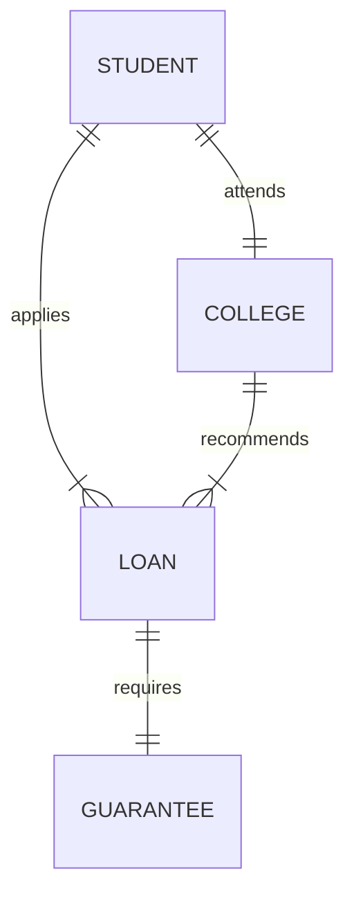

# 银行学生助学贷款管理系统详细设计与具体代码实现

作者：禅与计算机程序设计艺术

## 1.背景介绍

随着高等教育的普及,越来越多的学生需要申请助学贷款来支付学费和生活费。为了更好地管理和服务学生贷款,银行迫切需要一个高效、安全、易用的学生助学贷款管理系统。本文将详细介绍该系统的需求分析、架构设计、数据库设计、核心算法以及具体的代码实现。

### 1.1 学生助学贷款的现状与挑战
#### 1.1.1 学生贷款需求不断增长
#### 1.1.2 传统贷款管理方式效率低下
#### 1.1.3 学生信用评估难度大

### 1.2 贷款管理系统的目标与意义  
#### 1.2.1 提高贷款审批效率
#### 1.2.2 加强贷款全流程管控
#### 1.2.3 降低银行坏账风险

## 2.核心概念与联系

本节将介绍学生助学贷款管理系统涉及的核心概念,以及它们之间的关系。

### 2.1 学生
#### 2.1.1 学生基本信息
#### 2.1.2 学生学籍信息
#### 2.1.3 学生资助信息

### 2.2 高校
#### 2.2.1 高校基本信息
#### 2.2.2 高校专业设置
#### 2.2.3 高校收费标准

### 2.3 贷款
#### 2.3.1 贷款类型
#### 2.3.2 贷款金额与期限
#### 2.3.3 贷款利率与还款方式

### 2.4 担保
#### 2.4.1 担保人
#### 2.4.2 抵押物
#### 2.4.3 反担保措施

### 2.5 实体关系图
下图展示了学生、高校、贷款、担保四个核心实体之间的关系:



## 3.核心算法原理具体操作步骤

### 3.1 学生资格审核算法
#### 3.1.1 学籍信息真实性校验
#### 3.1.2 家庭经济状况评估
#### 3.1.3 综合评分排序

### 3.2 贷款风险评估模型  
#### 3.2.1 多维度特征提取
#### 3.2.2 机器学习模型训练
#### 3.2.3 风险等级划分

### 3.3 贷款发放与还款提醒
#### 3.3.1 贷款合同生成
#### 3.3.2 贷款资金划拨
#### 3.3.3 还款计划提醒

## 4.数学模型和公式详细讲解举例说明

### 4.1 学生资助资格综合评分模型

我们设计了一个加权评分模型来评估学生获得助学贷款资格的综合得分:

$$
Score = \sum_{i=1}^n w_i \cdot f_i(x_i)
$$

其中:
- $w_i$ 表示第 $i$ 个指标的权重
- $f_i$ 表示第 $i$ 个指标的打分函数
- $x_i$ 表示第 $i$ 个指标的原始值

举例来说,我们选取家庭人均收入、家庭资产、学生成绩排名等 3 个指标,权重分别为 0.4, 0.3, 0.3,对应的打分函数为:

$$
f_1(x) = \begin{cases}
100 & x \leq 10000 \\ 
80 & 10000 < x \leq 30000 \\
50 & 30000 < x \leq 50000 \\
0 & x > 50000
\end{cases}
$$

$$
f_2(x) = \begin{cases}
100 & x \leq 100000 \\ 
60 & 100000 < x \leq 500000 \\
0 & x > 500000
\end{cases}
$$

$$
f_3(x) = \begin{cases}
100 & x \leq 0.1 \\ 
80 & 0.1 < x \leq 0.3 \\
50 & 0.3 < x \leq 0.5 \\
0 & x > 0.5
\end{cases}
$$

如果一个学生家庭人均收入 25000 元,家庭总资产 80000 元,成绩排名前 20%,那么他的综合评分为:

$$
Score = 0.4 \times 80 + 0.3 \times 100 + 0.3 \times 80 = 86
$$

### 4.2 贷款违约风险预测模型

我们采用逻辑回归模型来预测学生的贷款违约概率:

$$
P(y=1|x) = \frac{1}{1+e^{-z}}
$$

其中:
- $y$ 表示是否违约,1 为违约,0 为正常还款 
- $x$ 表示学生特征向量
- $z$ 表示特征的加权求和,即 $z = w^T x + b$
- $w$ 和 $b$ 为模型参数,通过极大似然估计等方法求解

假设我们训练好的逻辑回归模型参数为:

$$
w = (0.2, -0.5, 0.1, 0.3)^T, b = -1.5
$$

某个学生的特征向量为:

$$
x = (1, 0, 1, 0.6)^T
$$

代入模型可得:

$$
\begin{aligned}
z &= w^T x + b \\
&= 0.2 \times 1 + (-0.5) \times 0 + 0.1 \times 1 + 0.3 \times 0.6 + (-1.5) \\
&= -1.02
\end{aligned}
$$

$$
P(y=1|x) = \frac{1}{1+e^{1.02}} \approx 0.265
$$

即该学生贷款违约的概率预测值为 26.5%。

## 5.项目实践：代码实例和详细解释说明

下面我们给出学生助学贷款管理系统的部分核心代码实现。

### 5.1 学生信息管理模块

```python
class Student:
    def __init__(self, id, name, college, major, grade, gpa):
        self.id = id
        self.name = name  
        self.college = college
        self.major = major
        self.grade = grade
        self.gpa = gpa

    def validate_info(self):
        """验证学生信息真实性"""
        pass

    def calc_score(self):
        """计算学生综合评分"""
        pass

class StudentDAO:
    def __init__(self, db):
        self.db = db

    def add_student(self, student):
        """添加学生信息"""
        pass

    def update_student(self, student):
        """更新学生信息"""
        pass

    def delete_student(self, id):
        """删除学生信息"""
        pass

    def query_student(self, id):
        """查询学生信息"""
        pass
```

`Student` 类封装了学生的基本信息,`validate_info` 和 `calc_score` 方法分别用于验证学生信息和计算评分。`StudentDAO` 类负责学生信息的增删改查操作。

### 5.2 贷款申请与审批模块

```python
from enum import Enum

class LoanState(Enum):
    PENDING = 1
    APPROVED = 2
    REJECTED = 3

class Loan:
    def __init__(self, id, student_id, amount, term, state=LoanState.PENDING):
        self.id = id
        self.student_id = student_id
        self.amount = amount
        self.term = term
        self.state = state

    def submit(self):
        """提交贷款申请"""
        pass

    def approve(self):
        """审批通过"""
        self.state = LoanState.APPROVED

    def reject(self):
        """审批拒绝"""
        self.state = LoanState.REJECTED

class LoanService:
    def __init__(self, loan_dao, student_dao):
        self.loan_dao = loan_dao
        self.student_dao = student_dao

    def create_loan(self, student_id, amount, term):
        """创建贷款申请"""
        loan = Loan(generate_id(), student_id, amount, term)
        self.loan_dao.add_loan(loan)

    def submit_loan(self, loan_id):
        """提交贷款申请"""
        loan = self.loan_dao.query_loan(loan_id)
        student = self.student_dao.query_student(loan.student_id)
        if student.calc_score() > 60:
            loan.submit()
        else:
            loan.reject()
        self.loan_dao.update_loan(loan)

    def approve_loan(self, loan_id):
        """审批通过贷款"""
        loan = self.loan_dao.query_loan(loan_id)
        loan.approve()
        self.loan_dao.update_loan(loan)

    def reject_loan(self, loan_id):
        """审批拒绝贷款"""
        loan = self.loan_dao.query_loan(loan_id)
        loan.reject()
        self.loan_dao.update_loan(loan)
```

`Loan` 类表示一笔贷款申请,包含贷款金额、期限等信息,以及 `submit`、`approve`、`reject` 等状态变更操作。`LoanState` 枚举定义了贷款的三种状态。

`LoanService` 类负责协调贷款和学生两个领域模型,提供创建贷款、提交审批、审批通过/拒绝等高层业务接口,并根据学生评分等进行自动审批。

### 5.3 还款管理模块

```python
from datetime import datetime

class Repayment:
    def __init__(self, id, loan_id, due_date, amount):
        self.id = id
        self.loan_id = loan_id
        self.due_date = due_date
        self.amount = amount
        self.paid_date = None
        self.paid_amount = None

    def is_overdue(self):
        """判断是否逾期"""
        return datetime.now().date() > self.due_date and self.paid_amount is None

    def pay(self, amount):
        """还款"""
        self.paid_amount = amount
        self.paid_date = datetime.now().date()

class RepaymentService:
    def __init__(self, repay_dao, loan_dao):
        self.repay_dao = repay_dao
        self.loan_dao = loan_dao

    def generate_repayments(self, loan_id):
        """生成还款计划"""
        loan = self.loan_dao.query_loan(loan_id)
        amount_per_month = loan.amount / loan.term
        for i in range(1, loan.term+1):
            due_date = loan.start_date + relativedelta(months=i)
            repay = Repayment(generate_id(), loan_id, due_date, amount_per_month)
            self.repay_dao.add_repayment(repay)

    def collect_repayment(self, repay_id):
        """收取还款"""
        repay = self.repay_dao.query_repayment(repay_id)
        repay.pay(repay.amount)
        self.repay_dao.update_repayment(repay)
```

`Repayment` 类表示一期还款,包含还款到期日、金额、实际还款日期等信息。`is_overdue` 方法判断该期是否已逾期。

`RepaymentService` 负责还款相关业务,`generate_repayments` 方法可根据贷款信息生成每月还款计划,`collect_repayment` 方法处理学生还款行为。

## 6.实际应用场景

学生助学贷款管理系统可应用于以下实际场景:

### 6.1 商业银行学生贷款业务
- 银行可利用该系统处理学生贷款申请、审批、发放、还款等各环节流程
- 通过该系统降低人工成本,提高业务处理效率,实现端到端全流程管理
- 利用系统积累的历史数据,优化贷款审批策略,控制坏账风险

### 6.2 高校助学贷款服务平台
- 高校可为学生提供一站式的网上贷款申请服务
- 学生可在线填写贷款申请,查询审批进度,并获得还款提醒
- 高校可与银行系统对接,协助银行核查学生学籍、成绩等信息

### 6.3 政府助学贷款管理
- 政府相关部门可通过该系统监管各高校、银行的助学贷款发放情况
- 根据贷款、还款数据分析全国学生资助工作成效  
- 为财政安排助学贷款资金提供数据支持

## 7.工具和资源推荐

### 7.1 开发语言和框架
- 后端:Java + Spring Boot, Python + Django, Go + Gin
- 前端:Vue.js, React, Angular
- 移动端:Flutter, React Native

### 7.2 数据库与中间件
- 关系型数据库:MySQL, PostgreSQL, Oracle
- NoSQL 数据库:MongoDB, Redis
- 消息队列:Kafka, RocketMQ
- 搜索引擎:Elasticsearch

### 7.3 机器学习平台和库
- 机器学习平台:Google Cloud AI, Azure ML, Amazon SageMaker
- 机器学习