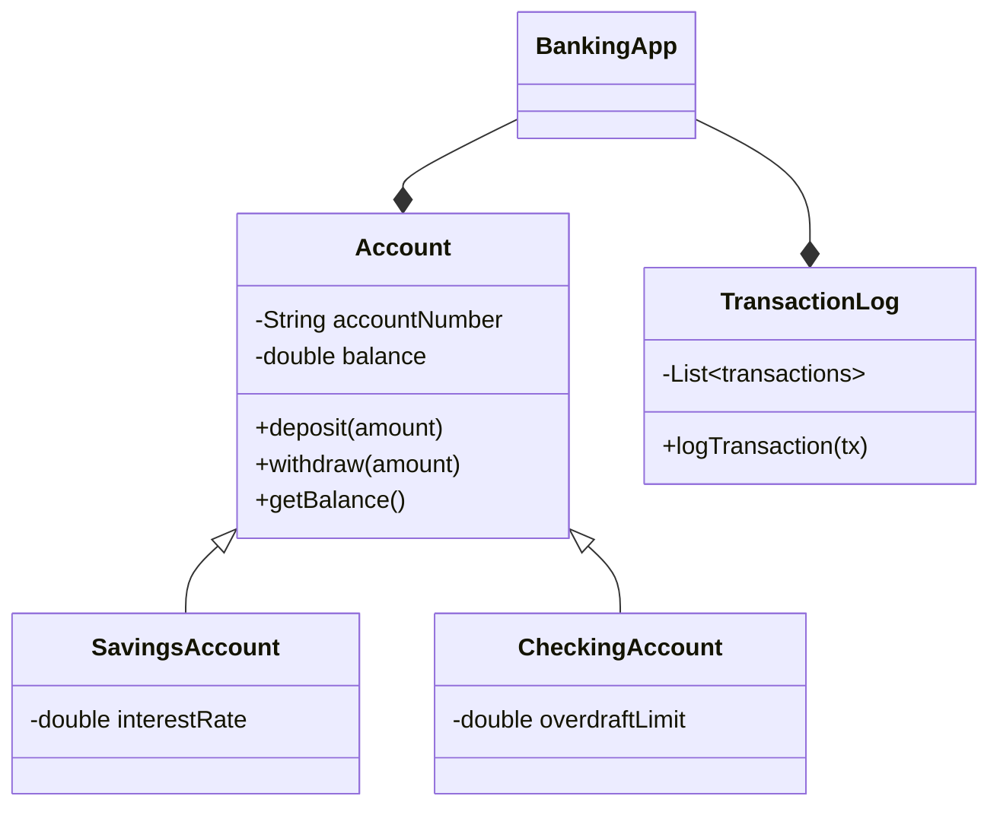

# 银行账目管理系统详细设计与具体代码实现

## 1.背景介绍

### 1.1 银行账目管理系统的重要性

在当今金融行业中,银行账目管理系统扮演着至关重要的角色。它是确保银行业务运营顺利、保护客户资金安全、维护银行声誉和遵守监管要求的关键系统。高效、准确的账目管理不仅能够提高银行的运营效率,还能增强客户对银行的信任度。

### 1.2 系统面临的挑战

然而,构建一个健全的银行账目管理系统并非易事。它需要处理大量复杂的交易数据、满足严格的安全和合规性要求、提供实时的账户信息查询和报告生成功能。此外,系统还需要具备高可用性、可扩展性和容错能力,以应对不断增长的业务量和不断变化的监管环境。

## 2.核心概念与联系 

### 2.1 账户

账户是银行账目管理系统的核心概念。每个客户在银行都拥有一个或多个账户,用于存储资金、进行交易等。账户通常包括以下属性:

- 账户号码
- 账户类型(储蓄、支票、定期等)
- 账户持有人信息
- 账户余额
- 交易记录

### 2.2 交易

交易是指对账户进行的任何操作,如存款、取款、转账等。每笔交易都需要记录以下信息:

- 交易ID
- 交易类型
- 交易金额
- 交易时间
- 相关账户

### 2.3 账户状态

账户状态反映了账户的当前情况,如正常、冻结、透支等。账户状态的变化通常由特定的交易或事件触发,如发生欺诈行为时冻结账户。

### 2.4 核心系统组件

一个典型的银行账目管理系统包括以下核心组件:

- 账户管理模块
- 交易处理模块 
- 报表生成模块
- 安全和授权模块
- 数据存储和备份模块

这些模块相互协作,确保系统的正常运行。

## 3.核心算法原理具体操作步骤

### 3.1 账户管理算法

#### 3.1.1 账户创建

1) 收集客户信息(姓名、身份证号、联系方式等)
2) 生成唯一的账户号码
3) 初始化账户余额(通常为0)
4) 将账户信息持久化存储

#### 3.1.2 账户查询

1) 根据账户号码或客户信息从数据库查询账户记录
2) 检查账户状态是否正常
3) 返回账户详细信息(余额、交易记录等)

#### 3.1.3 账户修改

1) 根据账户号码查询账户记录
2) 验证操作权限
3) 修改相应的账户信息字段
4) 更新数据库中的账户记录

#### 3.1.4 账户关闭

1) 根据账户号码查询账户记录  
2) 验证操作权限
3) 检查账户余额是否为0
4) 修改账户状态为"已关闭"
5) 归档账户历史记录

### 3.2 交易处理算法

#### 3.2.1 存款交易

1) 获取存款账户号码和金额
2) 从数据库查询账户信息
3) 检查账户状态是否正常
4) 更新账户余额 = 原余额 + 存款金额
5) 插入新的交易记录
6) 更新数据库中的账户记录

#### 3.2.2 取款交易  

1) 获取取款账户号码和金额
2) 从数据库查询账户信息
3) 检查账户状态和余额是否足够
4) 更新账户余额 = 原余额 - 取款金额  
5) 插入新的交易记录
6) 更新数据库中的账户记录

#### 3.2.3 转账交易

1) 获取转出账户、转入账户和转账金额
2) 从数据库查询两个账户信息
3) 检查两个账户状态是否正常
4) 检查转出账户余额是否足够
5) 更新转出账户余额 = 原余额 - 转账金额
6) 更新转入账户余额 = 原余额 + 转账金额
7) 插入两条新的交易记录
8) 更新数据库中的两个账户记录

### 3.3 账户利息计算算法

大部分银行账户都会计算利息,利息计算算法因账户类型而异。以活期存款账户为例:

$$
利息 = 账户年利率 \times 账户日均余额 \times \dfrac{计息天数}{365}
$$

其中:
- 账户年利率为固定值,由银行公布
- 账户日均余额 = $\dfrac{\sum_{i=1}^{n}余额_i}{n}$
- 计息天数为上次计息日至本次计息日的天数

算法步骤:

1) 确定计息周期(如每月最后一天计息) 
2) 获取上次计息日期和本次计息日期
3) 计算计息天数
4) 遍历账户交易记录,计算账户日均余额
5) 根据公式计算利息金额
6) 将利息金额加入账户余额
7) 插入新的计息交易记录

## 4.数学模型和公式详细讲解举例说明

在银行账目管理系统中,数学模型和公式主要用于利息计算、风险评估等场景。下面将详细介绍其中的两个重要模型。

### 4.1 单利计算模型

单利模型常用于定期存款和贷款的利息计算,公式如下:

$$
利息 = 本金 \times 利率 \times 时间
$$

其中:
- 本金为存款或贷款金额
- 利率为年利率,通常以小数形式表示
- 时间为存款或贷款的天数/365

例如,一笔100,000元的定期存款,年利率为3%,存期为1年,则利息为:

$$
利息 = 100,000 \times 0.03 \times (365/365) = 3,000 (元)
$$

### 4.2 复利计算模型

复利模型则常用于计算长期投资的收益,公式如下:

$$
终值 = 本金 \times (1+利率)^{时间}
$$

其中:
- 本金为初始投资金额 
- 利率为年利率
- 时间为投资年数

假设初始投资10,000元,年利率为5%,投资期限为10年,则最终收益为:

$$
终值 = 10,000 \times (1+0.05)^{10} = 16,288.95 (元)
$$

复利的力量体现在指数效应,长期投资收益将远高于单利收益。这也是为什么从年轻时就开始储蓄很重要的原因之一。

## 4.项目实践: 代码实例和详细解释说明

为了更好地理解银行账目管理系统的实现,我们将提供一个使用Java编写的简单示例项目。该项目包括基本的账户管理和交易处理功能。

### 4.1 项目架构



该系统由以下核心组件构成:

- `Account`类及其子类(`SavingsAccount`和`CheckingAccount`)负责账户管理。
- `TransactionLog`类负责记录和管理交易日志。
- `BankingApp`类是主程序入口,协调各个组件的工作。

### 4.2 Account类

`Account`类是整个系统的基础,它定义了账户的基本属性和行为。

```java
public abstract class Account {
    private String accountNumber;
    private double balance;

    // 构造函数、Getter和Setter方法

    public void deposit(double amount) {
        balance += amount;
        logTransaction("Deposit", amount);
    }

    public void withdraw(double amount) {
        if (balance >= amount) {
            balance -= amount;
            logTransaction("Withdrawal", -amount);
        } else {
            System.out.println("Insufficient balance!");
        }
    }

    public double getBalance() {
        return balance;
    }

    private void logTransaction(String type, double amount) {
        // 记录交易日志
    }
}
```

`deposit()`方法用于存款,它将存款金额加到账户余额中,并记录一条存款交易日志。

`withdraw()`方法用于取款,它首先检查账户余额是否足够,如果足够则从余额中扣除取款金额并记录一条取款交易日志,否则输出"余额不足"的错误信息。

`getBalance()`方法返回当前账户余额。

`logTransaction()`是一个内部方法,用于将交易信息记录到日志中。

### 4.3 SavingsAccount类

`SavingsAccount`是`Account`的子类,它添加了计算利息的功能。

```java
public class SavingsAccount extends Account {
    private double interestRate;

    public SavingsAccount(String accountNumber, double interestRate) {
        super(accountNumber);
        this.interestRate = interestRate;
    }

    public void calculateInterest() {
        double interest = getBalance() * interestRate / 100;
        deposit(interest);
        System.out.println("Interest added: " + interest);
    }
}
```

在构造函数中,我们需要传入账户号码和利率。`calculateInterest()`方法用于计算并添加利息到账户余额中。它首先根据账户余额和利率计算利息金额,然后调用`deposit()`方法将利息存入账户,最后输出一条消息。

### 4.4 BankingApp类

`BankingApp`类是整个应用程序的入口点,它负责创建账户、执行交易等操作。

```java
public class BankingApp {
    private static List<Account> accounts = new ArrayList<>();

    public static void main(String[] args) {
        Account savingsAccount = new SavingsAccount("123456789", 3.5);
        accounts.add(savingsAccount);

        savingsAccount.deposit(1000);
        savingsAccount.withdraw(500);

        SavingsAccount savings = (SavingsAccount) savingsAccount;
        savings.calculateInterest();

        System.out.println("Final balance: " + savingsAccount.getBalance());
    }
}
```

在`main()`方法中,我们首先创建了一个储蓄账户`savingsAccount`,并将它添加到`accounts`列表中。然后我们执行了一次存款、一次取款和一次计算利息的操作。最后,我们输出了账户的最终余额。

运行该程序,您将看到类似如下的输出:

```
Transaction log: Deposit 1000.0
Transaction log: Withdrawal 500.0
Interest added: 17.5
Final balance: 517.5
```

虽然这只是一个非常简单的示例,但它展示了银行账目管理系统的核心功能。在实际项目中,您需要添加更多的功能和错误处理,比如账户创建/删除、转账、安全认证等。

## 5.实际应用场景

银行账目管理系统在现实生活中有着广泛的应用,下面列举了一些典型的场景:

### 5.1 个人银行账户管理

每个银行客户都需要至少一个账户,用于存取款、支付账单、转账等日常银行业务。银行账目管理系统为客户提供了方便、安全的账户管理途径,如网上银行、手机银行应用程序等。

### 5.2 企业资金管理

企业客户通常需要管理多个银行账户,用于收付款项、工资发放、纳税等目的。账目管理系统可以为企业提供集中的资金管控,方便查询账户余额、交易记录,以及生成财务报表。

### 5.3 银行内部运营管理  

对于银行内部而言,账目管理系统是核心业务系统,用于记录和处理所有客户账户的交易活动。银行员工可以通过该系统执行存取款、转账等操作,并生成各类报表以满足监管要求。系统还为银行内部的风险控制、营运资金管理等提供了数据支持。

### 5.4 金融数据分析

银行账目系统积累的海量交易数据对于金融数据分析也具有重要价值。分析人员可以利用这些数据进行客户行为分析、反欺诈监测、市场预测等,为银行的业务决策提供依据。

## 6.工具和资源推荐  

在构建银行账目管理系统时,可以借助一些开源工具和框架来提高开发效率、增强系统功能。以下是一些推荐