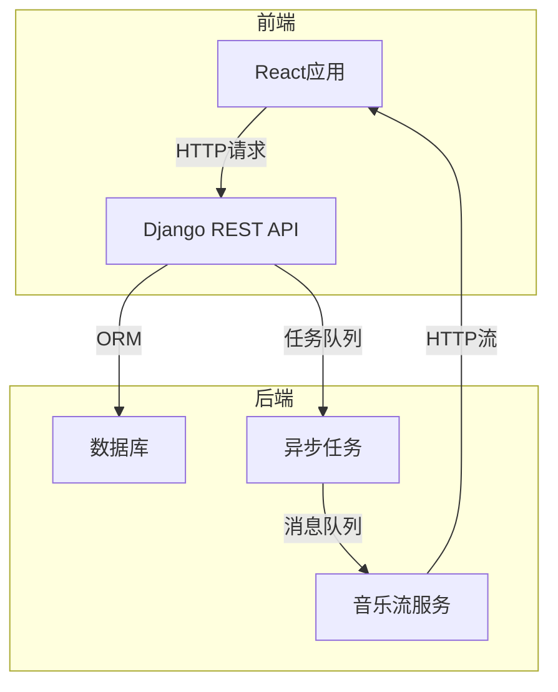

# 音乐网站详细设计与具体代码实现

## 1. 背景介绍

### 1.1 音乐网站的重要性

在当今数字时代,音乐已经成为人们生活中不可或缺的一部分。音乐网站为用户提供了一个方便、高效的音乐体验平台,让他们可以在线搜索、收听、下载和分享音乐。随着移动互联网和流媒体技术的不断发展,音乐网站已经成为人们获取音乐内容的主要渠道之一。

### 1.2 音乐网站发展历程

早期的音乐网站主要提供音乐下载服务,如著名的Napster等。随后,流媒体技术的兴起,使得在线音乐播放成为可能,网站如Pandora和Last.fm等应运而生。近年来,随着移动设备的普及,移动音乐应用程序也成为音乐网站的重要组成部分,如Spotify、Apple Music等。

### 1.3 音乐网站面临的挑战

尽管音乐网站发展迅速,但它们也面临着一些挑战,如版权问题、音乐推荐算法的不断优化、用户体验的提升等。因此,设计和实现一个优秀的音乐网站需要综合考虑多方面因素,包括技术、商业模式、用户需求等。

## 2. 核心概念与联系

### 2.1 音乐元数据

音乐元数据是描述音乐文件的一组结构化数据,包括艺术家、专辑、曲目名称、流派、发行年份等信息。它是音乐网站实现搜索、分类、推荐等功能的基础。

### 2.2 音频编码和流媒体技术

为了在网络上传输和播放音乐,需要将音频文件进行编码压缩,常用的编码格式有MP3、AAC、Ogg Vorbis等。流媒体技术则允许用户在下载完整音频文件之前就可以开始播放。

### 2.3 音乐推荐系统

个性化的音乐推荐系统是音乐网站的核心功能之一。它基于用户的历史收听记录、音乐元数据以及协同过滤算法,为用户推荐可能喜欢的音乐。

### 2.4 音乐社交网络

许多音乐网站都提供社交功能,允许用户关注艺术家、分享播放列表、与好友讨论音乐等。这有助于构建活跃的音乐社区,增强用户粘性。

### 2.5 版权管理

合法获取音乐版权并向权利人支付版税是音乐网站的重要环节。同时,也需要采取技术手段保护版权,防止音乐内容被非法传播。

## 3. 核心算法原理具体操作步骤  

### 3.1 音乐元数据提取

为了建立音乐库,需要从音频文件中提取元数据信息。常用的方法有:

1. 解析音频文件中的ID3标签(MP3)或其他元数据容器
2. 基于音频指纹技术从在线音乐数据库查询元数据
3. 使用机器学习模型自动识别艺术家、流派等

提取的元数据需要经过规范化处理,以消除重复、拼写错误等问题。

### 3.2 音乐推荐算法

常用的音乐推荐算法包括:

#### 3.2.1 协同过滤算法

根据用户的历史收听记录,找到与其收听习惯相似的其他用户,并推荐这些用户喜欢的音乐。可以使用基于用户的nearest neighbor算法或基于项目的算法。

#### 3.2.2 基于内容的推荐

根据音乐元数据(如流派、艺术家等)计算音乐项目之间的相似度,然后推荐与用户历史收听记录相似的音乐。常用的相似度度量有余弦相似度、Jaccard系数等。

#### 3.2.3 混合推荐算法

将协同过滤和基于内容的算法相结合,综合两者的优点,提高推荐质量。

### 3.3 音乐搜索

为了实现高效的音乐搜索,需要:

1. 建立倒排索引,将音乐元数据进行分词并存储单词到文档的映射关系。
2. 使用全文搜索引擎如Lucene或Elasticsearch实现快速查询。
3. 支持模糊搜索、相关度排序等高级功能。

### 3.4 音频流传输

为了实现流畅的音乐播放,需要:

1. 使用HTTP直播或RTMP/RTSP协议进行流式传输。
2. 采用自适应比特率流技术,根据网络状况动态调整码率。
3. 使用内存映射文件和缓存技术优化读取性能。
4. 实现断点续传、跨平台支持等功能。

## 4. 数学模型和公式详细讲解举例说明

### 4.1 相似度度量

在音乐推荐和相似音乐发现中,常用的相似度度量有:

#### 4.1.1 余弦相似度

余弦相似度用于计算两个向量之间的夹角余弦值,公式如下:

$$\text{sim}(A, B) = \cos(\theta) = \frac{A \cdot B}{\|A\|\|B\|} = \frac{\sum_{i=1}^{n}A_iB_i}{\sqrt{\sum_{i=1}^{n}A_i^2}\sqrt{\sum_{i=1}^{n}B_i^2}}$$

其中$A$和$B$是$n$维向量,表示两个音乐项目的特征向量。

#### 4.1.2 Jaccard系数

Jaccard系数用于计算两个集合的相似度,公式如下:

$$\text{sim}(A, B) = \frac{|A \cap B|}{|A \cup B|}$$

其中$A$和$B$表示两个音乐项目的标签集合。

#### 4.1.3 其他距离度量

其他常用的距离度量包括欧几里得距离、曼哈顿距离、Pearson相关系数等。

### 4.2 推荐系统评估指标

评估推荐系统的性能通常使用以下指标:

#### 4.2.1 准确率(Precision)

准确率表示推荐列表中有多少比例是用户真正感兴趣的项目:

$$\text{Precision} = \frac{\text{真正感兴趣的推荐项目数}}{\text{推荐项目总数}}$$

#### 4.2.2 覆盖率(Coverage)

覆盖率表示推荐系统能够覆盖多大比例的项目:

$$\text{Coverage} = \frac{\text{被推荐过的项目数}}{\text{总项目数}}$$

#### 4.2.3 其他指标

其他常用的评估指标包括召回率(Recall)、F1分数、平均准确率(MAP)、归一化折损累积增益(NDCG)等。

## 5. 项目实践:代码实例和详细解释说明

本节将提供一个音乐网站的实例项目,使用Python的Django Web框架和React前端框架进行开发。

### 5.1 项目架构



前端使用React构建单页面应用,通过REST API与后端进行数据交互。后端使用Django提供API,操作关系数据库存储音乐元数据。异步任务如音乐元数据提取、推荐计算等使用Celery进行处理,音乐流服务使用Node.js实现。

### 5.2 模型定义

```python
# models.py
from django.db import models

class Artist(models.Model):
    name = models.CharField(max_length=200)
    
class Album(models.Model):
    title = models.CharField(max_length=200)
    artist = models.ForeignKey(Artist, on_delete=models.CASCADE)
    
class Track(models.Model):
    title = models.CharField(max_length=200)
    album = models.ForeignKey(Album, on_delete=models.CASCADE)
    audio_file = models.FileField(upload_to='tracks/')
    
class Playlist(models.Model):
    name = models.CharField(max_length=200)
    tracks = models.ManyToManyField(Track)
    
class UserProfile(models.Model):
    user = models.OneToOneField(User, on_delete=models.CASCADE)
    playlists = models.ManyToManyField(Playlist)
    favorite_tracks = models.ManyToManyField(Track)
```

这些模型定义了艺术家、专辑、曲目、播放列表和用户资料等核心实体,为构建音乐库和推荐系统奠定基础。

### 5.3 音乐元数据提取

```python
# tasks.py
from celery import shared_task
import mutagen

@shared_task
def extract_metadata(track_id):
    track = Track.objects.get(pk=track_id)
    audio = mutagen.File(track.audio_file.path)
    if audio is None:
        return
    
    # 提取元数据
    title = audio.get('title', [''])[0]
    artist = audio.get('artist', [''])[0]
    album = audio.get('album', [''])[0]
    
    # 更新数据库
    track.title = title
    artist_obj, _ = Artist.objects.get_or_create(name=artist)
    album_obj, _ = Album.objects.get_or_create(title=album, artist=artist_obj)
    track.album = album_obj
    track.save()
```

使用mutagen库从音频文件中提取元数据,并更新数据库中的模型实例。这个任务被异步执行,避免阻塞Web服务器。

### 5.4 音乐推荐算法

```python
# recommendations.py
import numpy as np
from django.db.models import Count
from .models import UserProfile, Track

def build_user_profile_matrix():
    users = UserProfile.objects.annotate(track_count=Count('favorite_tracks'))
    user_ids = [u.id for u in users]
    tracks = Track.objects.all()
    
    # 构建用户-音乐矩阵
    user_track_matrix = np.zeros((len(users), len(tracks)))
    for i, user in enumerate(users):
        for track in user.favorite_tracks.all():
            j = tracks.index(track)
            user_track_matrix[i, j] = 1
            
    return user_track_matrix, user_ids

def recommend_tracks(user_id, n=10):
    # 构建用户-音乐矩阵
    user_track_matrix, user_ids = build_user_profile_matrix()
    
    # 计算用户之间的相似度
    user_sim_matrix = user_track_matrix.dot(user_track_matrix.T)
    
    # 找到与当前用户最相似的其他用户
    user_idx = user_ids.index(user_id)
    user_ratings = user_sim_matrix[user_idx]
    similar_users = np.argsort(-user_ratings)[1:31]
    
    # 推荐最相关的音乐
    track_scores = user_track_matrix[similar_users].sum(axis=0)
    track_ranking = np.argsort(-track_scores)
    recommended_tracks = [Track.objects.get(pk=i) for i in track_ranking[:n]]
    
    return recommended_tracks
```

这个模块实现了基于用户的协同过滤算法,构建用户-音乐矩阵,计算用户之间的相似度,然后推荐最相关的音乐给目标用户。

### 5.5 音乐搜索

```python
# search.py
import json
from elasticsearch import Elasticsearch

es = Elasticsearch()

def index_music_data():
    # 从数据库加载数据
    tracks = Track.objects.all()
    
    # 构建Elasticsearch文档
    docs = []
    for track in tracks:
        doc = {
            'id': track.id,
            'title': track.title,
            'artist': track.album.artist.name,
            'album': track.album.title
        }
        docs.append(doc)
        
    # 批量索引文档
    es.bulk(index='music', body=docs, refresh=True)

def search_tracks(query):
    # 构建查询请求
    body = {
        "query": {
            "multi_match": {
                "query": query,
                "fields": ["title", "artist", "album"]
            }
        }
    }
    
    # 执行搜索
    results = es.search(index='music', body=body)
    
    # 解析结果
    hits = results['hits']['hits']
    tracks = [Track.objects.get(pk=hit['_id']) for hit in hits]
    
    return tracks
```

这个模块使用Elasticsearch作为全文搜索引擎,索引音乐数据并提供搜索功能。可以根据曲目标题、艺术家和专辑进行多字段搜索。

### 5.6 音频流传输

```javascript
// AudioPlayer.js
import React, { useEffect, useRef } from 'react';

const AudioPlayer = ({ src }) => {
  const audioRef = useRef(null);

  useEffect(() => {
    const audio = audioRef.current;
    const source = `${window