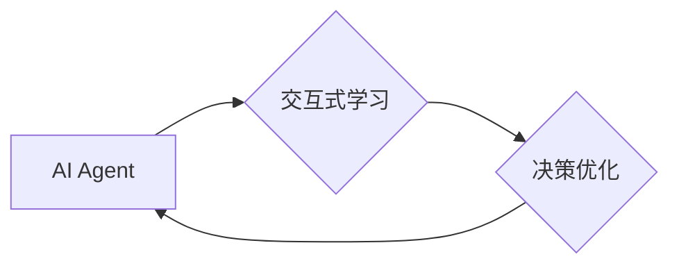

# AI Agent: AI的下一个风口 交互式学习与决策优化

作者：禅与计算机程序设计艺术

## 1. 背景介绍

### 1.1 人工智能发展历程回顾

人工智能(AI)经历了漫长的发展历程，从早期的符号主义、专家系统到如今的深度学习、强化学习，每一次技术突破都推动着AI迈向新的高度。近年来，随着深度学习技术的快速发展和应用，AI在图像识别、语音识别、自然语言处理等领域取得了突破性进展，极大地推动了AI技术的产业化落地。

### 1.2 AI Agent 的兴起

然而，传统的AI系统大多是针对特定任务进行训练的，缺乏自主学习和决策的能力，难以适应复杂多变的现实环境。为了解决这一问题，AI Agent应运而生。AI Agent是一种能够感知环境、自主学习、做出决策并采取行动的智能体，其目标是在动态环境中实现特定目标。

### 1.3 AI Agent 的优势与挑战

相比于传统的AI系统，AI Agent具有以下优势：

* **自主性:**  AI Agent能够在没有人工干预的情况下自主学习和决策。
* **适应性:** AI Agent能够适应动态变化的环境，并根据环境反馈调整自身行为。
* **可扩展性:** AI Agent可以方便地扩展到新的任务和环境中。

然而，AI Agent的开发也面临着诸多挑战：

* **环境建模:** 如何建立准确且高效的环境模型是AI Agent面临的首要挑战。
* **奖励机制设计:** 如何设计有效的奖励机制以引导AI Agent学习到期望的行为至关重要。
* **探索与利用:** AI Agent需要在探索未知环境和利用已有知识之间取得平衡。

## 2. 核心概念与联系

### 2.1 AI Agent 的基本要素

一个典型的AI Agent通常包含以下基本要素：

* **感知:**  AI Agent通过传感器感知外部环境信息，例如图像、声音、文本等。
* **表示:** AI Agent将感知到的环境信息转换为内部表示形式，例如状态、特征等。
* **推理:** AI Agent基于内部表示进行推理，预测未来状态、评估不同行动方案等。
* **学习:** AI Agent根据环境反馈更新内部模型，不断优化自身行为策略。
* **行动:** AI Agent根据推理结果选择并执行相应的行动，与环境进行交互。

### 2.2 交互式学习

交互式学习是指AI Agent通过与环境进行交互来学习最佳行为策略的过程。在交互式学习中，AI Agent不断尝试不同的行动，并根据环境反馈调整自身行为策略，最终学习到能够最大化长期累积奖励的策略。

### 2.3 决策优化

决策优化是指AI Agent在给定环境状态下，选择能够最大化预期奖励的行动的过程。常用的决策优化方法包括：

* **搜索算法:**  例如深度优先搜索、广度优先搜索等。
* **动态规划:** 例如值迭代、策略迭代等。
* **强化学习:** 例如Q-learning、SARSA等。

### 2.4 核心概念联系

下图展示了AI Agent、交互式学习、决策优化之间的联系：



## 3. 核心算法原理具体操作步骤

### 3.1 强化学习

强化学习是一种重要的交互式学习方法，其核心思想是通过试错来学习最佳行为策略。在强化学习中，AI Agent与环境进行交互，并根据环境反馈的奖励信号来调整自身行为策略。

#### 3.1.1 Q-learning算法

Q-learning是一种经典的强化学习算法，其目标是学习一个状态-动作值函数(Q函数)，该函数表示在某个状态下采取某个行动的预期累积奖励。Q-learning算法的更新规则如下：

$$
Q(s_t, a_t) \leftarrow Q(s_t, a_t) + \alpha [r_{t+1} + \gamma \max_{a} Q(s_{t+1}, a) - Q(s_t, a_t)]
$$

其中：

* $Q(s_t, a_t)$ 表示在状态 $s_t$ 下采取行动 $a_t$ 的 Q 值。
* $\alpha$ 是学习率，用于控制每次更新的幅度。
* $r_{t+1}$ 是在状态 $s_t$ 下采取行动 $a_t$ 后获得的奖励。
* $\gamma$ 是折扣因子，用于平衡当前奖励和未来奖励的重要性。
* $s_{t+1}$ 是状态 $s_t$ 下采取行动 $a_t$ 后的下一个状态。

#### 3.1.2 SARSA算法

SARSA算法是另一种常用的强化学习算法，其更新规则与Q-learning算法类似，区别在于SARSA算法使用实际采取的行动来更新Q函数，而Q-learning算法使用的是最优行动。SARSA算法的更新规则如下：

$$
Q(s_t, a_t) \leftarrow Q(s_t, a_t) + \alpha [r_{t+1} + \gamma Q(s_{t+1}, a_{t+1}) - Q(s_t, a_t)]
$$

其中，$a_{t+1}$ 是在状态 $s_{t+1}$ 下实际采取的行动。


### 3.2 深度强化学习

深度强化学习是深度学习与强化学习的结合，其核心思想是利用深度神经网络来逼近Q函数或策略函数。

#### 3.2.1 DQN算法

DQN算法是一种经典的深度强化学习算法，其使用深度神经网络来逼近Q函数。DQN算法的主要特点是引入了经验回放机制和目标网络，以提高算法的稳定性和效率。

#### 3.2.2 A3C算法

A3C算法是一种异步的深度强化学习算法，其使用多个actor-learner线程并行地与环境进行交互和学习，从而加速学习过程。

## 4. 数学模型和公式详细讲解举例说明

### 4.1 马尔可夫决策过程 (MDP)

马尔可夫决策过程 (Markov Decision Process, MDP) 是描述强化学习问题的常用数学框架。一个MDP通常由以下要素构成：

* **状态空间 $S$:** 所有可能的状态的集合。
* **行动空间 $A$:** 所有可能的行动的集合。
* **状态转移概率 $P(s'|s, a)$:** 在状态 $s$ 下采取行动 $a$ 后转移到状态 $s'$ 的概率。
* **奖励函数 $R(s, a, s')$:** 在状态 $s$ 下采取行动 $a$ 后转移到状态 $s'$ 所获得的奖励。
* **折扣因子 $\gamma$:** 用于平衡当前奖励和未来奖励的重要性。

### 4.2  Bellman 方程

Bellman 方程是MDP的核心方程，它描述了状态值函数 $V(s)$ 和状态-动作值函数 $Q(s, a)$ 之间的关系。

状态值函数 $V(s)$ 表示从状态 $s$ 开始，遵循策略 $\pi$ 所获得的期望累积奖励：

$$
V^{\pi}(s) = \mathbb{E}_{\pi}[R(s_0, a_0, s_1) + \gamma R(s_1, a_1, s_2) + ... | s_0 = s]
$$

状态-动作值函数 $Q(s, a)$ 表示在状态 $s$ 下采取行动 $a$，然后遵循策略 $\pi$ 所获得的期望累积奖励：

$$
Q^{\pi}(s, a) = \mathbb{E}_{\pi}[R(s_0, a_0, s_1) + \gamma R(s_1, a_1, s_2) + ... | s_0 = s, a_0 = a]
$$

Bellman 方程可以写成如下形式：

$$
V^{\pi}(s) = \sum_{a \in A} \pi(a|s) \sum_{s' \in S} P(s'|s, a)[R(s, a, s') + \gamma V^{\pi}(s')]
$$

$$
Q^{\pi}(s, a) = \sum_{s' \in S} P(s'|s, a)[R(s, a, s') + \gamma \sum_{a' \in A} \pi(a'|s') Q^{\pi}(s', a')]
$$

### 4.3 举例说明

假设有一个迷宫环境，其中包含一个起点、一个终点和若干障碍物。AI Agent的目标是找到从起点到终点的最短路径。

* **状态空间:** 迷宫中的所有格子。
* **行动空间:** 上下左右四个方向。
* **状态转移概率:**  如果行动合法 (不会撞墙)，则转移到目标格子，概率为1；否则，停留在原地，概率为1。
* **奖励函数:** 到达终点获得奖励1，其他情况奖励为0。
* **折扣因子:**  设置为0.9。

可以使用Q-learning算法来解决这个问题。初始时，将所有Q值初始化为0。然后，AI Agent从起点出发，不断尝试不同的行动，并根据环境反馈的奖励信号来更新Q值。最终，AI Agent将学习到一个最优策略，即在每个状态下选择能够最大化Q值的行动。

## 5. 项目实践：代码实例和详细解释说明

### 5.1 使用 Python 实现 Q-learning 算法

```python
import numpy as np

# 定义环境
class Maze:
    def __init__(self):
        self.height = 4
        self.width = 4
        self.start_state = (0, 0)
        self.goal_state = (3, 3)
        self.obstacles = [(1, 1), (2, 1)]

    def is_valid_state(self, state):
        return 0 <= state[0] < self.height and 0 <= state[1] < self.width and state not in self.obstacles

    def get_next_state(self, state, action):
        next_state = (state[0] + action[0], state[1] + action[1])
        if self.is_valid_state(next_state):
            return next_state
        else:
            return state

    def get_reward(self, state):
        if state == self.goal_state:
            return 1
        else:
            return 0

# 定义 Q-learning 算法
class QLearning:
    def __init__(self, env, learning_rate=0.1, discount_factor=0.9, epsilon=0.1):
        self.env = env
        self.learning_rate = learning_rate
        self.discount_factor = discount_factor
        self.epsilon = epsilon
        self.q_table = np.zeros((env.height, env.width, 4))

    def choose_action(self, state):
        if np.random.uniform(0, 1) < self.epsilon:
            return np.random.randint(0, 4)
        else:
            return np.argmax(self.q_table[state[0], state[1]])

    def update_q_table(self, state, action, reward, next_state):
        self.q_table[state[0], state[1], action] += self.learning_rate * (
            reward
            + self.discount_factor * np.max(self.q_table[next_state[0], next_state[1]])
            - self.q_table[state[0], state[1], action]
        )

    def train(self, num_episodes):
        for episode in range(num_episodes):
            state = self.env.start_state
            while state != self.env.goal_state:
                action = self.choose_action(state)
                next_state = self.env.get_next_state(state, [(0, 1), (1, 0), (0, -1), (-1, 0)][action])
                reward = self.env.get_reward(next_state)
                self.update_q_table(state, action, reward, next_state)
                state = next_state

# 创建环境和智能体
env = Maze()
agent = QLearning(env)

# 训练智能体
agent.train(num_episodes=1000)

# 打印 Q 表
print(agent.q_table)
```

### 5.2 代码解释

* 首先，定义了一个迷宫环境 `Maze`，其中包含迷宫的高度、宽度、起点、终点和障碍物的位置信息。
* 然后，定义了一个 Q-learning 算法 `QLearning`，其中包含学习率、折扣因子、epsilon-greedy 策略的参数以及 Q 表。
* `choose_action` 方法用于根据当前状态选择行动，使用 epsilon-greedy 策略平衡探索和利用。
* `update_q_table` 方法用于根据环境反馈更新 Q 表。
* `train` 方法用于训练智能体，在每个 episode 中，智能体从起点出发，不断与环境交互，直到到达终点或达到最大步数限制。
* 最后，创建了一个迷宫环境和一个 Q-learning 智能体，并训练智能体 1000 个 episode。

## 6. 实际应用场景

### 6.1 游戏 AI

AI Agent 在游戏领域有着广泛的应用，例如：

* **游戏角色控制:**  AI Agent 可以控制游戏角色的行为，例如移动、攻击、躲避等。
* **游戏关卡生成:** AI Agent 可以根据玩家的水平和喜好生成不同的游戏关卡。
* **游戏难度调整:** AI Agent 可以根据玩家的表现实时调整游戏的难度。

### 6.2  推荐系统

AI Agent 可以用于构建个性化的推荐系统，例如：

* **商品推荐:**  AI Agent 可以根据用户的历史行为和偏好推荐相关的商品。
* **新闻推荐:** AI Agent 可以根据用户的兴趣和阅读习惯推荐相关的新闻。
* **音乐推荐:** AI Agent 可以根据用户的音乐品味推荐相关的音乐。

### 6.3 自动驾驶

AI Agent 是自动驾驶技术的核心组成部分，例如：

* **路径规划:**  AI Agent 可以根据实时路况和交通规则规划安全的行驶路径。
* **车辆控制:** AI Agent 可以控制车辆的加速、刹车、转向等操作。
* **环境感知:** AI Agent 可以通过传感器感知周围环境，例如车辆、行人、交通信号灯等。

## 7. 总结：未来发展趋势与挑战

### 7.1 未来发展趋势

* **更强大的环境建模能力:**  随着深度学习、强化学习等技术的不断发展，AI Agent 将具备更强大的环境建模能力，能够处理更加复杂和动态的环境。
* **更智能的决策优化算法:**  未来将会出现更加智能的决策优化算法，例如基于模型的强化学习、元学习等，能够帮助 AI Agent 更快地学习到最优策略。
* **更广泛的应用场景:**  随着 AI Agent 技术的不断成熟，其应用场景将会越来越广泛，例如智能家居、智慧城市、医疗健康等领域。

### 7.2 面临的挑战

* **数据效率:**  当前的 AI Agent 通常需要大量的训练数据才能达到良好的性能，如何提高数据效率是未来研究的重点方向。
* **泛化能力:**  AI Agent 在训练环境中学习到的策略往往难以泛化到新的环境中，如何提高 AI Agent 的泛化能力是另一个挑战。
* **安全性:**  AI Agent 的决策可能会对现实世界产生重大影响，如何确保 AI Agent 的安全性至关重要。

## 8. 附录：常见问题与解答

### 8.1 什么是 AI Agent?

AI Agent 是一种能够感知环境、自主学习、做出决策并采取行动的智能体，其目标是在动态环境中实现特定目标。

### 8.2 AI Agent 与传统 AI 系统的区别是什么？

相比于传统的 AI 系统，AI Agent 具有自主性、适应性和可扩展性等优势。

### 8.3 AI Agent 的应用场景有哪些？

AI Agent 在游戏 AI、推荐系统、自动驾驶等领域有着广泛的应用。

### 8.4 AI Agent 未来发展趋势如何？

未来，AI Agent 将具备更强大的环境建模能力、更智能的决策优化算法和更广泛的应用场景。

### 8.5 AI Agent 面临哪些挑战？

AI Agent 面临着数据效率、泛化能力和安全性等挑战。
