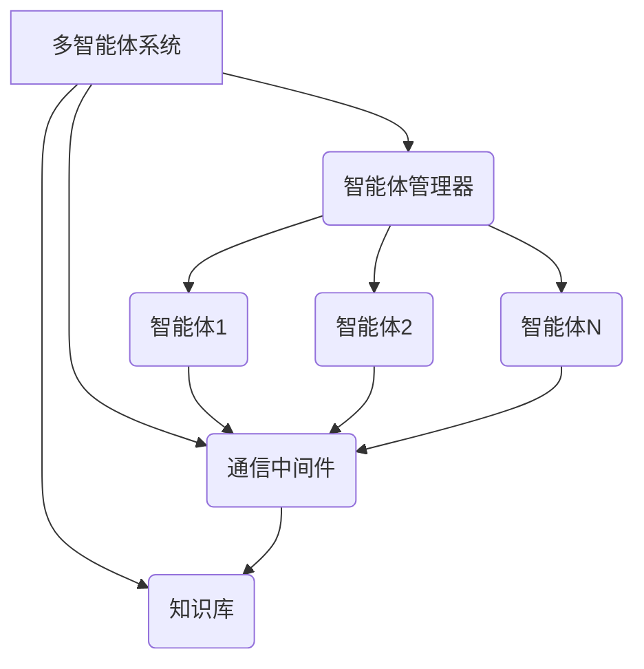
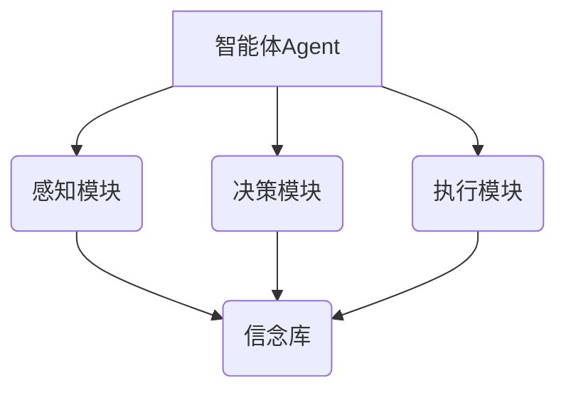

# AI Agent: AI的下一个风口 多智能体系统的未来

## 1. 背景介绍

### 1.1 人工智能的发展历程

人工智能(Artificial Intelligence, AI)是当代科技领域最具革命性和颠覆性的技术之一。自20世纪50年代AI的概念被正式提出以来,经历了起起伏伏的发展历程。

#### 1.1.1 AI的起源

1956年,约翰·麦卡锡在达特茅斯学院召开的一次会议上首次使用了"人工智能"这个词语。会议的目标是探讨如何使机器模仿人类智能的行为和过程。这标志着AI作为一个独立的研究领域正式诞生。

#### 1.1.2 AI的曲折发展

AI的发展历程可以分为几个阶段:

- 1950s-1960s:AI的萌芽期,专家系统和游戏程序取得了一些初步成果。
- 1970s-1980s:AI遇冷,由于计算能力和算法的限制,AI进入了一个相对停滞的低谷期。
- 1990s-2000s:机器学习和神经网络的兴起,推动了AI的复兴。
- 2010s至今:深度学习、大数据和强大的计算能力让AI获得了飞速发展。

### 1.2 AI的现状和挑战

当前,AI已经在语音识别、图像处理、自然语言处理等众多领域取得了长足进展,给人类生产生活带来了深刻影响。但AI也面临着一些挑战和困境:

- 缺乏通用智能
- 算法黑盒操作
- 数据质量和隐私问题
- 算力和能耗瓶颈
- 缺乏自主学习能力

这些问题推动着AI技术不断革新和突破。其中,多智能体系统(Multi-Agent System,MAS)被认为是AI发展的一个重要方向。

## 2. 核心概念与联系  

### 2.1 什么是多智能体系统?

多智能体系统是由多个智能体(Agent)组成的一个松散的虚拟社区,彼此之间通过某种通信语言和协议相互作用。每个智能体都是一个具有一定自主性的软件实体,能够根据环境的变化做出理性决策,并与其他智能体协作以完成复杂任务。

多智能体系统的核心思想是:将复杂的系统分解为多个相互协作的子系统(Agent),利用分布式人工智能技术,协同完成无法由单个智能体独立完成的复杂任务。

简单来说,多智能体系统是:
- 由多个智能体组成
- 智能体之间相互协作
- 利用分布式AI技术
- 解决复杂系统问题

### 2.2 多智能体系统与单智能体系统的区别

与传统的单智能体系统相比,多智能体系统具有以下独特优势:

- 分布性(Distribution):不同智能体可分布在不同的物理位置
-开放性(Openness):系统可动态地加入或移除智能体
- 健壮性(Robustness):单个智能体出现故障不会导致整个系统瘫痪
- 可扩展性(Scalability):可以通过增加智能体的数量来提高系统性能
- 异构性(Heterogeneity):智能体可以使用不同的架构和编程语言

与单智能体系统相比,多智能体系统更加灵活、健壮、可扩展,也更接近于真实世界的复杂系统。但同时,多智能体系统在设计和实现上也存在更大的挑战。

### 2.3 多智能体系统的关键技术

多智能体系统涉及多个技术领域,主要包括:

- 分布式人工智能
- 多智能体协作与协调
- 自主智能体决策
- 智能体通信语言
- 资源分配与任务规划
- 多智能体学习与自适应

其中,多智能体协作与协调是关键技术之一。如何在智能体之间达成协作共识,如何避免冲突和资源争用,需要高效的协调机制。此外,多智能体学习也是一个前沿热点方向。

## 3. 核心算法原理具体操作步骤

### 3.1 多智能体系统的典型架构

多智能体系统通常由以下几个核心组件组成:

1. **智能体管理器(Agent Manager)**:负责管理整个系统中的所有智能体的生命周期,包括创建、注册、调度、移除等。
2. **通信中间件(Communication Middleware)**:提供智能体之间的消息传递和协调机制,支持各种通信语言和协议。
3. **知识库(Knowledge Base)**:存储系统所需的领域知识、规则、本体等信息。
4. **智能体(Agent)**:真正执行任务的智能软件实体,具有自主性和交互能力。

### 3.2 智能体的基本结构

每个智能体内部都包含以下几个核心模块:

1. **感知模块(Perception Module)**:接收来自环境或其他智能体的信息输入,并对其进行预处理。
2. **决策模块(Decision Module)**:根据当前信念库中的状态和目标,运行决策算法选择下一步的行为动作。
3. **执行模块(Action Module)**:执行选定的行为动作,并将结果反馈到环境中。
4. **信念库(Belief Base)**:存储智能体对环境和自身的当前状态、目标、约束等信息。

智能体通过不断感知-决策-行动的循环与环境进行交互,完成分配的任务。

### 3.3 常见的多智能体协调算法

多智能体系统的核心挑战是如何实现智能体之间的高效协作。以下是一些常见的多智能体协调算法:

1. **基于契约网的协调(Contract Net Protocol)**
    - 基于市场机制,任务发布方(manager)招标,智能体(contractor)竞标
    - 分为四个阶段:任务广播->建议->评估->颁奖
2. **基于拍卖的协调(Auction-based Coordination)** 
    - 类似于契约网,但采用拍卖机制而非直接招标
    - 涉及拍卖员(auctioneer)、竞买者(bidder)等角色
3. **基于组织的协调(Organizational Coordination)**
    - 将智能体按角色和关系组织成团队、层级或全体关系
    - 依赖于组织结构和规范来协调行为
4. **基于规则的协调(Rule-based Coordination)**
    - 定义一组全局规则或协议,智能体遵循规则进行决策
    - 常用于规范化的环境,如交通管理
5. **基于机会主义的协调(Opportunistic Coordination)**
    - 智能体根据局部信息自主决策,无全局控制
    - 依赖于智能体本身的协调能力,适合动态环境

不同算法适用于不同场景,设计时需要权衡算法的效率、鲁棒性、通信开销等因素。

### 3.4 典型的多智能体学习算法

除了协调,多智能体学习也是一个重点研究方向。常见的多智能体学习算法有:

1. **团队Q学习(Team Q-Learning)**
    - 基于经典Q学习,智能体共享同一个Q函数
    - 适用于完全可观测、同质智能体的情况
2. **多智能体Q学习(Multi-Agent Q-Learning)**
    - 每个智能体维护自己的Q函数
    - 可应对部分可观测和异构智能体情况
3. **多智能体策略梯度(Multi-Agent Policy Gradient)**
    - 直接优化智能体的策略函数
    - 支持连续动作空间,但收敛性较差
4. **多智能体演员-评论家(Multi-Agent Actor-Critic)**
    - 将策略函数和价值函数分开学习
    - 改善了策略梯度方法的收敛性和方差
5. **多智能体对抗学习(Multi-Agent Adversarial Learning)**
    - 将多智能体视为一个对抗游戏
    - 智能体相互对抗以达到纳什均衡

多智能体学习算法通常比单智能体情况更加复杂,需要处理智能体间的竞争、合作、信息不对称等挑战。

## 4. 数学模型和公式详细讲解举例说明

### 4.1 马尔可夫决策过程(MDP)

马尔可夫决策过程(Markov Decision Process,MDP)是描述单智能体序贯决策问题的数学框架,也是强化学习算法的理论基础。

MDP由一个5元组 $\langle\mathcal{S}, \mathcal{A}, \mathcal{P}, \mathcal{R}, \gamma\rangle$ 定义:

- $\mathcal{S}$是可能的状态集合
- $\mathcal{A}$是可选的动作集合
- $\mathcal{P}(s,a,s')=\mathbb{P}(s_{t+1}=s'|s_t=s, a_t=a)$是状态转移概率
- $\mathcal{R}(s,a,s')$是在状态$s$执行动作$a$并转移到$s'$时获得的奖励
- $\gamma\in[0,1)$是折现因子,控制将来奖励的重视程度

在MDP中,智能体的目标是学习一个策略$\pi: \mathcal{S}\rightarrow\mathcal{A}$,使得期望的累积折现奖励最大化:

$$
\max_\pi \mathbb{E}_\pi\left[\sum_{t=0}^\infty \gamma^t R(s_t, a_t, s_{t+1})\right]
$$

### 4.2 马尔可夫博弈(Markov Game)

马尔可夫博弈(Markov Game)是多智能体决策问题的标准数学模型,是MDP向多智能体场景的推广。

一个包含$N$个智能体的马尔可夫博弈可以表示为一个元组:

$$
\langle\mathcal{S}, \mathcal{A}^1,\cdots,\mathcal{A}^N, \mathcal{P}, \mathcal{R}^1,\cdots,\mathcal{R}^N, \gamma\rangle
$$

其中:

- $\mathcal{S}$是共享的状态集合
- $\mathcal{A}^i$是第$i$个智能体的动作集合,所有智能体的联合动作为$\vec{a}=(a^1,\cdots,a^N)$
- $\mathcal{P}(s,\vec{a},s')$是执行联合动作$\vec{a}$时的状态转移概率
- $\mathcal{R}^i(s,\vec{a},s')$是第$i$个智能体在状态$s$执行联合动作$\vec{a}$并转移到$s'$时获得的奖励
- $\gamma$是折现因子

在马尔可夫博弈中,每个智能体$i$都试图最大化自己的期望累积折现奖励:

$$
\max_{\pi^i} \mathbb{E}_{\vec{\pi}}\left[\sum_{t=0}^\infty \gamma^t R^i(s_t, \vec{a}_t, s_{t+1})\right]
$$

其中$\vec{\pi}=(\pi^1,\cdots,\pi^N)$是所有智能体的策略集合。

马尔可夫博弈描述了多智能体之间的竞争和合作关系,是研究多智能体学习算法的基础。

### 4.3 多智能体学习的挑战

与单智能体相比,多智能体学习面临着更多挑战:

1. **非平稳环境**
    - 其他智能体的策略变化会导致环境动态变化
    - 违背了强化学习中环境平稳的假设
2. **信息不对称**
    - 智能体只能部分观测到环境状态
    - 需要估计其他智能体的行为和信念
3. **目标不一致**
    - 不同智能体可能有不同甚至对立的目标
    - 需要处理合作与竞争的关系
4. **高维动作空间**
    - 所有智能体的联合动作空间维数很高
    - 使得学习更加困难,需要采用分解和近似
5. **收敛性和稳定性**