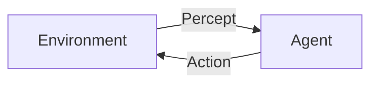
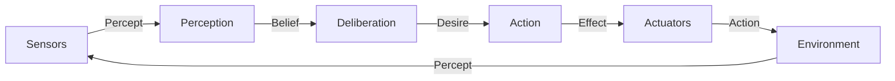

# AI Agent: AI的下一个风口 技术边界与未来无限

## 1.背景介绍

### 1.1 AI的兴起与发展历程

人工智能(AI)的概念可以追溯到20世纪50年代,当时一些先驱者提出了创建"思考机器"的想法。自那以后,AI经历了起伏跌宕的发展历程。20世纪80年代,专家系统和机器学习算法的出现,使AI获得了新的发展动力。进入21世纪,深度学习、大数据和强大的计算能力为AI带来了新的飞跃。

### 1.2 AI Agent的重要性

在当前AI发展的新阶段,AI Agent无疑成为了备受关注的热点领域。AI Agent指的是具有一定自主性、可以感知环境、做出决策并采取行动的智能体系统。它能够根据预定目标,通过与环境的交互学习并优化自身行为,展现出类似于人类的认知能力。

AI Agent已经广泛应用于机器人控制、游戏AI、智能助理等多个领域,未来还有望在自动驾驶、智能制造等更多领域发挥重要作用。它代表了AI发展的最新方向,对于推动AI技术的创新具有重要意义。

## 2.核心概念与联系  

### 2.1 AI Agent的定义

AI Agent是一种能够感知环境、处理信息、做出决策并采取行动的智能系统。它可以被形象地比喻为一个"理性主体",具备类似人类的认知和决策能力。一个理想的AI Agent应当具备以下几个核心特征:

- **自主性(Autonomy)**: 能够独立地做出决策和行为,而不需要人工干预。
- **反应性(Reactivity)**: 能够及时感知环境变化并做出相应反应。
- **主动性(Pro-activeness)**: 不仅被动响应环境,还能够主动地制定目标并采取行动。
- **社会能力(Social Ability)**: 能够与其他Agent进行协作和交互。

### 2.2 Agent与环境的交互

AI Agent并不是一个孤立的系统,它需要与外部环境进行交互。Agent通过**感知器(Sensors)**获取环境信息,通过**执行器(Actuators)**对环境产生影响。Agent和环境之间的交互过程可以用下面的流程图描述:



其中:

- **Percept**表示Agent从环境获取的感知信息,如视觉、声音等。
- **Action**表示Agent对环境施加的行为,如移动、控制等。

Agent的目标是基于当前的感知信息,选择最优的行为序列,以最大化某种预定的**效用函数(Utility Function)**,即达成既定目标。

### 2.3 Agent程序的基本结构

从程序设计的角度看,一个AI Agent通常由以下几个核心组件构成:



- **感知器(Sensors)**: 获取环境信息的输入设备,如相机、麦克风等。
- **感知模块(Perception)**: 对感知器输入的原始数据进行处理,形成对环境的内部表示(Belief)。
- **审议模块(Deliberation)**: 根据当前的信念状态和目标效用函数,决策下一步的行为(Desire)。  
- **执行模块(Action)**: 将决策的行为指令转换为对执行器的具体控制指令。
- **执行器(Actuators)**: 对环境施加实际的行为影响,如机器人的机械臂等。

这种基本结构体现了AI Agent感知、思考和行动的基本流程,是设计Agent系统的通用框架。

## 3.核心算法原理具体操作步骤

设计一个高效智能的AI Agent系统,核心就是要解决如何根据当前的信念状态,选择最优的行为序列。这可以通过搜索和规划算法来实现。

### 3.1 问题形式化

首先我们需要将Agent的决策问题形式化,定义为一个**马尔可夫决策过程(Markov Decision Process, MDP)**:

- 一组可能的**状态(States) S**,表示Agent对环境的信念。
- 一组**行为(Actions) A**,表示Agent可执行的动作。  
- 一个**状态转移函数(Transition Function) T(s, a, s')**,表示在状态s执行行为a后,转移到状态s'的概率。
- 一个**奖励函数(Reward Function) R(s, a, s')**,表示在状态s执行行为a后,转移到s'获得的即时奖励。

Agent的目标是找到一个**策略(Policy) $\pi: S \rightarrow A$**,使得按照这个策略选择行为,可以最大化从当前状态开始获得的**累积奖励(Return)**的期望值:

$$G_t = \sum_{k=0}^{\infty} \gamma^k R_{t+k+1}$$

其中$\gamma$是一个衰减因子,用于权衡即时奖励和长期奖励的权重。

### 3.2 价值函数与贝尔曼方程

对于一个给定的策略$\pi$,我们可以定义其在状态s的**价值函数(Value Function)** $V^{\pi}(s)$为:

$$V^{\pi}(s) = \mathbb{E}_{\pi}\left[G_t|S_t=s\right]$$

即按照策略$\pi$执行时,从状态s开始获得的累积奖励的期望值。同理,我们可以定义在状态s执行行为a的**动作价值函数(Action-Value Function)** $Q^{\pi}(s, a)$:

$$Q^{\pi}(s, a) = \mathbb{E}_{\pi}\left[G_t|S_t=s, A_t=a\right]$$

价值函数和动作价值函数遵循**贝尔曼方程(Bellman Equations)**:

$$\begin{aligned}
V^{\pi}(s) &= \sum_{a}\pi(a|s)\sum_{s'}T(s, a, s')\left[R(s, a, s') + \gamma V^{\pi}(s')\right] \\
Q^{\pi}(s, a) &= \sum_{s'}T(s, a, s')\left[R(s, a, s') + \gamma \sum_{a'}\pi(a'|s')Q^{\pi}(s', a')\right]
\end{aligned}$$

这些方程揭示了当前状态的价值函数与下一状态的价值函数之间的递归关系,为求解最优策略提供了理论基础。

### 3.3 动态规划算法

如果已知MDP的完整模型(状态转移函数T和奖励函数R),我们可以使用**价值迭代(Value Iteration)**或**策略迭代(Policy Iteration)**等动态规划算法来求解最优策略$\pi^*$及其对应的最优价值函数$V^*$。

以价值迭代为例,算法从一个任意的初始价值函数$V_0$开始,不断应用贝尔曼方程更新价值函数,直到收敛:

$$V_{k+1}(s) = \max_a \sum_{s'}T(s, a, s')\left[R(s, a, s') + \gamma V_k(s')\right]$$

当价值函数收敛后,对应的最优策略就是:

$$\pi^*(s) = \arg\max_a \sum_{s'}T(s, a, s')\left[R(s, a, s') + \gamma V^*(s')\right]$$

### 3.4 时序差分学习

在实际应用中,我们往往无法获知环境的完整模型。这时可以使用**时序差分(Temporal Difference, TD)学习**等强化学习算法,基于Agent与环境的实际交互数据,在线更新价值函数和策略。

以 **Q-Learning** 算法为例,在每个时间步,Agent执行行为a观测到下一状态s'和即时奖励r,则可以更新动作价值函数:

$$Q(s, a) \leftarrow Q(s, a) + \alpha\left[r + \gamma\max_{a'}Q(s', a') - Q(s, a)\right]$$

其中$\alpha$是学习率参数。通过不断更新Q函数,最终可以收敛到最优的Q*函数,对应的贪婪策略$\pi^*(s)=\arg\max_aQ^*(s, a)$即为最优策略。

## 4.数学模型和公式详细讲解举例说明

为了更好地理解AI Agent的数学模型,我们用一个简单的示例来具体说明。

### 4.1 示例:机器人导航问题

假设有一个小型机器人需要在一个$4\times 4$的网格世界中导航,如下图所示:

```
  +---+---+---+---+
  | # |   |   |   |
  +---+---+---+---+
  |   |   |   |   |
  +---+---+---+---+
  |   |   |   | T |
  +---+---+---+---+
  |   |   |   |   |
  +---+---+---+---+
```

其中`#`表示障碍物,`T`表示目标位置。机器人可以执行四个基本动作`{上, 下, 左, 右}`来移动到相邻的格子。机器人的目标是从起始位置出发,找到一条路径到达目标位置`T`。

### 4.2 MDP形式化

我们将这个问题形式化为一个MDP:

- **状态S**: 机器人在网格世界中的位置坐标$(x, y)$,共有$16-1=15$个有效状态(排除障碍物)。
- **行为A**: 四个基本动作`{上, 下, 左, 右}`。
- **状态转移函数T**: 确定性的,例如在$(1, 1)$位置执行`右`动作,转移到$(1, 2)$的概率为1。如果动作会撞到障碍物或边界,则保持原状态不变。
- **奖励函数R**: 在目标状态`T`获得终止奖励+1,其他状态和动作奖励为0。

### 4.3 价值迭代算法

我们使用价值迭代算法求解这个MDP问题。首先,初始化价值函数为0:$V_0(s)=0, \forall s$。然后不断应用贝尔曼方程更新价值函数:

$$V_{k+1}(s) = \max_a \sum_{s'}T(s, a, s')\left[R(s, a, s') + \gamma V_k(s')\right]$$

其中我们取$\gamma=1$表示不对未来奖励进行衰减。算法迭代若干次后,价值函数将收敛到最优解$V^*$。

以起始状态$(1, 1)$为例,价值函数的迭代过程如下:

$$
\begin{aligned}
V_0(1, 1) &= 0 \\
V_1(1, 1) &= \max\left\{0, 0, 0, 0\right\} = 0 \\
V_2(1, 1) &= \max\left\{0, 0, 0, R(1, 2) + \gamma V_1(1, 2)\right\} = 0 \\
V_3(1, 1) &= \max\left\{0, 0, 0, R(1, 2) + \gamma\max\left\{0, 0, 0, R(1, 3) + \gamma V_2(1, 3)\right\}\right\} = 0 \\
&\vdots \\
V_5(1, 1) &= \max\left\{0, 0, 0, R(1, 2) + \gamma\max\left\{0, 0, 0, R(1, 3) + \gamma\max\left\{0, 0, R(2, 3) + \gamma V_4(2, 3)\right\}\right\}\right\} = 0.8 \\
&\vdots \\
V^*(1, 1) &= 1
\end{aligned}
$$

最终,$V^*(1, 1)=1$表示从起点$(1, 1)$出发,能够到达目标位置并获得奖励+1。基于$V^*$,我们可以推导出最优策略$\pi^*$:对于每个状态s,执行可以使$V^*(s)$最大化的行为。

### 4.4 时序差分学习

如果无法获知环境的完整模型,我们可以使用时序差分学习算法,基于实际的环境交互数据来学习最优的价值函数和策略。

以Q-Learning算法为例,我们初始化动作价值函数$Q(s, a)=0$,然后在每个时间步根据下式更新Q函数:

$$Q(s, a) \leftarrow Q(s, a) + \alpha\left[r + \gamma\max_{a'}Q(s', a') - Q(s, a)\right]$$

其中$\alpha$是学习率参数,控制学习的步长。通过多次试错和学习,Q函数将收敛到最优解$Q^*$,对