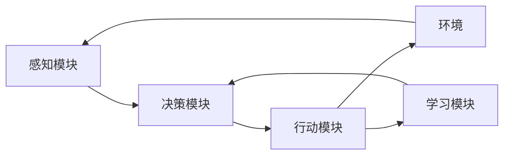

# AI Agent: AI的下一个风口 数据治理与社会伦理

作者：禅与计算机程序设计艺术

## 1. 背景介绍

### 1.1 AI Agent的兴起

近年来，人工智能 (AI) 技术取得了显著的进步，其应用范围不断扩大，从图像识别到自然语言处理，再到自动驾驶，AI正在改变着我们的生活方式。在AI发展的浪潮中，AI Agent 作为一种新型的AI应用形式，正逐渐崭露头角，并被视为AI的下一个风口。

AI Agent, 又称为人工智能代理，本质上是一种能够感知环境、进行决策和采取行动的自主软件程序。与传统的AI系统不同，AI Agent 更加注重与环境的交互，并能够根据环境变化动态调整自身的行为，以实现预设的目标。

### 1.2 AI Agent的应用领域

AI Agent 的应用领域非常广泛，涵盖了各个行业和领域，例如：

* **客户服务**: AI Agent 可以作为虚拟客服，为客户提供24小时不间断的服务，解答问题、处理投诉、推荐产品等。
* **个人助理**: AI Agent 可以作为个人助理，帮助用户管理日程、安排行程、预订酒店、购买商品等。
* **医疗保健**: AI Agent 可以协助医生进行诊断、制定治疗方案、监测患者病情等。
* **金融**: AI Agent 可以用于风险评估、欺诈检测、投资组合管理等。
* **教育**: AI Agent 可以作为个性化学习助手，根据学生的学习情况提供定制化的学习内容和指导。

### 1.3 AI Agent带来的机遇与挑战

AI Agent 的出现为我们带来了前所未有的机遇，同时也带来了一系列的挑战。

* **机遇**:
    * **提高效率和生产力**: AI Agent 可以自动完成许多繁琐的任务，从而提高效率和生产力。
    * **提升用户体验**: AI Agent 可以提供个性化的服务，从而提升用户体验。
    * **创造新的商业模式**: AI Agent 可以催生新的商业模式，例如基于AI Agent的平台经济。
* **挑战**:
    * **数据安全和隐私**: AI Agent 需要访问大量的个人数据，因此数据安全和隐私保护至关重要。
    * **伦理和社会影响**: AI Agent 的决策可能会产生伦理和社会影响，例如算法歧视、工作岗位流失等。
    * **技术成熟度**: AI Agent 仍处于发展初期，技术成熟度有待提高。

## 2. 核心概念与联系

### 2.1 AI Agent的定义与特征

AI Agent 是指能够感知环境、进行决策和采取行动的自主软件程序。其核心特征包括：

* **自主性**: AI Agent 能够自主地感知环境、做出决策和采取行动，无需人工干预。
* **目标导向**: AI Agent 的行为由其目标驱动，它会根据目标采取相应的行动。
* **适应性**: AI Agent 能够根据环境变化动态调整自身的行为，以适应新的环境。
* **学习能力**: AI Agent 可以从经验中学习，不断提高自身的性能。

### 2.2 AI Agent的架构

AI Agent 的架构通常包括以下几个核心组件:

* **感知模块**: 负责感知环境信息，例如图像、声音、文本等。
* **决策模块**: 负责根据感知到的信息进行决策，例如选择行动方案。
* **行动模块**: 负责执行决策模块选择的行动方案，例如移动、操作物体等。
* **学习模块**: 负责从经验中学习，不断提高 AI Agent 的性能。



### 2.3 AI Agent与其他AI技术的联系

AI Agent 与其他AI技术密切相关，例如：

* **机器学习**: AI Agent 的学习模块通常基于机器学习算法，例如强化学习、监督学习等。
* **自然语言处理**: AI Agent 需要理解和生成自然语言，例如与用户进行交互、从文本中提取信息等。
* **计算机视觉**: AI Agent 需要感知和理解图像信息，例如识别物体、导航等。
* **机器人**: AI Agent 可以控制机器人进行操作，例如抓取物体、移动等。

## 3. 核心算法原理具体操作步骤

### 3.1 强化学习

强化学习是一种机器学习方法，其目标是训练 AI Agent 在与环境交互的过程中学习最佳的行为策略。强化学习的核心思想是通过试错来学习，AI Agent 通过不断尝试不同的行动，并根据环境的反馈来调整自身的策略，最终学习到能够最大化奖励的策略。

#### 3.1.1 强化学习的基本要素

强化学习包含以下基本要素：

* **Agent**:  AI Agent，即学习者。
* **Environment**: 环境，AI Agent 与之交互的对象。
* **State**: 状态，描述环境当前的情况。
* **Action**: 行动，AI Agent 可以采取的行动。
* **Reward**: 奖励，环境对 AI Agent 行动的反馈，用于指示行动的好坏。
* **Policy**: 策略，AI Agent 根据当前状态选择行动的规则。

#### 3.1.2 强化学习的算法流程

强化学习的算法流程如下：

1. AI Agent 观察环境当前状态 $s_t$。
2. AI Agent 根据策略 $\pi$ 选择行动 $a_t$。
3. AI Agent 执行行动 $a_t$，环境状态转变为 $s_{t+1}$，并返回奖励 $r_{t+1}$。
4. AI Agent 根据奖励 $r_{t+1}$ 更新策略 $\pi$。
5. 重复步骤 1-4，直到 AI Agent 学习到最佳策略。

#### 3.1.3 强化学习的算法分类

强化学习算法可以分为以下几类：

* **基于值函数的方法**: 学习状态或状态-行动对的值函数，例如 Q-learning、SARSA 等。
* **基于策略梯度的方法**: 直接学习策略，例如 REINFORCE、A2C、PPO 等。
* **Actor-Critic 方法**: 结合了值函数和策略梯度方法的优点，例如 A3C、DDPG、TD3 等。

### 3.2 模仿学习

模仿学习是一种机器学习方法，其目标是训练 AI Agent 模仿专家演示的行为。模仿学习的核心思想是通过观察专家的行为来学习，AI Agent 通过观察专家的行动轨迹，学习到能够模拟专家行为的策略。

#### 3.2.1 模仿学习的数据集

模仿学习的数据集通常由专家演示的行为轨迹组成，每个轨迹包含一系列的状态-行动对。

#### 3.2.2 模仿学习的算法流程

模仿学习的算法流程如下：

1. 收集专家演示的行为轨迹数据集。
2. 使用监督学习算法训练 AI Agent，使其能够根据当前状态预测专家的行动。
3. 使用训练好的 AI Agent 控制 AI Agent，使其能够模拟专家的行为。

#### 3.2.3 模仿学习的算法分类

模仿学习算法可以分为以下几类：

* **行为克隆**: 直接学习状态-行动映射，例如监督学习。
* **逆强化学习**: 学习奖励函数，然后使用强化学习算法学习策略。

## 4. 数学模型和公式详细讲解举例说明

### 4.1 马尔可夫决策过程 (MDP)

马尔可夫决策过程 (Markov Decision Process, MDP) 是强化学习的数学基础，它描述了 AI Agent 与环境交互的过程。

#### 4.1.1 MDP 的定义

MDP 是一个五元组 $<S, A, P, R, \gamma>$，其中：

* $S$ 是状态空间，表示环境所有可能的状态。
* $A$ 是行动空间，表示 AI Agent 可以采取的所有行动。
* $P$ 是状态转移概率函数，表示在状态 $s$ 下采取行动 $a$ 后转移到状态 $s'$ 的概率，记作 $P(s'|s, a)$。
* $R$ 是奖励函数，表示在状态 $s$ 下采取行动 $a$ 后获得的奖励，记作 $R(s, a)$。
* $\gamma$ 是折扣因子，用于衡量未来奖励的价值。

#### 4.1.2 MDP 的目标

MDP 的目标是找到一个策略 $\pi$，使得 AI Agent 在与环境交互的过程中能够获得最大的累积奖励。累积奖励定义为：

$$
G_t = \sum_{k=0}^{\infty} \gamma^k R_{t+k+1}
$$

其中，$G_t$ 表示从时刻 $t$ 开始的累积奖励。

#### 4.1.3 MDP 的求解方法

MDP 的求解方法主要包括动态规划和蒙特卡洛方法。

### 4.2 值函数

值函数用于评估状态或状态-行动对的价值。

#### 4.2.1 状态值函数

状态值函数 $V^{\pi}(s)$ 表示在状态 $s$ 下遵循策略 $\pi$ 的期望累积奖励，定义为：

$$
V^{\pi}(s) = \mathbb{E}_{\pi}[G_t | S_t = s]
$$

#### 4.2.2  状态-行动值函数 (Q 函数)

状态-行动值函数 $Q^{\pi}(s, a)$ 表示在状态 $s$ 下采取行动 $a$ 并遵循策略 $\pi$ 的期望累积奖励，定义为：

$$
Q^{\pi}(s, a) = \mathbb{E}_{\pi}[G_t | S_t = s, A_t = a]
$$

### 4.3  贝尔曼方程

贝尔曼方程是值函数满足的递归关系式。

#### 4.3.1 状态值函数的贝尔曼方程

$$
V^{\pi}(s) = \sum_{a \in A} \pi(a|s) \sum_{s' \in S} P(s'|s, a) [R(s, a) + \gamma V^{\pi}(s')]
$$

#### 4.3.2  状态-行动值函数的贝尔曼方程

$$
Q^{\pi}(s, a) = \sum_{s' \in S} P(s'|s, a) [R(s, a) + \gamma \sum_{a' \in A} \pi(a'|s') Q^{\pi}(s', a')]
$$

### 4.4  Q-learning 算法

Q-learning 是一种基于值函数的强化学习算法，其目标是学习状态-行动值函数 (Q 函数)。

#### 4.4.1 Q-learning 算法的更新规则

$$
Q(s, a) \leftarrow Q(s, a) + \alpha [r + \gamma \max_{a'} Q(s', a') - Q(s, a)]
$$

其中，$\alpha$ 是学习率，$r$ 是奖励，$s'$ 是下一个状态，$a'$ 是下一个行动。

#### 4.4.2 Q-learning 算法的流程

1. 初始化 Q 函数。
2. 循环：
    * 观察环境当前状态 $s$。
    * 选择行动 $a$ (例如使用 $\epsilon$-greedy 策略)。
    * 执行行动 $a$，观察奖励 $r$ 和下一个状态 $s'$。
    * 更新 Q 函数：$Q(s, a) \leftarrow Q(s, a) + \alpha [r + \gamma \max_{a'} Q(s', a') - Q(s, a)]$。
    * 更新状态：$s \leftarrow s'$。
3. 直到 Q 函数收敛。

## 5. 项目实践：代码实例和详细解释说明

### 5.1  CartPole 环境

CartPole 是一个经典的强化学习环境，其目标是控制一根杆子使其保持平衡。

#### 5.1.1 CartPole 环境的描述

CartPole 环境包含以下要素：

* **状态**: 杆子的角度和角速度，小车的位移和速度。
* **行动**: 向左或向右移动小车。
* **奖励**: 每个时间步的奖励为 1，如果杆子倾斜超过一定角度或小车超出边界，则游戏结束。

#### 5.1.2  使用 Q-learning 算法解决 CartPole 问题

```python
import gym
import numpy as np

# 创建 CartPole 环境
env = gym.make('CartPole-v1')

# 初始化 Q 函数
Q = np.zeros([env.observation_space.n, env.action_space.n])

# 设置超参数
alpha = 0.1  # 学习率
gamma = 0.99  # 折扣因子
epsilon = 0.1  # 探索概率

# 训练循环
for episode in range(1000):
    # 初始化状态
    state = env.reset()

    # 循环直到游戏结束
    done = False
    while not done:
        # 选择行动
        if np.random.uniform(0, 1) < epsilon:
            action = env.action_space.sample()  # 随机选择行动
        else:
            action = np.argmax(Q[state, :])  # 选择 Q 值最大的行动

        # 执行行动
        next_state, reward, done, info = env.step(action)

        # 更新 Q 函数
        Q[state, action] += alpha * (reward + gamma * np.max(Q[next_state, :]) - Q[state, action])

        # 更新状态
        state = next_state

# 测试训练好的 AI Agent
state = env.reset()
done = False
while not done:
    # 选择行动
    action = np.argmax(Q[state, :])

    # 执行行动
    next_state, reward, done, info = env.step(action)

    # 更新状态
    state = next_state

    # 渲染环境
    env.render()

# 关闭环境
env.close()
```

### 5.2  自定义 AI Agent

除了使用现有的强化学习环境，我们也可以自定义 AI Agent 来解决特定问题。

#### 5.2.1  自定义环境

首先，我们需要定义 AI Agent 与之交互的环境。例如，我们可以定义一个简单的迷宫环境，AI Agent 的目标是在迷宫中找到出口。

```python
class Maze:
    def __init__(self, maze):
        self.maze = maze
        self.start = (0, 0)
        self.goal = (len(maze) - 1, len(maze[0]) - 1)

    def reset(self):
        self.current_state = self.start
        return self.current_state

    def step(self, action):
        row, col = self.current_state
        if action == 0:  # 上移
            row -= 1
        elif action == 1:  # 下移
            row += 1
        elif action == 2:  # 左移
            col -= 1
        elif action == 3:  # 右移
            col += 1

        # 检查是否超出边界
        if row < 0 or row >= len(self.maze) or col < 0 or col >= len(self.maze[0]):
            return self.current_state, -1, False, {}

        # 检查是否遇到障碍物
        if self.maze[row][col] == 1:
            return self.current_state, -1, False, {}

        # 更新当前状态
        self.current_state = (row, col)

        # 检查是否到达目标
        if self.current_state == self.goal:
            return self.current_state, 1, True, {}

        return self.current_state, 0, False, {}
```

#### 5.2.2  定义 AI Agent

接下来，我们需要定义 AI Agent，例如可以使用 Q-learning 算法。

```python
class QLearningAgent:
    def __init__(self, env, alpha=0.1, gamma=0.99, epsilon=0.1):
        self.env = env
        self.alpha = alpha
        self.gamma = gamma
        self.epsilon = epsilon
        self.Q = np.zeros([env.maze.shape[0] * env.maze.shape[1], env.action_space.n])

    def get_state_index(self, state):
        return state[0] * self.env.maze.shape[1] + state[1]

    def choose_action(self, state):
        if np.random.uniform(0, 1) < self.epsilon:
            return self.env.action_space.sample()
        else:
            return np.argmax(self.Q[self.get_state_index(state), :])

    def learn(self, state, action, reward, next_state):
        state_index = self.get_state_index(state)
        next_state_index = self.get_state_index(next_state)
        self.Q[state_index, action] += self.alpha * (
            reward + self.gamma * np.max(self.Q[next_state_index, :]) - self.Q[state_index, action]
        )
```

#### 5.2.3  训练 AI Agent

最后，我们可以训练 AI Agent，使其能够在迷宫中找到出口。

```python
# 定义迷宫
maze = [
    [0, 0, 0, 0],
    [0, 1, 0, 1],
    [0, 0, 0, 0],
    [1, 1, 0, 0],
]

# 创建环境
env = Maze(maze)

# 创建 AI Agent
agent = QLearningAgent(env)