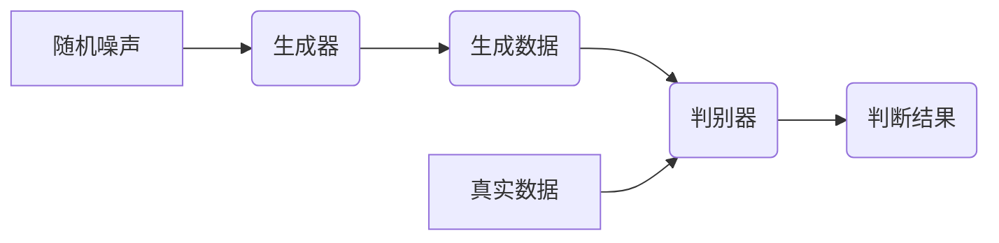
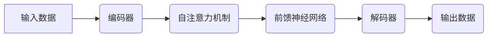

## AIGC与未来社会：AI塑造未来世界

作者：禅与计算机程序设计艺术


## 1. 背景介绍

### 1.1 人工智能发展历程

人工智能(Artificial Intelligence, AI) 的概念最早可以追溯到上世纪50年代，经历了三次浪潮。第一次浪潮以符号主义为代表，主要基于逻辑推理和符号运算；第二次浪潮以连接主义为代表，以人工神经网络为核心，在语音识别、图像识别等领域取得了突破；当前，我们正处于第三次浪潮，以深度学习为代表，人工智能在各个领域都取得了令人瞩目的成就，并逐渐渗透到我们生活的方方面面。

### 1.2 AIGC的兴起与发展

AIGC (AI Generated Content)，即人工智能生成内容，是人工智能技术应用的新疆域。不同于传统的 PGC (Professionally Generated Content，专业生成内容) 和 UGC (User Generated Content，用户生成内容), AIGC 利用人工智能算法自动生成各种形式的内容，例如文本、图像、音频、视频等。

AIGC 的发展得益于深度学习技术的突破、大数据的积累以及算力的提升。近年来，随着生成对抗网络 (Generative Adversarial Networks, GANs)、Transformer 等深度学习模型的出现，AIGC 的生成能力得到了显著提升，生成的內容质量也越来越高，逐渐接近甚至超越人类水平。

### 1.3 AIGC的应用领域

AIGC 已经在多个领域展现出巨大的应用潜力，例如：

* **文本生成**: 自动生成新闻报道、小说、诗歌、剧本等。
* **图像生成**:  生成各种风格的图像、进行图像修复、图像风格迁移等。
* **音频生成**: 生成音乐、语音合成、音效制作等。
* **视频生成**: 生成视频片段、进行视频剪辑、视频特效制作等。

## 2. 核心概念与联系

### 2.1 AIGC 核心技术

#### 2.1.1  自然语言处理 (NLP) 

自然语言处理是人工智能领域的一个重要分支，其目标是让计算机能够理解和处理人类语言。在 AIGC 中，NLP 主要应用于文本生成、机器翻译、情感分析等方面。

#### 2.1.2 计算机视觉 (CV)

计算机视觉是人工智能领域另一个重要分支，其目标是让计算机能够“看”懂图像和视频。在 AIGC 中，CV 主要应用于图像生成、图像识别、目标检测等方面。

#### 2.1.3  生成模型

生成模型是 AIGC 的核心，其主要作用是学习数据的概率分布，并根据学习到的分布生成新的数据。常见的生成模型包括：

* **生成对抗网络 (GANs)**
* **变分自编码器 (VAEs)**
* **自回归模型 (Autoregressive Models)**
* **扩散模型 (Diffusion Models)**


### 2.2 AIGC 与其他技术的联系

AIGC 的发展离不开其他技术的支持，例如：

* **云计算**:  为 AIGC 提供强大的计算和存储资源。
* **大数据**: 为 AIGC 提供海量的训练数据。
* **物联网**: 为 AIGC 提供丰富的应用场景。

## 3. 核心算法原理具体操作步骤

### 3.1 生成对抗网络 (GANs)

#### 3.1.1 原理

GANs 由两个神经网络组成：生成器 (Generator) 和判别器 (Discriminator)。生成器的目标是生成尽可能逼真的数据，判别器的目标是区分真实数据和生成器生成的数据。两个网络相互对抗，不断优化，最终生成器可以生成以假乱真的数据。

#### 3.1.2 操作步骤

1.  准备训练数据集，包含真实数据样本。
2.  定义生成器网络结构，接收随机噪声作为输入，输出生成数据。
3.  定义判别器网络结构，接收真实数据或生成数据作为输入，输出判断结果 (真实或虚假)。
4.  训练过程中，首先固定判别器，训练生成器，使其生成的样本能够欺骗判别器。然后固定生成器，训练判别器，使其能够更好地分辨真实数据和生成数据。
5.  重复步骤 4，直到生成器生成的样本质量达到要求。

#### 3.1.3  Mermaid 流程图



### 3.2  Transformer

#### 3.2.1 原理

Transformer 是一种基于自注意力机制 (Self-attention) 的神经网络模型，最初应用于自然语言处理领域，后来也被应用于图像生成等领域。自注意力机制可以让模型关注输入序列中不同位置的信息，从而更好地理解上下文关系。

#### 3.2.2 操作步骤

1.  将输入数据编码成向量表示。
2.  利用多头自注意力机制学习输入序列中不同位置之间的关系。
3.  利用前馈神经网络对每个位置的向量表示进行非线性变换。
4.  重复步骤 2-3 多次，得到最终的输出表示。

#### 3.2.3  Mermaid 流程图




## 4. 数学模型和公式详细讲解举例说明

### 4.1  生成对抗网络 (GANs)

#### 4.1.1  目标函数

GANs 的目标函数可以表示为：

$$ \min_G \max_D V(D, G) = \mathbb{E}_{x \sim p_{data}(x)}[\log D(x)] + \mathbb{E}_{z \sim p_z(z)}[\log(1 - D(G(z)))] $$

其中：

* $G$ 表示生成器
* $D$ 表示判别器
* $x$ 表示真实数据
* $z$ 表示随机噪声
* $p_{data}(x)$ 表示真实数据的概率分布
* $p_z(z)$ 表示随机噪声的概率分布

#### 4.1.2  训练过程

GANs 的训练过程可以看作是生成器和判别器之间玩的一个零和博弈。生成器的目标是尽可能地生成以假乱真的数据，从而使判别器无法区分真实数据和生成数据；而判别器的目标是尽可能地分辨出真实数据和生成数据。

在训练过程中，生成器和判别器交替训练：

* **训练判别器**: 固定生成器，将真实数据和生成数据输入判别器，根据判别器的输出结果更新判别器的参数，使其能够更好地分辨真实数据和生成数据。
* **训练生成器**: 固定判别器，将随机噪声输入生成器，根据判别器的输出结果更新生成器的参数，使其能够生成更逼真的数据。

### 4.2  Transformer

#### 4.2.1  自注意力机制

自注意力机制的计算过程可以表示为：

$$ Attention(Q, K, V) = softmax(\frac{QK^T}{\sqrt{d_k}})V $$

其中：

* $Q$ 表示查询矩阵 (Query)
* $K$ 表示键矩阵 (Key)
* $V$ 表示值矩阵 (Value)
* $d_k$ 表示键矩阵的维度
* $softmax$ 表示 Softmax 函数

#### 4.2.2  多头自注意力机制

多头自注意力机制是自注意力机制的扩展，它将输入数据分成多个头，每个头都进行自注意力计算，最后将所有头的结果拼接起来，得到最终的输出。

## 5. 项目实践：代码实例和详细解释说明

### 5.1  使用 GANs 生成手写数字图像

```python
import torch
import torch.nn as nn
import torchvision
import torchvision.transforms as transforms

# 定义生成器网络结构
class Generator(nn.Module):
    def __init__(self):
        super(Generator, self).__init__()
        self.main = nn.Sequential(
            nn.Linear(100, 128),
            nn.ReLU(),
            nn.Linear(128, 256),
            nn.ReLU(),
            nn.Linear(256, 784),
            nn.Tanh()
        )

    def forward(self, x):
        return self.main(x).view(-1, 1, 28, 28)

# 定义判别器网络结构
class Discriminator(nn.Module):
    def __init__(self):
        super(Discriminator, self).__init__()
        self.main = nn.Sequential(
            nn.Linear(784, 256),
            nn.LeakyReLU(0.2),
            nn.Linear(256, 128),
            nn.LeakyReLU(0.2),
            nn.Linear(128, 1),
            nn.Sigmoid()
        )

    def forward(self, x):
        return self.main(x.view(-1, 784))

# 初始化生成器和判别器
generator = Generator()
discriminator = Discriminator()

# 定义损失函数和优化器
criterion = nn.BCELoss()
optimizer_G = torch.optim.Adam(generator.parameters(), lr=0.0002)
optimizer_D = torch.optim.Adam(discriminator.parameters(), lr=0.0002)

# 加载 MNIST 数据集
train_dataset = torchvision.datasets.MNIST(root='./data', train=True, download=True, transform=transforms.ToTensor())
train_loader = torch.utils.data.DataLoader(train_dataset, batch_size=64, shuffle=True)

# 训练 GANs
for epoch in range(100):
    for i, (images, _) in enumerate(train_loader):
        # 训练判别器
        real_labels = torch.ones(images.size(0), 1)
        fake_labels = torch.zeros(images.size(0), 1)

        # 将真实数据输入判别器
        outputs = discriminator(images)
        d_loss_real = criterion(outputs, real_labels)

        # 生成随机噪声，并将其输入生成器
        noise = torch.randn(images.size(0), 100)
        fake_images = generator(noise)

        # 将生成数据输入判别器
        outputs = discriminator(fake_images.detach())
        d_loss_fake = criterion(outputs, fake_labels)

        # 计算判别器的总损失，并更新判别器的参数
        d_loss = d_loss_real + d_loss_fake
        optimizer_D.zero_grad()
        d_loss.backward()
        optimizer_D.step()

        # 训练生成器
        # 将随机噪声输入生成器
        noise = torch.randn(images.size(0), 100)
        fake_images = generator(noise)

        # 将生成数据输入判别器
        outputs = discriminator(fake_images)

        # 计算生成器的损失，并更新生成器的参数
        g_loss = criterion(outputs, real_labels)
        optimizer_G.zero_grad()
        g_loss.backward()
        optimizer_G.step()

    # 打印训练过程中的信息
    print(f'Epoch [{epoch+1}/100], d_loss: {d_loss.item():.4f}, g_loss: {g_loss.item():.4f}')

# 保存训练好的生成器模型
torch.save(generator.state_dict(), 'generator.pth')
```

### 5.2  代码解释

*  代码首先定义了生成器和判别器的网络结构。生成器接收一个 100 维的随机噪声向量作为输入，输出一个 28x28 的手写数字图像；判别器接收一个 28x28 的图像作为输入，输出一个介于 0 到 1 之间的数值，表示该图像为真实图像的概率。

*  然后，代码初始化了生成器和判别器，并定义了损失函数和优化器。

*  接下来，代码加载了 MNIST 数据集，并将数据转换成 PyTorch 张量。

*  最后，代码开始训练 GANs。在每个 epoch 中，代码遍历训练数据集，并交替训练判别器和生成器。

## 6. 实际应用场景

### 6.1  内容创作

* **新闻报道**:  自动生成新闻报道，特别是对于一些格式化程度较高的新闻，例如体育赛事报道、财经新闻等。
* **文学创作**:  辅助作家进行文学创作，例如生成小说情节、人物对话等。
* **广告文案**:  自动生成广告文案，提高广告创作效率。

### 6.2  设计创作

* **平面设计**:  自动生成海报、logo、banner 等平面设计作品。
* **产品设计**:  辅助设计师进行产品外观设计、UI 设计等。
* **游戏设计**: 自动生成游戏场景、角色、道具等。

### 6.3  教育领域

* **个性化学习**:  根据学生的学习情况，自动生成个性化的学习资料。
* **虚拟教师**:  打造虚拟教师，为学生提供在线辅导。
* **教育游戏**:  开发更具趣味性和互动性的教育游戏。

### 6.4  其他领域

* **医疗**: 辅助医生进行医学影像诊断、药物研发等。
* **金融**:  进行风险评估、欺诈检测等。
* **安防**:  进行人脸识别、目标跟踪等。


## 7. 总结：未来发展趋势与挑战

### 7.1 未来发展趋势

* **更加智能化**:  AIGC 将会更加智能化，能够根据用户的需求生成更精准、更优质的内容。
* **更加个性化**:  AIGC 将会更加个性化，能够根据用户的喜好生成定制化的内容。
* **更加多元化**:  AIGC 的应用场景将会更加多元化，渗透到更多领域。

### 7.2 面临的挑战

* **伦理问题**:  AIGC 生成的内容可能会存在版权问题、虚假信息问题等伦理问题。
* **技术瓶颈**:  AIGC 的生成质量还有待提高，例如文本生成中的逻辑问题、图像生成中的细节问题等。
* **社会影响**:  AIGC 的普及可能会对一些传统行业造成冲击，例如内容创作、设计行业等。


## 8. 附录：常见问题与解答

### 8.1  AIGC 会取代人类的创造力吗？

AIGC 不会取代人类的创造力，而是会成为人类创造力的补充和延伸。AIGC 可以帮助人类完成一些重复性、机械性的创作任务，从而释放人类的创造力，让人类可以专注于更高级别的创作。


### 8.2  AIGC 的发展会带来哪些风险？

AIGC 的发展可能会带来一些风险，例如版权问题、虚假信息问题等。为了应对这些风险，我们需要制定相应的法律法规，并加强对 AIGC 的监管。


### 8.3  如何才能更好地利用 AIGC？

为了更好地利用 AIGC，我们需要：

*   **提高自身的技术水平**:  学习和掌握 AIGC 相关的技术，例如机器学习、深度学习等。
*   **保持开放的心态**:  积极拥抱新技术，探索 AIGC 的应用场景。
*   **遵守伦理道德**:  在使用 AIGC 时，要遵守伦理道德，避免生成有害的内容。


总而言之，AIGC 作为人工智能领域的新兴技术，拥有着巨大的发展潜力和应用前景。相信在未来，AIGC 将会深刻地改变我们的生活方式，并为人类社会创造更多价值。 
