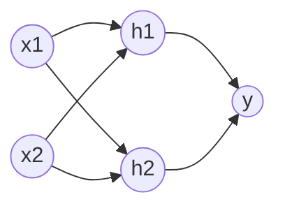

# AI人工智能深度学习算法：反向传播与优化方法

作者：禅与计算机程序设计艺术

## 1. 背景介绍

### 1.1 人工智能与深度学习概述
人工智能(Artificial Intelligence, AI)是计算机科学的一个重要分支,旨在研究和开发能够模拟、延伸和扩展人的智能的理论、方法、技术及应用系统。近年来,随着计算机硬件性能的不断提升以及大数据时代的到来,人工智能技术取得了突破性进展。其中,深度学习(Deep Learning, DL)作为人工智能的一个子领域,更是受到学术界和工业界的广泛关注。

深度学习是机器学习的一种方法,它试图使用包含复杂结构或由多重非线性变换构成的多个处理层对数据进行高层抽象的算法。深度学习在图像识别、语音识别、自然语言处理等多个领域取得了巨大成功,甚至在某些任务上已经超越了人类的表现。

### 1.2 反向传播算法的重要性
在深度学习的各种算法中,反向传播(Backpropagation, BP)算法可以说是最核心、最基础的算法。BP算法为训练多层网络提供了一种有效的方法,使得深度学习模型能够从大规模数据中学习特征表示,是深度学习得以实现的关键。

本文将重点介绍BP算法的原理和实现,探讨BP算法的优化方法,并通过实例演示BP算法的应用。通过本文的学习,读者能够深入理解BP算法的内在机制,掌握BP算法的实现要点,了解BP算法的优化思路,为进一步学习和应用深度学习打下坚实的基础。

## 2. 核心概念与联系

### 2.1 人工神经网络
人工神经网络(Artificial Neural Network, ANN)是一种模仿生物神经网络(动物的中枢神经系统,特别是大脑)的结构和功能的数学模型或计算模型,用于对函数进行估计或近似。人工神经网络由大量的人工神经元相互连接进行计算。大多数情况下人工神经网络能在外界信息的基础上改变内部结构,是一种自适应系统。

### 2.2 多层感知机
多层感知机(Multilayer Perceptron, MLP)是一种常见的人工神经网络结构。MLP由输入层、隐藏层和输出层组成,每层包含一定数量的神经元。每个神经元使用一个非线性的激活函数对输入进行变换。网络中的神经元通过带权重的连接进行信息传递。MLP能够学习输入与输出间复杂的非线性关系。

### 2.3 激活函数
激活函数是人工神经网络的重要组成部分,它引入了非线性因素,使得神经网络能够逼近任意复杂的函数。常用的激活函数包括Sigmoid函数、双曲正切(Tanh)函数、整流线性单元(ReLU)等。激活函数对神经网络的表达能力和训练效率有重要影响。

### 2.4 损失函数
损失函数用于衡量神经网络的预测输出与实际输出之间的差异大小。常见的损失函数包括均方误差(Mean Squared Error, MSE)、交叉熵(Cross Entropy)等。神经网络通过不断调整连接权重以最小化损失函数,从而实现学习的过程。

### 2.5 BP算法与梯度下降
BP算法本质上是一种基于梯度下降策略的优化算法。它通过计算损失函数关于每个权重参数的梯度,并沿梯度的反方向更新参数,使得每次迭代都能够减小损失函数的值,直至达到一个局部最小点。BP算法分为前向传播和反向传播两个阶段,前向传播计算网络的输出,反向传播计算损失函数的梯度并更新权重。

## 3. 核心算法原理具体操作步骤

### 3.1 前向传播
#### 3.1.1 输入层到隐藏层
对于输入层第i个神经元到隐藏层第j个神经元,其连接权重为$w_{ij}$,隐藏层第j个神经元的加权输入为:
$$
z_j = \sum_{i=1}^{n} w_{ij} x_i + b_j
$$
其中,$x_i$为输入层第i个神经元的输出,$b_j$为隐藏层第j个神经元的偏置项。

隐藏层第j个神经元的输出为:
$$
a_j = f(z_j)
$$

其中,$f(\cdot)$为激活函数。

#### 3.1.2 隐藏层到输出层  
类似地,对于隐藏层第j个神经元到输出层第k个神经元,其连接权重为$v_{jk}$,输出层第k个神经元的加权输入为:
$$ 
z_k = \sum_{j=1}^{m} v_{jk} a_j + b_k  
$$

其中,$a_j$为隐藏层第j个神经元的输出,$b_k$为输出层第k个神经元的偏置项。

输出层第k个神经元的输出为:
$$
y_k = f(z_k)  
$$

### 3.2 反向传播
#### 3.2.1 计算输出层误差
对于输出层第k个神经元,定义其误差项为:
$$
\delta_k = \frac{\partial E}{\partial z_k} = (y_k - t_k) \cdot f'(z_k)
$$  

其中,$E$为损失函数,$t_k$为该神经元的实际输出。

#### 3.2.2 计算隐藏层误差
对于隐藏层第j个神经元,定义其误差项为:
$$
\delta_j = \frac{\partial E}{\partial z_j} = \sum_{k=1}^{l} \delta_k \cdot v_{jk}  \cdot f'(z_j)
$$

其中,l为输出层神经元个数。可以看出,隐藏层误差是通过输出层误差和连接权重反向传播得到的。

#### 3.2.3 更新连接权重
根据梯度下降原理,以学习率$\eta$更新隐藏层到输出层的连接权重$v_{jk}$:

$$
v_{jk} := v_{jk} - \eta \cdot \frac{\partial E}{\partial v_{jk}} = v_{jk} - \eta \cdot \delta_k \cdot a_j
$$

类似地,更新输入层到隐藏层的连接权重$w_{ij}$:
$$
w_{ij} := w_{ij} - \eta \cdot \frac{\partial E}{\partial w_{ij}} = w_{ij} - \eta \cdot \delta_j \cdot x_i 
$$

### 3.3 算法流程总结
BP算法的完整流程可总结如下:
1. 随机初始化连接权重矩阵W和V
2. 开始迭代,直至达到停止条件(如误差足够小或达到最大迭代次数):
   a. 选取一个小批量(mini-batch)训练样本 
   b. 前向传播,计算每一层的加权输入和激活值
   c. 计算输出层误差
   d. 反向传播,计算隐藏层误差
   e. 根据误差梯度更新连接权重W和V
3. 输出训练后的权重矩阵作为结果

## 4. 数学模型和公式详细讲解举例说明

这一节我们通过一个具体的例子来说明BP算法涉及的数学原理。考虑一个如下图所示的简单MLP:



该网络包含2个输入单元$x_1,x_2$,2个隐藏单元$h_1,h_2$以及1个输出单元$y$。我们使用Sigmoid函数作为激活函数:

$$
f(z) = \frac{1}{1 + e^{-z}}
$$

其导数为:

$$
f'(z) = f(z) \cdot (1 - f(z))
$$

假设输入层到隐藏层的权重矩阵为:

$$
W = 
\begin{bmatrix}
w_{11} & w_{12} \\
w_{21} & w_{22} 
\end{bmatrix}
$$

隐藏层到输出层的权重向量为:

$$
V = [v_1, v_2]^T
$$

偏置项向量分别为:

$$
b = [b_1,b_2]^T, c
$$

给定一个训练样本$(x,t)$,其中$x=[x_1,x_2]^T$,网络前向传播的过程如下:

对于隐藏层第1个神经元:
$$
z_{h1} = w_{11}x_1 + w_{21}x_2 + b_1
$$

$$
h_1 = f(z_{h1})
$$

同理可得隐藏层第2个神经元的输出$h_2$。

对于输出层神经元:

$$
z_y = v_1 h_1 + v_2 h_2 + c
$$

$$  
y = f(z_y)
$$

使用均方误差损失函数:
$$
E = \frac{1}{2}(y - t)^2
$$

接下来进行反向传播。首先计算输出层误差项:

$$
\delta_y = (y-t) \cdot f'(z_y)
$$

然后计算隐藏层误差项:
$$
\delta_{h1} = v_1 \cdot \delta_y \cdot f'(z_{h1})
$$

$$
\delta_{h2} =v_2 \cdot \delta_y \cdot f'(z_{h2})  
$$

最后更新权重。对于隐藏层到输出层:
$$
v_1 := v_1 - \eta \cdot \delta_y \cdot h_1
$$

$$
v_2 := v_2 - \eta \cdot \delta_y \cdot h_2  
$$

对于输入层到隐藏层,以$w_{11}$为例: 
$$
w_{11} := w_{11} - \eta \cdot \delta_{h1} \cdot x_1
$$

其他权重更新方式类似。以上就是一次完整的前向传播和反向传播过程,重复迭代直至网络训练完成。

## 4. 项目实践：代码实例和详细解释说明

这一节我们使用Python实现一个简单的MLP,并用BP算法进行训练,以巩固前面学习的理论知识。

### 4.1 定义MLP类

首先定义一个MLP类,包含初始化、前向传播、反向传播、训练等方法。

```python
import numpy as np

class MLP:
    def __init__(self, input_size, hidden_size, output_size):
        self.W = np.random.randn(input_size, hidden_size)
        self.b = np.zeros((1, hidden_size))
        self.V = np.random.randn(hidden_size, output_size)  
        self.c = np.zeros((1, output_size))
        
    def sigmoid(self, x):
        return 1 / (1 + np.exp(-x))
    
    def forward(self, x):
        self.z = np.dot(x, self.W) + self.b
        self.h = self.sigmoid(self.z) 
        self.z2 = np.dot(self.h, self.V) + self.c
        self.y = self.sigmoid(self.z2)
        return self.y
        
    def backward(self, x, y, t, learning_rate):
        delta_y = (y - t) * y * (1 - y)
        delta_h = np.dot(delta_y, self.V.T) * self.h * (1 - self.h)
        
        self.V -= learning_rate * np.dot(self.h.T, delta_y)  
        self.c -= learning_rate * np.sum(delta_y, axis=0, keepdims=True)
        self.W -= learning_rate * np.dot(x.T, delta_h)
        self.b -= learning_rate * np.sum(delta_h, axis=0, keepdims=True)
        
    def train(self, X, T, learning_rate, epochs):
        for epoch in range(epochs):
            for x, t in zip(X, T):
                x = x.reshape(1, -1)  
                y = self.forward(x)
                self.backward(x, y, t, learning_rate)         
```

### 4.2 准备数据集

我们使用异或(XOR)问题作为测试数据集。XOR是一个典型的非线性分类问题,需要使用包含隐藏层的MLP来解决。

```python
X = np.array([[0, 0], [0, 1], [1, 0], [1, 1]])
T = np.array([[0], [1], [1], [0]])
```

### 4.3 训练模型

接下来,我们初始化一个MLP实例,设置合适的超参数,并进行训练。

```python
mlp = MLP