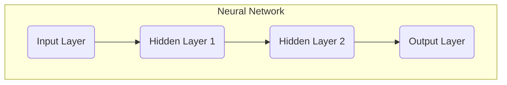

# AI人工智能深度学习算法：神经网络的复杂性与能力

## 1.背景介绍

### 1.1 人工智能的兴起

人工智能(AI)已经成为当今科技界最炙手可热的领域之一。从语音助手到自动驾驶汽车,从医疗诊断到金融分析,AI系统正在渗透到我们生活的方方面面。驱动这一变革的核心技术是机器学习(ML),尤其是深度学习(DL)。

### 1.2 深度学习的重要性

深度学习是机器学习的一个子领域,它模仿人脑的工作原理,通过对大量数据的学习来发现内在的数据模式。深度学习算法在计算机视觉、自然语言处理、语音识别等领域取得了突破性的进展,展现出超乎想象的能力。

### 1.3 神经网络的关键作用

神经网络是深度学习最核心的模型,其设计灵感来源于生物神经系统。神经网络通过构建由节点(神经元)和连接(权重)组成的网络结构,对输入数据进行层层传递和变换,最终输出所需结果。神经网络的复杂性和强大能力使其成为AI发展的关键推动力。

## 2.核心概念与联系  

### 2.1 神经网络的基本结构

神经网络由输入层、隐藏层和输出层组成。每一层由多个节点构成,节点之间通过加权连接进行信息传递。连接的权重决定了每个输入对输出的影响程度,权重会在训练过程中不断调整以最小化误差。



### 2.2 激活函数

激活函数决定了神经网络的非线性能力。常用的激活函数包括Sigmoid、Tanh、ReLU等。激活函数将节点的加权输入转换为输出,引入非线性因素,使神经网络能够模拟复杂的映射关系。

$$\text{ReLU}(x) = \max(0, x)$$

### 2.3 前向传播和反向传播

前向传播是神经网络对输入数据进行计算和预测的过程。反向传播则是根据预测结果和真实标签计算误差,并沿着网络反向传播,更新连接权重的过程。反向传播使用梯度下降等优化算法,不断调整权重以最小化损失函数。

### 2.4 网络架构

不同的神经网络架构被设计用于解决特定的问题。例如,卷积神经网络(CNN)擅长处理图像和视觉数据,循环神经网络(RNN)适用于序列数据,而Transformer则在自然语言处理任务中表现出色。

## 3.核心算法原理具体操作步骤

### 3.1 前向传播算法

前向传播算法描述了数据在神经网络中的传播过程,具体步骤如下:

1. 初始化网络权重和偏置项
2. 对于每个输入样本:
   a. 计算输入层到隐藏层的加权输入
   b. 应用激活函数得到隐藏层输出
   c. 重复上述步骤直到输出层
   d. 计算输出层与真实标签之间的损失

### 3.2 反向传播算法

反向传播算法用于根据损失函数的梯度更新网络权重,步骤如下:

1. 计算输出层损失函数关于输出的偏导数
2. 反向传播输出层误差到前一隐藏层
3. 计算隐藏层损失函数关于权重和偏置的偏导数
4. 更新隐藏层权重和偏置
5. 重复步骤2-4,直到输入层

### 3.3 优化算法

为了提高训练效率和收敛性,通常采用优化算法来更新权重,如:

- **随机梯度下降(SGD)**: 每次使用一个样本的梯度更新权重
- **动量SGD**: 在SGD基础上引入动量项,加快收敛
- **AdaGrad**: 自适应调整每个参数的学习率
- **Adam**: 结合动量和自适应学习率的优化算法

## 4.数学模型和公式详细讲解举例说明

### 4.1 损失函数

损失函数用于衡量神经网络预测输出与真实标签之间的差异,是优化的目标函数。常用的损失函数包括:

- **均方误差(MSE)**: $\frac{1}{n}\sum_{i=1}^{n}(y_i - \hat{y}_i)^2$
- **交叉熵(CE)**: $-\frac{1}{n}\sum_{i=1}^{n}[y_i\log(\hat{y}_i) + (1-y_i)\log(1-\hat{y}_i)]$

其中,$y_i$是真实标签,$\hat{y}_i$是预测输出。

### 4.2 反向传播公式

反向传播的核心是计算损失函数关于权重的梯度。对于单层网络:

$$\frac{\partial E}{\partial w_{jk}} = \frac{\partial E}{\partial y_j}\frac{\partial y_j}{\partial u_j}\frac{\partial u_j}{\partial w_{jk}}$$

其中,$E$是损失函数,$w_{jk}$是从第k个输入到第j个输出的权重,$y_j$是第j个输出,$u_j$是第j个输出单元的加权输入。

对于多层网络,使用链式法则沿网络进行反向传播计算每层的梯度。

### 4.3 权重更新

使用梯度下降法更新权重:

$$w_{jk} \leftarrow w_{jk} - \eta\frac{\partial E}{\partial w_{jk}}$$

其中,$\eta$是学习率,控制更新的步长。

### 4.4 正则化

为了防止过拟合,常采用正则化技术,如L1和L2正则化:

$$E_\text{reg} = E + \lambda\sum_w|w|^p$$

其中,$\lambda$是正则化强度,$p=1$为L1正则化,$p=2$为L2正则化。

## 4.项目实践:代码实例和详细解释说明

以下是一个使用Python和PyTorch框架实现的简单前馈神经网络示例,用于对MNIST手写数字数据集进行分类:

```python
import torch
import torch.nn as nn
import torch.nn.functional as F

# 定义神经网络模型
class Net(nn.Module):
    def __init__(self):
        super(Net, self).__init__()
        self.fc1 = nn.Linear(784, 128)  # 输入层到隐藏层
        self.fc2 = nn.Linear(128, 64)   # 隐藏层到隐藏层
        self.fc3 = nn.Linear(64, 10)    # 隐藏层到输出层

    def forward(self, x):
        x = x.view(-1, 784)  # 将输入图像展平为一维向量
        x = F.relu(self.fc1(x))  # 第一个隐藏层使用ReLU激活函数
        x = F.relu(self.fc2(x))  # 第二个隐藏层使用ReLU激活函数
        x = self.fc3(x)  # 输出层不使用激活函数
        return x

# 实例化模型
model = Net()

# 定义损失函数和优化器
criterion = nn.CrossEntropyLoss()
optimizer = torch.optim.SGD(model.parameters(), lr=0.01)

# 训练循环
for epoch in range(10):
    for data, target in train_loader:
        optimizer.zero_grad()  # 清除梯度
        output = model(data)  # 前向传播
        loss = criterion(output, target)  # 计算损失
        loss.backward()  # 反向传播
        optimizer.step()  # 更新权重
```

在这个示例中:

1. 我们定义了一个包含一个输入层、两个隐藏层和一个输出层的前馈神经网络模型。
2. 在`forward`函数中,我们实现了前向传播过程,包括输入数据的预处理、隐藏层的计算和输出层的计算。
3. 我们使用交叉熵损失函数和随机梯度下降优化器。
4. 在训练循环中,我们对每个小批量数据执行前向传播、损失计算、反向传播和权重更新。

这只是一个简单的示例,在实际应用中,您可能需要调整网络架构、超参数和优化策略,以获得更好的性能。

## 5.实际应用场景

神经网络在各个领域都有广泛的应用,下面列举一些典型的应用场景:

### 5.1 计算机视觉

- **图像分类**: 使用卷积神经网络(CNN)对图像进行分类,如识别手写数字、物体检测等。
- **目标检测和跟踪**: 结合CNN和其他技术,实现目标检测和实时跟踪。
- **图像分割**: 将图像像素级别分割为不同的对象或区域。
- **图像生成**: 使用生成对抗网络(GAN)生成逼真的图像。

### 5.2 自然语言处理

- **机器翻译**: 使用序列到序列模型(如Transformer)实现多语种之间的自动翻译。
- **文本生成**: 根据上下文生成连贯的自然语言文本。
- **情感分析**: 分析文本的情感倾向,如正面、负面等。
- **问答系统**: 根据知识库回答用户提出的自然语言问题。

### 5.3 语音识别

- **语音到文本**: 将语音信号转录为文本,广泛应用于智能助手、会议记录等场景。
- **说话人识别**: 根据语音特征识别说话人身份。

### 5.4 推荐系统

- **协同过滤**: 基于用户的历史行为和偏好,推荐感兴趣的商品或内容。

### 5.5 金融

- **股票预测**: 利用历史股票数据,预测未来股价走势。
- **欺诈检测**: 识别可疑的金融交易活动。

### 5.6 医疗

- **医学图像分析**: 分析X光、CT、MRI等医学影像,用于疾病诊断和治疗规划。
- **药物设计**: 利用神经网络预测分子结构和生物活性,加速新药研发。

## 6.工具和资源推荐

开发和部署神经网络模型需要合适的工具和资源,下面列出一些推荐:

### 6.1 深度学习框架

- **PyTorch**: 由Facebook开发的Python深度学习框架,具有动态计算图和良好的可读性。
- **TensorFlow**: 由Google开发的开源深度学习框架,支持多种语言和部署环境。
- **Keras**: 基于TensorFlow或Theano的高级神经网络API,简化模型构建过程。

### 6.2 GPU加速

- **CUDA**: NVIDIA提供的并行计算平台,支持在GPU上高效运行深度学习模型。
- **cuDNN**: NVIDIA开发的GPU加速深度神经网络库,可提高训练和推理性能。

### 6.3 数据集和竞赛平台

- **ImageNet**: 著名的大规模图像分类数据集,推动了深度学习在计算机视觉领域的发展。
- **COCO**: 用于目标检测、分割和字幕的大型数据集。
- **Kaggle**: 提供各种数据集和机器学习竞赛的平台,可以锻炼和展示技能。

### 6.4 开源库和资源

- **PyTorchHub**: PyTorch官方提供的预训练模型库,可直接下载使用。
- **Hugging Face**: 提供自然语言处理的预训练模型和工具。
- **OpenAI Gym**: 开源的强化学习环境集合,用于训练和评估智能体。
- **Arxiv.org**: 主要的学术论文预印本网站,可以了解最新的研究进展。

## 7.总结:未来发展趋势与挑战

### 7.1 发展趋势

神经网络的发展正在朝着以下方向前进:

- **更大更深的模型**: 随着计算能力的提升,更大规模的深度神经网络模型将变得可行,提高模型的表征能力。
- **自监督学习**: 利用大量无标注数据进行自监督预训练,再通过少量标注数据进行微调,减少对大规模标注数据的依赖。
- **多模态学习**: 融合视觉、语音、文本等多种模态数据,构建统一的多模态模型,实现跨模态的理解和生成。
- **可解释AI**: 开发能够解释内部决策过程的可解释神经网络模型,提高模型的透明度和可信度。
- **小型化部署**: 研究