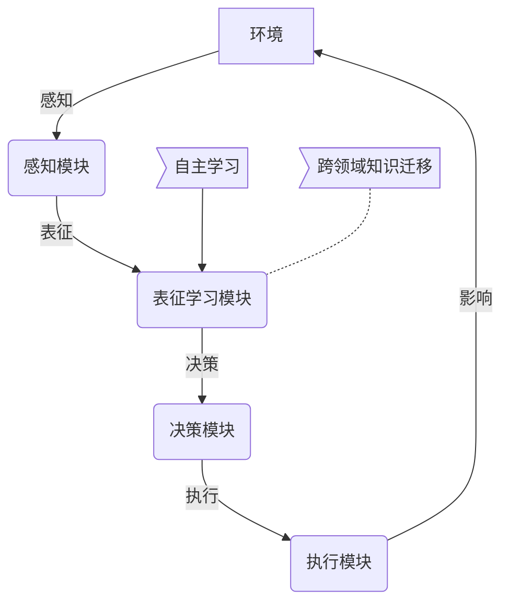

# AI人工智能深度学习算法：跨领域自主深度学习代理的集成

## 1.背景介绍

### 1.1 人工智能的发展历程

人工智能(Artificial Intelligence, AI)是当代科技发展中最具革命性和颠覆性的领域之一。自20世纪50年代AI概念被正式提出以来,经历了几个重要的发展阶段。早期的AI系统主要基于符号主义和逻辑推理,但由于知识库的构建困难和组合爆炸问题,遇到了瓶颈。

### 1.2 深度学习的兴起

21世纪初,深度学习(Deep Learning)技术的出现为AI注入了新的活力。深度学习是机器学习的一种技术,它通过对数据进行表征学习,从而使计算机在特定任务上的表现接近或超过人类。近年来,深度学习在计算机视觉、自然语言处理、语音识别等领域取得了突破性进展。

### 1.3 跨领域智能体的需求

然而,现有的深度学习模型大多局限于单一领域或任务,无法轻松迁移到其他领域。为了实现通用人工智能(Artificial General Intelligence, AGI),我们需要开发能够在多个领域自主学习和决策的智能体。这正是本文所探讨的"跨领域自主深度学习代理"(Cross-Domain Autonomous Deep Learning Agent)的核心思想。

## 2.核心概念与联系

### 2.1 深度学习代理

深度学习代理是指基于深度神经网络构建的智能体系统,能够从环境中获取信息、学习知识,并作出相应的决策和行为。深度学习代理主要包括以下几个关键组成部分:

- **感知模块**:通过传感器获取环境数据,如图像、文本、声音等。
- **表征学习模块**:利用深度神经网络对输入数据进行特征提取和表征学习。
- **决策模块**:基于学习到的表征,结合reward函数或策略,作出行为决策。
- **执行模块**:将决策转化为具体的行为,并影响环境的状态。

### 2.2 自主学习

自主学习(Autonomous Learning)是指智能体能够在没有或仅有少量人工标注数据的情况下,通过与环境的互动自主获取知识和经验。常见的自主学习方法包括:

- **强化学习**(Reinforcement Learning):通过试错并获取reward信号,不断优化策略。
- **自监督学习**(Self-Supervised Learning):利用环境中的冗余信息作为监督信号进行学习。
- **元学习**(Meta-Learning):从过去的任务中积累经验,加速新任务的学习。

### 2.3 跨领域知识迁移

跨领域知识迁移(Cross-Domain Knowledge Transfer)是指智能体能够将在一个领域学习到的知识和技能迁移到另一个领域,避免在每个新领域重新学习。这需要具备以下能力:

- **领域不变表示学习**:学习领域不变的数据表征,使其可以推广到不同领域。
- **知识蒸馏**:将已学习模型中的知识提取并注入新模型,实现知识迁移。
- **多任务学习**:同时学习多个不同但相关的任务,提高泛化能力。

### 2.4 Mermaid流程图

上图展示了跨领域自主深度学习代理的核心概念及其相互联系。代理通过感知模块获取环境信息,利用表征学习模块对数据进行特征提取,然后由决策模块作出行为决策,最终通过执行模块影响环境状态。在这个过程中,代理利用自主学习机制自主获取知识和经验,同时通过跨领域知识迁移实现跨领域泛化。

## 3.核心算法原理具体操作步骤 

### 3.1 自主探索与强化学习

#### 3.1.1 探索-利用权衡

在自主学习的过程中,代理需要在探索(Exploration)和利用(Exploitation)之间寻求平衡。探索新的状态有助于发现更优的策略,但过度探索也会带来额外的代价。常用的探索策略包括:

- ε-Greedy:以ε的概率选择随机行为,1-ε的概率选择当前最优行为。
- Softmax:根据各行为的价值函数值,按一定概率分布选择行为。

#### 3.1.2 时序差分学习

时序差分(Temporal Difference, TD)学习是强化学习中的一种重要技术,用于估计价值函数。其核心思想是利用后继状态的估计值,更新当前状态的估计值。

对于状态s,执行行为a,获得即时奖励r,转移到新状态s',TD误差为:

$$
\delta = r + \gamma V(s') - V(s)
$$

其中,γ为折现因子,V(s)为状态s的估计值。我们使用TD误差对价值函数进行迭代更新:

$$
V(s) \leftarrow V(s) + \alpha \delta
$$

α为学习率。通过不断更新,价值函数将逐渐收敛到最优解。

#### 3.1.3 Deep Q-Network (DQN)

DQN将深度神经网络应用于Q-Learning,用于近似表示Q函数。其核心思想是:

1. 使用经验回放池(Experience Replay)存储过往的状态转移数据。
2. 从经验回放池中采样数据,作为神经网络的输入,进行小批量梯度下降训练。
3. 利用目标网络(Target Network)的Q值进行bootstrapping,增强训练稳定性。

DQN的损失函数为:

$$
L = \mathbb{E}_{(s,a,r,s')\sim D}\left[(r + \gamma \max_{a'} Q(s',a';\theta^-) - Q(s,a;\theta))^2\right]
$$

其中,D为经验回放池,θ为当前网络参数,θ-为目标网络参数。

### 3.2 自监督学习

#### 3.2.1 对比学习

对比学习(Contrastive Learning)是自监督学习的一种重要方法。其基本思想是:从同一个样本中提取两个视图(View),并最大化这两个视图的相似度,同时最小化不同样本视图之间的相似度。

常用的对比学习损失函数为NT-Xent Loss:

$$
\ell_{i,j} = -\log\frac{\exp(\textrm{sim}(z_i, z_j) / \tau)}{\sum_{k=1}^{2N}\mathbb{1}_{[k\neq i]}\exp(\textrm{sim}(z_i, z_k)/\tau)}
$$

其中,zi和zj为同一样本的两个视图的表征向量,sim为相似度函数(如点积),τ为温度超参数。

通过这种方式,对比学习可以学习出良好的数据表征,而无需人工标注。

#### 3.2.2 掩码语言模型

掩码语言模型(Masked Language Model, MLM)是自然语言处理中的一种自监督学习方法。其基本思路是:在输入序列中随机掩码部分token,然后训练模型预测被掩码的token。

例如,对于输入序列"The [MASK] runs in the park",模型需要预测[MASK]处的token为"dog"。通过这种方式,语言模型可以学习到单词之间的上下文关系,而无需依赖人工标注的语料库。

MLM通常与Transformer等注意力模型相结合使用。训练目标是最大化被掩码token的条件概率:

$$
\max_\theta \sum_{t=1}^{T} \log P(x_t | x_{\\mask}, \theta)
$$

其中,θ为模型参数,x是原始序列,x_mask是掩码后的序列。

### 3.3 跨领域知识迁移

#### 3.3.1 领域不变表示学习

领域不变表示学习(Domain-Invariant Representation Learning)旨在学习能够跨领域泛化的数据表征。常用的方法包括:

- 域对抗训练(Domain Adversarial Training):通过对抗训练,使特征表示对领域无关。
- 最大均值差异(Maximum Mean Discrepancy):最小化不同领域数据分布的均值差异。

#### 3.3.2 知识蒸馏

知识蒸馏(Knowledge Distillation)是将教师模型(老模型)中的知识迁移到学生模型(新模型)的过程。常见的做法是:

1. 使用教师模型对大量unlabeled数据进行前向传播,获得soft target。
2. 将soft target作为监督信号,训练学生模型。
3. 在知识蒸馏损失函数的基础上,增加其他辅助损失项,如注意力匹配等。

知识蒸馏可以实现模型压缩和知识迁移,提高新模型的泛化能力。

#### 3.3.3 多任务学习

多任务学习(Multi-Task Learning)是同时优化多个相关任务的联合目标函数,使得模型可以获得更好的泛化性能。其基本思想是:在神经网络的底层提取共享特征,在顶层对应不同任务。

多任务学习的关键是设计合理的任务权重,平衡不同任务的重要性。此外,还需要注意任务之间的冲突、计算效率等问题。

## 4.数学模型和公式详细讲解举例说明

在上一节中,我们介绍了几种核心算法的原理和公式。现在,让我们通过具体的例子来进一步说明这些公式的含义和应用。

### 4.1 时序差分学习示例

假设我们有一个简单的网格世界,智能体的目标是从起点到达终点。在每个状态下,智能体可以选择上下左右四个动作。到达终点会获得+1的奖励,其他情况奖励为0。我们使用时序差分学习来估计每个状态的价值函数V(s)。

假设当前状态为(2,1),执行向右动作,转移到(3,1)状态,并获得0奖励。设置γ=0.9,初始V(2,1)=0.5,V(3,1)=0.7。根据时序差分公式:

$$
\begin{aligned}
\delta &= r + \gamma V(s') - V(s) \\
       &= 0 + 0.9 \times 0.7 - 0.5 \\
       &= 0.13
\end{aligned}
$$

假设学习率α=0.1,我们可以更新V(2,1):

$$
V(2,1) \leftarrow V(2,1) + \alpha \delta = 0.5 + 0.1 \times 0.13 \approx 0.513
$$

通过不断探索和更新,V(s)将逐渐收敛到最优解。

### 4.2 NT-Xent Loss示例

假设我们有一批图像数据,对于其中的一张图像x,我们通过数据增广获得两个视图z1和z2。现在我们需要最大化这两个视图的相似度,同时最小化与其他图像视图之间的相似度。

假设批量大小为N=8,温度参数τ=0.1,z1和z2的点积sim(z1,z2)=0.8。对于z1,其NT-Xent Loss为:

$$
\begin{aligned}
\ell_{1,2} &= -\log\frac{\exp(0.8 / 0.1)}{\sum_{k=1,k\neq 1}^{16}\exp(\textrm{sim}(z_1, z_k)/0.1)} \\
          &= -\log\frac{e^8}{e^8 + \sum_{k=3}^{16}e^{\textrm{sim}(z_1,z_k)/0.1}}
\end{aligned}
$$

其中,分母部分是将z1与批量中其他15个视图的相似度求和。通过优化该损失函数,模型将学习到能最大化正例相似度、最小化负例相似度的表征。

### 4.3 掩码语言模型示例

假设我们有一个输入序列"The cute [MASK] runs in the park"。我们的目标是最大化被掩码token"dog"的条件概率。

设词表大小为V,输入序列长度为T=7。我们使用一个双向Transformer编码器对序列进行编码,得到每个位置的上下文表征h_t。对于被掩码的位置t=3,我们有:

$$
P(x_3 = \textrm{"dog"} | x_{\\mask}) = \textrm{