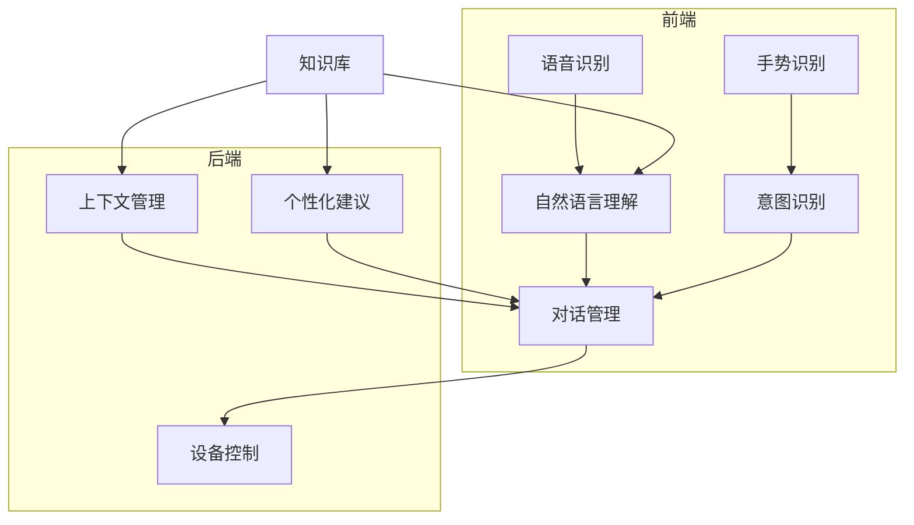

# AI可用性与设计思维：创新解决方案

## 1.背景介绍

### 1.1 人工智能的崛起

人工智能(AI)在过去几十年中经历了飞速发展,并在各个领域取得了令人瞩目的成就。从语音识别和自然语言处理,到计算机视觉和机器学习,AI技术正在彻底改变我们与技术的交互方式。然而,随着AI系统越来越复杂,确保这些系统的可用性和用户友好性也变得越来越重要。

### 1.2 可用性的重要性

可用性是指系统在特定使用环境中,由特定用户使用时,达到特定目标的有效性、效率和满意度的程度。高可用性的系统不仅可以提高用户体验,还能提高生产力,降低运营成本。相反,可用性差的系统会导致用户挫折感,降低采用率,并可能对企业造成严重损失。

### 1.3 设计思维与创新解决方案

设计思维是一种以人为本的解决问题的方法,它强调同理心、创新性和实验性。通过将设计思维与AI技术相结合,我们可以开发出真正以用户为中心的创新解决方案,为复杂的AI系统提供卓越的可用性体验。

## 2.核心概念与联系

### 2.1 人机交互(HCI)

人机交互(HCI)是一个研究人与计算机之间交互过程的跨学科领域。它探讨了设计高效、直观和愉悦的用户界面和交互方式的原则和技术。HCI原则对于设计高可用性的AI系统至关重要。

### 2.2 用户体验(UX)设计

用户体验(UX)设计是一个以用户为中心的设计过程,旨在创造有用、可用、可访问、令人愉悦和有价值的用户体验。UX设计原则可确保AI系统符合用户的需求和期望。

### 2.3 人工智能与可用性

人工智能技术正在推动着人机交互和用户体验设计的发展。例如,自然语言处理可以实现更自然的语音交互,计算机视觉可以支持手势和面部识别等交互模式。同时,AI系统本身也需要高度的可用性,以确保用户能够高效、直观地与之交互。

## 3.核心算法原理具体操作步骤

### 3.1 用户研究

```
1) 确定目标用户群
2) 进行用户访谈和观察
3) 创建用户画像和场景
4) 分析用户需求和痛点
```

### 3.2 设计原型

```
1) 基于用户需求制定设计目标
2) 头脑风暴和草图设计
3) 构建低保真度线框图
4) 制作高保真度交互式原型
5) 用户测试和迭代优化
```

### 3.3 开发和测试

```
1) 选择合适的AI技术和框架
2) 编写核心算法和模型
3) 集成人机交互组件
4) 功能测试和可用性测试
5) 部署和持续优化
```

## 4.数学模型和公式详细讲解举例说明

在设计高可用性的AI系统时,我们需要依赖各种数学模型和算法来实现智能功能。以下是一些常用的模型和公式:

### 4.1 自然语言处理

自然语言处理(NLP)是AI的一个重要分支,它涉及计算机理解和生成人类语言的技术。常用的NLP模型包括:

- **N-gram语言模型**:用于预测下一个词的概率,公式为:

$$P(w_n|w_1,...,w_{n-1}) = \frac{C(w_1,...,w_n)}{C(w_1,...,w_{n-1})}$$

其中 $C(x)$ 表示序列 $x$ 在语料库中出现的次数。

- **神经网络语言模型**:使用神经网络来学习词与词之间的关系,常用的架构包括RNN、LSTM和Transformer等。

- **句子嵌入**:将句子映射到一个固定长度的向量空间,常用的模型包括Word2Vec、GloVe和BERT等。

### 4.2 计算机视觉

计算机视觉(CV)是AI的另一个重要分支,它使计算机能够从数字图像或视频中获取有意义的信息。常用的CV模型包括:

- **卷积神经网络(CNN)**: 用于图像分类、目标检测和语义分割等任务,其核心思想是通过卷积和池化操作来自动提取图像特征。常用的CNN架构包括AlexNet、VGGNet、ResNet等。

- **生成对抗网络(GAN)**: 由生成器和判别器两个神经网络组成,可用于图像生成、图像翻译和风格迁移等任务。GAN的目标函数为:

$$\min_G \max_D V(D,G) = \mathbb{E}_{x\sim p_\text{data}}[\log D(x)] + \mathbb{E}_{z\sim p_z}[\log(1-D(G(z)))]$$

其中 $G$ 为生成器, $D$ 为判别器, $z$ 为噪声向量。

### 4.3 强化学习

强化学习(RL)是一种基于环境反馈来学习行为策略的范式。它常用于机器人控制、游戏AI和决策系统等领域。核心思想是通过试错来最大化预期回报,常用的算法包括Q-Learning、策略梯度和Actor-Critic等。

Q-Learning的核心更新公式为:

$$Q(s_t, a_t) \leftarrow Q(s_t, a_t) + \alpha\left(r_t + \gamma\max_a Q(s_{t+1}, a) - Q(s_t, a_t)\right)$$

其中 $Q(s,a)$ 表示在状态 $s$ 下执行动作 $a$ 的价值函数, $\alpha$ 为学习率, $\gamma$ 为折现因子。

通过合理应用这些数学模型和算法,我们可以为AI系统提供强大的功能,但同时也需要注重可用性设计,确保用户能够自然、高效地与系统交互。

## 4.项目实践:代码实例和详细解释说明

为了更好地说明如何将AI技术与可用性设计相结合,我们来看一个实际项目的例子。假设我们要开发一个智能家居控制系统,它可以通过语音和手势与用户交互,并控制家中的各种设备。

### 4.1 系统架构



该系统由以下几个主要模块组成:

- **语音识别**: 将用户的语音输入转换为文本。
- **自然语言理解**: 分析文本,提取关键词和意图。
- **手势识别**: 检测用户的手势输入。
- **意图识别**: 将手势与相应的意图进行匹配。
- **对话管理**: 根据用户的意图和上下文信息,决定系统的响应。
- **设备控制**: 向家中的各种设备发送控制命令。
- **上下文管理**: 跟踪对话的状态和历史信息。
- **个性化建议**: 基于用户的偏好和使用习惯,提供个性化的建议。
- **知识库**: 存储与系统相关的各种知识和数据。

### 4.2 核心代码示例

以下是一个简化的Python代码示例,它实现了基本的语音识别、自然语言理解和设备控制功能:

```python
import speech_recognition as sr
import nltk

# 语音识别
r = sr.Recognizer()
with sr.Microphone() as source:
    print("请说话...")
    audio = r.listen(source)

try:
    text = r.recognize_google(audio)
    print(f"您说: {text}")
except:
    print("抱歉,我没有听清楚")

# 自然语言理解
tokens = nltk.word_tokenize(text)
tagged = nltk.pos_tag(tokens)

device = None
action = None
for word, tag in tagged:
    if tag.startswith('NN'):
        device = word
    elif word == 'open' or word == 'close':
        action = word

# 设备控制
if device and action:
    print(f"正在{action}设备: {device}")
else:
    print("抱歉,我无法理解您的指令")
```

在这个示例中,我们使用 `speech_recognition` 库进行语音识别,将用户的语音输入转换为文本。然后,我们使用 `nltk` 库进行自然语言理解,提取设备名称和操作动作。最后,如果成功识别出用户的意图,我们就模拟执行相应的设备控制操作。

虽然这只是一个非常简单的示例,但它展示了如何将AI技术(语音识别和自然语言理解)与可用性设计(语音交互)相结合,为用户提供自然、高效的交互体验。在实际项目中,我们还需要考虑更多的因素,如错误处理、上下文理解、个性化建议等,以提供更加智能和人性化的体验。

## 5.实际应用场景

AI可用性和设计思维的理念可以应用于各种领域,为用户带来创新的解决方案。以下是一些典型的应用场景:

### 5.1 智能助手

智能助手(如Siri、Alexa和小米AI助手)是AI可用性设计的典范。它们通过自然语言交互和多模态输入(语音、触摸、手势等),为用户提供个性化的信息查询、设备控制和任务自动化等服务。设计高度可用的智能助手需要综合考虑语言理解、对话管理、知识库构建、个性化推荐等多个AI技术,并与优秀的交互设计和用户体验相结合。

### 5.2 可穿戴设备

可穿戴设备(如智能手表、健身手环等)由于其小型化和移动性,对可用性设计提出了更高的要求。设计师需要考虑微小屏幕下的信息呈现、简化的交互方式(如手势和语音)、功能的精简和场景化等因素。同时,也可以利用AI技术(如活动识别、生理数据分析等)为用户提供智能化的健康管理和生活助手服务。

### 5.3 智能家居

智能家居系统集成了多种AI技术,如语音识别、计算机视觉、自动化控制等,旨在为用户提供安全、舒适、节能的家居环境。设计师需要考虑家居环境下的自然交互方式(如语音控制、手势控制)、跨设备的一致性体验、个性化偏好等因素,以提供无缝、人性化的智能家居体验。

### 5.4 自动驾驶

自动驾驶汽车是AI可用性设计的一大挑战。除了需要强大的感知、决策和控制算法外,还需要考虑人机交互的各个方面,如安全警示、紧急接管、辅助驾驶模式等。设计师需要深入研究驾驶员的认知模式和行为习惯,设计直观、高度可靠的交互界面和流程,以确保自动驾驶系统的可用性和安全性。

### 5.5 医疗健康

AI技术在医疗健康领域有着广阔的应用前景,如医学影像分析、疾病诊断、药物开发等。然而,这些系统的可用性对于医疗工作者和患者来说至关重要。设计师需要考虑专业人员的工作流程、决策支持需求,以及普通用户的健康教育和自我管理需求,并针对不同场景提供适当的交互方式和信息呈现形式。

无论是在哪个领域,将AI技术与优秀的可用性设计相结合,都能为用户带来创新、高效和人性化的解决方案。设计师需要深入了解用户需求,紧密融合AI能力和交互设计,才能打造出真正以人为本的智能系统。

## 6.工具和资源推荐

在AI可用性设计的实践中,有许多优秀的工具和资源可以为我们提供帮助和启发。以下是一些推荐:

### 6.1 AI框架和库

- **TensorFlow**: 谷歌开源的端到端机器学习平台,支持多种AI任务。
- **PyTorch**: 元张量库,具有高度灵活性和可扩展性。
- **Scikit-learn**: 基于