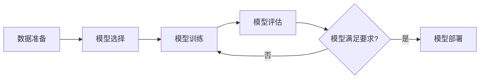

# AI模型训练与调优：打造高精度、高效率的AI模型

作者：禅与计算机程序设计艺术

## 1. 背景介绍

### 1.1 人工智能的兴起与模型训练的重要性

近年来，人工智能（AI）技术取得了突破性进展，在图像识别、自然语言处理、语音识别等领域展现出巨大潜力。AI 的核心在于构建能够模拟人类智能的模型，而模型训练则是将数据转化为智能的关键环节。一个训练良好、性能优异的 AI 模型能够准确地识别模式、预测结果，并为实际应用提供强大支持。

### 1.2 模型训练面临的挑战

然而，构建高精度、高效率的 AI 模型并非易事。模型训练过程中面临着诸多挑战，例如：

- **数据质量问题：** 训练数据的质量直接影响模型的性能。现实世界中的数据往往存在噪声、缺失、不平衡等问题，需要进行有效的数据清洗和预处理。
- **模型选择与参数调整：**  面对不同的应用场景和数据特点，需要选择合适的模型架构，并对模型参数进行精细调整，以达到最佳性能。
- **计算资源消耗：**  训练大型深度学习模型需要消耗大量的计算资源和时间，对硬件设备和算法效率提出了更高要求。
- **模型泛化能力：**  训练好的模型需要具备良好的泛化能力，才能在未知数据上表现出色，避免出现过拟合问题。

### 1.3 本文目标

本文旨在探讨 AI 模型训练与调优的关键技术，帮助读者理解模型训练的基本流程、核心算法以及优化技巧，从而打造高精度、高效率的 AI 模型。

## 2. 核心概念与联系

### 2.1 机器学习基本概念

在深入探讨模型训练之前，首先需要了解一些机器学习的基本概念：

- **数据集：** 用于训练和评估模型的数据集合，通常分为训练集、验证集和测试集。
- **特征：**  用于描述数据样本属性的变量，例如图像的像素值、文本的词向量等。
- **标签：**  数据样本的预期输出结果，例如图像的类别标签、文本的情感倾向等。
- **模型：**  对输入数据进行预测或分类的数学函数，例如线性回归模型、支持向量机、神经网络等。
- **损失函数：**  用于衡量模型预测值与真实值之间差异的函数，例如均方误差、交叉熵等。
- **优化算法：**  用于更新模型参数，最小化损失函数的算法，例如梯度下降法、Adam 算法等。

### 2.2 模型训练流程

典型的 AI 模型训练流程包括以下步骤：



1. **数据准备：**  收集、清洗、预处理数据，将其转换为模型可接受的格式。
2. **模型选择：**  根据任务需求和数据特点选择合适的模型架构。
3. **模型训练：** 使用训练数据对模型进行训练，调整模型参数，最小化损失函数。
4. **模型评估：**  使用验证集或测试集对训练好的模型进行评估，衡量其性能指标。
5. **模型部署：**  将训练好的模型部署到实际应用环境中，提供预测服务。

### 2.3 模型训练与调优的关系

模型训练和调优是密不可分的两个阶段。模型训练的目标是找到一组能够使损失函数最小化的模型参数，而模型调优则是在此基础上，通过调整模型结构、超参数等手段，进一步提升模型的性能。

## 3. 核心算法原理具体操作步骤

### 3.1 梯度下降法

梯度下降法是一种常用的优化算法，用于寻找函数的最小值。其基本思想是沿着函数梯度的反方向不断迭代更新参数，直到找到函数的局部最小值。

#### 3.1.1 算法原理

梯度下降法的更新规则如下：

$$
\theta_{t+1} = \theta_t - \alpha \nabla J(\theta_t)
$$

其中：

- $\theta_t$ 表示第 $t$ 次迭代的参数值
- $\alpha$ 表示学习率，用于控制每次迭代的步长
- $\nabla J(\theta_t)$ 表示损失函数 $J(\theta)$ 在 $\theta_t$ 处的梯度

#### 3.1.2 具体操作步骤

1. 初始化模型参数 $\theta_0$。
2. 计算损失函数 $J(\theta)$ 在当前参数值 $\theta_t$ 处的梯度 $\nabla J(\theta_t)$。
3. 根据梯度下降法更新规则更新参数：$\theta_{t+1} = \theta_t - \alpha \nabla J(\theta_t)$。
4. 重复步骤 2 和步骤 3，直到损失函数收敛或达到预设的迭代次数。

#### 3.1.3 梯度下降法的变种

- **批量梯度下降法（BGD）：**  每次迭代使用全部训练数据计算梯度，计算量大，收敛速度慢。
- **随机梯度下降法（SGD）：**  每次迭代随机选择一个样本计算梯度，计算量小，收敛速度快，但容易陷入局部最优解。
- **小批量梯度下降法（MBGD）：**  每次迭代使用一小批数据计算梯度，平衡了计算效率和收敛速度。

### 3.2 反向传播算法

反向传播算法是一种用于计算神经网络梯度的有效方法，其核心思想是利用链式法则将损失函数的梯度逐层反向传播，从而计算出每个参数的梯度。


## 4. 数学模型和公式详细讲解举例说明

### 4.1 线性回归模型

线性回归模型是一种用于预测连续值的简单模型，其数学表达式为：

$$
\hat{y} = w^Tx + b
$$

其中：

- $\hat{y}$ 表示模型的预测值
- $x$ 表示输入特征向量
- $w$ 表示权重向量
- $b$ 表示偏置项

线性回归模型的目标是找到一组最优的 $w$ 和 $b$，使得模型的预测值 $\hat{y}$ 与真实值 $y$ 之间的差异最小。

#### 4.1.1 损失函数

线性回归模型常用的损失函数是均方误差（MSE）：

$$
J(w, b) = \frac{1}{2m} \sum_{i=1}^{m} (\hat{y}^{(i)} - y^{(i)})^2
$$

其中：

- $m$ 表示训练样本的数量
- $\hat{y}^{(i)}$ 表示第 $i$ 个样本的预测值
- $y^{(i)}$ 表示第 $i$ 个样本的真实值

#### 4.1.2 参数更新

使用梯度下降法更新线性回归模型的参数：

$$
w_{t+1} = w_t - \alpha \frac{\partial J(w, b)}{\partial w} = w_t - \alpha \frac{1}{m} \sum_{i=1}^{m} (\hat{y}^{(i)} - y^{(i)})x^{(i)}
$$

$$
b_{t+1} = b_t - \alpha \frac{\partial J(w, b)}{\partial b} = b_t - \alpha \frac{1}{m} \sum_{i=1}^{m} (\hat{y}^{(i)} - y^{(i)})
$$

### 4.2 逻辑回归模型

逻辑回归模型是一种用于解决二分类问题的模型，其数学表达式为：

$$
\hat{y} = \sigma(w^Tx + b)
$$

其中：

- $\sigma(z) = \frac{1}{1+e^{-z}}$ 是 sigmoid 函数，用于将线性模型的输出值映射到 0 到 1 之间，表示样本属于正类的概率

#### 4.2.1 损失函数

逻辑回归模型常用的损失函数是交叉熵损失函数：

$$
J(w, b) = -\frac{1}{m} \sum_{i=1}^{m} [y^{(i)} \log(\hat{y}^{(i)}) + (1-y^{(i)}) \log(1-\hat{y}^{(i)})]
$$

#### 4.2.2 参数更新

使用梯度下降法更新逻辑回归模型的参数：

$$
w_{t+1} = w_t - \alpha \frac{\partial J(w, b)}{\partial w} = w_t - \alpha \frac{1}{m} \sum_{i=1}^{m} (\hat{y}^{(i)} - y^{(i)})x^{(i)}
$$

$$
b_{t+1} = b_t - \alpha \frac{\partial J(w, b)}{\partial b} = b_t - \alpha \frac{1}{m} \sum_{i=1}^{m} (\hat{y}^{(i)} - y^{(i)})
$$


## 5. 项目实践：代码实例和详细解释说明

### 5.1 使用 Python 和 TensorFlow 构建线性回归模型

```python
import tensorflow as tf

# 准备数据
x_train = [1.0, 2.0, 3.0, 4.0]
y_train = [2.0, 4.0, 6.0, 8.0]

# 创建模型
model = tf.keras.models.Sequential([
  tf.keras.layers.Dense(units=1, input_shape=[1])
])

# 编译模型
model.compile(optimizer='sgd', loss='mse')

# 训练模型
model.fit(x_train, y_train, epochs=1000)

# 评估模型
x_test = [5.0, 6.0, 7.0]
y_test = [10.0, 12.0, 14.0]
loss = model.evaluate(x_test, y_test, verbose=0)
print('Loss:', loss)

# 预测
predictions = model.predict(x_test)
print('Predictions:', predictions)
```

**代码解释：**

1. 导入 TensorFlow 库。
2. 准备训练数据 `x_train` 和 `y_train`。
3. 创建一个线性回归模型，使用 `tf.keras.layers.Dense` 创建一个全连接层，设置 `units=1` 表示输出维度为 1。
4. 使用 `model.compile` 编译模型，设置优化器为随机梯度下降（`sgd`），损失函数为均方误差（`mse`）。
5. 使用 `model.fit` 训练模型，设置迭代次数为 1000。
6. 准备测试数据 `x_test` 和 `y_test`。
7. 使用 `model.evaluate` 评估模型在测试数据上的损失。
8. 使用 `model.predict` 对新数据进行预测。

### 5.2 使用 Python 和 Scikit-learn 构建逻辑回归模型

```python
from sklearn.linear_model import LogisticRegression
from sklearn.model_selection import train_test_split
from sklearn.metrics import accuracy_score

# 准备数据
X = [[1, 2], [2, 3], [3, 1], [4, 3], [5, 3], [6, 2]]
y = [0, 0, 0, 1, 1, 1]

# 划分训练集和测试集
X_train, X_test, y_train, y_test = train_test_split(X, y, test_size=0.2)

# 创建模型
model = LogisticRegression()

# 训练模型
model.fit(X_train, y_train)

# 预测
y_pred = model.predict(X_test)

# 评估模型
accuracy = accuracy_score(y_test, y_pred)
print('Accuracy:', accuracy)
```

**代码解释：**

1. 导入必要的库：`LogisticRegression` 用于创建逻辑回归模型，`train_test_split` 用于划分训练集和测试集，`accuracy_score` 用于评估模型准确率。
2. 准备训练数据 `X` 和 `y`。
3. 使用 `train_test_split` 将数据划分为训练集和测试集，设置 `test_size=0.2` 表示测试集占总数据的 20%。
4. 创建一个逻辑回归模型 `model`。
5. 使用 `model.fit` 训练模型。
6. 使用 `model.predict` 对测试集进行预测。
7. 使用 `accuracy_score` 计算模型的准确率。


## 6. 实际应用场景

### 6.1 图像分类

- **场景描述：**  识别图像中的物体类别，例如猫、狗、汽车等。
- **模型选择：**  卷积神经网络（CNN）
- **数据准备：**  收集大量带标签的图像数据，进行数据增强（例如旋转、缩放、裁剪等）以扩充数据集。
- **模型训练：**  使用带标签的图像数据训练 CNN 模型，调整模型参数，最小化分类错误率。
- **模型评估：**  使用测试集评估模型的分类准确率、精确率、召回率等指标。

### 6.2 自然语言处理

- **场景描述：**  分析文本数据，例如情感分析、机器翻译、文本摘要等。
- **模型选择：**  循环神经网络（RNN）、长短期记忆网络（LSTM）、Transformer 等。
- **数据准备：**  收集大量文本数据，进行分词、词向量表示等预处理。
- **模型训练：**  使用预处理后的文本数据训练模型，调整模型参数，最小化预测误差。
- **模型评估：**  使用测试集评估模型的准确率、困惑度、BLEU 分数等指标。

### 6.3 语音识别

- **场景描述：**  将语音信号转换为文本，例如语音助手、语音输入法等。
- **模型选择：**  循环神经网络（RNN）、长短期记忆网络（LSTM）、连接时序分类（CTC）等。
- **数据准备：**  收集大量的语音数据和对应的文本标注，进行语音特征提取等预处理。
- **模型训练：**  使用预处理后的语音数据和文本标注训练模型，调整模型参数，最小化语音识别错误率。
- **模型评估：**  使用测试集评估模型的字错误率（WER）、词错误率（CER）等指标。

## 7. 工具和资源推荐

### 7.1 深度学习框架

- **TensorFlow：**  由 Google 开发的开源深度学习框架，提供丰富的 API 和工具，支持多种编程语言。
- **PyTorch：**  由 Facebook 开发的开源深度学习框架，以其灵活性和易用性著称，在学术界和工业界得到广泛应用。
- **Keras：**  构建在 TensorFlow 和 Theano 之上的高级神经网络 API，提供简洁易用的接口，适合快速原型设计。

### 7.2 数据集

- **ImageNet：**  包含超过 1400 万张带标签的图像数据集，用于图像分类、目标检测等任务。
- **CIFAR-10/CIFAR-100：**  包含 10 个和 100 个类别的彩色图像数据集，用于图像分类任务。
- **MNIST：**  包含 70000 张手写数字图像数据集，用于图像分类任务。
- **GLUE benchmark：**  包含多个自然语言理解任务的数据集，用于评估自然语言处理模型的性能。

### 7.3 模型库

- **TensorFlow Hub：**  提供预训练的 TensorFlow 模型，可以直接用于各种任务。
- **PyTorch Hub：**  提供预训练的 PyTorch 模型，可以直接用于各种任务。
- **Hugging Face Model Hub：**  提供预训练的自然语言处理模型，可以直接用于各种任务。

## 8. 总结：未来发展趋势与挑战

### 8.1 未来发展趋势

- **AutoML：**  自动化机器学习技术将进一步发展，降低 AI 模型训练和调优的门槛，使更多人能够利用 AI 技术。
- **边缘计算：**  随着物联网和边缘计算的发展，AI 模型将更多地部署在边缘设备上，对模型的轻量化和效率提出更高要求。
- **可解释性：**  AI 模型的可解释性越来越受到重视，未来将涌现更多可解释的 AI 模型和技术。

### 8.2 面临的挑战

- **数据隐私和安全：**  随着 AI 应用的普及，数据隐私和安全问题日益突出，需要开发更加安全可靠的 AI 技术。
- **模型鲁棒性：**  AI 模型容易受到对抗样本的攻击，需要提高模型的鲁棒性和对抗攻击能力。
- **模型泛化能力：**  如何提高 AI 模型的泛化能力，使其在不同场景和数据分布下都能表现出色，仍然是一个挑战。

## 9. 附录：常见问题与解答

### 9.1 如何选择合适的模型？

选择合适的模型需要考虑多个因素，包括：

- **任务类型：**  不同的任务类型需要选择不同的模型，例如分类任务可以选择逻辑回归、支持向量机、神经网络等，回归任务可以选择线性回归、决策树等。
- **数据特点：**  数据的规模、维度、特征类型等都会影响模型的选择。
- **计算资源：**  模型的复杂度和训练时间与计算资源密切相关。

### 9.2 如何调整模型的超参数？

调整模型的超参数可以使用以下方法：

- **网格搜索：**  对每个超参数设置一个候选值列表，遍历所有可能的组合，选择性能最好的组合。
- **随机搜索：**  在超参数空间中随机采样，