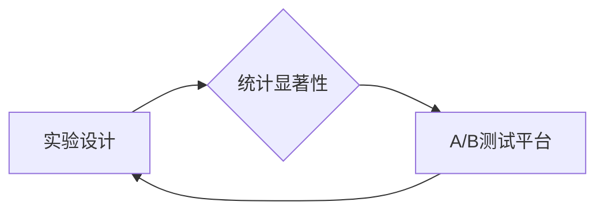

# AI系统A/B测试原理与代码实战案例讲解

作者：禅与计算机程序设计艺术

## 1. 背景介绍

### 1.1. A/B测试概述
在软件开发和数据驱动的决策过程中，A/B测试（也称为分割测试）已成为评估变更、优化性能和提升用户体验的基石。它是一种实验方法，通过将用户随机分配到两个或多个不同的版本（通常称为A/B版本）中，收集和比较这些版本的数据，来确定哪个版本在实现预定义目标方面表现最佳。

### 1.2. AI系统中的A/B测试
随着人工智能（AI）的兴起，A/B测试在AI系统的开发和部署中变得越来越重要。与传统软件不同，AI系统通常由复杂的算法和模型驱动，这些算法和模型的行为可能会受到训练数据、模型参数和实时输入的影响，导致结果难以预测。 A/B测试提供了一种数据驱动的方法来评估AI系统不同版本之间的性能差异，并确保所做的更改能够带来预期的改进。

### 1.3. 本文目标
本文旨在深入探讨AI系统A/B测试的原理、方法和最佳实践，并通过代码实战案例，帮助读者理解如何在实际项目中应用A/B测试来优化AI系统性能。

## 2. 核心概念与联系

### 2.1. 实验设计
A/B测试的核心是实验设计。一个精心设计的实验应该包含以下要素：

* **明确的假设**: 在开始实验之前，需要明确定义想要验证的假设，例如“新模型将提高点击率”。
* **关键指标**: 选择能够有效衡量实验结果的关键指标，例如点击率、转化率或用户参与度。
* **实验组和对照组**: 将用户随机分配到实验组（接收新版本）和对照组（保留旧版本）中，确保两组用户特征尽可能相似。
* **样本量**: 确定合适的样本量，以确保实验结果具有统计显著性。
* **实验周期**:  根据业务需求和数据收集速度，设置合理的实验周期。

### 2.2. 统计显著性
统计显著性是指观察到的结果不太可能仅仅由随机因素引起。在A/B测试中，通常使用假设检验来确定实验结果是否具有统计显著性。常用的假设检验方法包括t检验和卡方检验。

### 2.3. A/B测试平台
为了简化A/B测试的实施和管理，可以使用A/B测试平台。这些平台通常提供以下功能：

* **流量分配**: 将用户流量随机分配到不同的实验版本中。
* **数据收集**:  收集和存储实验数据。
* **结果分析**: 提供可视化工具和统计分析方法，帮助用户分析实验结果。

### 2.4. 核心概念之间的联系
如下图所示，实验设计、统计显著性和A/B测试平台是A/B测试的三个核心概念，它们相互关联，共同构成了A/B测试的完整体系。



## 3. 核心算法原理具体操作步骤

### 3.1.  假设检验
假设检验是一种统计推断方法，用于检验关于总体参数的假设。在A/B测试中，假设检验用于确定实验组和对照组之间观察到的差异是否具有统计显著性。

假设检验的基本步骤如下：

1. **提出零假设和备择假设**: 零假设通常表示没有差异或没有影响，而备择假设则表示存在差异或影响。
2. **选择检验统计量**: 检验统计量是根据样本数据计算出的一个统计量，用于衡量样本与零假设之间的一致程度。
3. **确定显著性水平**: 显著性水平是拒绝零假设的概率阈值，通常设置为0.05。
4. **计算p值**: p值是观察到的检验统计量在零假设成立的情况下出现的概率。
5. **做出决策**: 如果p值小于显著性水平，则拒绝零假设，接受备择假设；否则，不拒绝零假设。

### 3.2.  t检验
t检验是一种常用的假设检验方法，用于比较两个样本均值之间的差异。在A/B测试中，t检验可以用于比较实验组和对照组的关键指标均值之间的差异。

t检验的公式如下：

$$
t = \frac{\bar{x}_1 - \bar{x}_2}{\sqrt{\frac{s_1^2}{n_1} + \frac{s_2^2}{n_2}}}
$$

其中：

* $\bar{x}_1$ 和 $\bar{x}_2$ 分别是两个样本的均值
* $s_1$ 和 $s_2$ 分别是两个样本的标准差
* $n_1$ 和 $n_2$ 分别是两个样本的样本量

### 3.3.  卡方检验
卡方检验是一种非参数假设检验方法，用于比较两个分类变量之间的相关性。在A/B测试中，卡方检验可以用于比较实验组和对照组中不同用户行为的比例。

卡方检验的公式如下：

$$
\chi^2 = \sum_{i=1}^{r} \sum_{j=1}^{c} \frac{(O_{ij} - E_{ij})^2}{E_{ij}}
$$

其中：

* $O_{ij}$ 是观测频数
* $E_{ij}$ 是期望频数
* $r$ 是行数
* $c$ 是列数

### 3.4.  置信区间
置信区间是总体参数的取值范围估计。在A/B测试中，置信区间可以用于估计实验组和对照组之间关键指标差异的真实大小。

置信区间的计算公式如下：

$$
(\bar{x}_1 - \bar{x}_2) \pm t_{\alpha/2, df} \sqrt{\frac{s_1^2}{n_1} + \frac{s_2^2}{n_2}}
$$

其中：

* $\bar{x}_1$ 和 $\bar{x}_2$ 分别是两个样本的均值
* $s_1$ 和 $s_2$ 分别是两个样本的标准差
* $n_1$ 和 $n_2$ 分别是两个样本的样本量
* $t_{\alpha/2, df}$ 是t分布的临界值，其中 $\alpha$ 是显著性水平，$df$ 是自由度

## 4. 数学模型和公式详细讲解举例说明

### 4.1.  示例场景
假设我们正在开发一个电商网站，并希望通过A/B测试来评估更改产品推荐算法对点击率的影响。

### 4.2.  数据收集
我们收集了实验组和对照组用户的点击数据，如下表所示：

| 组别 | 样本量 | 点击次数 | 点击率 |
|---|---|---|---|
| 实验组 | 1000 | 150 | 0.15 |
| 对照组 | 1000 | 120 | 0.12 |

### 4.3.  假设检验
**零假设**: 更改产品推荐算法对点击率没有影响。
**备择假设**: 更改产品推荐算法对点击率有影响。

我们使用t检验来比较两组之间的点击率差异。

**计算t统计量**:

```
t = (0.15 - 0.12) / sqrt((0.15 * (1 - 0.15) / 1000) + (0.12 * (1 - 0.12) / 1000)) = 2.53
```

**计算p值**:

使用t分布表或统计软件，我们可以找到t统计量为2.53，自由度为1998（1000 + 1000 - 2）时的p值为0.011。

**做出决策**:

由于p值（0.011）小于显著性水平（0.05），我们拒绝零假设，接受备择假设。这意味着更改产品推荐算法对点击率有显著影响。

### 4.4.  置信区间
**计算95%置信区间**:

```
(0.15 - 0.12) ± 1.96 * sqrt((0.15 * (1 - 0.15) / 1000) + (0.12 * (1 - 0.12) / 1000)) = (0.01, 0.05)
```

这表明我们有95%的信心认为更改产品推荐算法后，点击率的提升幅度在1%到5%之间。

## 5. 项目实践：代码实例和详细解释说明

### 5.1. Python代码示例
以下是一个使用Python进行A/B测试的简单示例代码：

```python
import numpy as np
from scipy.stats import ttest_ind

# 模拟实验组和对照组数据
np.random.seed(42)
control_group = np.random.normal(loc=100, scale=10, size=1000)
treatment_group = np.random.normal(loc=102, scale=10, size=1000)

# 进行t检验
t_statistic, p_value = ttest_ind(control_group, treatment_group)

# 打印结果
print(f"t statistic: {t_statistic:.2f}")
print(f"p-value: {p_value:.3f}")

# 判断是否拒绝零假设
if p_value < 0.05:
    print("拒绝零假设，实验组和对照组之间存在显著差异")
else:
    print("不拒绝零假设，实验组和对照组之间不存在显著差异")
```

### 5.2. 代码解释
* 首先，我们使用`numpy`库生成模拟的实验组和对照组数据。
* 然后，我们使用`scipy.stats`模块中的`ttest_ind`函数进行t检验。
* 最后，我们打印t统计量和p值，并根据p值是否小于显著性水平来判断是否拒绝零假设。

## 6. 实际应用场景

A/B测试在AI系统中有着广泛的应用场景，包括：

* **推荐系统**: 评估不同的推荐算法对点击率、转化率或用户参与度的影响。
* **搜索引擎**: 优化搜索结果排名，提高搜索结果的相关性和用户满意度。
* **自然语言处理**: 比较不同模型在文本分类、情感分析或机器翻译等任务上的性能。
* **计算机视觉**: 评估不同的图像识别模型在目标检测、图像分类或图像分割等任务上的准确率。

## 7. 工具和资源推荐

### 7.1. A/B测试平台
* **Google Optimize**:  由Google提供的免费A/B测试平台，与Google Analytics集成。
* **Optimizely**:  领先的商业A/B测试平台，提供丰富的功能和灵活的定制选项。
* **VWO**:  另一个流行的商业A/B测试平台，提供全面的A/B测试解决方案。

### 7.2. Python库
* **statsmodels**:  提供丰富的统计分析工具，包括假设检验、回归分析和时间序列分析。
* **scipy**:  提供科学计算工具，包括统计分析、优化、线性代数和信号处理。
* **abtest**:  专门用于A/B测试的Python库，提供简单易用的API。

## 8. 总结：未来发展趋势与挑战

### 8.1. 未来发展趋势
* **多变量测试**:  与传统的A/B测试相比，多变量测试允许同时测试多个变量，可以更有效地优化AI系统。
* **强化学习**:  强化学习是一种机器学习方法，可以用于自动优化AI系统。A/B测试可以用于评估不同的强化学习算法。
* **因果推断**:  因果推断是一种统计方法，可以用于确定变量之间的因果关系。A/B测试可以与因果推断相结合，以更深入地了解AI系统的行为。

### 8.2. 挑战
* **数据质量**:  A/B测试结果的可靠性取决于数据的质量。确保数据的准确性和完整性至关重要。
* **实验周期**:  A/B测试需要时间来收集足够的数据。在快速变化的环境中，这可能是一个挑战。
* **伦理问题**:  在某些情况下，A/B测试可能会引发伦理问题，例如在医疗保健或金融等领域。

## 9. 附录：常见问题与解答

### 9.1.  A/B测试和机器学习有什么区别？
A/B测试是一种实验方法，用于比较不同版本的性能。机器学习是一种算法类别，用于从数据中学习并做出预测。A/B测试可以使用机器学习模型来生成不同的版本，但它本身并不是一种机器学习方法。

### 9.2.  如何确定合适的样本量？
样本量的大小取决于几个因素，包括预期的效果大小、显著性水平和统计功效。可以使用统计软件或在线计算器来确定合适的样本量。

### 9.3.  如何处理季节性因素对A/B测试结果的影响？
季节性因素可能会影响A/B测试结果。为了解决这个问题，可以使用时间序列分析方法或在不同的时间段内进行多次A/B测试。

### 9.4.  如何解释A/B测试结果？
在解释A/B测试结果时，重要的是要考虑统计显著性、效果大小和置信区间。还应考虑其他因素，例如实验设计和数据质量。