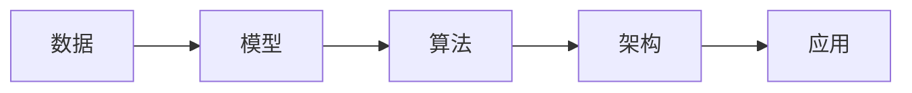

##  1. 背景介绍

### 1.1 人工智能的兴起与应用

近年来，人工智能（AI）技术取得了突飞猛进的发展，从AlphaGo战胜围棋世界冠军到自动驾驶汽车的上路测试，AI正在深刻地改变着我们的生活。随着数据量的爆炸性增长和计算能力的不断提升，AI已经渗透到各个领域，为我们带来了前所未有的机遇和挑战。

### 1.2 AI系统架构的重要性

为了构建高效、可靠、可扩展的AI系统，一个设计良好、架构清晰的系统至关重要。合理的AI系统架构可以帮助我们：

*   **提高开发效率:**  模块化的设计和清晰的接口可以降低开发难度，提高代码复用率，缩短开发周期。
*   **提升系统性能:**  合理的资源分配和并行计算可以充分利用硬件资源，提高系统运行效率。
*   **增强系统可维护性:**  清晰的架构和良好的代码规范可以方便代码维护和更新，降低系统维护成本。
*   **促进团队协作:**  统一的架构和规范可以促进团队成员之间的沟通和协作，提高开发效率。

### 1.3 本文目标

本文旨在深入探讨AI系统架构的原理和最佳实践，并结合代码实战案例，帮助读者更好地理解和掌握AI系统的设计与开发。

##  2. 核心概念与联系

### 2.1 数据

#### 2.1.1 数据类型

*   结构化数据：关系型数据库中的数据，如用户信息、订单信息等。
*   半结构化数据：XML、JSON等格式的数据。
*   非结构化数据：文本、图像、音频、视频等数据。

#### 2.1.2 数据预处理

*   数据清洗：去除数据中的噪声和异常值。
*   数据集成：将来自不同数据源的数据整合在一起。
*   数据转换：将数据转换为适合AI算法处理的格式。
*   特征工程：从原始数据中提取有效的特征。

### 2.2 模型

#### 2.2.1 机器学习模型

*   监督学习：线性回归、逻辑回归、支持向量机、决策树、随机森林等。
*   无监督学习：聚类、降维等。
*   强化学习：Q-learning、SARSA等。

#### 2.2.2 深度学习模型

*   卷积神经网络（CNN）：主要用于图像识别、目标检测等领域。
*   循环神经网络（RNN）：主要用于自然语言处理、语音识别等领域。
*   生成对抗网络（GAN）：主要用于图像生成、风格迁移等领域。

### 2.3 算法

#### 2.3.1 训练算法

*   梯度下降法
*   随机梯度下降法
*   Adam算法

#### 2.3.2 评估指标

*   准确率
*   精确率
*   召回率
*   F1值

### 2.4 架构

#### 2.4.1 分层架构

将AI系统划分为不同的层次，例如数据层、模型层、应用层等，每一层负责不同的功能。

#### 2.4.2 微服务架构

将AI系统拆分为多个独立的服务，每个服务负责一个特定的功能，服务之间通过API进行通信。

### 2.5 联系

数据、模型、算法和架构之间存在着密切的联系，它们共同构成了一个完整的AI系统。



##  3. 核心算法原理具体操作步骤

### 3.1 监督学习

#### 3.1.1 线性回归

**原理：**

线性回归是一种用于建立自变量和因变量之间线性关系的统计模型。它假设自变量和因变量之间存在线性关系，并试图找到一条直线来拟合数据点，使得预测值与真实值之间的误差最小化。

**操作步骤：**

1.  准备数据：收集并清洗数据，将数据分为训练集和测试集。
2.  选择模型：选择线性回归模型。
3.  训练模型：使用训练集数据训练模型，找到最佳的模型参数。
4.  评估模型：使用测试集数据评估模型的性能，例如使用均方误差（MSE）或决定系数（R²）。
5.  预测：使用训练好的模型对新的数据进行预测。

**代码示例：**

```python
import numpy as np
from sklearn.linear_model import LinearRegression
from sklearn.model_selection import train_test_split
from sklearn.metrics import mean_squared_error, r2_score

# 准备数据
X = np.array([[1], [2], [3], [4], [5]])
y = np.array([2, 4, 6, 8, 10])

# 划分训练集和测试集
X_train, X_test, y_train, y_test = train_test_split(X, y, test_size=0.2, random_state=42)

# 创建线性回归模型
model = LinearRegression()

# 训练模型
model.fit(X_train, y_train)

# 预测
y_pred = model.predict(X_test)

# 评估模型
mse = mean_squared_error(y_test, y_pred)
r2 = r2_score(y_test, y_pred)

print("均方误差:", mse)
print("决定系数:", r2)
```

#### 3.1.2 逻辑回归

**原理：**

逻辑回归是一种用于预测分类变量的统计模型。它使用逻辑函数将线性回归模型的输出转换为概率值，用于预测样本属于某个类别的概率。

**操作步骤：**

1.  准备数据：收集并清洗数据，将数据分为训练集和测试集。
2.  选择模型：选择逻辑回归模型。
3.  训练模型：使用训练集数据训练模型，找到最佳的模型参数。
4.  评估模型：使用测试集数据评估模型的性能，例如使用准确率、精确率、召回率或F1值。
5.  预测：使用训练好的模型对新的数据进行预测。

**代码示例：**

```python
import numpy as np
from sklearn.linear_model import LogisticRegression
from sklearn.model_selection import train_test_split
from sklearn.metrics import accuracy_score, precision_score, recall_score, f1_score

# 准备数据
X = np.array([[1, 2], [2, 3], [3, 4], [4, 5], [5, 6]])
y = np.array([0, 0, 1, 1, 1])

# 划分训练集和测试集
X_train, X_test, y_train, y_test = train_test_split(X, y, test_size=0.2, random_state=42)

# 创建逻辑回归模型
model = LogisticRegression()

# 训练模型
model.fit(X_train, y_train)

# 预测
y_pred = model.predict(X_test)

# 评估模型
accuracy = accuracy_score(y_test, y_pred)
precision = precision_score(y_test, y_pred)
recall = recall_score(y_test, y_pred)
f1 = f1_score(y_test, y_pred)

print("准确率:", accuracy)
print("精确率:", precision)
print("召回率:", recall)
print("F1值:", f1)
```

### 3.2 无监督学习

#### 3.2.1 K均值聚类

**原理：**

K均值聚类是一种将数据点分成K个簇的算法。它迭代地将每个数据点分配到最近的簇中心，并更新簇中心，直到簇中心不再发生变化。

**操作步骤：**

1.  准备数据：收集并清洗数据。
2.  选择模型：选择K均值聚类模型。
3.  训练模型：使用数据训练模型，找到最佳的簇中心。
4.  评估模型：使用轮廓系数或其他指标评估模型的性能。
5.  预测：使用训练好的模型对新的数据进行聚类。

**代码示例：**

```python
import numpy as np
from sklearn.cluster import KMeans
from sklearn.metrics import silhouette_score

# 准备数据
X = np.array([[1, 2], [1, 4], [1, 0], [4, 2], [4, 4], [4, 0]])

# 创建K均值聚类模型
model = KMeans(n_clusters=2)

# 训练模型
model.fit(X)

# 预测
labels = model.predict(X)

# 评估模型
silhouette_avg = silhouette_score(X, labels)

print("轮廓系数:", silhouette_avg)
```

#### 3.2.2 主成分分析（PCA）

**原理：**

主成分分析是一种降维算法，它通过线性变换将高维数据转换为低维数据，同时保留尽可能多的数据信息。

**操作步骤：**

1.  准备数据：收集并清洗数据。
2.  选择模型：选择PCA模型。
3.  训练模型：使用数据训练模型，找到主成分。
4.  评估模型：使用解释方差比或其他指标评估模型的性能。
5.  预测：使用训练好的模型对新的数据进行降维。

**代码示例：**

```python
import numpy as np
from sklearn.decomposition import PCA
from sklearn.preprocessing import StandardScaler

# 准备数据
X = np.array([[1, 2, 3], [4, 5, 6], [7, 8, 9], [10, 11, 12]])

# 数据标准化
scaler = StandardScaler()
X_scaled = scaler.fit_transform(X)

# 创建PCA模型
model = PCA(n_components=2)

# 训练模型
model.fit(X_scaled)

# 预测
X_pca = model.transform(X_scaled)

# 解释方差比
print("解释方差比:", model.explained_variance_ratio_)
```

### 3.3 深度学习

#### 3.3.1 卷积神经网络（CNN）

**原理：**

卷积神经网络是一种专门用于处理网格状数据的深度学习模型，例如图像数据。它使用卷积层和池化层来提取图像的特征，并使用全连接层进行分类或回归。

**操作步骤：**

1.  准备数据：收集并清洗数据，将数据分为训练集、验证集和测试集。
2.  选择模型：选择CNN模型，例如LeNet、AlexNet、VGGNet、GoogLeNet或ResNet。
3.  训练模型：使用训练集数据训练模型，找到最佳的模型参数。
4.  评估模型：使用验证集数据评估模型的性能，例如使用准确率、损失函数或其他指标。
5.  预测：使用训练好的模型对新的数据进行预测。

**代码示例：**

```python
import tensorflow as tf
from tensorflow.keras.models import Sequential
from tensorflow.keras.layers import Conv2D, MaxPooling2D, Flatten, Dense

# 准备数据
(X_train, y_train), (X_test, y_test) = tf.keras.datasets.mnist.load_data()

# 数据预处理
X_train = X_train.astype('float32') / 255.0
X_test = X_test.astype('float32') / 255.0
y_train = tf.keras.utils.to_categorical(y_train, num_classes=10)
y_test = tf.keras.utils.to_categorical(y_test, num_classes=10)

# 创建CNN模型
model = Sequential()
model.add(Conv2D(32, kernel_size=(3, 3), activation='relu', input_shape=(28, 28, 1)))
model.add(MaxPooling2D(pool_size=(2, 2)))
model.add(Conv2D(64, kernel_size=(3, 3), activation='relu'))
model.add(MaxPooling2D(pool_size=(2, 2)))
model.add(Flatten())
model.add(Dense(10, activation='softmax'))

# 编译模型
model.compile(loss='categorical_crossentropy', optimizer='adam', metrics=['accuracy'])

# 训练模型
model.fit(X_train, y_train, batch_size=128, epochs=10, validation_data=(X_test, y_test))

# 评估模型
score = model.evaluate(X_test, y_test, verbose=0)
print('Test loss:', score[0])
print('Test accuracy:', score[1])
```

## 4. 数学模型和公式详细讲解举例说明

### 4.1 线性回归

#### 4.1.1 模型表示

线性回归模型可以用以下公式表示：

$$
y = \beta_0 + \beta_1 x_1 + \beta_2 x_2 + ... + \beta_n x_n + \epsilon
$$

其中：

*   $y$ 是因变量。
*   $x_1, x_2, ..., x_n$ 是自变量。
*   $\beta_0, \beta_1, \beta_2, ..., \beta_n$ 是模型参数，表示自变量对因变量的影响程度。
*   $\epsilon$ 是误差项，表示模型无法解释的部分。

#### 4.1.2 损失函数

线性回归模型的损失函数通常使用均方误差（MSE），它表示预测值与真实值之间平方误差的平均值。

$$
MSE = \frac{1}{m} \sum_{i=1}^{m} (y_i - \hat{y_i})^2
$$

其中：

*   $m$ 是样本数量。
*   $y_i$ 是第 $i$ 个样本的真实值。
*   $\hat{y_i}$ 是第 $i$ 个样本的预测值。

#### 4.1.3 参数估计

线性回归模型的参数估计可以使用最小二乘法，它试图找到一组模型参数，使得损失函数最小化。

$$
\hat{\beta} = (X^T X)^{-1} X^T y
$$

其中：

*   $\hat{\beta}$ 是模型参数的估计值。
*   $X$ 是自变量矩阵。
*   $y$ 是因变量向量。

#### 4.1.4 举例说明

假设我们想建立一个线性回归模型来预测房价，我们收集了以下数据：

| 面积（平方米） | 卧室数量 | 房价（万元） |
| :------------- | :------- | :----------- |
| 100           | 2         | 200         |
| 120           | 3         | 250         |
| 150           | 4         | 300         |

我们可以使用以下代码来训练一个线性回归模型：

```python
import numpy as np
from sklearn.linear_model import LinearRegression

# 准备数据
X = np.array([[100, 2], [120, 3], [150, 4]])
y = np.array([200, 250, 300])

# 创建线性回归模型
model = LinearRegression()

# 训练模型
model.fit(X, y)

# 打印模型参数
print("截距:", model.intercept_)
print("系数:", model.coef_)
```

输出结果：

```
截距: 50.00000000000001
系数: [ 1.5  25. ]
```

这意味着我们可以使用以下公式来预测房价：

$$
\text{房价} = 50 + 1.5 \times \text{面积} + 25 \times \text{卧室数量}
$$

### 4.2 逻辑回归

#### 4.2.1 模型表示

逻辑回归模型可以用以下公式表示：

$$
P(y=1|x) = \frac{1}{1 + e^{-(\beta_0 + \beta_1 x_1 + \beta_2 x_2 + ... + \beta_n x_n)}}
$$

其中：

*   $P(y=1|x)$ 是在给定自变量 $x$ 的情况下，因变量 $y$ 等于 1 的概率。
*   $x_1, x_2, ..., x_n$ 是自变量。
*   $\beta_0, \beta_1, \beta_2, ..., \beta_n$ 是模型参数。

#### 4.2.2 损失函数

逻辑回归模型的损失函数通常使用对数损失函数，也称为交叉熵损失函数。

$$
J(\theta) = -\frac{1}{m} \sum_{i=1}^{m} [y^{(i)} log(h_\theta(x^{(i)})) + (1 - y^{(i)}) log(1 - h_\theta(x^{(i)}))]
$$

其中：

*   $m$ 是样本数量。
*   $y^{(i)}$ 是第 $i$ 个样本的真实标签。
*   $h_\theta(x^{(i)})$ 是模型对第 $i$ 个样本的预测概率。

#### 4.2.3 参数估计

逻辑回归模型的参数估计可以使用梯度下降法，它迭代地更新模型参数，使得损失函数最小化。