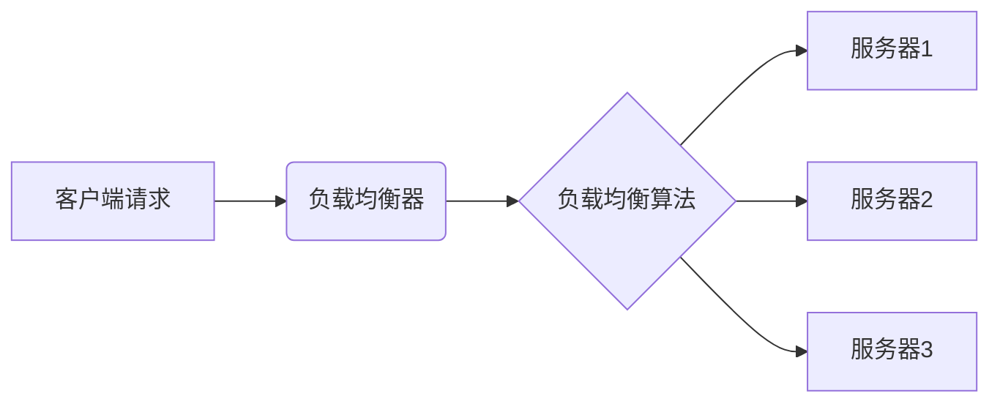

# AI系统负载均衡原理与代码实战案例讲解

作者：禅与计算机程序设计艺术

## 1. 背景介绍

### 1.1. AI系统负载现状与挑战

近年来，随着深度学习、机器学习等人工智能技术的快速发展和应用，AI系统在各个领域都取得了显著的成果。然而，随着AI应用规模的不断扩大，数据量的爆炸式增长以及模型复杂度的提升，传统的单机部署方式已经难以满足日益增长的计算需求，AI系统面临着严峻的负载压力。

**AI系统负载面临的主要挑战包括：**

* **高并发请求：** 诸如图像识别、自然语言处理等AI应用需要处理大量的并发请求，对系统的吞吐量和响应速度提出了极高的要求。
* **计算资源密集：** AI模型训练和推理过程通常需要消耗大量的计算资源，包括CPU、GPU、内存和存储等。
* **数据规模庞大：** AI应用通常需要处理海量的训练数据，对数据的存储、传输和处理效率提出了挑战。

### 1.2. 负载均衡的意义与作用

为了应对上述挑战，负载均衡成为了构建高性能、高可用性AI系统的关键技术之一。负载均衡旨在将工作负载均匀地分布到多个服务器或计算资源上，避免单点过载，从而提高系统的整体性能、可靠性和可扩展性。

**负载均衡在AI系统中的主要作用包括：**

* **提高资源利用率：** 通过将负载均衡分配到多个服务器上，可以充分利用所有可用资源，避免资源浪费。
* **提升系统性能：**  将负载分散到多个服务器上，可以降低单个服务器的压力，提高系统的吞吐量和响应速度。
* **增强系统可靠性：** 当某个服务器出现故障时，负载均衡器可以将请求自动转发到其他正常运行的服务器上，保证系统的可用性。
* **提高系统可扩展性：** 当系统负载增加时，可以通过添加新的服务器来扩展系统的处理能力，而无需修改应用程序代码。

## 2. 核心概念与联系

### 2.1. 负载均衡算法

负载均衡算法是负载均衡的核心，它决定了如何将请求分发到不同的服务器上。常见的负载均衡算法包括：

* **轮询算法（Round Robin）：**  将请求依次分配给每个服务器，适用于服务器性能均衡的场景。
* **加权轮询算法（Weighted Round Robin）：**  根据服务器的权重分配请求，权重高的服务器处理更多的请求，适用于服务器性能差异较大的场景。
* **最少连接数算法（Least Connections）：**  将请求分配给当前连接数最少的服务器，适用于处理请求时间差异较大的场景。
* **IP哈希算法（IP Hash）：** 根据客户端IP地址的哈希值将请求分配到固定的服务器，适用于需要保持会话一致性的场景。
* **一致性哈希算法（Consistent Hashing）：**  将服务器和请求映射到一个哈希环上，每个请求根据其哈希值被分配到环上顺时针方向的第一个服务器，适用于需要动态添加或删除服务器的场景。

### 2.2. 负载均衡器

负载均衡器是实现负载均衡的关键组件，它负责接收客户端请求，根据负载均衡算法选择合适的服务器，并将请求转发给该服务器。负载均衡器可以是硬件设备，也可以是软件程序。

**常见的负载均衡器包括：**

* **硬件负载均衡器：**  例如F5 BIG-IP、Citrix Netscaler等，性能高，功能强大，但价格昂贵。
* **软件负载均衡器：** 例如Nginx、HAProxy、LVS等，成本低，配置灵活，但性能相对较低。

### 2.3. 反向代理

反向代理是指以代理服务器的身份接收互联网上的连接请求，然后将请求转发给内部网络上的服务器，并将从服务器上得到的结果返回给互联网上请求连接的客户端，此时代理服务器对外就表现为一个服务器。

**反向代理与负载均衡的关系：**

* 反向代理可以作为负载均衡器的一部分，实现请求的转发和负载均衡。
* 负载均衡器可以利用反向代理的功能，例如缓存、SSL卸载等，提高系统性能和安全性。

### 2.4. 核心概念关系图



## 3. 核心算法原理具体操作步骤

### 3.1. 轮询算法（Round Robin）

**原理：** 将请求依次分配给每个服务器，循环往复。

**操作步骤：**

1. 维护一个服务器列表，并设置一个指向当前服务器的指针。
2. 当有新的请求到达时，将请求分配给指针指向的服务器。
3. 将指针移动到下一个服务器。
4. 如果指针已经指向最后一个服务器，则将其移动到第一个服务器。

**优点：** 简单易实现，适用于服务器性能均衡的场景。

**缺点：**  无法感知服务器的负载情况，可能导致负载不均衡。

### 3.2. 加权轮询算法（Weighted Round Robin）

**原理：**  根据服务器的权重分配请求，权重高的服务器处理更多的请求。

**操作步骤：**

1. 维护一个服务器列表，并为每个服务器设置一个权重。
2. 计算所有服务器权重的总和。
3. 针对每个请求，计算一个随机数，该随机数的范围为0到所有服务器权重总和之间。
4. 遍历服务器列表，累加服务器的权重，直到累加值大于等于随机数。
5. 将请求分配给当前遍历到的服务器。

**优点：** 可以根据服务器的性能差异分配请求，更加灵活。

**缺点：**  需要预先设置服务器的权重，配置较为复杂。

### 3.3. 最少连接数算法（Least Connections）

**原理：** 将请求分配给当前连接数最少的服务器。

**操作步骤：**

1. 维护一个服务器列表，并记录每个服务器当前的连接数。
2. 当有新的请求到达时，选择连接数最少的服务器。
3. 将请求分配给该服务器，并将该服务器的连接数加1。
4. 当服务器完成请求处理后，将其连接数减1。

**优点：**  可以根据服务器的负载情况动态分配请求，更加智能。

**缺点：**  需要维护服务器的连接数，实现较为复杂。

### 3.4. IP哈希算法（IP Hash）

**原理：**  根据客户端IP地址的哈希值将请求分配到固定的服务器。

**操作步骤：**

1. 维护一个服务器列表。
2. 当有新的请求到达时，计算客户端IP地址的哈希值。
3. 根据哈希值将请求分配到对应的服务器。

**优点：**  可以将来自同一个客户端的请求分配到同一个服务器，适用于需要保持会话一致性的场景。

**缺点：**  当服务器数量变化时，会导致大量的请求分配错误。

### 3.5. 一致性哈希算法（Consistent Hashing）

**原理：** 将服务器和请求映射到一个哈希环上，每个请求根据其哈希值被分配到环上顺时针方向的第一个服务器。

**操作步骤：**

1. 创建一个哈希环，并将所有服务器的IP地址或域名哈希到环上的不同位置。
2. 当有新的请求到达时，计算请求的哈希值。
3. 在哈希环上找到该哈希值对应的位置，并将请求分配到环上顺时针方向的第一个服务器。

**优点：**  当服务器数量变化时，只会影响到少量的请求，可以实现动态添加或删除服务器。

**缺点：**  实现较为复杂。


## 4. 数学模型和公式详细讲解举例说明

### 4.1. 加权轮询算法权重计算

加权轮询算法中，服务器的权重通常根据其处理能力来设置。假设有两个服务器A和B，它们的权重分别为$w_A$和$w_B$，则服务器A处理请求的概率为：

$$
P_A = \frac{w_A}{w_A + w_B}
$$

例如，如果服务器A的权重为2，服务器B的权重为1，则服务器A处理请求的概率为：

$$
P_A = \frac{2}{2 + 1} = \frac{2}{3}
$$

### 4.2. 一致性哈希算法哈希环构建

一致性哈希算法中，通常使用环状哈希空间来映射服务器和请求。假设哈希空间的大小为$2^m$，则每个服务器和请求的哈希值都将在0到$2^m-1$之间。

为了将服务器映射到哈希环上，可以使用如下公式计算服务器的哈希值：

$$
h(server) = (hash(server.ip)  \% 2^m)
$$

其中，$hash(server.ip)$表示服务器IP地址的哈希值，$\%$表示取模运算。

例如，假设哈希空间的大小为$2^8=256$，服务器A的IP地址为192.168.1.1，则服务器A的哈希值为：

$$
h(server A) = (hash(192.168.1.1) \% 256)
$$

### 4.3.  举例说明

假设有3台服务器A、B、C，权重分别为5、2、3，使用加权轮询算法进行负载均衡，则每台服务器处理请求的概率分别为：

```
服务器A： 5 / (5+2+3) = 0.5
服务器B： 2 / (5+2+3) = 0.2
服务器C： 3 / (5+2+3) = 0.3
```

假设有10个请求依次到达，则每个请求分配到服务器的情况如下表所示：

| 请求  | 随机数 | 服务器 |
|---|---|---|
| 1     | 4     | A     |
| 2     | 7     | C     |
| 3     | 1     | A     |
| 4     | 9     | C     |
| 5     | 2     | A     |
| 6     | 6     | B     |
| 7     | 3     | A     |
| 8     | 0     | A     |
| 9     | 8     | C     |
| 10    | 5     | B     |

从上表可以看出，加权轮询算法可以根据服务器的权重分配请求，权重高的服务器处理更多的请求。


## 5. 项目实践：代码实例和详细解释说明

### 5.1 Python实现简单轮询算法

```python
class RoundRobinLoadBalancer:
    def __init__(self, servers):
        self.servers = servers
        self.current_server = 0

    def get_server(self):
        server = self.servers[self.current_server]
        self.current_server = (self.current_server + 1) % len(self.servers)
        return server
```

**代码解释：**

* `__init__`方法初始化服务器列表和当前服务器索引。
* `get_server`方法返回当前服务器，并将当前服务器索引移动到下一个服务器。

**使用示例：**

```python
# 初始化服务器列表
servers = ['192.168.1.1:8080', '192.168.1.2:8080', '192.168.1.3:8080']

# 创建负载均衡器
load_balancer = RoundRobinLoadBalancer(servers)

# 获取服务器
for i in range(10):
    server = load_balancer.get_server()
    print(f'请求 {i+1} 分配到服务器 {server}')
```

### 5.2 使用Nginx实现反向代理和负载均衡

**安装Nginx:**

```
sudo apt update
sudo apt install nginx
```

**配置Nginx:**

```nginx
http {
    upstream myapp {
        server 192.168.1.1:8080 weight=5;
        server 192.168.1.2:8080 weight=2;
        server 192.168.1.3:8080 weight=3;
    }

    server {
        listen 80;
        server_name example.com;

        location / {
            proxy_pass http://myapp;
        }
    }
}
```

**配置解释：**

* `upstream myapp`定义了一个名为myapp的上游服务器组，其中包含3台服务器，权重分别为5、2、3。
* `server`块定义了一个虚拟主机，监听80端口，域名
* `location /`块将所有请求转发到myapp上游服务器组。

**重启Nginx:**

```
sudo systemctl restart nginx
```

**测试负载均衡:**

使用浏览器访问 `http://example.com`，可以看到请求被分发到了不同的服务器上。

## 6. 实际应用场景

### 6.1. 网站负载均衡

对于访问量较大的网站，可以使用负载均衡来提高网站的可用性和性能。例如，可以使用Nginx将请求分发到多台Web服务器上，当其中一台服务器出现故障时，Nginx会自动将请求转发到其他正常运行的服务器上，保证网站的正常访问。

### 6.2. API网关负载均衡

在微服务架构中，API网关通常作为所有请求的入口，可以使用负载均衡将请求分发到不同的微服务实例上，提高API网关的性能和可靠性。例如，可以使用Kong或Zuul等API网关来实现负载均衡。

### 6.3. 数据库负载均衡

对于读写压力较大的数据库，可以使用负载均衡将读写请求分发到不同的数据库实例上，提高数据库的性能和可用性。例如，可以使用MySQL Proxy或MaxScale等数据库代理来实现负载均衡。

## 7. 工具和资源推荐

### 7.1. 负载均衡工具

* **Nginx:**  开源、高性能的Web服务器和反向代理服务器，支持多种负载均衡算法。
* **HAProxy:**  开源、高性能的TCP和HTTP代理服务器，支持多种负载均衡算法。
* **LVS:**  Linux Virtual Server，工作在网络层，性能高，稳定性好，适用于大规模集群。
* **F5 BIG-IP:**  商业负载均衡器，性能高，功能强大，但价格昂贵。
* **Citrix Netscaler:**  商业负载均衡器，性能高，功能强大，但价格昂贵。

### 7.2. 负载均衡学习资源

* **Nginx官方文档:**  https://nginx.org/en/docs/
* **HAProxy官方文档:**  http://cbonte.github.io/haproxy-dconv/
* **LVS官方网站:**  http://www.linuxvirtualserver.org/
* **负载均衡详解（IBM Developer）:**  https://developer.ibm.com/zh/articles/wa-k10038/

## 8. 总结：未来发展趋势与挑战

### 8.1. 未来发展趋势

* **云原生负载均衡：** 随着云计算的普及，云原生负载均衡成为了趋势，例如Kubernetes Ingress、Istio等。
* **智能化负载均衡：**  利用机器学习等技术，实现更加智能的负载均衡，例如根据服务器的负载情况、网络状况等动态调整权重。
* **多协议负载均衡：**  支持HTTP、TCP、UDP等多种协议的负载均衡，满足不同应用场景的需求。

### 8.2. 面临的挑战

* **复杂性：**  随着负载均衡技术的发展，其配置和管理也变得越来越复杂。
* **安全性：**  负载均衡器本身也可能成为攻击目标，需要采取相应的安全措施。
* **可观测性：**  需要对负载均衡系统的运行状态进行监控和分析，以便及时发现和解决问题。

## 9. 附录：常见问题与解答

### 9.1. 什么是会话保持？

会话保持是指将来自同一个客户端的请求分配到同一个服务器上，以保持会话状态。例如，在用户登录网站后，需要将用户的后续请求都分配到同一台服务器上，以避免用户需要重新登录。

### 9.2. 如何选择合适的负载均衡算法？

选择合适的负载均衡算法需要考虑以下因素：

* 服务器性能差异：如果服务器性能差异较大，则应该选择加权轮询算法或最少连接数算法。
* 会话保持需求：如果需要保持会话状态，则应该选择IP哈希算法。
* 服务器数量变化：如果服务器数量经常变化，则应该选择一致性哈希算法。

### 9.3. 如何监控负载均衡系统的运行状态？

可以使用各种工具来监控负载均衡系统的运行状态，例如：

* **Nginx Amplify:**  Nginx官方提供的监控工具。
* **Prometheus:**  开源的监控系统。
* **Grafana:**  开源的数据可视化工具。

通过监控负载均衡系统的运行状态，可以及时发现和解决问题，保证系统的稳定运行。
