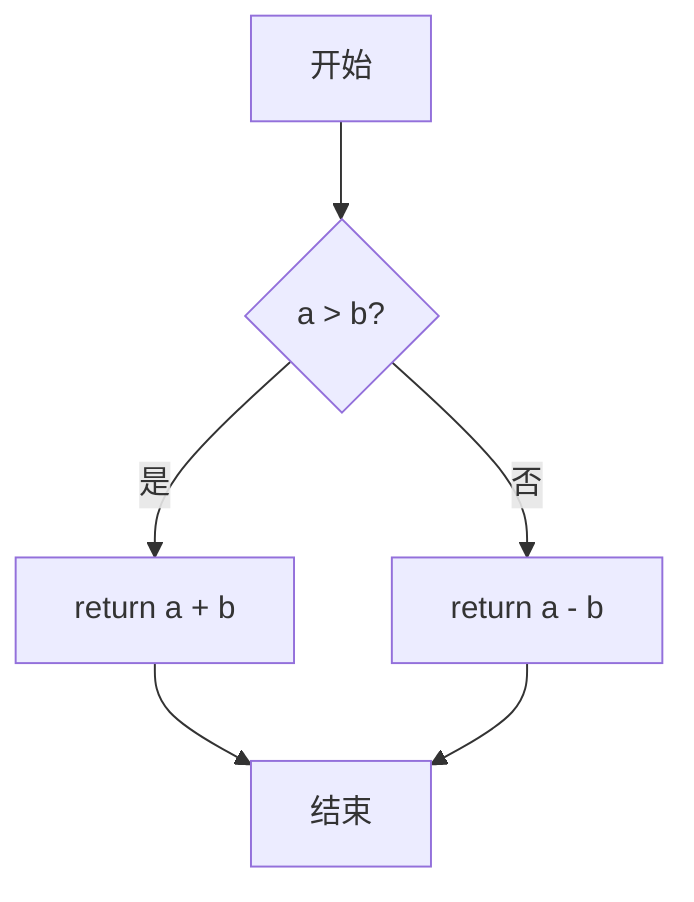

## 1. 背景介绍

### 1.1 AI 项目管理的挑战

人工智能（AI）项目因其复杂性、跨学科性以及快速迭代的特性，对项目管理提出了独特的挑战。其中，高效的沟通协作是确保项目成功的关键因素之一。AI 项目通常涉及来自不同领域（例如数据科学、软件工程、领域专家）的团队成员，他们需要紧密合作，共享信息，协调工作，才能高效地推动项目进展。

### 1.2 沟通协作工具的重要性

传统的沟通方式，如电子邮件和电话会议，往往效率低下，难以满足 AI 项目快速迭代和信息共享的需求。因此，选择合适的沟通协作工具对于 AI 项目的成功至关重要。这些工具可以帮助团队：

* **实时沟通和信息共享:**  打破地域和时间限制，促进团队成员之间的快速交流和信息同步。
* **任务管理和进度追踪:**  明确任务分配，追踪进度，提高团队协作效率。
* **文档协作和知识管理:**  集中管理项目文档，方便团队成员查阅和编辑，促进知识共享。
* **代码协作和版本控制:**  支持多人协同开发，追踪代码变更历史，确保代码质量。

## 2. 核心概念与联系

### 2.1 沟通协作工具的分类

AI 项目管理中常用的沟通协作工具可以分为以下几类：

* **即时通讯工具:**  例如 Slack, Microsoft Teams,  钉钉等，用于团队成员之间的实时沟通和信息共享。
* **项目管理工具:**  例如 Jira, Asana, Trello 等，用于任务管理、进度追踪和团队协作。
* **代码托管平台:**  例如 GitHub, GitLab, Bitbucket 等，用于代码协作、版本控制和代码审查。
* **文档协作平台:**  例如 Google Docs, Quip, Notion 等，用于多人协同编辑文档，促进知识共享。

### 2.2 工具之间的联系

这些工具之间并非孤立存在，而是相互关联，共同构成 AI 项目管理的沟通协作体系。例如，项目管理工具可以与即时通讯工具集成，实现任务更新的实时通知；代码托管平台可以与项目管理工具集成，实现代码提交与任务关联。

### 2.3 核心概念

* **实时沟通:** 指团队成员之间能够即时发送和接收信息，无需等待邮件或电话回复。
* **异步沟通:** 指团队成员可以根据自己的时间安排发送和接收信息，例如通过邮件或留言板。
* **任务管理:** 指对项目任务进行分解、分配、追踪和管理，确保项目按计划进行。
* **版本控制:** 指追踪代码变更历史，方便团队成员回溯和管理代码版本。
* **知识管理:** 指对项目相关知识和信息进行整理、存储和共享，方便团队成员查阅和使用。

## 3. 核心算法原理具体操作步骤

### 3.1 即时通讯工具的工作原理

即时通讯工具通常采用客户端-服务器架构，客户端负责用户界面和消息发送，服务器负责消息存储、转发和用户管理。

* **用户注册:** 用户在服务器上注册账号，获取唯一的用户标识。
* **消息发送:** 用户通过客户端发送消息，消息包含发送者、接收者、消息内容等信息。
* **消息存储:** 服务器接收消息后，将其存储在数据库中，并记录消息状态（例如已发送、已接收）。
* **消息转发:** 服务器根据消息的接收者，将消息转发给对应的客户端。
* **消息接收:** 客户端接收消息后，将其显示在用户界面上。

### 3.2 项目管理工具的工作原理

项目管理工具通常采用 Web 应用架构，用户通过浏览器访问应用，进行任务管理、进度追踪和团队协作。

* **项目创建:** 用户创建项目，定义项目目标、时间安排和团队成员。
* **任务分解:** 将项目目标分解为多个可执行的任务，并分配给团队成员。
* **任务状态更新:** 团队成员更新任务状态，例如进行中、已完成、阻塞等。
* **进度追踪:** 工具根据任务状态，自动计算项目进度，并生成报表。
* **团队协作:** 团队成员可以通过工具进行沟通、文件共享和讨论。

### 3.3 代码托管平台的工作原理

代码托管平台通常采用 Git 版本控制系统，用户通过 Git 命令行工具或图形界面客户端与平台交互。

* **代码库创建:** 用户创建代码库，用于存储项目代码。
* **代码提交:** 用户将本地代码修改提交到平台，生成新的代码版本。
* **代码拉取:** 用户从平台拉取最新代码版本到本地，进行开发或测试。
* **分支管理:** 用户可以创建代码分支，用于并行开发或实验性功能开发。
* **代码合并:** 将不同分支的代码合并到主分支，形成最终的代码版本。

## 4. 数学模型和公式详细讲解举例说明

### 4.1 项目进度计算模型

项目进度可以使用挣值管理（EVM）模型进行计算。EVM 模型包含以下几个核心指标：

* **计划价值（PV）：** 计划在某个时间点完成的工作的价值。
* **挣值（EV）：** 实际完成的工作的价值。
* **实际成本（AC）：** 完成工作实际花费的成本。

基于这三个指标，可以计算出以下几个指标：

* **成本偏差（CV）：** EV - AC，表示项目成本的盈余或亏损。
* **进度偏差（SV）：** EV - PV，表示项目进度提前或落后。
* **成本绩效指数（CPI）：** EV / AC，表示每花费 1 元实际成本所获得的挣值。
* **进度绩效指数（SPI）：** EV / PV，表示实际完成的工作与计划完成工作的比例。

**举例说明：**

假设一个项目计划在 10 天内完成，总预算为 10000 元。在第 5 天，项目实际完成了价值 4000 元的工作，实际花费了 5000 元。

* PV = 5000 元（计划在第 5 天完成一半的工作）
* EV = 4000 元
* AC = 5000 元
* CV = EV - AC = -1000 元（项目成本超支）
* SV = EV - PV = -1000 元（项目进度落后）
* CPI = EV / AC = 0.8（成本效率较低）
* SPI = EV / PV = 0.8（进度落后）

### 4.2 代码复杂度度量模型

代码复杂度可以使用循环复杂度（Cyclomatic Complexity）进行度量。循环复杂度是指代码中线性独立路径的数量，可以用来评估代码的测试难度和维护成本。

**计算公式：**

```
CC = E - N + 2P
```

其中：

* E：代码中的边数（控制流图中的边数）。
* N：代码中的节点数（控制流图中的节点数）。
* P：代码中的连通分量数。

**举例说明：**

```python
def calculate_sum(a, b):
  if a > b:
    return a + b
  else:
    return a - b
```

该代码片段的控制流图如下：



* E = 5
* N = 5
* P = 1

因此，该代码片段的循环复杂度为：

```
CC = 5 - 5 + 2 * 1 = 2
```

## 5. 项目实践：代码实例和详细解释说明

### 5.1 使用 Slack 进行团队沟通

```python
# 导入 Slack API 库
from slack_sdk import WebClient

# 初始化 Slack 客户端
slack_client = WebClient(token="YOUR_SLACK_API_TOKEN")

# 发送消息到指定频道
slack_client.chat_postMessage(
    channel="#general",
    text="大家好，今天项目进度如何？"
)

# 监听频道消息
@slack_client.on("message")
def handle_message(message):
  # 处理消息
  print(message)
```

### 5.2 使用 Jira 进行任务管理

```python
# 导入 Jira API 库
from jira import JIRA

# 初始化 Jira 客户端
jira_client = JIRA(
    server="YOUR_JIRA_SERVER_URL",
    basic_auth=("YOUR_JIRA_USERNAME", "YOUR_JIRA_PASSWORD")
)

# 创建任务
issue = jira_client.create_issue(
    project="YOUR_JIRA_PROJECT_KEY",
    summary="完成用户登录功能",
    description="实现用户登录功能，包括用户名密码验证和登录状态维护",
    issuetype={"name": "Task"}
)

# 分配任务
jira_client.assign_issue(issue=issue.key, assignee="YOUR_JIRA_USERNAME")

# 更新任务状态
jira_client.transition_issue(issue=issue.key, transition="In Progress")
```

### 5.3 使用 GitHub 进行代码协作

```bash
# 克隆代码库
git clone https://github.com/YOUR_GITHUB_USERNAME/YOUR_GITHUB_REPOSITORY.git

# 创建新的代码分支
git checkout -b feature/user-login

# 修改代码
# ...

# 提交代码修改
git add .
git commit -m "实现用户登录功能"

# 推送代码到远程分支
git push origin feature/user-login

# 创建 Pull Request
# ...
```

## 6. 实际应用场景

### 6.1  自动驾驶项目

自动驾驶项目涉及多个团队，例如感知、规划、控制、定位等。这些团队需要紧密合作，共享数据，协调工作，才能高效地开发和测试自动驾驶系统。

* **即时通讯工具：** 用于团队成员之间实时沟通，例如讨论技术方案、报告问题、协调测试计划等。
* **项目管理工具：** 用于任务管理、进度追踪和团队协作，例如分配开发任务、追踪测试进度、管理代码版本等。
* **代码托管平台：** 用于代码协作、版本控制和代码审查，例如存储代码、追踪代码变更历史、进行代码审查等。
* **仿真平台：** 用于模拟真实交通环境，进行自动驾驶系统测试和验证。

### 6.2  医疗影像分析项目

医疗影像分析项目需要数据科学家、医学专家和软件工程师协同工作，才能开发出准确、可靠的医疗影像分析模型。

* **即时通讯工具：** 用于团队成员之间实时沟通，例如讨论算法方案、标注数据、分析模型结果等。
* **项目管理工具：** 用于任务管理、进度追踪和团队协作，例如分配标注任务、追踪模型训练进度、管理数据版本等。
* **机器学习平台：** 用于训练和部署医疗影像分析模型，例如提供数据预处理、模型训练、模型评估等功能。
* **影像标注工具：** 用于标注医疗影像数据，例如勾画病灶区域、标注病灶类型等。

## 7. 工具和资源推荐

### 7.1 即时通讯工具

* **Slack:**  功能强大，易于使用，支持多种集成，适合大型团队使用。
* **Microsoft Teams:**  与 Microsoft Office 365 深度集成，适合企业用户使用。
* **钉钉:**  国内用户较多，功能全面，支持多种办公场景。

### 7.2 项目管理工具

* **Jira:**  功能强大，灵活可配置，适合大型项目使用。
* **Asana:**  界面简洁，易于使用，适合小型团队使用。
* **Trello:**  采用看板式管理，直观易懂，适合敏捷开发团队使用。

### 7.3 代码托管平台

* **GitHub:**  全球最大的代码托管平台，拥有庞大的开发者社区。
* **GitLab:**  功能强大，支持 CI/CD，适合企业用户使用。
* **Bitbucket:**  与 Atlassian 产品深度集成，适合使用 Atlassian 工具链的团队。

### 7.4 文档协作平台

* **Google Docs:**  免费易用，支持多人协同编辑，适合小型团队使用。
* **Quip:**  功能强大，支持实时协作和任务管理，适合大型团队使用。
* **Notion:**  功能全面，支持笔记、文档、数据库等多种内容，适合个人和团队使用。

## 8. 总结：未来发展趋势与挑战

### 8.1 趋势

* **一体化平台：** 未来，沟通协作工具将更加一体化，将即时通讯、项目管理、代码托管、文档协作等功能整合到一个平台上，提供更加便捷的使用体验。
* **人工智能驱动：** 人工智能技术将被应用于沟通协作工具，例如智能助理可以帮助用户自动安排会议、生成会议纪要、推荐相关文档等。
* **低代码化：** 低代码开发平台将使得非技术人员也能够轻松地构建和定制沟通协作工具，满足个性化需求。

### 8.2 挑战

* **信息过载：** 随着沟通协作工具功能的不断增加，用户可能会面临信息过载的问题，难以有效地筛选和处理信息。
* **安全和隐私：** 沟通协作工具存储了大量的敏感信息，例如项目代码、商业机密等，需要加强安全和隐私保护措施。
* **工具选择：** 市场上存在大量的沟通协作工具，用户需要根据自身需求选择合适的工具，避免工具泛滥和效率低下。


## 9. 附录：常见问题与解答

### 9.1 如何选择合适的沟通协作工具？

选择合适的沟通协作工具需要考虑以下因素：

* **团队规模：** 小型团队可以选择简单易用的工具，大型团队需要选择功能强大、可扩展的工具。
* **项目类型：** 不同类型的项目对工具的功能需求不同，例如软件开发项目需要代码托管平台，而设计项目需要文档协作平台。
* **预算：** 一些工具是免费的，而另一些工具则需要付费订阅。
* **集成：** 工具之间能否集成，例如项目管理工具能否与即时通讯工具集成，实现任务更新的实时通知。

### 9.2 如何提高团队沟通效率？

提高团队沟通效率可以采取以下措施：

* **建立清晰的沟通规范：** 例如，规定不同类型信息的沟通渠道，例如技术问题使用 Slack 讨论，项目进度使用 Jira 追踪。
* **定期进行团队会议：** 定期进行团队会议，同步项目进度，讨论问题，并制定下一步计划。
* **使用可视化工具：** 使用图表、看板等可视化工具，清晰地展示项目进度和问题。
* **鼓励团队成员积极沟通：** 鼓励团队成员积极提出问题、分享想法，并及时回复消息。
* **定期进行团队建设活动：** 定期进行团队建设活动，增进团队成员之间的了解和信任，提高团队凝聚力。
