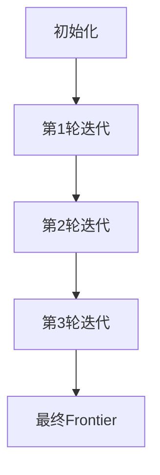

# AdaBoost原理与代码实例讲解

## 1.背景介绍

### 1.1 分类算法概述

在机器学习和数据挖掘领域中,分类是一项基本而重要的任务。分类算法的目标是根据输入数据的特征,将其划分到事先定义好的类别或标签中。常见的分类算法包括逻辑回归、决策树、支持向量机、朴素贝叶斯等。这些算法各有优缺点,适用于不同的数据场景。

### 1.2 AdaBoost算法的产生背景  

虽然上述传统分类算法在许多场景下表现不错,但它们也存在一些缺陷,比如:

- 容易过拟合
- 对噪声和异常值敏感
- 无法很好地处理非线性和高维数据

为了克服这些缺陷,提高分类性能,一种新的分类算法家族——Boosting算法应运而生。Boosting算法的核心思想是将多个"弱分类器"组合成一个"强分类器",从而获得比单个分类器更高的准确性。

AdaBoost(Adaptive Boosting)算法是Boosting家族中最著名、最具影响力的一种算法,由Freund和Schapire于1997年提出。它通过迭代方式训练弱分类器,并根据每个弱分类器的表现对训练数据的权重进行调整,从而构建一个高性能的最终分类器。AdaBoost算法在理论和实践中都取得了巨大成功,被广泛应用于多个领域。

## 2.核心概念与联系

### 2.1 弱分类器和强分类器

AdaBoost算法的核心思想是将多个"弱分类器"组合成一个"强分类器"。所谓弱分类器,是指分类准确率仅略高于随机猜测的分类器。而强分类器则是由多个弱分类器线性组合而成,具有很高的分类准确率。

单个弱分类器的性能有限,但多个弱分类器合力就能获得极好的分类效果。这种"整体强于个体"的特性,正是Boosting算法的精髓所在。

### 2.2 Boosting算法原理

Boosting算法的工作原理可以概括为以下三个步骤:

1. 初始化训练数据的权重分布
2. 迭代训练弱分类器
   - 根据当前权重分布训练一个弱分类器
   - 更新训练数据权重分布,提高错误分类样本权重
3. 线性组合所有弱分类器,得到最终的强分类器

在每一轮迭代中,算法会关注那些之前没有被正确分类的样本,给予它们更高的权重,迫使新的弱分类器去关注这些"困难"样本。最终将所有弱分类器线性组合,就能得到一个强大的最终分类器。

### 2.3 AdaBoost算法流程

AdaBoost算法遵循上述Boosting的一般原理,但在具体实现上有自己的特色:

1. 初始化训练数据权重为均匀分布
2. 对训练数据进行多轮迭代:
   - 基于当前权重分布,训练一个弱分类器
   - 计算当前弱分类器的加权错误率
   - 根据加权错误率,更新训练数据权重分布
   - 为当前弱分类器分配一个系数alpha,alpha值越大,说明该分类器越好
3. 将所有弱分类器加权线性组合,得到最终强分类器

AdaBoost算法的核心在于训练数据权重分布的更新策略,以及弱分类器系数alpha的计算方法。这使得AdaBoost能够自适应地提高"困难"样本的权重,从而获得极高的分类性能。

## 3.核心算法原理具体操作步骤  

### 3.1 AdaBoost算法步骤

AdaBoost算法的具体步骤如下:

1. 初始化训练数据的权重分布D1(i)=1/N,i=1,2,...,N。其中N为训练样本数量。
2. 对m=1,2,...,M次迭代:
    - 基于训练数据权重分布Dm,训练一个弱分类器Gm(x)
    - 计算Gm(x)在训练数据上的加权错误率:
      
      $$\varepsilon_m=\sum_{i=1}^{N}P(G_m(x_i)\neq y_i)D_m(i)$$
      
    - 计算Gm(x)的系数(一个实数):
      
      $$\alpha_m=\ln\frac{1-\varepsilon_m}{\varepsilon_m}$$
      
    - 更新训练数据权重分布:
      
      $$D_{m+1}(i)=\frac{D_m(i)\exp(-\alpha_my_iG_m(x_i))}{Z_m}$$
      
      其中Zm是一个归一化因子,使得Dm+1是一个概率分布。
      
3. 构建最终的强分类器G(x):

   $$G(x)=\text{sign}(\sum_{m=1}^{M}\alpha_mG_m(x))$$

上述算法每一轮迭代时,都会训练一个新的弱分类器Gm(x)。对于被Gm(x)错误分类的样本,会增加其权重;对于被正确分类的样本,会降低其权重。这样做的目的是强化对"难分"样本的重视程度。

最终的强分类器G(x)是所有弱分类器Gm(x)的加权线性组合,权重alpha_m反映了每个弱分类器的"重要性"。分类时,只需将G(x)的符号作为最终的类别预测。

### 3.2 算法收敛性 

AdaBoost算法的训练过程是基于前向分步算法,可以被证明具有以下性质:

- 训练误差将会快速下降,最终收敛  
- 只要存在一个弱分类器的性能好于随机猜测,最终的强分类器就将具有很高的准确性

这一性质来源于AdaBoost算法的权重更新策略。每轮迭代中,错误分类样本的权重会大幅增加,迫使下一个弱分类器去更加关注这些"困难"样本。

同时,由于Gm(x)的系数alpha_m与其加权错误率呈反比关系,所以分类性能好的弱分类器会获得较大的系数,从而在强分类器中占据更重要的位置。

这种自适应调整权重和系数的方式,使得AdaBoost算法能够快速收敛到一个具有很高泛化能力的强分类器。

## 4.数学模型和公式详细讲解举例说明

### 4.1 加权分布与指数损失函数

AdaBoost算法的核心在于训练数据权重分布的更新,这一策略源于指数损失函数的最小化。

给定一个二分类问题,令训练数据为(x1,y1),...,(xN,yN),其中xi为实例的特征向量,yi∈{-1,+1}为类别标记。AdaBoost试图找到一个分类器G(x),使其分类误差最小化:

$$L(G)=\sum_{i=1}^{N}e^{-y_iG(x_i)}$$

这就是指数损失函数的形式。我们可以证明,通过在每一轮迭代中最小化加权形式的指数损失函数,就能得到AdaBoost的权重更新策略。

具体地,在第m轮迭代时,AdaBoost最小化:

$$\sum_{i=1}^{N}D_m(i)\exp(-\alpha_my_iG_m(x_i))$$

其中Dm(i)是训练样本xi在第m轮的权重分布。通过一些代数运算,我们就能得到上述权重更新公式。

因此,AdaBoost算法的本质,就是在加权数据集上,以指数损失函数为目标函数,进行前向分步算法求解。

### 4.2 弱分类器的选择

AdaBoost算法对于弱分类器的选择是很灵活的,只要满足分类准确率略高于随机猜测即可。常见的选择包括:

- 决策树桩(决策树的一个节点)
- 神经网络
- 朴素贝叶斯

以决策树桩为例,在第m轮迭代中,我们需要在加权数据集(x1,y1,Dm(1)),...,(xN,yN,Dm(N))上,找到一个最优的树桩Gm(x),使其加权分类误差最小:

$$\varepsilon_m=\min_{\alpha,\beta,\theta}\sum_{i=1}^{N}D_m(i)I(y_i\neq G_m(x_i))$$

其中Gm(x)=α[x>θ]+β,α∈{-1,+1},β∈R,θ为分割特征阈值。可以遍历所有特征和阈值,找到使误差最小的树桩。

### 4.3 AdaBoost与Frontiers

AdaBoost算法还可以从Frontiers(Frontal Faces)的角度来理解。Frontiers是指在样本空间中,能将正负样本完全分开的理想分类边界。

AdaBoost算法的目标,就是通过组合多个弱分类器,在样本空间中寻找一个Frontier,使正负样本能被很好地分离。每个弱分类器对应一个局部的Frontier,而最终的强分类器对应全局的Frontier。

具体地,AdaBoost算法会逐步缩小正负样本的重合区域,最终将它们完全分隔开。这一过程如下图所示:



从上图可以看出,随着迭代的进行,正负样本被逐步分隔开来,直至达到完美分类的Frontier。这就是AdaBoost算法追求的理想边界。

## 4.项目实践:代码实例和详细解释说明

为了加深对AdaBoost算法的理解,我们来看一个使用Python实现的代码示例。这个示例使用了scikit-learn库中的AdaBoost分类器,并在一个简单的二维数据集上进行训练和测试。

### 4.1 导入相关库

```python
import numpy as np
import matplotlib.pyplot as plt
from sklearn.ensemble import AdaBoostClassifier
from sklearn.tree import DecisionTreeClassifier
from sklearn.datasets import make_gaussian_quantiles
```

我们导入了NumPy、Matplotlib用于数值计算和可视化,以及scikit-learn库中的AdaBoost分类器和决策树分类器。make_gaussian_quantiles函数用于生成一个简单的二维数据集。

### 4.2 生成数据集

```python
# 生成二维数据集
X1, y1 = make_gaussian_quantiles(n_samples=500, n_features=2, n_classes=2, random_state=0)
# 绘制数据集
plt.scatter(X1[:, 0], X1[:, 1], marker='o', c=y1)
plt.show()
```

我们使用make_gaussian_quantiles函数生成一个包含500个样本、2个特征、2个类别的二维数据集。然后使用Matplotlib绘制数据集,正负样本用不同颜色表示。

### 4.3 创建AdaBoost分类器

```python
# 创建AdaBoost分类器
bdt = AdaBoostClassifier(DecisionTreeClassifier(max_depth=1),
                         algorithm="SAMME",
                         n_estimators=200)

# 拟合训练数据
bdt.fit(X1, y1)
```

我们创建了一个AdaBoost分类器实例bdt,指定了以下参数:

- 弱分类器为决策树桩(最大深度为1)
- 使用SAMME.R实现算法(AdaBoost的一种多类别版本)
- 设置弱分类器的数量为200

然后在训练数据X1、y1上拟合这个分类器模型。

### 4.4 评估分类性能

```python
# 绘制决策边界
plot_colors = "br"
plot_step = 0.02
x_min, x_max = X1[:, 0].min() - 1, X1[:, 0].max() + 1
y_min, y_max = X1[:, 1].min() - 1, X1[:, 1].max() + 1
xx, yy = np.meshgrid(np.arange(x_min, x_max, plot_step),
                     np.arange(y_min, y_max, plot_step))

Z = bdt.predict(np.c_[xx.ravel(), yy.ravel()])
Z = Z.reshape(xx.shape)
cs = plt.contourf(xx, yy, Z, cmap=plt.cm.Paired)
plt.scatter(X1[:, 0], X1[:, 1], marker='o', c=y1)
plt.show()

# 计算分类准确率
from sklearn.metrics import accuracy_score
y_pred = bdt.predict(X1)
accuracy = accuracy_score(