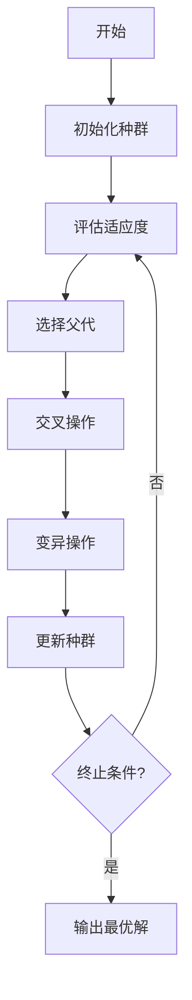

# "AdaGrad优化器在遗传算法中的应用"

## 1.背景介绍

### 1.1 遗传算法概述

遗传算法(Genetic Algorithm, GA)是一种基于生物进化理论的优化算法,被广泛应用于解决复杂的非线性优化问题。它通过模拟自然界中生物的遗传和进化过程,对一个种群中的个体进行选择、交叉和变异操作,使种群不断进化,最终获得最优解或近似最优解。

遗传算法主要包括以下几个步骤:

1. 初始化种群
2. 评估个体适应度
3. 选择操作
4. 交叉操作 
5. 变异操作
6. 重复2-5直到满足终止条件

其中,选择、交叉和变异是遗传算法的核心操作。

### 1.2 优化算法及其在遗传算法中的作用

在遗传算法中,如何高效地寻找最优解是一个关键问题。传统的遗传算法容易陷入局部最优解,且收敛速度较慢。优化算法的引入可以有效改善这一问题。

优化算法是指通过迭代方式调整参数值,使目标函数值达到最优的一类算法。常见的优化算法包括梯度下降法、牛顿法、共轭梯度法等。这些算法被广泛应用于机器学习、深度学习等领域,用于训练模型参数。

在遗传算法中,优化算法可以应用于:

1. 调整种群个体的基因值,提高种群适应度
2. 加快算法收敛速度
3. 跳出局部最优解

本文将重点介绍 AdaGrad 优化器在遗传算法中的应用。

## 2.核心概念与联系  

### 2.1 AdaGrad 优化器

AdaGrad(Adaptive Gradient Algorithm)是一种自适应学习率的优化算法,由 John Duchi 等人于2011年提出。它根据参数的历史梯度值动态调整每个参数的学习率,从而实现自适应性。

AdaGrad 的核心思想是:对于高频参数(梯度值较大),降低学习率;对于低频参数(梯度值较小),提高学习率。这样可以更好地平衡参数更新的幅度,加快收敛速度。

AdaGrad 的更新规则如下:

$$
\begin{align}
g_{t+1} &= \nabla_{\theta} J(\theta_{t+1}) \\
G_{t+1} &= G_t + g_{t+1}^2\\
\theta_{t+2} &= \theta_{t+1} - \frac{\eta}{\sqrt{G_{t+1} + \epsilon}}g_{t+1}
\end{align}
$$

其中:
- $g_t$是参数$\theta_t$的梯度
- $G_t$是所有历史梯度的平方和
- $\eta$是初始学习率
- $\epsilon$是一个很小的正数,避免分母为0

可以看出,随着迭代次数增加,$G_t$会越来越大,从而使得学习率逐渐减小。这样可以保证算法收敛,但也可能导致学习停滞过早。

### 2.2 AdaGrad在遗传算法中的应用

遗传算法中的变异操作通常是在个体的部分基因上添加随机扰动,以增加种群的多样性。传统的做法是使用固定的变异率,但这可能导致算法收敛缓慢或陷入局部最优。

将 AdaGrad 应用于遗传算法的变异操作,可以自适应地调整每个基因的变异率,从而加快算法收敛并提高全局搜索能力。具体做法是:

1. 对每个个体的每个基因维护一个 AdaGrad 状态变量$G$
2. 在变异时,根据$G$的值调整该基因的变异率
3. 变异后,更新该基因对应的$G$值

这种方法的优点是:对于变异频繁的基因,降低其变异率,避免过度扰动;对于变异较少的基因,提高其变异率,增加搜索范围。从而在探索(exploration)和利用(exploitation)之间达到更好的平衡。

除了变异操作,AdaGrad 还可以应用于遗传算法中的其他部分,如交叉操作、适应度评估等,以进一步提高算法性能。

## 3.核心算法原理具体操作步骤

### 3.1 遗传算法伪代码

为了更好地理解 AdaGrad 在遗传算法中的应用,我们先给出一个基本的遗传算法伪代码:

```python
def genetic_algorithm(fitness_func, num_generations, population_size):
    population = init_population(population_size)
    for generation in range(num_generations):
        fitness_scores = evaluate_fitness(population, fitness_func)
        selected_parents = selection(population, fitness_scores)
        offspring = crossover(selected_parents)
        offspring = mutation(offspring)
        population = offspring
    return max(population, key=lambda x: fitness_func(x))
```

其中:

- `init_population`函数初始化种群
- `evaluate_fitness`函数计算每个个体的适应度
- `selection`函数根据适应度选择父代个体
- `crossover`函数对选择的父代个体进行交叉操作,产生子代
- `mutation`函数对子代个体进行变异操作

### 3.2 应用 AdaGrad 优化变异操作

现在,我们将 AdaGrad 应用于变异操作中。假设个体的编码是二进制串,变异操作是随机翻转部分位。我们为每个个体的每个基因维护一个 AdaGrad 状态变量$G$,初始值为1。

伪代码如下:

```python
def mutation(offspring, mutation_rate=0.1):
    mutated_offspring = []
    for individual in offspring:
        individual_g = [1] * len(individual)  # 初始化 AdaGrad 状态变量
        mutated_individual = []
        for i, gene in enumerate(individual):
            if random.random() < mutation_rate / (math.sqrt(individual_g[i]) + 1e-8):
                mutated_gene = 1 - gene  # 翻转基因
                individual_g[i] += 1  # 更新 AdaGrad 状态变量
            else:
                mutated_gene = gene
            mutated_individual.append(mutated_gene)
        mutated_offspring.append(mutated_individual)
    return mutated_offspring
```

在上述代码中,我们使用 AdaGrad 状态变量$G$调整每个基因的变异率。对于变异频繁的基因,其$G$值较大,变异率较低;对于变异较少的基因,其$G$值较小,变异率较高。

通过这种自适应的变异策略,算法可以在探索和利用之间达到更好的平衡,从而提高收敛速度和全局搜索能力。

### 3.3 算法流程图

为了更直观地理解算法流程,我们使用 Mermaid 绘制了一张流程图:



在上图中,变异操作使用了 AdaGrad 优化,具体实现如3.2节所示。

## 4.数学模型和公式详细讲解举例说明

在前面的章节中,我们简要介绍了 AdaGrad 优化器的数学模型。现在,我们将详细解释其中的公式,并给出具体的例子说明。

### 4.1 AdaGrad 公式解释

AdaGrad 的更新规则包含以下三个公式:

$$
\begin{align}
g_{t+1} &= \nabla_{\theta} J(\theta_{t+1}) \\
G_{t+1} &= G_t + g_{t+1}^2\\
\theta_{t+2} &= \theta_{t+1} - \frac{\eta}{\sqrt{G_{t+1} + \epsilon}}g_{t+1}
\end{align}
$$

1. 第一个公式计算当前参数$\theta_{t+1}$的梯度$g_{t+1}$。梯度表示目标函数在当前参数下的变化率,用于指导参数的更新方向。

2. 第二个公式计算所有历史梯度的平方和$G_{t+1}$。这个累积的平方和反映了参数在不同维度上的更新频率。

3. 第三个公式根据梯度$g_{t+1}$和累积平方和$G_{t+1}$更新参数$\theta_{t+2}$。公式中,分母$\sqrt{G_{t+1} + \epsilon}$起到了自适应调整学习率的作用。当$G_{t+1}$较大时(对应的维度更新频繁),学习率较小,避免过度更新;当$G_{t+1}$较小时(对应的维度更新较少),学习率较大,加快收敛速度。

需要注意的是,AdaGrad 公式中有一个超参数$\eta$,即初始学习率。选择合适的初始学习率对算法收敛性能有很大影响。通常需要根据具体问题进行调参。

### 4.2 AdaGrad 公式举例

为了更好地理解 AdaGrad 公式,我们给出一个简单的例子。假设我们要最小化一个二元函数:

$$
f(x, y) = x^2 + 2y^2
$$

初始参数为$(x_0, y_0) = (2, 3)$,初始学习率$\eta = 0.1$。

按照 AdaGrad 公式,第一次迭代的计算过程如下:

1. 计算梯度:
   $$
   \begin{align}
   g_1 &= \nabla f(x_0, y_0) = (4, 12)
   \end{align}
   $$

2. 计算累积梯度平方和:
   $$
   \begin{align}
   G_1 &= g_1^2 = (16, 144)
   \end{align}
   $$

3. 更新参数:
   $$
   \begin{align}
   x_1 &= x_0 - \frac{\eta}{\sqrt{G_1^{(x)} + \epsilon}}g_1^{(x)} = 2 - \frac{0.1}{\sqrt{16 + 10^{-8}}} \cdot 4 = 1.6 \\
   y_1 &= y_0 - \frac{\eta}{\sqrt{G_1^{(y)} + \epsilon}}g_1^{(y)} = 3 - \frac{0.1}{\sqrt{144 + 10^{-8}}} \cdot 12 = 1.2
   \end{align}
   $$

可以看出,由于$y$方向的梯度较大,因此$y$方向的学习率较小,以避免过度更新。

通过多次迭代,AdaGrad 可以自适应地调整每个维度的学习率,从而加快收敛速度。

## 4.项目实践:代码实例和详细解释说明

为了更好地理解 AdaGrad 优化器在遗传算法中的应用,我们给出一个实际的编程实例。这个实例使用 Python 实现了一个基本的遗传算法,并将 AdaGrad 应用于变异操作中。我们将详细解释代码,并对关键部分进行说明。

### 4.1 问题描述

我们将使用遗传算法求解一个简单的函数最小化问题:

$$
f(x) = x^4 - 16x^2 + 5x, \quad x \in [-5, 5]
$$

该函数在区间$[-5, 5]$内有两个局部最小值点,分别为$x \approx -1.0337$和$x \approx 2.9028$。我们的目标是找到全局最小值点。

### 4.2 代码实现

```python
import random
import math

# 目标函数
def objective_func(x):
    return x**4 - 16*x**2 + 5*x

# 初始化种群
def init_population(size, chromosome_length):
    population = []
    for _ in range(size):
        chromosome = [random.randint(0, 1) for _ in range(chromosome_length)]
        population.append(chromosome)
    return population

# 解码染色体
def decode_chromosome(chromosome):
    x = 0
    for i, gene in enumerate(chromosome):
        x += gene * (2**i)
    return -5 + 10 * x / (2**len(chromosome) - 1)

# 评估适应度
def evaluate_fitness(population):
    fitness_scores = []
    for chromosome in population:
        x = decode_chromosome(chromosome)
        fitness = 1 / (1 + objective_func(x))
        fitness_scores.append(fitness)
    return fitness_scores

# 选择操作
def selection(population, fitness_scores):
    selected_parents = []
    for _ in range(len(population) // 2):
        parent1 = random.choices(population, weights=fitness_scores, k=1)[0]
        parent2 = random.choices(population, weights=fitness_scores, k=1)[0]
        selected_parents